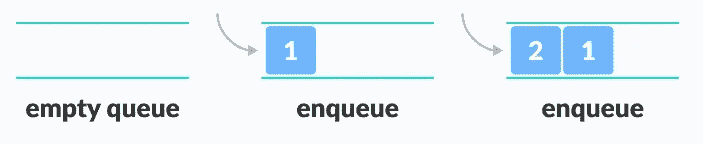
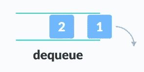

# Javascript 中的队列

> 原文：<https://blog.devgenius.io/queues-in-javascript-c40a9fe6baac?source=collection_archive---------11----------------------->


数据结构介绍文章。队列概念和应用于 Javascript 语言的例子。

# 介绍

数据结构是有效处理大量数据的一种手段，了解它的结构和组成可以给我们提供更有效的工具来设计与某些问题相关的产品。在这种情况下，我们将执行队列介绍，回顾其特点和用途。

# 队列概念

队列是一种动态数据结构，它允许基于结构 **FIFO** (先进先出)存储和检索元素。这个名字来源于银行中客户队列的类比。先到的顾客将首先得到服务，后到的顾客将被排在队伍的最后，以此类推。


# 用 Javascript 实现队列

为了用 Javascript 实现队列，我们将依赖于存储库:[**https://github . com/trek Hleb/Javascript-algorithms/blob/master/src/data-structures/Queue/Queue . js**](https://github.com/trekhleb/javascript-algorithms/blob/master/src/data-structures/queue/Queue.js)

该库包含一个使用 [**LinkedList**](https://medium.com/@dcortes.net/linked-list-in-javascript-795595742087) 的优秀实现，但是我们将简化一些方法和结构以便能够理解它的操作。我们会支持面向对象编程的所有人。

## 队列类别

类来表示队列，这个类将具有名为`items`的属性，该属性将表示一组要存储的元素(在本例中，我们将使用元素数组，但它可以是任何其他类型，例如，对象或集合。最重要的是封装行为)。在启动时，`items`属性将没有任何元素。

```
class Queue{
  constructor() {
    this.items = [];
  }
}
```

接下来的步骤是给类`Queue`添加方法，帮助我们操作队列中的元素。

## 方法来插入元素

为了将项目插入到我们的队列中，我们创建了名为 **enqueue** 的公共方法。

**enqueue()**

```
enqueue(element) {
  this.items.push(element);
}
```



## 元素移除方法

为了删除队列中的元素，我们将创建一个名为**的公共方法。这个方法的目的是让队列中的元素出列。**

**出列()**

```
dequeue() {
  return this.items.shift();
}
```



## 元素显示方法

另一个更常见的队列操作是显示将要退出的元素。这种方法通常被称为 peek。

**peek()**

```
peek() {
  return this.items[0];
}
```

# 完整代码

# 结局

在本文中，我们以简单的方式处理队列，然而，这些方法应该足以涵盖基本的用例。当然，有许多方法可以扩展和改进我们的例子。我建议继续探索实现，并使它们适应您的需要。

感谢你远道而来，如果你觉得这很有用，别忘了鼓掌👏。订阅以接收更多内容🔔。

如果你需要额外的帮助，请联系我🤠。

*   ✉️ [**给我发邮件**](mailto:dcortes.net@gmail.com)
*   🤝 [**在 LinkedIn 上联系我**](https://www.linkedin.com/in/dcortesnet/)
*   📮 [**在推特上联系我**](https://twitter.com/dcortes_net)

非常感谢您的阅读，我感谢您的时间。