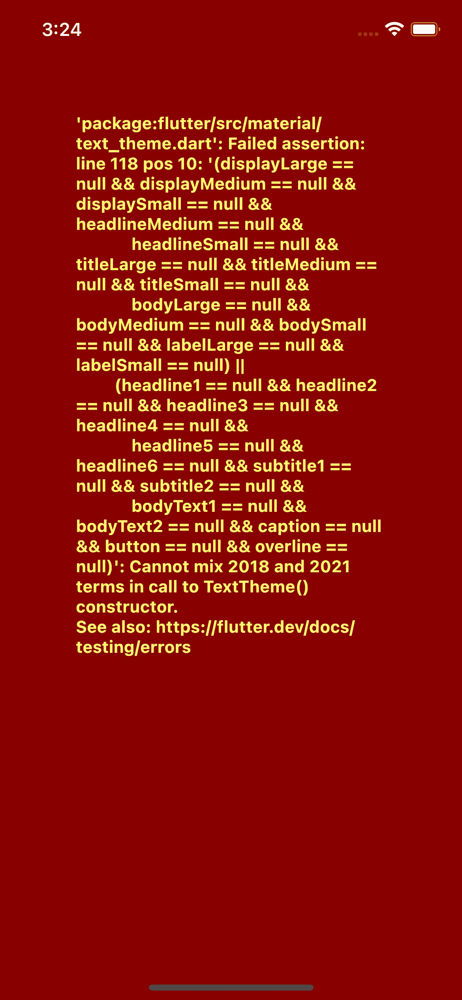

# 快速简单的方式添加主题到任何颤振应用程序

> 原文：<https://blog.devgenius.io/quick-and-simple-way-to-add-theming-to-any-flutter-app-826c16a53e19?source=collection_archive---------1----------------------->

## 使用 ChangeNotifier 类使主题化变得容易

作为一名前端、全栈甚至后端开发人员，我相信你一定至少谷歌过一次“如何主题化”。如今应用程序主题化如此普遍，但在大多数框架上仍然有点复杂，因此前端和后端开发人员在谷歌上搜索“如何为应用程序主题化”就不足为奇了。

在这篇文章中，我将分享我如何使用 ChangeNotifier 类对我的 Flutter 应用程序进行主题化，无论这是一个附带项目还是其他。

先决条件:

*   基本的颤振和飞镖知识
*   完全安装在开发机器上的 Flutter SDK
*   测试应用程序的设备或模拟器
*   ChangeNotifier 类的基础知识([简单的 app 状态管理| Flutter](https://docs.flutter.dev/development/data-and-backend/state-mgmt/simple)

# 我们开始吧

我将从创建 theme.dart 文件开始。根据您的文件结构，它可以保存在任何目录中。我把它保存在一个单独的文件夹中，其中包含 colors.dart 和其他任何主题化/样式化变量。

## 初始设置

首先，让我们将应用程序的根变成一个有状态的小部件。我们需要这样做，以便小部件树在主题改变时重新呈现。你们中的一些人可能会认为这将是一个非常任务化的应用程序，特别是如果它是一个像 Instagram 这样的大型应用程序，那么你会惊讶地知道 Flutter 处理得非常好，如果你遇到任何瓶颈或 janky 帧，你可以随时利用`AnimatedBuilder`小部件，它接受一个`Listenable`作为参数，并根据`Listenable`中发生的变化来改变它包装的子小部件或小部件树。

一旦您摆脱了 flutter create 样板代码并将 MyApp 更改为有状态小部件，您就应该有类似的东西了。

正如我在这类文章中经常做的那样，我在代码片段中解释代码。记下这些评论。

## 创建 Theme.dart

我们可以暂时保留 main.dart 文件，然后继续创建 Theme.dart 文件。

在这个文件中，我们将声明我们的主题，无论是光，暗，日出，中午，或任何你想叫他们。我们通过使用 Flutter 中的 ThemeData 类来实现这一点

所有的主题数据和参数都可以更改为你的应用程序使用的任何颜色。这只是一个例子，说明可以做些什么

无论你的应用程序主题是什么，你都可以更改颜色、文本样式等等。使用某些参数时要小心，因为某些原因，当与其他参数结合使用时，有些参数不起作用。例如，TextTheme 类中的 bodyMedium 和 bodyText1 参数不能同时使用，这将导致应用程序中断并显示以下错误

我不知道为什么会允许这种事情发生🤷‍♂️.他们应该反对 2018 年的条款

## 创建 AppTheme 类

我们将创建一个名为`AppTheme`的类，它利用了`ChangeNotifier`类。这将包含我们的主题状态和处理主题切换的回调。

请注意，添加了使用 ChangeNotifier 的 AppTheme 类

在上面的代码片段中，我将 AppTheme 类添加到了 theme.dart 文件中。我这样做是因为这个类只有几行代码。请注意，我在第 30 行创建了它的一个实例，我这样做是因为如果另一个人查看您的代码并查找 AppTheme 的根实例，会更容易理解。

我让 themeMode 成为一个 getter，因为直接改变状态是不明智的，因为直接改变状态有时会导致意想不到的错误。

## 实现 appTheme

一旦你创建了所有的东西，你就可以返回到你的 main.dart 文件，并在你的应用程序根目录下的 MaterialApp 小部件中实现它，就像这样:

这样你就大功告成了。为了使用主题值，你需要做的就是使用`Theme.of(context).*`，用(*)作为你之前在主题数据变量中设置的参数，例如(`Theme.of(context).textTheme.headlineMedium`

让我给你看一下`PlaceholderWidget`代码作为例子

注意上下文用法的主题

# 结论

让我向您展示一下，如果您不折不扣地遵循本文，您的应用程序会是什么样子:

没错。它自己做淡入淡出动画，没有额外的代码。

瞧啊。你已经完成了你的 Flutter 应用程序的主题化。通过不到 30 行代码和对现有代码的一些修改，您已经将主题添加到了 Flutter 应用程序中。

如果这篇文章以任何方式帮助了你，请随意分享，留下评论或掌声👏。如果你认为我可以以任何方式改进这篇文章，请留下评论，我很乐意聊天和交流。

如果你真的喜欢这篇文章，请随意查看我关于类似主题的其他帖子。别忘了下周收听我正在做的一个小项目的内幕。

 [## 使用 Flutter 拉动以刷新或搜索

### 嗨，伙计们，这篇文章将讲述如何使用 Flutter，VelocityX 和 Simple……

devshogun.medium.com](https://devshogun.medium.com/pull-to-refresh-or-search-using-flutter-e06e57b3b5e2)