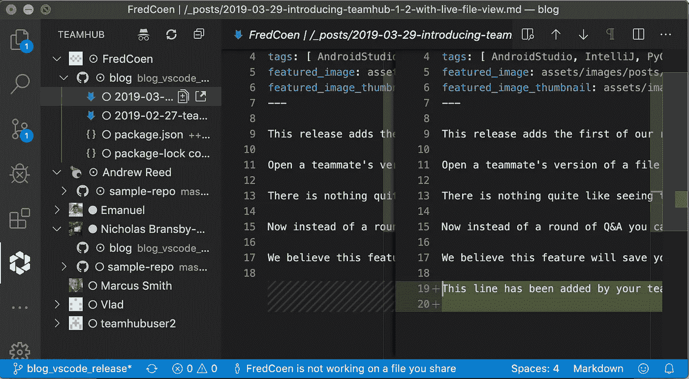
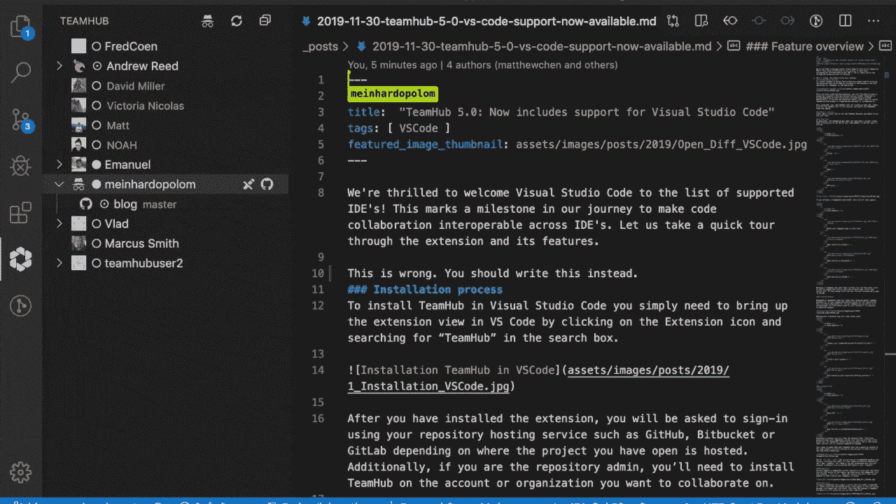

# 快速开发协作—这一定是一件令人头疼的事情吗？

> 原文：<https://blog.devgenius.io/quick-dev-collaboration-does-it-have-to-be-a-headache-b0dc5a7e430e?source=collection_archive---------28----------------------->

新冠肺炎无疑加剧了这种感觉，但是还有谁认为在代码上与你的队友合作或者仅仅是交流是不方便的，尤其是在快速解决问题的时候？

作为软件工程师，我们都太熟悉在一个问题上坚持几个小时，而它的解决方案却只有一行代码甚至更少。让我们更深入地探讨一下这种基本的、但却很常见的情况。

假设我的团队成员正在处理一个我碰巧比他们更熟悉的问题。因此，我的队友被卡住了，无法解决沟通问题。为什么？**因为这是一个令人头疼的**！**

# 让我们看看我们的选择:

1.  **即时消息**:在一个随意的工作流程中，我的队友可以尝试通过即时消息服务直接解释问题，比如 Slack。由于我和我的队友在不同的环境下工作，我可能需要几次沟通才能完全理解这个问题。一旦我理解了问题，就需要再进行几次迭代才能完整地传递解决方案。整个过程很可能包括复制粘贴代码片段，并占用我们大量的时间。这不仅仅是**的时间！**沟通不畅耗费精力，夺走开发人员最有效率的时间🚴‍♂️ 🚴‍♂️ 🚴‍♂️ **解决时间:*小时*？**
2.  **问题和 PR 线程:**我们可以线程化 PR 请求或问题，而不是中断我们的工作流。虽然我确实喜欢在适当的地方进行相关的交流，但是解决这个问题确实会延迟解决的时间。根据当前分配的工作负载及其异步性质的程度，单个开发人员可能会由于单个瓶颈而停滞不前。受阻会导致开发人员和管理人员都感到沮丧。**解决时间:*天？***
3.  **截屏:**嗯……不用了，谢谢！

# 这给我们留下了什么？

没有一个渠道被证明对快速无缝地解决问题非常有用。这让我想到了 git live([https://www . g](https://www.teamhub.dev)it . live)，这是我目前作为首席运营官参与的一个项目，我想在这里介绍一下。GitLive 是一个 IDE 插件，它向事务性 git 工作流添加了一个实时层。该插件提供了一个集成的团队环境，它与您的存储库托管服务团队的组成同步。它让你实时访问你的队友的本地工作副本，受隐私设置，可以修改。此外，通过简单的鼠标点击，您可以请求一个协作会话，允许您输入您队友的本地文件！在我看来，这很酷。

1.  我摆脱了反复的沟通，去理解我队友的问题及其背景。

2.我无缝地添加一两行代码，让我的队友回到正轨。

**解析时间: *5 分钟*！**

是的，可能没那么容易，但我很想了解一下你们在日常开发沟通流程中面临的最重要的痛点，以及你们对 GitLive 的想法。扔给我🥊 😁