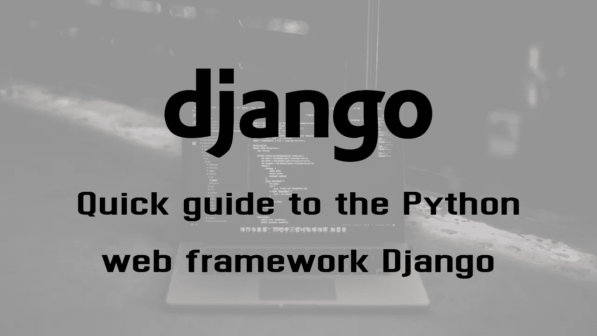
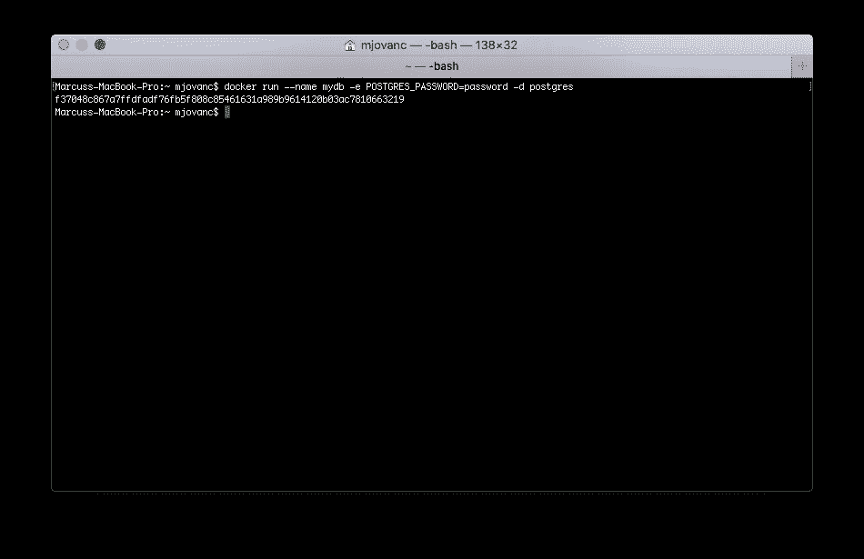
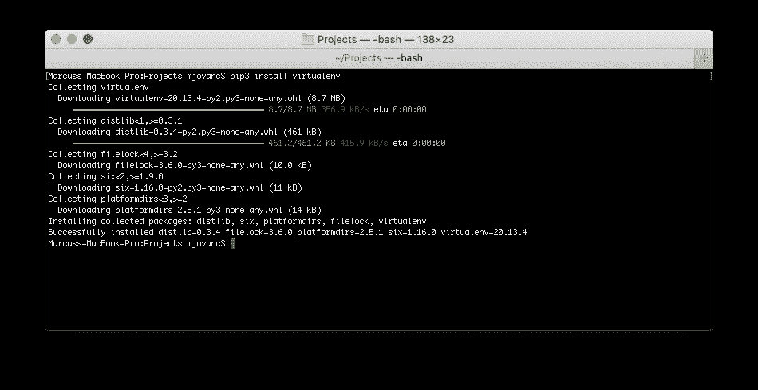
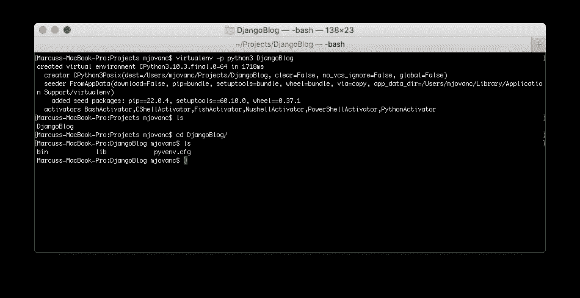
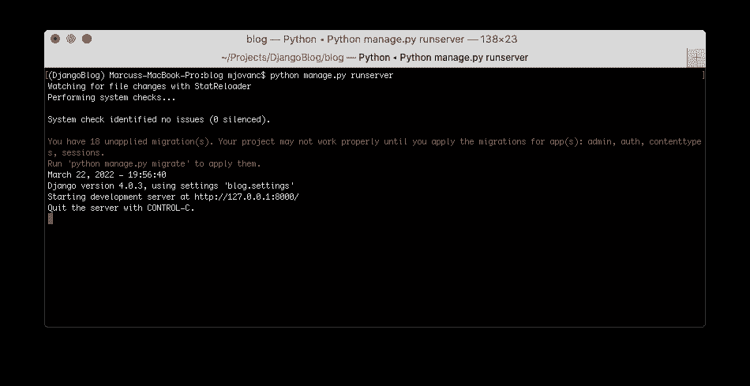
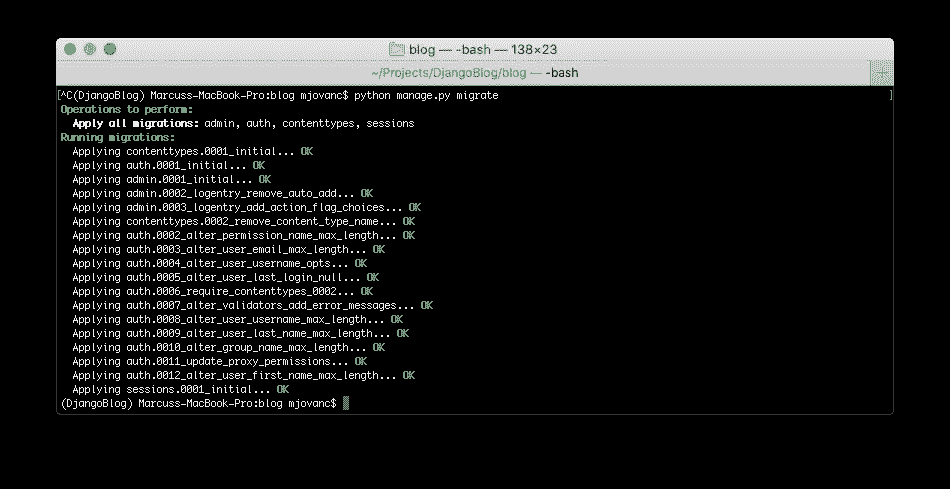
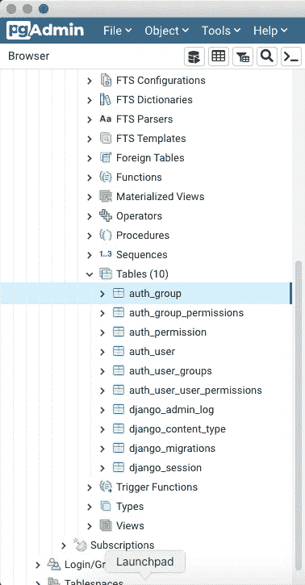
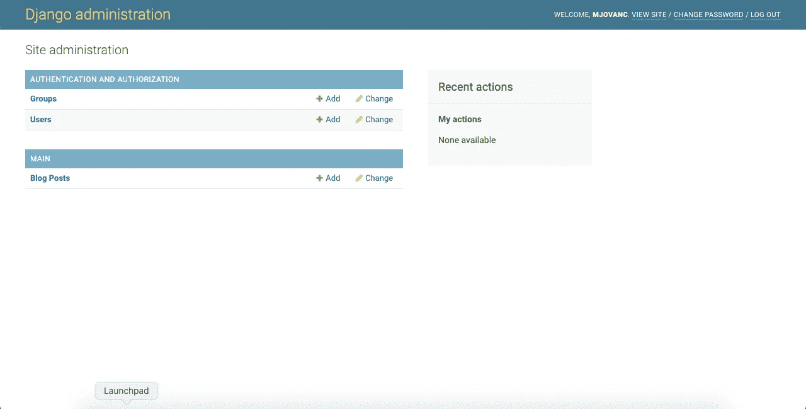

# Python web 框架 Django 快速指南

> 原文：<https://blog.devgenius.io/quick-guide-of-the-python-web-framework-django-f7b7bcdecb57?source=collection_archive---------2----------------------->



作为一种语言，Python 已经成为当今许多领域中非常重要的工具，例如机器学习、人工智能、Web 开发、数据分析、游戏开发、物联网、应用程序开发、医学和药理学、生物学和生物信息学、计算机视觉和图像处理等等。很明显它会留在这里。

在本教程中，我们将介绍如何使用 web 框架 Django 和 PostgreSQL 数据库启动一个简单的 web 应用程序来存储我们的数据。我们将在 Docker 容器中运行数据库，以节省在我们的计算机上设置数据库的时间，或者只是因为我们可以！当然，如果您更愿意手动安装 PostgreSQL，您可以自由地这样做，并且仍然能够跟随。我假设您熟悉终端和 UNIX 系统。我通常在我的 Ubuntu 操作系统上演示，但这次用的是 Mac 操作系统。

**我们将使用:**

*   Python 3.10.3
*   姜戈 4.0.3
*   一种数据库系统

# 设置开发数据库

因此，首先我们将使用 Docker 设置数据库，以避免这种情况。如果你不知道 Docker 是如何工作的，并且想学习它，可以查看我在 Docker 上的教程:[https://mjovanc . com/get-started-with-Docker-and-Docker-compose-cdd CB 5a 3 F3 b 9](https://mjovanc.com/get-started-with-docker-and-docker-compose-cddcb5a3f3b9)

在终端中运行以下命令启动数据库:

```
docker run --name mydb -e POSTGRES_PASSWORD=password -d -p 5432:5432 postgres
```



# 安装 Virtualenv 和 Django

现在我们有了一个正在运行的 PostgreSQL 服务器，我们准备开始深入研究 Django。确保您的系统上安装了 Python 3。我们开始在您的主目录中创建一个目录，使用:

```
mkdir -p ~/Projects
```

然后，我们在终端中移动到该目录，并运行以下命令:

```
pip3 install virtualenv
```

我们用它在我们的系统上安装 virtualenv pip 包。pip3 是 Python 3 的包管理器，类似于 JavaScript 的 NPM 或 Java 的 Maven 等。这是它的外观，它将下载我们使用 virtualenv 所需的所有依赖项:



```
virtualenv -p python3 DjangoBlog
```

我们使用这个命令来隔离我们的开发环境，所以一旦我们觉得可以发布软件了，我们就可以提取已安装的依赖项列表，并确保软件和相应的版本与我们在一起，没有任何东西会中断。现在我们进入创建的目录:



现在我们必须激活虚拟环境，这样我们就可以使用*内部* pip 命令只在其中安装软件包，而不是在系统范围内:

```
source bin/activate
```

现在我们已经激活并准备安装 Django，输入以下命令:

```
pip install Django psycopg2-binary
```

正如你在这里看到的，我们还包括了 **psycopg2-binary** ，这个库是使用 PostgreSQL 所必需的。

现在我们将开始一个 Django 项目:

```
django-admin startproject blog
```

现在我们有了一个名为 **blog** 的新目录，在其中你会看到一个文件 **manage.py** 和一个名为 **blog** 的目录。manage.py 文件是用于处理管理任务的命令行实用程序。例如，当我们启动应用程序时会用到它。我们稍后将介绍如何启动它，因为现在我们将创建一个新的应用程序，我们将定义我们的 **ORM** 模型(对象-角色建模)。这在今天非常普遍，因为如果我们创建新的模型，删除或编辑它们以在例如表中存储数据，它节省了大量的时间和编写我们自己的 SQL 查询的麻烦。

# 配置 Django PostgreSQL 设置

让我们打开目录博客中的 **settings.py** 文件，将数据库配置替换为:

```
DATABASES = {
    'default': {
        'ENGINE': 'django.db.backends.postgresql',
        'NAME': 'postgres',
        'USER': 'postgres',
        'PASSWORD': 'password',
        'HOST': '127.0.0.1',
        'PORT': '5432',
    }
}
```

现在，我们已经完成了一些非常基本的配置，我们将测试启动应用程序，这样我们就可以看到与数据库的通信正常工作，并且在此过程中没有出错。现在运行~/Projects/DjangoBlog/blog 中的命令:

```
python manage.py runserver
```

现在我们将看到下面的内容，我们已经成功地启动了它，但是我们实际上还没有完成到数据库的初始迁移，所以我们创建了 Django 应用程序所需的模式和表。



python manage.py runserver

为了解决这个问题，我们将按照控制台中的提示运行:

```
python manage.py migrate
```



python manage.py 迁移

迁移完成，我们现在可以再次启动服务器，错误消息将会消失。我们可以通过打开我们的数据库来确认这些表已经被创建，并检查这些表是否确实存在，以进一步确认:



它工作了。太好了，我们现在可以开始创建新的应用程序了。

# 创建 Django 应用程序

停止服务器并运行命令:

```
python manage.py startapp main
```

我们将创建一个名为 main 的新应用程序，在那里我们将存储我们的模型，视图和管理设置。

# 创建模型

现在，我们有了一个名为 main 的新目录，打开 models.py 文件，并在其中添加以下内容:

```
from django.db import models
from django.utils.translation import gettext_lazy as _

class BlogPost(models.Model):
    title = models.CharField(verbose_name=_('Title'), max_length=100)
    text = models.TextField(verbose_name=_('Description'), max_length=1000, blank=True)
    created = models.DateTimeField(verbose_name=_('Created Date'), auto_now_add=True, blank=True, null=True)
    updated = models.DateTimeField(verbose_name=_('Updated Date'), auto_now_add=True, blank=True, null=True)  

    class Meta:
        verbose_name = _('Blog Post')
        verbose_name_plural = _('Blog Posts')
```

我们从内置库 **django.db** 和翻译库导入模型，这样我们就可以定义我们的模型字段，这样如果我们将来需要，它将能够使用翻译。我一般都是为了避免以后做而加，反正也不用太费力气。

然后，我们创建一个名为 BlogPost 的新类，它继承了 Model 类，因此我们可以从中获得所有的属性和行为。然后，我们定义我们需要的自定义字段，如标题、文本、创建和更新。根据我们想要在字段中存储的内容，我们使用不同类型的字段类型。更多信息，他们做什么，什么可能被设置为参数检查 Django 模型字段参考:[https://docs.djangoproject.com/en/4.0/ref/models/fields/](https://docs.djangoproject.com/en/4.0/ref/models/fields/)

# 注册应用程序

所以现在，在我们在 **models.py** 中添加了一个新的自定义 ORM 模型之后，我们将注册我们的应用程序，这样 Django 就可以识别出我们有了一个应该迁移到我们的数据库中的新 ORM 模型。要注册我们的应用程序，再次打开 **settings.py** ，转到 **INSTALLED_APPS** 变量，添加应用程序的名称，在这种情况下，添加 **main** ，如下所示:

```
INSTALLED_APPS = [
    'main',
    'django.contrib.admin',
    'django.contrib.auth',
    'django.contrib.contenttypes',
    'django.contrib.sessions',
    'django.contrib.messages',
    'django.contrib.staticfiles',
]
```

现在我们已经注册了应用程序，现在我们只需要再添加一个命令 **makemigrations** 。运行以下命令:

```
python manage.py makemigrations
python manage.py migrate
```

所以现在数据库中已经填充了一个名为 **main_blogpost** 的新表。从相应的应用程序添加的所有表都有命名约定(如果没有明确指定)**<appname>_<class name>**，全部小写。

# 向管理员注册模型

在这里，我们将创建的模型注册到 Django admin，这样我们可以更容易地添加新对象。我们也可以使用 Django shell 来做这件事，但是如果您希望我做一个的话，最好在以后的更高级的教程中介绍。

因此，让我们首先打开文件 admin.py，并将以下内容添加到其中:

```
from django.contrib import admin
from .models import BlogPost

@admin.register(BlogPost)
class BlogPostAdmin(admin.ModelAdmin):
    list_display = (
        'id',
        'title',
        'created',
        'updated',
    )
```

我们首先导入 admin 和我们创建的模型 BlogPost。然后我们使用一个装饰器来注册这个模型，并创建一个名为 **BlogPostAdmin** 的定制管理类。命名约定是模型名称，并在末尾添加 Admin。然后我们继承 ModelAdmin 类来获取它的属性和行为，然后添加一个自定义的 **list_display** 元组，其中包含我们想要显示的字段。我们不会添加文本字段，因为它可能会很长，而且不会给我们增加太多的价值。

现在我们准备进入管理区，但是首先我们需要创建一个超级用户来访问管理区。通过运行以下命令来完成:

```
python manage.py createsuperuser
```

按照提示添加您需要的信息。然后我们再次启动服务器:

```
python manage.py runserver
```

然后，我们进入管理区域:[http://localhost:8000/admin](http://localhost:8000/admin)输入您刚刚创建的用户名和密码并登录。现在，您应该能够看到以下内容:



Django 管理仪表板

我们现在看到一个名为 main 的新部分，在它下面你会看到博客文章和两个按钮 Add 和 Change。按添加，添加一个新的博客帖子。创建和更新的日期字段将不会显示，因为它会自动为我们添加值。多亏了姜戈，我们不需要任何逻辑处理。

很好，现在我们的数据库中存储了一篇博文，我们可以继续创建一个视图来显示这篇博文。

# 创建基于类的视图

那么，如果我们想通过呈现带有创建对象的 HTML 页面来显示数据，该怎么办呢？我们可以通过创建 Django 视图来解决这个问题。我们将在这里介绍如何使用基于类的视图来实现这一点。这非常方便，因为 Django 已经让我们很容易做到了。还有一个选项是使用函数作为视图，但我们不会在这里讨论它。

打开 **views.py** 并添加以下内容:

```
from django.views.generic.base import TemplateView
from .models import BlogPost

class IndexView(TemplateView):
    template_name = 'index.html'

    def get_context_data(self, **kwargs):
        context = super(IndexView, self).get_context_data(**kwargs)
        context['blogposts'] = BlogPost.objects.all()
        return context
```

在这里，我们定义了一个**模板视图**，并选择将要使用的 HTML 模板的名称。我们还覆盖了 get_context_data()方法，并添加了我们自己的上下文，它将是我们从数据库中获取并返回的 BlogPost 对象，因此我们可以在 HTML 模板中访问它。

转到 **settings.py** 中的**模板**变量，添加如下内容:

```
TEMPLATES = [
    {
        'BACKEND': 'django.template.backends.django.DjangoTemplates',
        'DIRS': [os.path.join(BASE_DIR, 'templates')],
        'APP_DIRS': True,
        'OPTIONS': {
            'context_processors': [
                'django.template.context_processors.debug',
                'django.template.context_processors.request',
                'django.contrib.auth.context_processors.auth',
                'django.contrib.messages.context_processors.messages',
            ],
        },
    },
]
```

在项目的根目录下创建一个名为 **templates** 的目录，并创建一个名为**index.html**的新文件，并将以下代码放入其中:

```
<!DOCTYPE html>
<html lang="en">
<head>
    <meta charset="UTF-8">
    <title>Blog</title>
</head>
<body>

<ul>
    
        <li>{{ bp.title }} - {{ bp.text }}</li>
    
</ul>

</body>
</html>
```

正如我们在这里看到的，我们有一个 **ul** 元素，它循环通过我们在 get_context_data()方法中定义的 blogposts 对象，并访问标题和文本。

现在，我们应该能够获得关于我们的博客文章的上下文数据，并遍历它们，将其呈现在 HTML 页面上。

# 注册视图以列出路线 URL

在博客目录中打开 **urls.py** 并添加以下内容:

```
from django.contrib import admin
from django.urls import path
from main.views import IndexViewurlpatterns = [
    path('admin/', admin.site.urls),
    path('', IndexView.as_view(), name='index'),
]
```

我们添加一个新路径，并将其设置为空字符串，以定义它将出现在索引页面上。我们也可以在我们的应用程序目录中创建一个 **urls.py** 文件，然后将该文件加载到这个文件中，但是现在由于我们没有太多的视图，我们将把它直接添加到项目特定的 **urls.py** 文件中。

现在访问: [http://localhost:8000](http://localhost:8000) ，我们应该能够看到我们的博客文章被渲染成 HTML 文档。

这就是本教程的基本内容。将来我可能会做一些更深入的教程，介绍关系和更高级的用法。这意味着像使用 Django 的基本介绍。

我希望你觉得这是有用的，如果你有，请分享它。:)

# 资源

*   [https://docs.djangoproject.com/en/4.0/](https://docs.djangoproject.com/en/4.0/)
*   [https://docs.djangoproject.com/en/4.0/topics/db/models/](https://docs.djangoproject.com/en/4.0/topics/db/models/)
*   [https://docs.djangoproject.com/en/4.0/topics/db/queries/](https://docs.djangoproject.com/en/4.0/topics/db/queries/)
*   [https://docs.djangoproject.com/en/4.0/topics/http/urls/](https://docs.djangoproject.com/en/4.0/topics/http/urls/)
*   https://docs.djangoproject.com/en/4.0/topics/templates/
*   【https://docs.djangoproject.com/en/4.0/ref/contrib/admin/ 