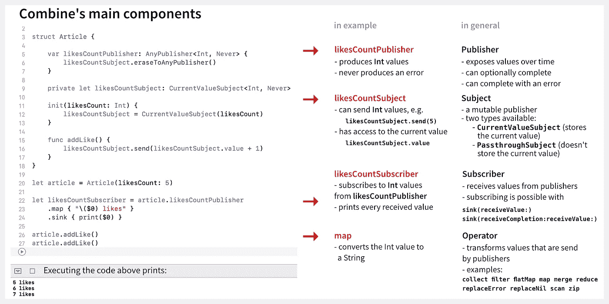

# 联合收割机基本要素快速指南

> 原文：<https://blog.devgenius.io/quick-guide-on-combine-essentials-3b5f8065865e?source=collection_archive---------3----------------------->

## 阅读本指南，了解联合收割机的基本概念和术语，开始使用联合收割机。

在 2019 年 WWDC 展会上听到苹果公司名为 Combine 的新框架真是令人兴奋。最后，我们有了一种本地方式来编写功能性反应代码，并以声明的方式构建应用程序。

这篇文章概述了联合收割机的概念和术语。

# 概观

联合收割机的主要部件有`Publisher`、`Subject`、`Subscriber`和`Operator`。以下是他们工作的简要总结:

**发布者**

*   随着时间的推移公开某种类型的值
*   可以完成，也可以因出错而失败

**主题**

*   一个可变的发布者(能够在初始化后发送新值)
*   有两种主题类型可用:
*   `CurrentValueSubject` -顾名思义，这个主题类型可以访问当前值
*   `PassthroughSubject` -顾名思义，这个 subject 传递当前值，也就是说它不能访问当前值

**订户**

*   从发布者/主题接收值

**操作员**

*   修改从发布者/主题发送的值

在下图中，我们可以看到这些组件的作用。我们将一步一步地看这个例子，下面会更详细地介绍。



组合备忘单

想象一下，我们有一个向用户展示文章的应用程序。文章可以收到喜欢。作为一项要求，我们希望能够改变每篇文章的点赞数，并通知订阅者这一变化。

# 出版商和主题

作为第一步，我们使用 Combine 的发布者和主题的组合来实现我们的目标。

合并出版商和主题

让我们一步一步地检查这段代码。

1.  我们将名为`likesCountSubject`的**主题**定义为`CurrentValueSubject<Int, Never>`类型的私有变量。我们将使用该主题向订户发送新值。因为主题是一个泛型类型，我们指定它是`Output`和`Failure`类型。输出类型定义了主题将发送什么类型的值，在我们的例子中是`Int`值。因为在我们的例子中 in 不能失败，所以我们使用`Never`作为错误类型。
2.  我们用一个`likesCount`参数定义 init 方法，给`likesCountSubject`一个初始值。
3.  我们定义了一个类型为`AnyPublisher<Int, Never>`的名为`likesCountPublisher`的**发布者**。它的`Output`和`Failure`类型与我们的主题相同。订阅者可以使用发布者。我们不一定需要出版商，我们可以简单地将我们的主题公开。但是由于我们不希望 article struct 之外的任何人发送新值，所以我们使用了一个 publisher，只让订阅部分对外部世界可用。
4.  我们定义了增加点赞数的`addLike`方法。在这里，我们使用我们的主题来发送新的值。为了能够添加一个赞，我们访问 subject 的`value`属性来获得赞的当前值。这就是我们在这种情况下使用`CurrentValueSubject`而不是`PassthroughSubject`的原因，因为只有`CurrentValueSubject`可以访问它的当前值。

# 订阅者

现在，我们可以如下使用`Article`结构:

合并用户

让我们一步一步地检查这段代码。

1.  我们创建了一篇文章，并给它一个初始赞数 5。
2.  我们创建了一个名为`likesCountSubscriber`的**用户**，他对赞数的任何更新都感兴趣。订阅者使用发布者及其`sink(receiveValue:)`方法来订阅更新。现在，每次赞数改变时，调用打印新值的闭包。
3.  我们通过调用两次`addLike()`来增加赞数。

因此，代码会产生以下输出:

```
5
6
7
```

当我们创建一个新的订阅者时，发布者总是返回一个符合`Cancellable`协议的对象。因此，如果我们想取消接收新值，我们可以在订阅服务器上调用`cancel()`方法。

例如，如果我们在增加的赞之间添加取消呼叫，

```
article.addLike()
likesCountSubscriber.cancel()
article.addLike()
```

不会打印最后一个值。

# 经营者

现在，我们可以在执行打印闭包之前使用操作符来修改接收到的值。例如，如果我们想打印一些更具描述性的东西，我们可以使用`map`操作符将`Int`值映射到`String`值:

```
let likesCountSubscriber = article.likesCountPublisher
    .map { "\($0) likes" }
    .sink { print($0) }
```

现在，我们的输出看起来像这样:

```
5 likes
6 likes
7 likes
```

Combine 提供了许多有用的操作符，我们可以链接任意多的操作符。

为了更深入地研究操作符，让我们看下面的例子。

这个例子没有做什么有用的事情，但是它有望给操作符和它们的组合一个很好的理解。

在查看下面的解决方案之前，尝试自己找出每个操作符产生的输出。

1.  产生`[1, 3] [6, 10] [4, 19, 8, 6]`，因为我们用`merge`操作符将来自`publisher1`的元素和来自`publisher2`的元素组合在一起
2.  产生`1, 3, 6, 10, 4, 19, 8`，因为我们用`flatMap`将`Int`数组展平成一系列`Int`值
3.  产生`6, 10, 4, 8`，因为我们用`filter`运算符过滤掉了所有不均匀的值
4.  产生`10, 4, 8`，因为我们用`dropFirst`操作符删除了第一个元素
5.  产生`[10, 4, 8]`，因为我们用`collect`操作符收集所有接收到的项目，并将它们作为数组返回
6.  产生`[4, 8, 10]`，因为我们用`map`操作符将数组映射到一个排序的数组中

当然，还有更多运营商有待发现。运营商的完整列表可在官方发布文档中获得。

# 联合收割机中的内存管理

订户的生命周期与保留对象的生命周期相关联。每当释放该对象时，都会自动在 subscriber 属性上调用 cancel 方法，它也将被释放。

当然，就像 Swift 中的“传统”内存管理一样，您需要注意不要创建保留周期，例如在`sink`闭包中使用强 selfs 时。

# 进一步阅读

既然您已经了解了 Combine 的基础知识，我的下一步建议是研究属性包装器。在这种情况下，特别有趣的是将变量转换成组合发布器的 [@Publish 属性包装器](https://developer.apple.com/documentation/combine/published)。

【https://tanaschita.com】原载于[](https://tanaschita.com/posts/20201115-quick-guide-on-combine-essentials/)**。**