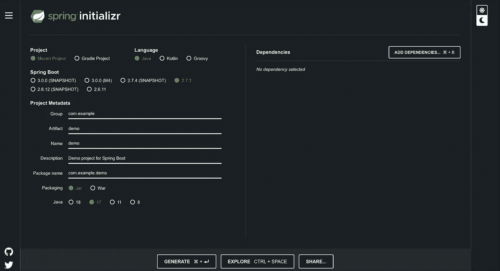
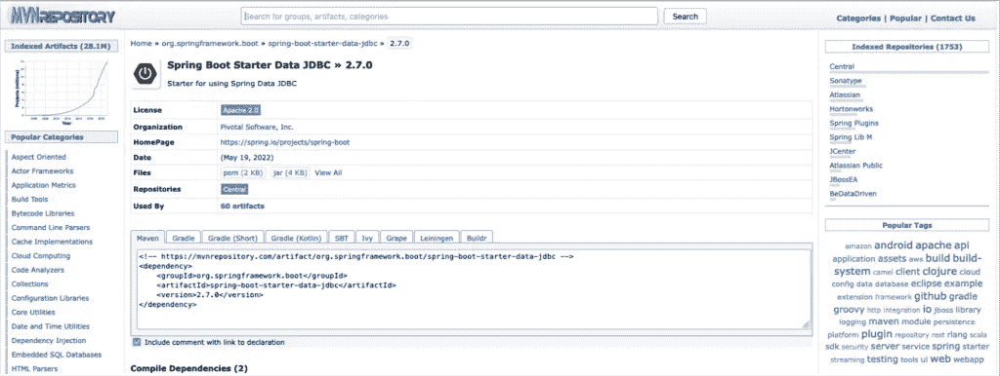

# Spring Boot Rest API 开发快速入门

> 原文：<https://blog.devgenius.io/quick-intro-to-rest-api-development-with-spring-boot-64583dabbe8c?source=collection_archive---------14----------------------->

具有真实数据库数据的 Spring Boot REST API 项目。提供带源代码的回购！


# 介绍

这是一个快速、简单、运行良好的 Spring Boot REST API 项目，展示了这样一个项目的基本构件。这个想法是为了激励初学者，并挑战他们开始深入挖掘。当然，您可以遵循“ [**开发您的第一个 Spring Boot 应用程序**](https://docs.spring.io/spring-boot/docs/current/reference/htmlsingle/#getting-started.first-application) ”的官方文档或任何其他适当的来源。当然，您必须花一些时间来熟悉基本概念(例如，REST APIs、端点、请求、响应等。这个帖子也是我其他帖子的基础。提供了 GitHub 库。

# 先决条件

自从你开始阅读这篇文章，我想你也开始对 Spring Boot 开发感兴趣，至少知道如何通过[**Spring iintializ**](https://start.spring.io/)[**r**](https://start.spring.io/)创建/初始化一个项目。

[](https://start.spring.io/)

如果您想继续，您应该有一个合适的 IDE 和必要的工具来开发这样一个应用程序。如果你想了解如何开始使用 Spring Boot 和相关工具编写 VS 代码[ [**这里**](https://www.devxperiences.com/pzwp1/2022/05/15/intellij-community-edition-working-with-spring-boot/) ]，以及 IntelliJ (CE) IDEA [ [**这里**](https://www.devxperiences.com/pzwp1/2022/05/15/visual-studio-code-setting-it-up-as-your-java-spring-boot-development-environment/) ]，我还有其他的帖子。这些帖子还包括了 IDE 中的**的 Spring Initializr 的用法。此外，你还需要访问一个工作数据库，实际上是一个 MariaDB/MySQL 数据库。**

# REST API 的非常非常基本的演示应用

## 项目初始化

在通过 Spring Intializr 创建/初始化项目的过程中，您可以添加许多适合开始开发项目的依赖项。Spring Boot 为我们提供了许多“开端”。添加到项目类路径中的 jar 打包依赖项(如库)。通过点击[**Spring iinitalizr**](https://start.spring.io/)中的 ADD DEPENDENCIES 按钮，您可以找到一个带有简短描述的启动器/依赖项的长列表。此外，您可以随时访问 Maven 存储库，它维护着一个庞大的依赖项列表。

此外，您可以随时访问 Maven 存储库，它维护着一个庞大的依赖项列表。

[](https://mvnrepository.com/artifact/org.springframework.boot/spring-boot-starter-web/2.7.0)

注意:这里使用了 [**Apache Maven**](https://maven.apache.org/index.html) 依赖/包管理器。—不是那个 [Gradle](https://gradle.org/) 。

因为 REST API 开发实际上是一个 WEB 应用程序，你至少需要添加 **Spring Boot 启动 Web** 。


此外，如果你也希望使你的开发周期更容易(自动重启/实时重载)，那么也可以添加 Spring Boot 开发工具。


就这样，现在不需要更多的依赖。在您的本地计算机中选择一个文件夹，并创建您的项目。实际创建的是一个与下图相同或相似的文件夹结构:

看看下面的 [**pom.xml**](https://maven.apache.org/guides/introduction/introduction-to-the-pom.html#what-is-a-pom) 文件，您可以看到由 Spring Initializr 自动添加的真正的依赖项:

太酷了。花点时间熟悉 Spring Boot、依赖项和 pom.xml 文件，以及创建的其他文件和文件夹。

## 从事项目

**添加一个对象(实体)类**

添加一个对象类作为对 HTTP 请求的响应，作为数据发回的原型。在这里，作为一个例子，我们使用了**Item.java**类:

**添加一个存储库类**

这是另一个标注为 [@Repository](https://docs.spring.io/spring-framework/docs/current/javadoc-api/org/springframework/stereotype/Repository.html) 的类，在这里我们可以收集对象的**列表**(在我们的例子中是项目),并将它们作为响应发送回去。它实际上充当了一个[@控制器](https://docs.spring.io/spring-framework/docs/current/javadoc-api/org/springframework/stereotype/Controller.html)的存储库**服务**(数据源)。下面是一个非常简单的例子，它只返回带有预定义值的 Item 对象的数组列表:

由于上述两个 java 类都是数据对象，我们可以将它们打包在一个包中，例如" **dataObjects** "包。

*注意，一个* [*包*](https://docs.oracle.com/javase/tutorial/java/concepts/package.html) *这里只是一个* ***文件夹*** *聚集在一起的一些相关类/对象。此外，使用包来构建您的开发项目总是一个好主意。*

**添加一个控制器**

一个[控制器](https://docs.spring.io/spring-framework/docs/current/javadoc-api/org/springframework/stereotype/Controller.html)只不过是一个用一些 Spring 注释适当注释的 java 类。它的主要目的是处理/接受特定端点(URL 路径)的 HTTP 请求，并使用数据(例如对象列表)或异常错误进行响应。下面也是一个名为**ItemsController.java**的控制器的简单例子:

因为我们很可能会添加更多的控制器，例如为不同数据对象的其他端点服务，所以将我们的控制器(ItemsController.java)放在一个单独的包中是一个好主意。在这里我们将这个包命名为**控制器**。之后，项目的文件夹结构变成了:

或者，您也可以在 IDE 中查看项目的文件夹结构(此处来自 VS 代码):


## 运行项目

如果你使用的是 VS 代码，并且已经安装了必要的工具(正如我之前提到的，你可以在这篇[](https://www.devxperiences.com/pzwp1/2022/05/15/visual-studio-code-setting-it-up-as-your-java-spring-boot-development-environment/)**的帖子中看到)，那么你就可以运行这个应用程序了，方法是在边栏下部的左窗格中找到 **Spring Boot 仪表板**标签。然后点击运行箭头，启动应用程序。(如果您看到任何类似“*错误:无法找到或加载主类 com . zzpzaf . restapidemo . restapidemoapplication*”的错误，那么您可能需要首先编译应用程序，方法是单击 **Maven** 选项卡的**生命周期**的**编译**选项。然后运行应用程序。)**

****

**您应该知道，嵌入式 [Apache Tomca](https://tomcat.apache.org/) [t](https://tomcat.apache.org/) 服务器(由 spring-boot-starter-web 依赖项提供，我们已经在项目初始化期间添加了该依赖项)在端口 8080 监听传入的 HTTP 请求。所以，打开你的浏览器，输入网址:[http://localhost:8080/API/items，](http://localhost:8080/api/items,)然后回车:**

****

**当然，更好的方法是安装并使用众所周知的 [Postman](https://www.postman.com/) API 测试工具，与你的 API 一起工作。例如:**

****

**酷！。到目前为止，一切顺利。**

**如果您成功地遵循了上面的指导方针，那么您已经创建了一个简单的项目代码库。然而，为了您的方便，这里有一个回购协议，您可以将其作为进一步发展的基础:
[https://github.com/zzpzaf/restapidemo_base.git](https://github.com/zzpzaf/restapidemo_base.git)。**

# **使用真实数据库中的数据**

**到目前为止，一切顺利。然而，仅仅使用一个 ArrayList 来创建一些条目数据，就可以让您了解如何通过 REST API 端点来提供一些数据，但实际上，这没什么大不了。在大多数情况下，REST API 由一个真实的数据库支持，即用于保存和检索应用程序数据的持久性数据层。**

**下面，我们将通过使用一个真实的数据库来扩展我们的基本示例。**

## **使用真实数据库进行数据准备( [MariaDB](#fb72) )**

**在 [SQL](https://en.wikipedia.org/wiki/SQL) 数据库和 [NoSQL](https://en.wikipedia.org/wiki/NoSQL) 数据库之间，这里我们将使用一个 SQL 数据库，更准确地说是 [MariaDB](https://mariadb.org/) 一个对 [MySQL](https://www.mysql.com/) 的开源(二进制)替代。如果你还没有在你的机器上安装它，你可以这样做，例如，在我的文章中选择下面两个选项中的一个:**

*   **[Docker](https://medium.com/@zzpzaf.se/mariadb-in-docker-65130d77959b?sk=b52cad21459a10dc0c873fcf15b612c8)中的 MariaDB(安装和使用)**
*   **[安装 MariaDB (10.5.8。-GA)通过 macOS 上的自制软件](https://www.devxperiences.com/pzwp1/2021/01/08/install-mariadb-10-5-8-ga-via-homebrew-on-macos/)**

**因此，在您访问一个工作的 MariaDB 安装之后，您必须创建一个表，并添加一些我们以前见过的作为 item 对象的 ArrayList 创建的条目记录。**

**使用 MariaDB 和 SQL 数据既可以通过使用您的终端和**[**MySQL CLI**](https://mariadb.com/kb/en/mysql-command-line-client/)来完成，也可以通过使用 GUI 来完成，例如 [MySQL Workbench](https://www.mysql.com/products/workbench/) 或基于 web 的 [phpMyAdmin](https://www.phpmyadmin.net/) (或任何其他允许您使用 MariaDB/MySQL 数据库的工具)。请注意，你可能也会发现我的帖子[在这里](/the-database-command-line-tools-you-can-add-to-your-dev-environment-without-database-installation-9091dd0c0277?sk=50026b887181c062144e6fbb9130663e)很有用，关于如何安装和使用 **mysql CLI** 作为**独立工具**。同样在这里(在我的个人网站上)你可以看到如何在你的机器上安装 phpMyAdmin。为了方便起见，在下面找到生成 Items 表的 SQL 脚本，并向其中添加一些记录:****

****例如，您必须授予用户对该表的访问权限。在这里，我们将向名为 **user1** 的用户授予完全权限，该用户是在文章 [here](https://www.devxperiences.com/pzwp1/2021/01/08/install-mariadb-10-5-8-ga-via-homebrew-on-macos/) 中创建 MariaDB Docker 容器的过程中自动创建的，如前所述:****

****仅针对表“项目”:****

```
**GRANT ALL ON items TO 'user1'@'%'**
```

****或者对于数据库模式中名为“items1”的任何对象(在我们的示例中，它包含表“items”):****

```
**GRANT ALL ON items1.* TO 'user1'@'%'**
```

## ****添加依赖关系****

****在我们准备好数据库之后，我们现在可以回去继续我们的 REST API 项目。****

****首先，我们必须在项目 pom.xml 文件中添加必要的依赖项。这实际上是两个依赖关系。****

****1. [MariaDB Java 客户端](https://mvnrepository.com/artifact/org.mariadb.jdbc/mariadb-java-client) —是 MariaDB 和 MySQL 数据库的 JDBC 驱动程序。(最新版本——今天 220520 是 3.0.4)。****

****[](https://mvnrepository.com/artifact/org.mariadb.jdbc/mariadb-java-client)****

****2. [Spring Boot 首发数据 JDBC](https://mvnrepository.com/artifact/org.springframework.boot/spring-boot-starter-data-jdbc/2.7.0) 。这是最低要求的依赖，为我们提供关系连接和工作模板(创建、执行等)。)与原始 SQL 查询(No[ORM](https://docs.spring.io/spring-framework/docs/3.0.x/spring-framework-reference/html/orm.html)s/[JPA](https://spring.io/projects/spring-data-jpa)/[Hibernate](https://hibernate.org/orm/))。它支持所有主要的 SQL 数据库和方言(DB2、H2、HSQLDB、MariaDB、Microsoft SQL Server、MySQL、Oracle、Postgres)。
注意，不需要指定其版本，因为它遵循的是 Spring Boot 框架的父依赖关系(今天 220521 的最新版本是版本 2.7.0)。****

****[](https://mvnrepository.com/artifact/org.springframework.boot/spring-boot-starter-data-jdbc/2.7.0)****

****因此，下面给出了实际需要添加到 pom.xml 中的内容。****

*****请注意，每次您更改****POM . XML****文件时，您的 IDE 都应该* ***同步*** *所做的更改(即，它应该从 Maven 存储库中移除或获取依赖项)。如果你愿意，你可以配置它自动完成。*****

## ****向 application.properties 文件中添加连接参数。****

****您可能已经注意到，在用 Spring Initializr 创建/初始化的项目结构中的 **/src/main/resources** 子文件夹中，已经创建了一个名为 **application.properties** 的文件。文件到目前为止是空的。****

******application.properties** 文件用于定义外部参数(环境属性),这些参数将是我们希望 Spring Boot 应用程序使用的属性。有一些可以使用的预定义属性，这里的[是一些最常用的属性。此外，有一个完整的机制允许为不同的目的(开发、测试、生产等)使用不同的 application.properties 文件。)但这是另一个话题。](https://docs.spring.io/spring-boot/docs/current/reference/html/application-properties.html)****

****现在我们要做的是设置属性和它们的值，这将允许我们连接和使用我们的 MariaDB 数据库。因此，请在 application.properties 文件中添加以下不言自明的行:****

****就这样，现在可以继续编码了。****

## ****更改我们的存储库中的代码(ItemsRepo.java)****

****嗯，除了我们更改了 pom.xml 和 application.properties 文件之外，实际上 Java 代码已经没什么可做的了。****

****因此，打开 ItemsRepo.java 文件，找到 **getItems()** 请求处理方法，并像下面的代码一样修改它:****

****这么简单！其余的由弹簧处理。****

## ****运行应用程序****

****如果您没有更改 Items 表中的数据，您将不会注意到任何差异。产量绝对和以前一样！然而，这一次我们使用一个真实的数据库。****

********

****所以，就这样了。
同样，你可以在回购处访问最终代码:
[【https://github.com/zzpzaf/restapidemo-jdbc-mysql.git](https://github.com/zzpzaf/restapidemo-jdbc-mysql.git)
在你希望进一步发展的任何时候使用它。****

****我希望你有所领悟，并准备好开始与 Spring Boot 合作！****

****编码快乐！****