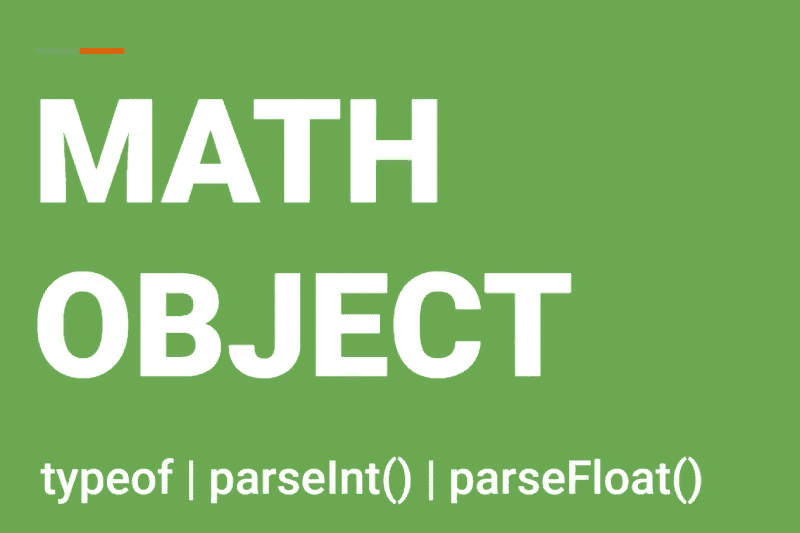

# JS 系列# 7:JS 中的主数学对象和转换

> 原文：<https://blog.devgenius.io/quick-math-operations-with-math-object-type-conversion-9d836363b46c?source=collection_archive---------10----------------------->

## 轻松玩转 JS 中的数字



JS 中的快速数学运算

> `Math`对象包含用于轻松执行数学运算的属性和方法。除了各种方法之外，`Math` object 还包含一个内置常量/属性列表，用于最常用的值，如`PI`、`E`、`LN10`、`LN2`、`LOG10E`、`LOG2E`。`SQRT2`等。

```
console.log(Math.PI) // 3.141592653589793console.log(Math.E) // 2.718281828459045console.log(Math.round(4.8)) // 5console.log(Math.abs(-45)) // 45console.log(Math.pow(2.5)) // 32console.log(Math.floor(3.9876)) // 3
```

## 命名约定

注意在上面的例子中，`Math`是一个对象(类),所以第一个字母是大写的。`PI`、`E`、`LN10`为常量，按照 JS 中的命名约定，以大写形式书写。

# 数学对象的流行方法

数学对象涵盖了一系列执行数学运算的方法，大多数方法都是自解释的。您可以找到[数学对象方法 MDN 引用](https://developer.mozilla.org/en-US/docs/Web/JavaScript/Reference/Global_Objects/Math)的完整列表。

这里我们将介绍日常生活中最常用的数学对象方法。

## 1.数学. abs(n)

它返回`n`的绝对值。`n` / `-n`的绝对值始终为正`n`。

```
**Example:** console.log(Math.abs(45)) // 45
console.log(Math.abs(-67)) // 67
```

## 2.Math.cbrt(n)

它返回`n`的立方根。

```
**Example:**
console.log(Math.cbrt(27)) // 3
console.log(Math.cbrt(125)) // 5
console.log(Math.cbrt(1000)) // 10
```

## 3.数学.地板(n)

它返回小于或等于`n`的最大整数。

```
**Example:**
console.log(Math.floor(3.6)) // 3
console.log(Math.floor(4.9)) // 4
console.log(Math.floor(-3.8)) // -4
```

## 4.数学细胞

它返回大于或等于`n`的最小整数。

```
**Example:**
console.log(Math.ceil(3.6)) // 4
console.log(Math.ceil(3.2)) // 4
console.log(Math.ceil(-3.2)) // -3
```

## 5.Math.round(n)

将`n`四舍五入到最接近的整数。

```
**Example:**
console.log(Math.round(3.4)) // 3
console.log(Math.round(2.8)) // 3
console.log(Math.round(-3.6)) // -4
```

## 6.Math.trunc(n)

通过移除任何小数来返回`n`的整数部分

```
**Example:**
console.log(Math.trunc(3.45)) // 3
console.log(Math.trunc(3.99)) // 3
console.log(Math.trunc(-4.5)) // -4
```

## 7.Math.max(x，[y，[z…]])

它可以返回给定值中的最大值。它可以接受任意数量的参数。

```
**Example:**
Math.max(2,5) // 5
Math.max(4,8,11,2) // 11
Math.max(-2.4,5,-9.8,2.99) // 5
```

## 8.Math.random()

返回 0 到 1 之间的随机数，但不包括 1。

```
**Example:**
Math.random() // 0.1978566956715737
Math.random() // 0.9108333111459985
```

# 生成 1 到 10 之间的随机数

```
**Step-1:** Math.random() // Returns any random number between 0 to 1, not    including 1\. For example: 0.6666310360357859**Step-2:** Math.random() * 10 // 6.666310360357859, shift one digit to the left and make a number between 0 to 10, not including 10**Step-3:** Math.floor(Math.random() * 10): Chops all decimal places and returns an integer between 0 to 10 not including 10.**Step-4:** Math.floor(Math.random() * 10) + 1 : Add 1 to get the number between 1 to 10.**Complete in Single Step:***Math.floor(Math.random() * 10) + 1* 
```

# 生成 50 到 100 之间的随机数。

```
// **Step-1:** Generate Random number between 0 to 50
Math.floor(Math.random() * 50) // 5// **Step-2:** Add 50 to get the numbers between 50 to 100
Math.floor(Math.random() * 50) + 50 // 55
```

# 运算符的类型

在 JavaScript 中，`typeof`是一个奇数运算符，用于获取任何值、变量或表达式的类型。

```
typeof 99 // "number"
typeof 'Alex' // "string"
typeof true // "boolean"
typeof undefined // "undefined"
typeof null // "object"
```

# parseInt() & parseFloat()

如果我们在讨论数字及其类型，有两个主要的功能是不能忽视的…

`parseInt()` & `parseFloat()`函数用来将字符串转换成数字。任何表示有效数字的字符串都可以转换成等价的数字。

以数字开头的`string`代表有效数字。如果`parseInt()` & `parseFloat()`无法将字符串转换成数字，则返回`NaN`。

```
**Example:**
console.log(parseInt('124')) // 124
console.log(parseInt('Alex')) // NaN
console.log(parseFloat('99.45')) // 99.45
console.log(parseInt('99.45')) // 99
console.log(parseInt('$45')) // NaN
console.log(parseInt('95 cents')) // 95
console.log(praseInt('     99999')) //99999
console.log(parseInt('     .987')) // NaN
console.log(parseFloat('    .987')) // 0.987
```

如果你喜欢这篇文章，请关注我:

**中:**[https://medium.com/@maheshshittlani](https://medium.com/@maheshshittlani)
**Github:**[https://github.com/maheshshittlani](https://github.com/maheshshittlani)
**LinkedIn:**[https://in.linkedin.com/in/mahesh-shittlani-638b7429](https://in.linkedin.com/in/mahesh-shittlani-638b7429)