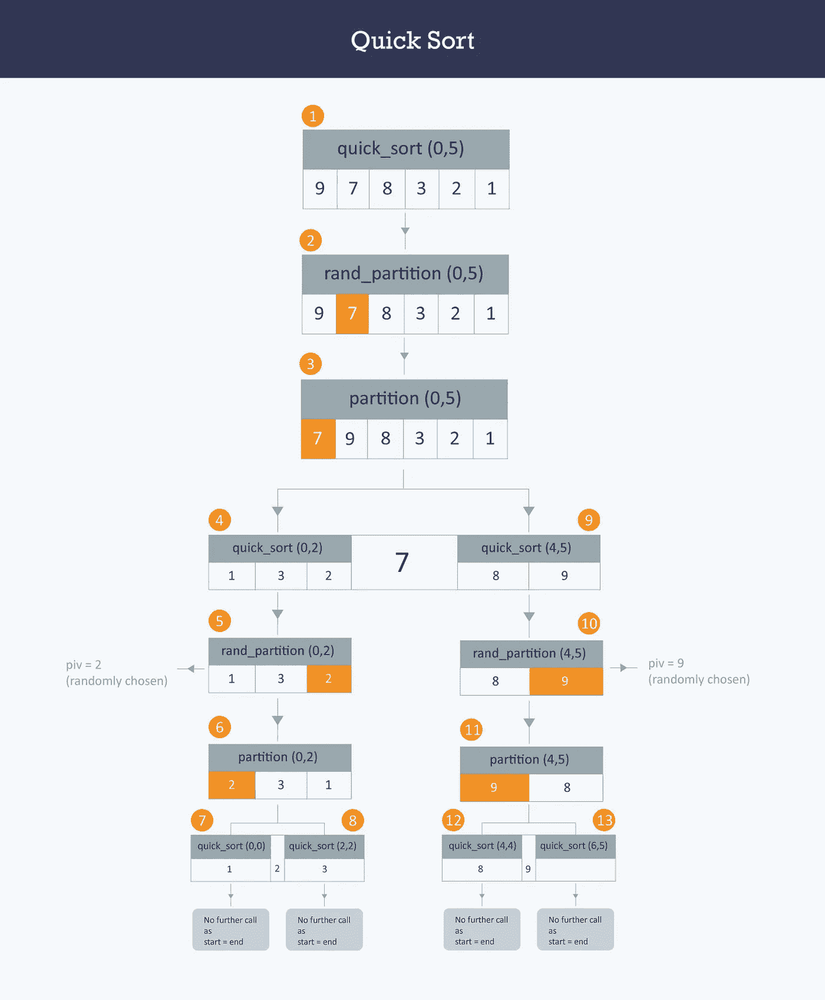
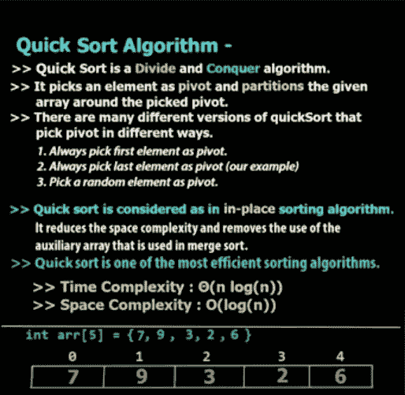
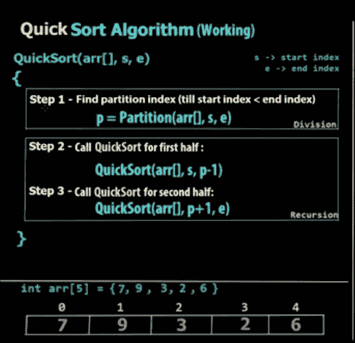
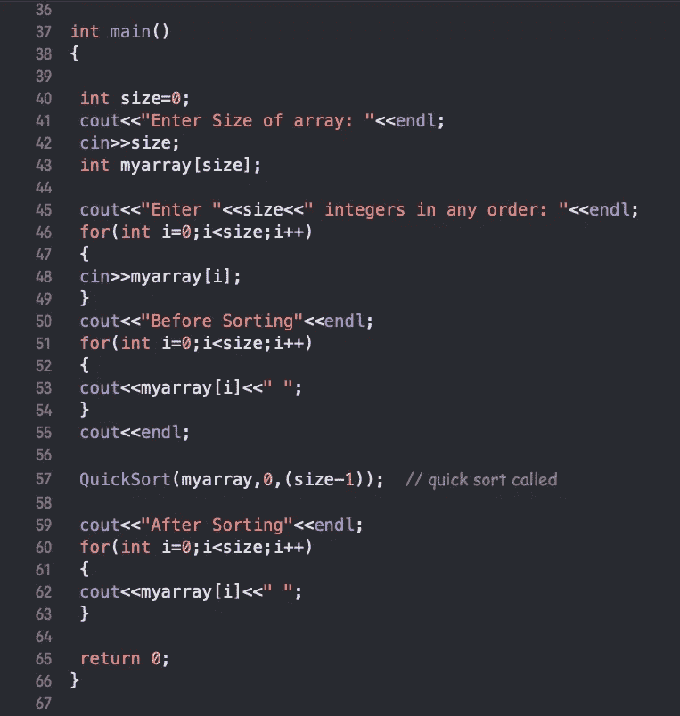
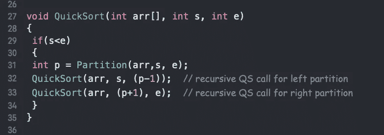
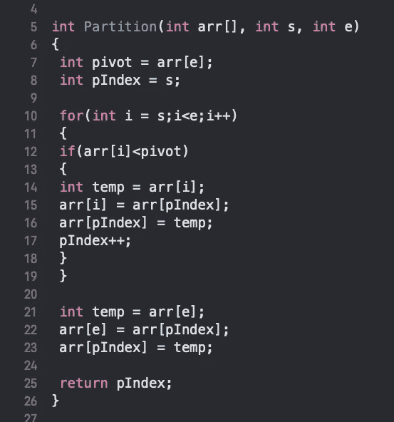

# 快速排序算法

> 原文：<https://blog.devgenius.io/quick-sort-algorithm-7bcf2ff1e79c?source=collection_archive---------0----------------------->

**逐行解释 C++中的快速排序算法**

一位作者在这里用图表和代码截图简要解释了快速排序，还推荐了一些链接。此外，逐行解释该算法在 C++中的程序执行。

> 快速排序基于分而治之的方法，这种方法基于选择一个元素作为 pivot 元素并对其周围的数组进行分区的思想，这样:pivot 的左侧包含小于 pivot 元素的所有元素，右侧包含大于 pivot 元素的所有元素。

# 图解说明快速排序算法的工作

# 现在让我们为这个算法编码

**节目第一部分(图 1)**

**第 37 行(图 1) :-** 这里从主函数启动程序，因为我们向用户询问数组的大小，由用户获取数组的元素，并在排序前打印元素。

**第 57 行(图 1) :-** 这里我们调用排序算法对数组进行排序，现在是时候研究这个函数了，我们也将参数作为数组的第 0 个索引和数组的最后一个索引进行传递。

# 现在让我们编写快速排序函数的代码

**程序的第二部分(图 2)**

**第 27 行(图 2) :-** 这里我们应用主排序函数，将参数作为数组，将“s”作为起始索引，“e”作为结束索引。

**第 29 行(图 2) :-** 这里我们检查的是起始索引是否小于结束索引，很明显起始索引(0)总是小于最后一个数组，写这个的目的是为了确定是否有更多的元素。

**第 31 行(图 2) :-** 这里我们调用的是分区函数，将返回值存储在 p integer 中。也以参数为 *arr* 和起始索引和结束索引。

**第 32、33 行(图 2) :-** 这里我们递归调用函数本身，希望你对递归函数有所了解。

> 在继续下一步之前，你至少应该听说过递归函数，如果你不知道的话，那就谷歌一下。

# 现在让我们编写我们的分区函数

**程序的第三部分(图 3)**

**首先让我们了解分区的目的，因为该算法说选择一个枢轴，然后将所有较小的值放在左边，较大的值放在右边，这意味着与枢轴相比较小的值将在左边，而与枢轴相比较大的值将在右边。**

**第 5 行(图 3) :-** 这里我们以参数为数组，起始索引，最后索引来应用分区。现在，在第 7 行中，我们将数组的最后一个元素作为支点，在下一行中，我们将一个整数作为第一个索引的值，我们将在下一个程序中使用 *iIndex* 。

**第 10 行(图 3) :-** 现在我们正在迭代一个 for 循环，将较小的值放在左边，将较大的值放在右边。所以从起始索引 0 开始循环，直到最后一个索引。现在，我们将第一个元素与 pivot 进行比较，并交换它们(将较小的值放在左边)。

**第 21 行(图 3) :-** 这里我们正在执行交换，但是与 pivot 相比，它的值更大。并返回 *pIndex* 的值。

# 下面视频中的快速排序算法讲解

**快速排序的算法说明**