# Apache DolphinScheduler 机器学习工作流程快速入门

> 原文：<https://blog.devgenius.io/quick-start-with-apache-dolphinscheduler-machine-learning-workflow-ee267e606cae?source=collection_archive---------11----------------------->

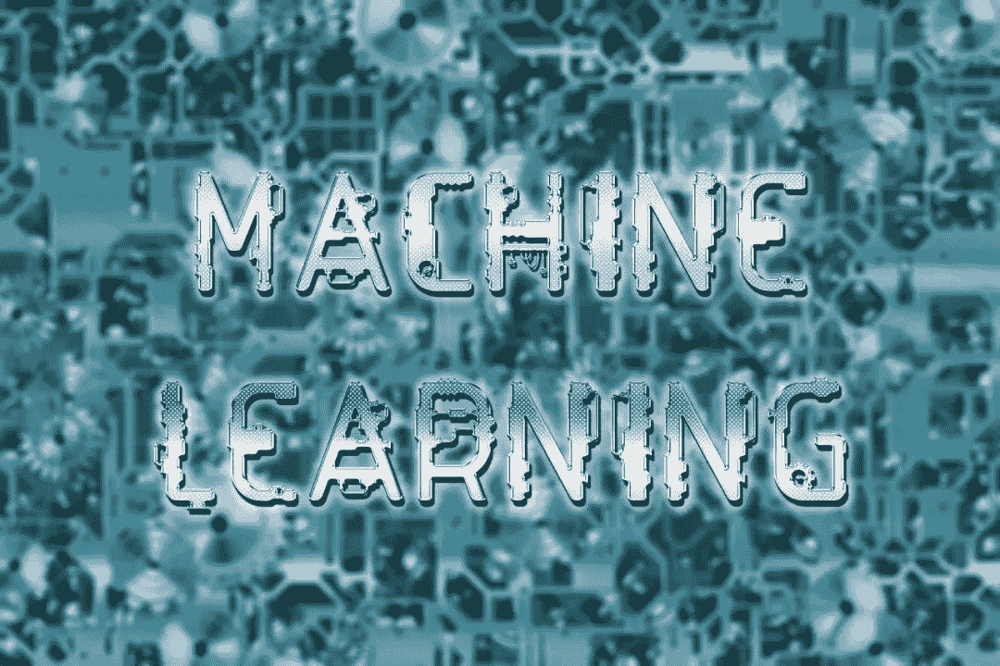

# 摘要

随着 Apache DolphinScheduler 3.1.0 的发布，增加了许多 AI 组件，以帮助用户更高效地在 Apache DolphinScheduler 上构建机器学习工作流。

本文详细描述了如何用一些机器学习环境来设置 DolphinScheduler。还通过实验示例介绍了 MLflow 组件和 DVC 组件的使用。

# DolphinScheduler 和机器学习环境

## 测试程序

所有代码可以在[https://github . com/Jie Guangzhou/dolphin scheduler-ml-tutorial](https://github.com/jieguangzhou/dolphinscheduler-ml-tutorial)找到

获取代码

```
git clone <https://github.com/jieguangzhou/dolphinscheduler-ml-tutorial.git>
git checkout dev
```

## 安装环境

**康达**

只需按照官方网站安装它，并将 Conda 的路径添加到环境变量中

安装后，mlflow 和 dvc 命令将被安装在 conda 的 bin 目录中。

```
pip install mlflow==1.30.0 dvc
```

## Java8 环境

```
sudo apt-get update
sudo apt-get install openjdk-8-jdk
java -version
```

配置 Java 环境变量，~/。bashrc 或者~/。zshrc

```
# Confirm that your jdk is as below and configure the environment variables
export JAVA_HOME=/usr/lib/jvm/java-1.8.0-openjdk-amd64
export PATH=$PATH:$JAVA_HOME/bin
```

## 阿帕奇海豚调度程序 3.1.0

下载海豚调度程序 3.1.0

```
# Go to the following directory (you can install in other directories, for the convenience of replication, in this case, the installation is performed in the following directory)
cd first-example/install_dolphinscheduler
## install DolphinScheduler
wget <https://dlcdn.apache.org/dolphinscheduler/3.1.0/apache-dolphinscheduler-3.1.0-bin.tar.gz>
tar -zxvf apache-dolphinscheduler-3.1.0-bin.tar.gz
rm apache-dolphinscheduler-3.1.0-bin.tar.gz
```

在 DolphinScheduler 中配置 Conda 环境和 Python 环境

```
## Configure conda environment and default python environment
cp common.properties apache-dolphinscheduler-3.1.0-bin/standalone-server/conf
echo "export PATH=$(which conda)/bin:\\$PATH" >> apache-dolphinscheduler-3.1.0-bin/bin/env/dolphinscheduler_env.sh
echo "export PYTHON_HOME=$(dirname $(which conda))/python" >> apache-dolphinscheduler-3.1.0-bin/bin/env/dolphinscheduler_env.sh
```

*   dolphinscheduler-mlflow 配置

当使用 MLFLOW 组件时，GitHub 上的 dolphinscheduler-mlflow 项目将被用作参考，因此如果您无法获得正确的网络连接，可以通过以下步骤替换存储库源代码

首先执行 git 克隆

然后将 common.properties 中 ml.mlflow.preset_repository 字段的值更改为下载的默认路径

启动海豚调度程序

```
## start DolphinScheduler
cd apache-dolphinscheduler-3.1.0-bin
bash bin/dolphinscheduler-daemon.sh start standalone-server
## You can view the log using the following command
# tail -500f standalone-server/logs/dolphinscheduler-standalone.log
```

一旦启动，等待服务启动，你将被带到 DolphinScheduler 页面

打开[http://localhost:12345/dolphinscheduler/ui](http://localhost:12345/dolphinscheduler/ui)就会看到 dolphin scheduler 页面

账号:admin，密码:dolphinscheduler123

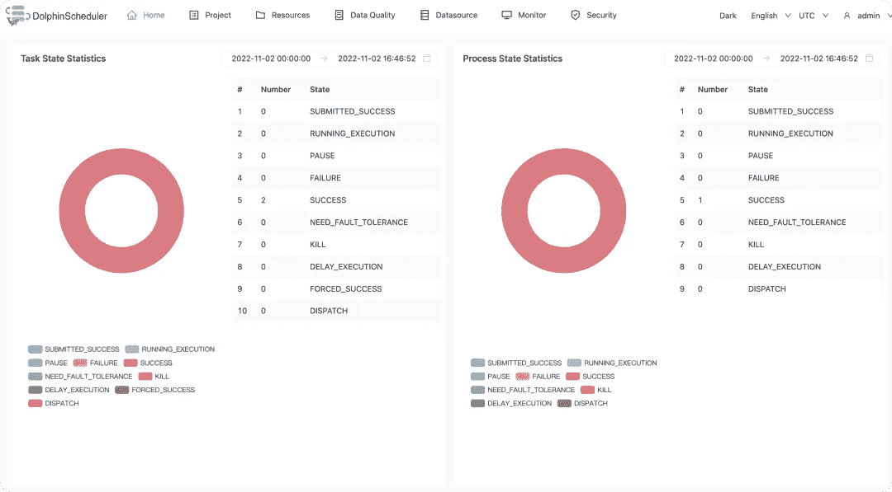

## MLflow

MLflow 跟踪服务器的启动相对简单，只需使用命令 docker run-name ml flow-p 5000:5000-d jalonzjg/ml flow:latest 即可启动

打开 [http://localhost:5000](http://localhost:5000) ，就能找到 MLflow 模型和测试管理页面

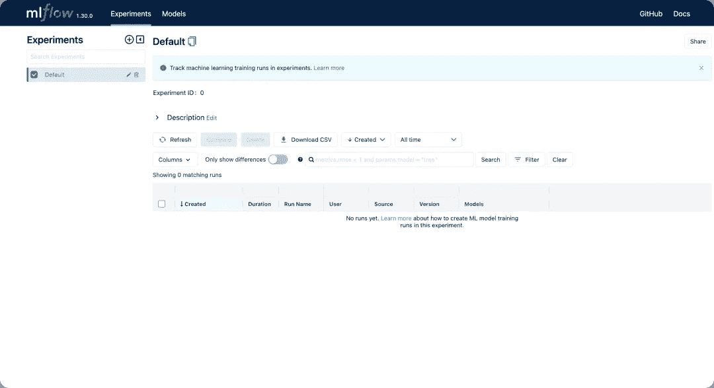

这个镜像的 docker 文件可以在 first-example/docker-ml flow/docker file 中找到

# 组件介绍

本文中使用了 5 种主要类型的组件

## 外壳组件

shell 组件用于运行 SHELL 类型的任务

## PYTHON 组件

python 组件用于运行 PYTHON 类型的任务

## 条件组件

条件是一个条件节点，它根据上游任务的运行状态来确定应该运行哪个下游任务。

## MLFLOW 组件

MLFLOW 组件用于在基于 dolphinscheduler-mlflow 库的 DolphinScheduler 上运行 MLflow 项目，以实现分类场景的预构建算法和 AutoML 功能，并在 mlflow 跟踪服务器上部署模型

## DVC 组件

DVC 组件用于 DolphinScheduler 上机器学习中的数据版本化，比如将特定数据注册为特定版本，下载特定版本的数据。

在上述五个组成部分中

*   SHELL 组件和 PYTHON 组件是基础组件，可以运行多种任务。
*   条件是可以动态控制工作流操作逻辑的逻辑组件。
*   MLFLOW 组件和 DVC 组件是机器学习类型的组件，可用于促进工作流内的机器学习场景特征能力的易用性。

# 机器学习工作流

工作流程由三部分组成。

*   第一部分是前期准备，如数据下载、数据版本化管理库等。；这是一次性的准备。
*   第二部分是训练模型工作流程:包括数据预处理、训练模型和模型评估
*   第三部分是部署工作流，包括模型部署和接口测试。

## 初步准备工作流程

创建一个目录来存储所有的过程数据 mkdir /tmp/ds-ml-example

在程序的开始，我们需要下载测试数据并初始化 DVC 存储库以进行数据版本控制

以下所有命令都在 dolphin scheduler-ml-tutorial/first-example 目录中运行

因为我们通过 pydolphinscheduler 提交工作流，所以让我们安装 pip install Apache-dolphinscheduler = = 3 . 1 . 0

**工作流程(下载数据):下载测试数据**

命令:pydolphin scheduler YAML-f pyds/download _ data . YAML

按顺序执行以下两个任务

1.Install-dependencies:安装下载脚本中需要的 python 依赖包

2.下载数据:将数据集下载到/tmp/ds-ml-example/raw

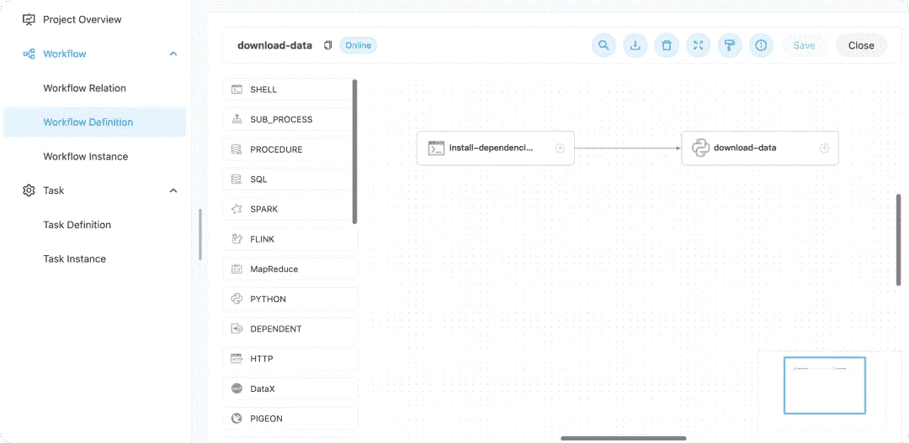

**工作流(dvc_init_local):初始化 dvc 数据版本管理库**

命令:pydolphin scheduler YAML-f pyds/init _ DVC _ repo . YAML

按顺序执行以下任务

1.create_git_repo:在本地环境中创建一个空的 git 存储库

2.init_dvc:将存储库转换为 dvc 类型的存储库以进行数据版本控制

3.条件:确定 init_dvc 任务的状态，如果成功，则执行报告成功消息，否则执行报告错误消息

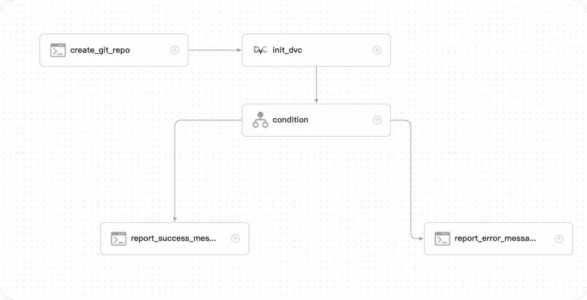

## 培训模型工作流程

在训练模型部分，工作流程包括数据预处理、模型训练和模型评估。

**工作流程(下载-数据):数据预处理**

命令:pydolphin scheduler YAML-f pyds/prepare _ data . YAML


按顺序执行以下任务

1.data_preprocessing:预处理数据，出于演示的目的，我们在这里只执行了一个简单的截断过程

2.upload_data:将数据上传到存储库，并将其注册为特定版本 v1

下图显示了 git 存储库中的信息

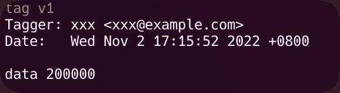

**工作流(train_model):培训模型**

命令:pydolphin scheduler YAML-f pyds/train _ model . YAML

按顺序执行以下任务

1.clean_exists_data:删除潜在重复测试生成的历史数据/tmp/ds-ml-example/train_data

2.pull_data:将 v1 数据拉至/tmp/ds-ml-example/train_data

3.train_automl:使用 MLFLOW 组件的 automl 函数训练分类模型，并将其注册到 MLflow 跟踪服务器，如果当前模型版本 F1 是最高的，则将其注册为生产版本。

4.推断:使用 mlflow CLI 导入一小部分数据进行批量推断

5.评估:获得推理的结果，并再次对模型进行简单的评估，包括新数据的度量、计划的标签分布等。

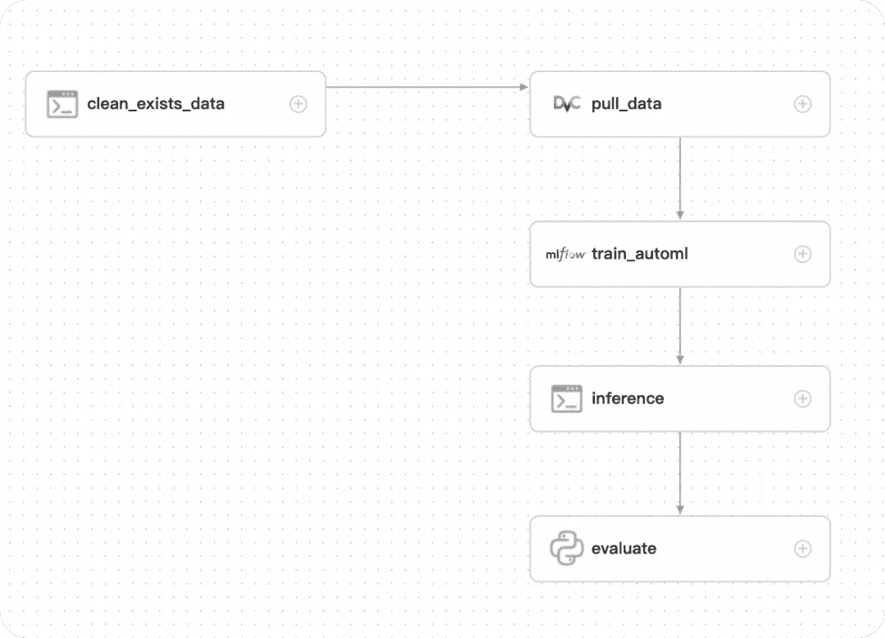

在 train_automl 完成其操作后，可在 MLflow 跟踪服务器( [http://localhost:5000](http://localhost:5000) )中查看测试结果和模型。

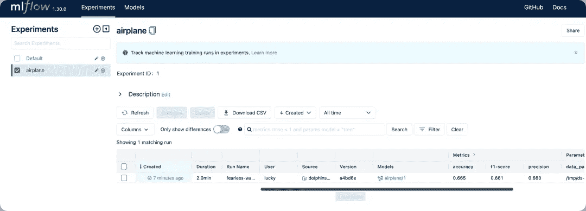

评估任务完成后，可以查看评估任务的操作日志。

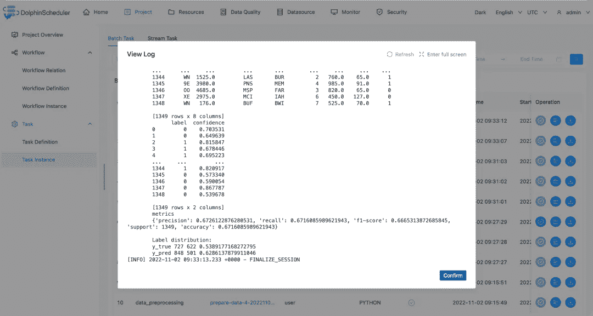

## 部署流程工作流

**工作流(部署模型):部署模型**

运行:pydolphin scheduler YAML-f pyds/deploy . YAML

按顺序运行以下任务。

1.kill-server:关闭之前的服务器

2.部署模型:部署模型

3.测试服务器:测试服务器

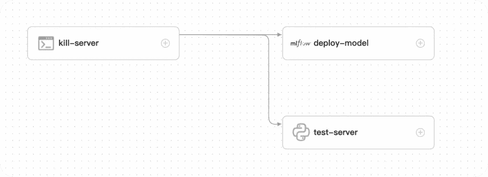

如果手动启动此工作流，界面将如下所示，只需输入端口号和型号版本号。

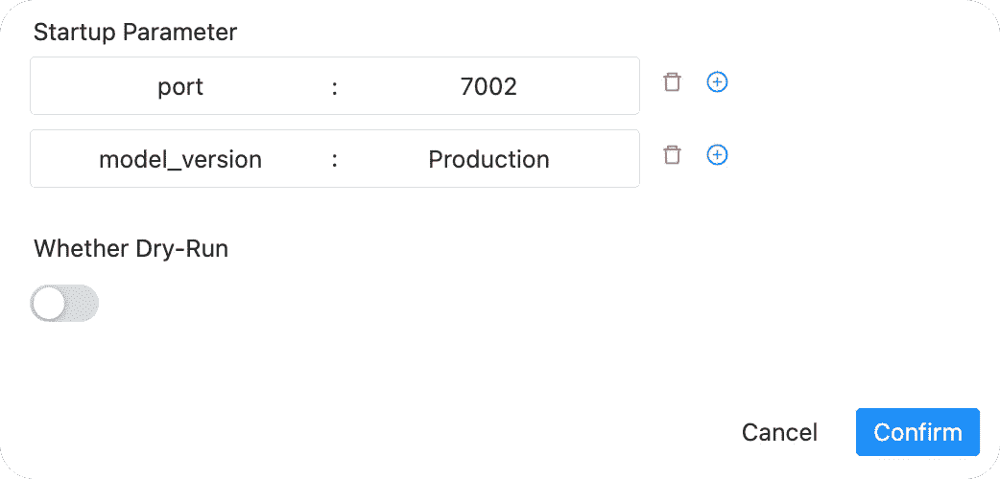

## 整合工作流程

对于实际使用，在获得稳定的工作流迭代后，整个过程需要链接在一起，例如在获得新版本后，然后训练模型，如果它执行得更好，则部署模型。

例如，我们切换到生产版本 git check out first-example-production

这两个版本的区别在于:

1.在 train_and_deploy.yaml 中有一个额外的工作流定义，用于组合各种工作流

2.修改预处理脚本以获取 v2 数据

3.将每个子工作流定义中的标志更改为 false，并让 train_and_deploy.yaml 一致运行。

运行:pydolphin scheduler YAML-f pyds/train _ and _ deploy . YAML

下图中的每个任务都是一个子工作流任务，对应于上述三个工作流。


如下图，在操作之后获得了模型的新版本 version2，并且已经注册为生产版本

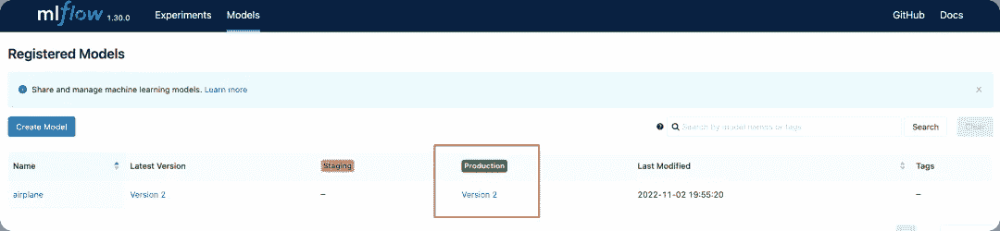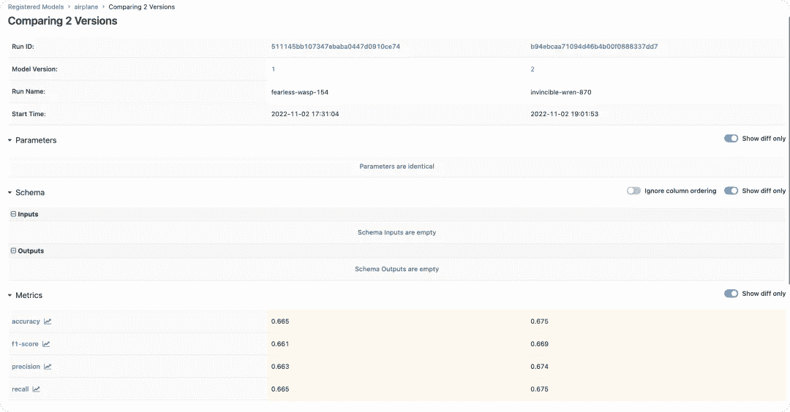

# 摘要

本文描述了如何开始使用 Apache DolphinScheduler 来构建机器学习工作流，希望能够帮助您:

1.了解如何构建 Apache DolphinScheduler、Conda、MLflow 服务环境

2.快速运行机器学习工作流的能力

📌📌欢迎填写[本次调查](https://www.surveymonkey.com/r/7CHHWGW)来反馈您的用户体验或您对 Apache DolphinScheduler 的想法:)

https://www.surveymonkey.com/r/7CHHWGW