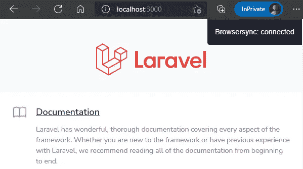
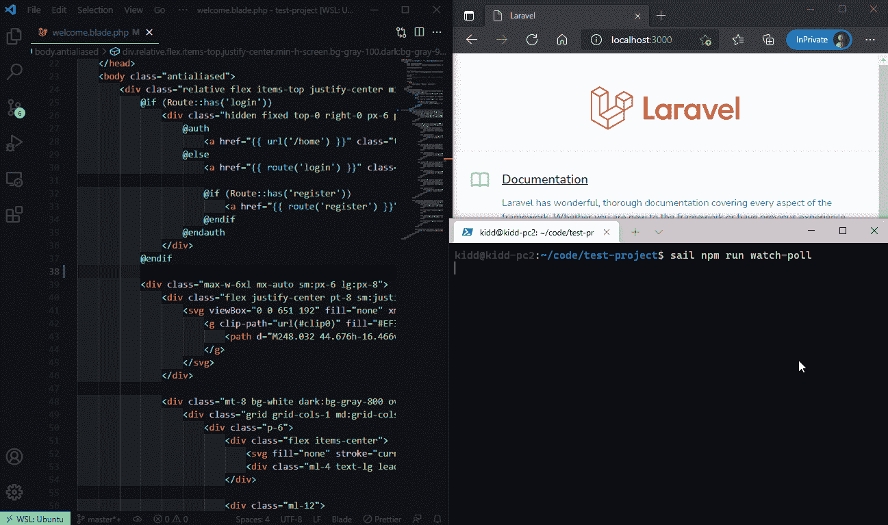

# 快速提示💡Laravel 在 Sail 中混合热重装与浏览器同步

> 原文：<https://blog.devgenius.io/quick-tip-laravel-mix-hot-reloading-in-sail-with-browsersync-555b6c97bca3?source=collection_archive---------0----------------------->

令人惊讶的是，在 Laravel 官方文档中并没有很好的记录(无论是在 [Sail](https://laravel.com/docs/8.x/sail) 页面还是 [Mix](https://laravel.com/docs/8.x/mix) 页面)

这只是给我自己的一封信，希望能回答你的问题。如果你是一个初学者，你可以看看这篇[文章](/kickstart-your-laravel-web-app-using-laravel-sail-30276265e588)，用 Docker 桌面在 WSL2 上从头开始学习 Laravel Sail。



# 发布 Docker 文件

您必须为 Browsersync 公开端口`3000`，发布 docker 配置文件以供编辑。

```
sail artisan sail:publish
```

# 修改 webpack.mix.js

在`webpack.mix.js`中添加以下行，用于启用 BrowserSync。

```
mix.browserSync({
    proxy: 'localhost',
    open: false,
});
```

# 修改 docker-compose.yml

在项目根目录下编辑`docker-compose.yml`文件。
在`ports`处追加`- 3000:3000`，露出端口`3000`

```
ports:
    - '${APP_PORT:-80}:80'
    - 3000:3000
```

使用以下命令停止容器并重新启动容器:

```
sail downsail up -d
```

# 运行 Laravel Mix

您应该通过执行以下命令来安装所有节点组件:

```
sail npm install
```

然后，您应该能够使用以下命令正确执行 Laravel Mix:

```
sail npm run watch-poll
```

现在，您可以在启用 BrowserSync 的情况下使用 [http://localhost:3000](http://localhost:3000) 打开您的浏览器。



如果你喜欢我的文章，请关注并分享我的文章。你可以关注这个 Github [主题](https://github.com/JeffreyWay/laravel-mix/issues/2719)来获得更多更新。

# 视频演示: