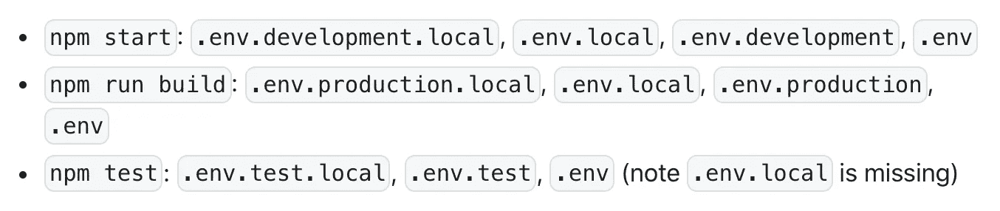

# 快速教程:如何在 React 应用中处理密钥

> 原文：<https://blog.devgenius.io/quick-tutorial-how-to-deal-with-secret-keys-in-react-apps-97e886c5d2a3?source=collection_archive---------3----------------------->


感谢这张很酷的照片，[保罗·埃施-洛朗](https://unsplash.com/@pinjasaur)

## 了解在 React 中隐藏和使用密钥。

记得第一次了解 [*dotenv*](https://www.npmjs.com/package/dotenv) 的那一刻。这不是你在学校的普通计算机科学课上学到的东西，但如果你正在构建任何一种与另一种服务接口的应用程序，你将不可避免地需要了解这一点。很久以前，当我试图弄清楚如何将一个 web 应用程序与 Slack 正确集成时，我第一次接触到了这一切。

简单来说， *dotenv* 允许你在应用程序中隐藏和使用密钥。例如，这些是您将在 API 调用中使用的键，以便您正在与之交互的外部服务知道您是谁以及您想要什么。通常，这些服务会给你一些密钥，你需要使用这些密钥来成功地与它们进行交互。

我说的*藏*钥匙是什么意思？当然，作为幕后的开发人员，您将能够看到和编辑这些键。隐藏的意思是当你上传你的代码到 Github 或者发布你的应用到互联网上时，密钥不会显示给其他人看。这就是你如何避免暴露你的秘密密钥的危险后果。本文只关注如何在 React 应用程序中隐藏和使用键的基础知识。

这里有一个关于如何设置一个应用程序的分步指南，特别是一个 React 应用程序，具有隐藏和使用密钥的能力！

## 步骤 1:使用[创建 React 应用](https://create-react-app.dev/)创建一个应用

在您的终端中，您可以启动一个新的 react 应用程序，如下所示:

```
npx create-react-app my-app
```

在这里，该应用程序被命名为*我的应用程序*，但你可以随意命名。一旦你在代码编辑器中打开了 *my-app* ，你就可以完成下一步了。

## 步骤 2:创建一个. env 文件并添加您的密钥

创建一个名为**的新文件。env** 专门位于您的根目录中。你的根目录和 **package.json** 和**是一个级别的。gitignore** 文件所在的位置，与应用程序内容所属的 src 目录相对。

这个新文件是你的秘密密钥将要去的地方。您实际上是将这些键转换成环境变量(这就是‘env’的意思)。例如，如果您想以编程方式从 [Unsplash](https://unsplash.com/) 中获取照片，并且有一个 Unsplash 密钥，您可以将它放入您的**中。env** 文件是这样的:

```
UNSPLASH_KEY=x3j5j7b49s2jd03......
```

一般来说，这是可行的，**但是对于 React 应用程序，有一个警告！**在命名键时，像`UNSPLASH_KEY`一样，React 只识别名称开头有`REACT_APP_`的键。因此，在 React 应用程序中，你必须做这样的事情:

```
REACT_APP_UNSPLASH_KEY=x3j5j7b49s2jd03......
```

这里的要点是，不是直接将这个密钥写入应用程序的代码，而是将它存储到一个变量中，您可以在代码中引用它。这个变量专门隐藏您的键，因为它在一个**中。env** 文件。稍后会有更多的介绍。

快速旁注。支持**的是 *dotenv* 包。env** 文件。这也是本文开头提到 *dotenv* 的原因。这个包已经带有 Create React 应用程序，所以你不必安装它或做任何事情来制作**。env** 文件生效！然而，在一个不是通过 Create React App 创建的 React 应用程序中，你可能需要安装 dotenv 并在你的应用程序中需要它。

## 第三步:如果服务器正在运行，重启它！

如果你在创建的时候运行`npm start`。env 文件夹或向该文件夹添加新的密钥，您需要停止服务器(Mac 上的 control+C)并重新启动它！否则，你的应用程序不会识别这些。env 改变，当你试图使用存储在那里的键时会出错。在您编辑您的时，应随时重新执行此步骤。env 文件—也就是说，当对该文件进行更改时，总是要重新启动服务器。

## 步骤 4:在 React 应用程序中使用密钥变量

要在 React 组件中访问像`REACT_APP_UNSPLASH_KEY`这样的变量，可以编写`process.env.REACT_APP_UNSPLASH_KEY`。在幕后，`process.env`返回几个东西，包括在您的。环境文件。您可以将它包含在 API 调用中，如下所示。注意，这只是一个假设的例子:

```
**//This state holds the photos fetched from Unsplash**
const [photos, setPhotos] = useState({});**//The useEffect hook triggers fetch upon initial component render**
useEffect(()=>{**//This is the URL for fetching photos, built using your env variable**
const URL = `https://api.unsplash.com/photos/?client_id=${***process.env.REACT_APP_UNSPLASH_KEY***}`;**//This is fetching from the URL using promises**
fetch(URL)
        .then(response => response.json())
        .then(data => setPhotos(data));}, [])
```

这里的(假设)结果是让`photos`保存从 Unsplash 获取的照片 URL！这都要感谢提供的 env 变量，它充当了对您的秘密 Unsplash 键的引用。

## 第五步:最后但绝对不是最不重要的，告诉 Git 藏起来。env 这样别人就看不到你的钥匙了

一旦你共享和发布你的代码，这部分实际上使你的密钥隐藏起来。

就在**的里面。gitignore** ，add **。env** 到列表那里。很快，您可能会注意到**中已经列出了其他文件。gitignore** 看起来和**极其相似。env** (.env.local、env.development.local、env.test.local 和. env.production.local)。请不要让这些吓走你！我会解释这是怎么回事。

你可以相信你的 app 会一直关注基本的**。env** 文件。然而，在很多情况下，从本地开发到生产，您的应用程序在不同阶段需要不同的密钥。例如，也许在您的本地环境中，您正在使用一个链接到测试数据的密钥，而您的生产应用程序需要一个不同的密钥来访问真实数据。

这就是所有这些不同的地方。env 文件命名出现了变化。根据您是为本地/开发、测试还是生产而构建，您的应用程序将优先考虑某些文件。这完全取决于名字。如下所示，根据您运行的命令，应用程序会将左侧的文件优先于右侧的文件。



截图取自 Create React 应用程序文档

例如，如果您有一个名为 **.env.production.local** 的文件和另一个名为**的文件。env** ，然后你通过运行构建你的 app，你的 app 会优先选择 **.env.production.local** 。这是，因为命名暗示了您的环境特定设置的本地覆盖的存在，而**。env** 含糊不清。

你可能注意到了，**。env** 在上面显示的优先级列表中很低。但是，如果你只有一个**。env** 文件，并且没有这些其他的变化，**。env** 文件将成为最高优先级。在这篇文章中，我推荐使用**。env** 开始，但是你可能最终会创建这些其他类型来满足你的应用程序的需要。关于这方面的更多信息， [Create React App 文档](https://create-react-app.dev/docs/adding-custom-environment-variables/#what-other-env-files-can-be-used)很好地概括了这一切。

## 关于使用密钥部署应用程序的说明

当通过主机提供商部署应用程序时，您通常会在主机提供商的 UI 中看到一个添加环境变量的选项。如果在这个阶段没有提供您的密钥，它们可能不会出现在生产中。例如，一旦你通过 Netlify 部署了一个应用程序，你会看到一个在你的站点设置的 *Build & deploy* 部分添加变量的选项。添加新变量后，重新部署您的站点很重要，这样您的应用程序将实际使用这些变量。

希望这篇文章有助于澄清如何在 React 应用程序中处理密钥！这是与外部服务(如 Unsplash、Slack、Stripe 等)成功接口的关键部分。向你的阅读致敬。

附言:如果你有兴趣阅读另一个随机的技术金块，这里有一篇我写的关于网页可访问性的简单提示的文章:

> [**用 HTML/CSS 让你的网站更受欢迎的 20 种方法**](https://medium.datadriveninvestor.com/20-ways-to-make-your-website-more-welcoming-with-html-css-b302690a3a6f)