# 将 Laravel 应用程序部署到数字海洋的快速方法

> 原文：<https://blog.devgenius.io/quick-way-to-deploy-a-laravel-app-to-digitalocean-d212f088bcc5?source=collection_archive---------0----------------------->

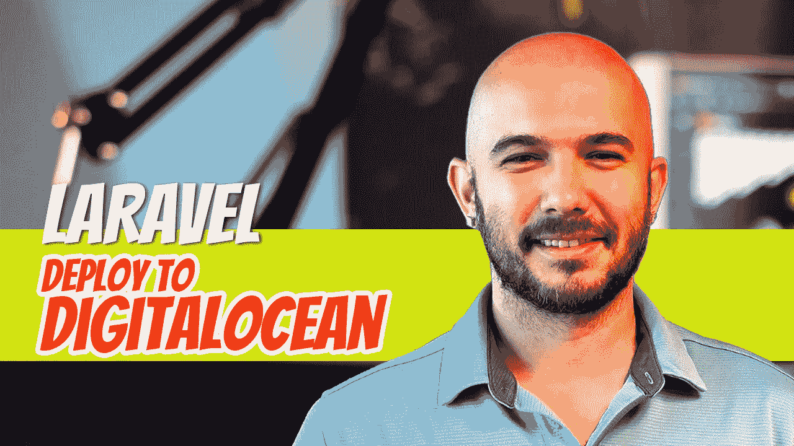

虽然您可以用数百种不同的方式部署 Laravel 应用程序，但我想分享一种在 DigitalOcean 中部署 Laravel 应用程序的快速方法，以帮助您入门。

## 假设

*   您有一个正在尝试部署的 [Laravel](https://laravel.com/) 应用程序。
*   你有一个[数字海洋](https://www.digitalocean.com/)账户。如果没有的话，[报名](https://www.digitalocean.com/)真的很简单。
*   您的 Laravel 应用程序位于 [GitHub](https://github.com/) 或 [Bitbucket](https://bitbucket.org/) 上。

## 微滴

登录您的数字海洋账户，点击**创建**->-**水滴**按钮。

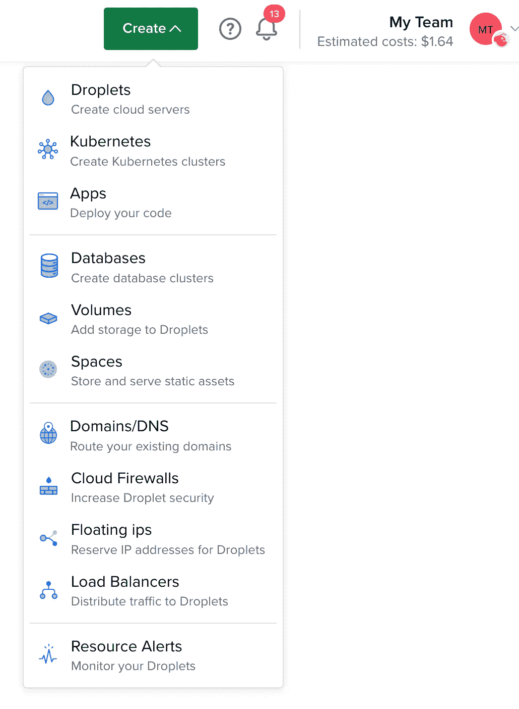

你将被带到一个如下图所示的屏幕。默认的**发行版**选项卡将被选中，但是我们不想在优化我们的环境上花费太多时间。我们想要的东西快，已经为我们优化。

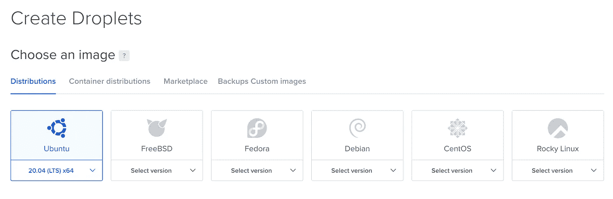

选择**市场**标签并搜索 **Laravel** 。

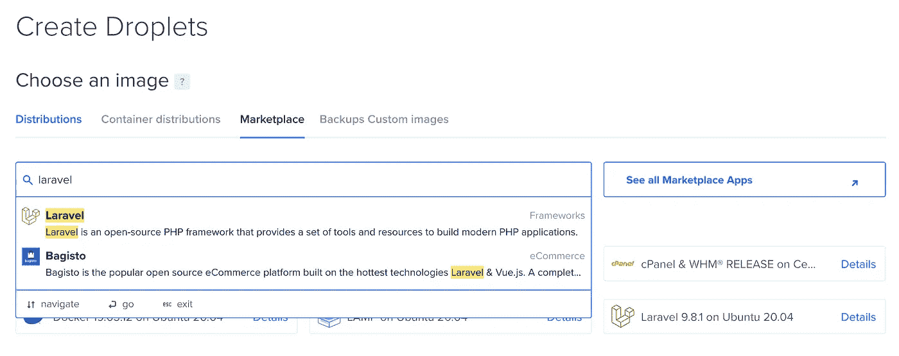

将显示 Laravel 的最新版本。选择它。

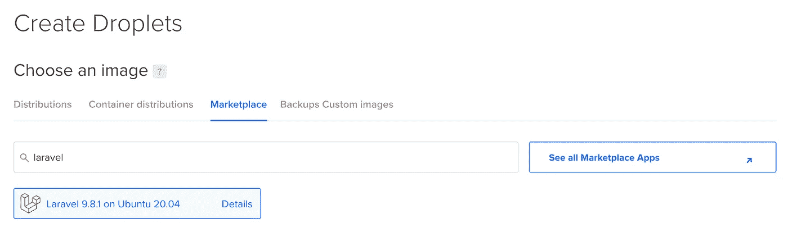

选择**基本**计划。

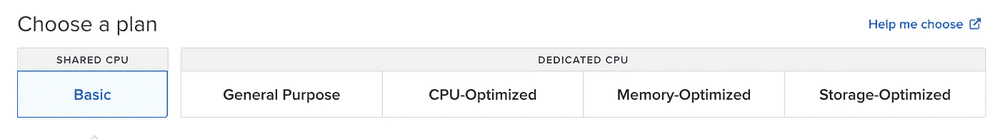

点击**带 SSD 的常规**选项，并选择 **$5/mo** 选项。

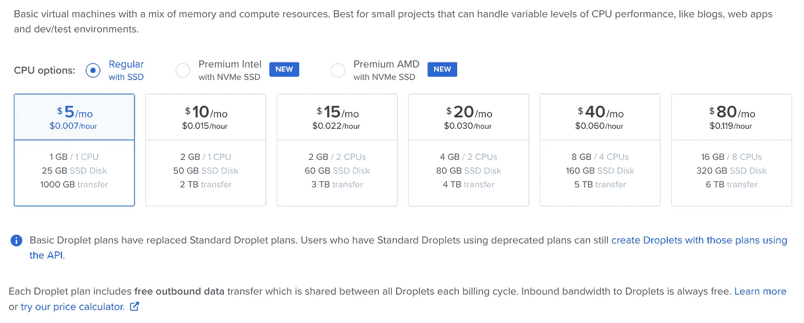

跳过说明您应该添加块存储的部分。

因为我在美国东海岸，所以我选择了纽约的数据中心。选择离你最近的一个。

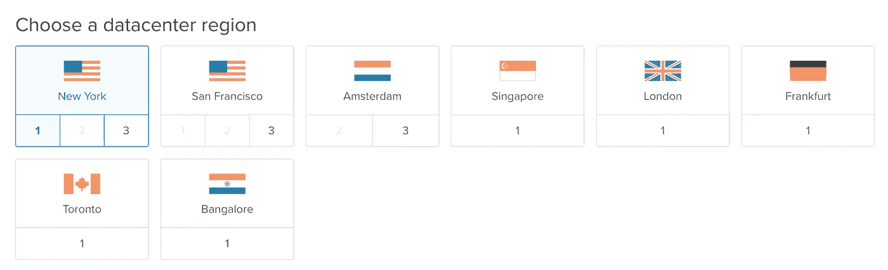

VPC 网络不需要改变什么。

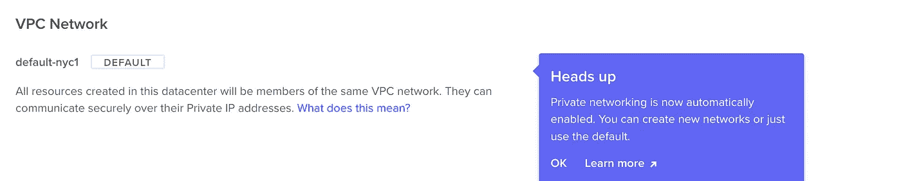

指定您要用来访问 Droplet 的密码。

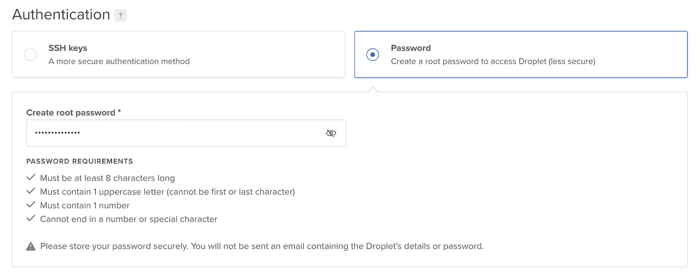

如果您打算保持此应用程序运行，我建议您启用备份。

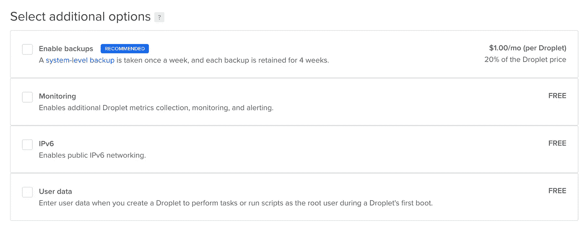

您可以保留所有其他设置，点击**创建水滴**按钮。

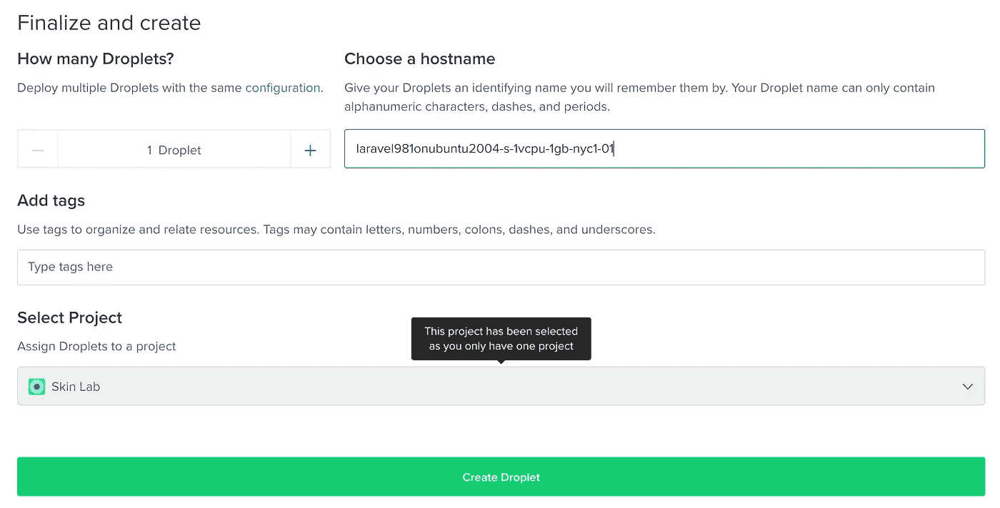

在水滴产生的时候要有耐心。

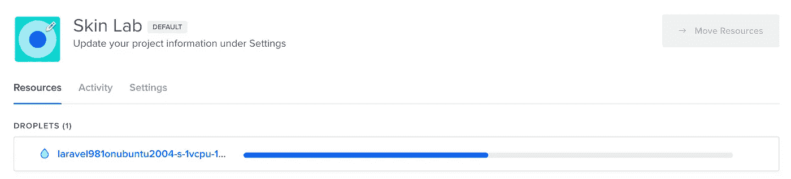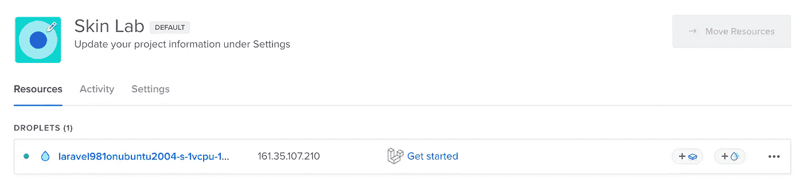

完成后，你可以点击水滴进入水滴屏幕。如果你看到像下面这样的屏幕，你就成功了。

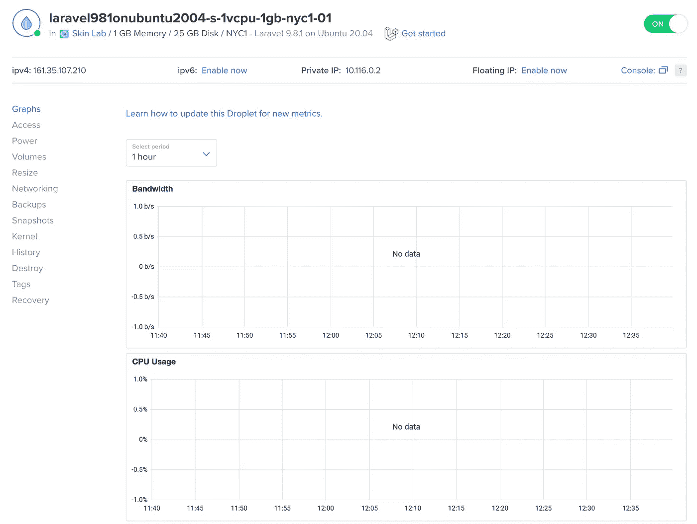

是时候测试你的水滴了。点击 **ipv4** 地址复制地址。将其粘贴到浏览器的地址栏中。您应该会看到 Laravel 欢迎屏幕。

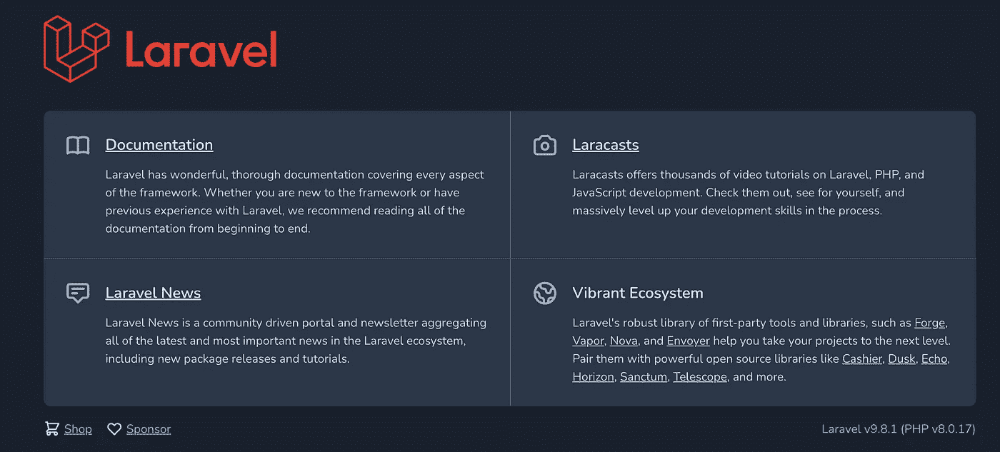

现在它工作了，是时候把你的应用程序推到 droplet 上了。

## 将您的 Laravel 应用程序推送到 Droplet

此时，我假设您的应用程序已经被推送到 GitHub 或 Bitbucket 之类的替代产品。

在 droplet 屏幕的右上角，您会看到一个到**控制台**的链接。点击它打开它。

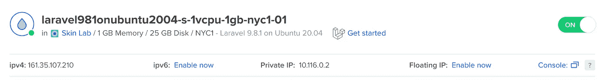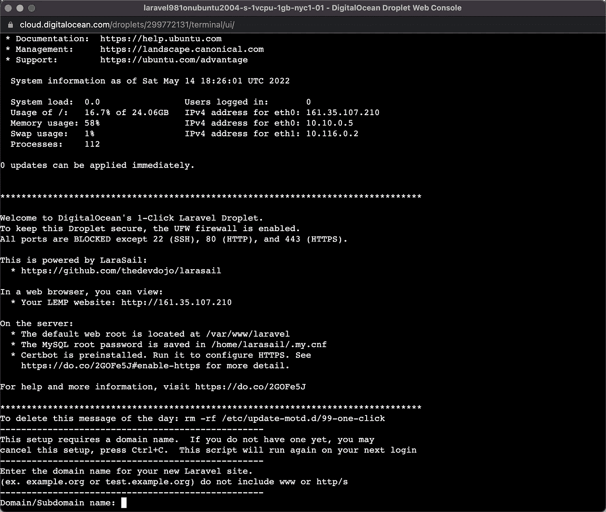

由于这是您第一次启动应用程序，您需要输入域/子域凭据。我们不会在本文中讨论这个问题。你可以点击 **CTRL+C** 退出应用程序或者按照提示操作。

你的申请托管在*../var/www/laravel/* 。如果你想探索那个文件夹，你可以光盘进入它:*光盘../var/www/laravel/* 。我们将转到上面的目录并删除 *laravel* 文件夹，因为我们要将我们的 laravel 应用程序复制到其中: *cd../var/www/* 。

执行命令 **rm -r laravel/** 删除 laravel 文件夹及其所有子文件夹。您可以通过键入 **ls** 来验证它是否已被删除。您应该只会看到 **html** 文件夹。

是时候将存储库克隆到您的应用程序中了。要克隆回购协议，进入你的 GitHub 账户，点击代码下拉按钮，选择 HTTPS 选项。

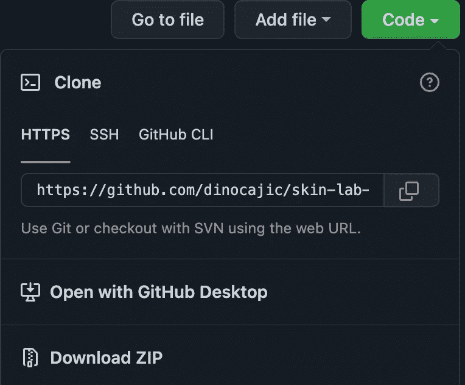

回到你的控制台，输入:

吉特克隆人 https://github.com/your-user-name/your-project.git·拉勒维尔

确保在最后添加 **laravel** 文件夹，因为我们将复制与之前相同的结构。

如果您在浏览器中返回到 Laravel 应用程序，您会发现它不起作用。那是因为我们必须设置它。

执行以下命令:

*cp .env .例。环境*

*作曲家安装*

如果您还没有运行最新版本的 Laravel，这可能会遇到一些问题。所以你可能要开始做一些升级了。对于我的应用程序，因为它是在版本 7 上，所以我必须做以下事情:

*   *sudo apt-get 更新*
*   sudo 安装 php-xml
*   *sudo apt-get 安装 php-mbstring*
*   *作曲家更新*
*   *作曲家安装*

我希望您不必这样做，但这只是任何部署的一部分(除非您使用 Docker 来做，或者您已经在本地运行了最新版本的 Laravel，但一次只能运行一篇文章)。

*php 工匠键:生成*

*php artisan 存储:链接*

*php artisan 迁移:新鲜种子*

应该就是这样了。您应该能够进入您的应用程序并看到它在工作。但是，事情从来没有这么简单，你总是运行在不同的版本上，不是吗？

## 潜在误差时间

如果您正在执行 *migrate:fresh* 命令，您可能会得到以下错误。

*Illuminate \ Database \ query exception 找不到驱动程序(SQL:SHOW FULL TABLES WHERE TABLE _ type = ' BASE TABLE ')*

要修复它，请执行以下命令:

*   *apt 安装 php-mysql*

一旦您尝试运行 *migrate:fresh* 命令，您很可能会得到一个新的错误，例如:

*Illuminate \ Database \ query exception SQLSTATE[hy 000][1045]拒绝用户' root'@'localhost '的访问(使用密码:YES)(SQL:SHOW FULL TABLES WHERE TABLE _ type = ' BASE TABLE ')*

是时候在你的**中设置用户名/密码了。env** 文件。在控制台中，键入:

*纳米。包络*

找到数据库用户名和密码字段。编造一些事情并记住它们。我选择了 *sail* 作为用户名 *password* 作为密码。还要选择数据库名称，因为我们很可能需要它。点击 **CTRL+X** 保存，然后退出。让我们用这些凭证创建一个用户。

*mysql -u root*

*创建由“密码”标识的用户“sail”@“localhost”；*

*授予*的所有权限。*以' sail ' @ ' localhost*

*同花顺特权；*

*创建数据库 your _ database _ name*

*退出*

*服务 mysql 重启*

再次尝试*迁移:刷新*命令。现在应该可以工作了。

如果返回到应用程序，您可能会得到一个额外的错误:

*流或文件“/var/www/laravel/storage/logs/laravel . log”无法在追加模式下打开:无法打开流:权限被拒绝尝试记录时出现异常:流或文件“/var/www/laravel/storage/logs/laravel . log”*

要解决该错误，请执行以下命令:

*   *chmod -R 775 存储引导/缓存*
*   *sudo chown-R $用户:www-数据存储*
*   *sudo chown-R $ USER:www-data bootstrap/cache*

就是这样。刷新您的页面，希望您看到您创建的应用程序。

我希望这将有助于您快速部署应用程序。在后面的文章中，我将介绍如何将域名链接到应用程序。

迪诺·卡伊奇目前是 [LSBio(生命周期生物科学公司)](https://www.lsbio.com/)、[绝对抗体](https://absoluteantibody.com/)、 [Kerafast](https://www.kerafast.com/) 、[珠穆朗玛生物](https://everestbiotech.com/)、[北欧 MUbio](https://www.nordicmubio.com/) 和 [Exalpha](https://www.exalpha.com/) 的 IT 主管。他还担任我的自动系统的首席执行官。他有十多年的软件工程经验。他拥有计算机科学学士学位，辅修生物学。他的背景包括创建企业级电子商务应用程序、执行基于研究的软件开发，以及通过写作促进知识的传播。

你可以在 [LinkedIn](https://www.linkedin.com/in/dinocajic/) 上联系他，在 [Instagram](https://instagram.com/think.dino) 上关注他，或者[订阅他的媒体出版物](https://dinocajic.medium.com/subscribe)。

[*阅读迪诺·卡吉克(以及媒体上成千上万其他作家)的每一个故事。你的会员费直接支持迪诺·卡吉克和你阅读的其他作家。你也可以在媒体上看到所有的故事。*](https://dinocajic.medium.com/membership)