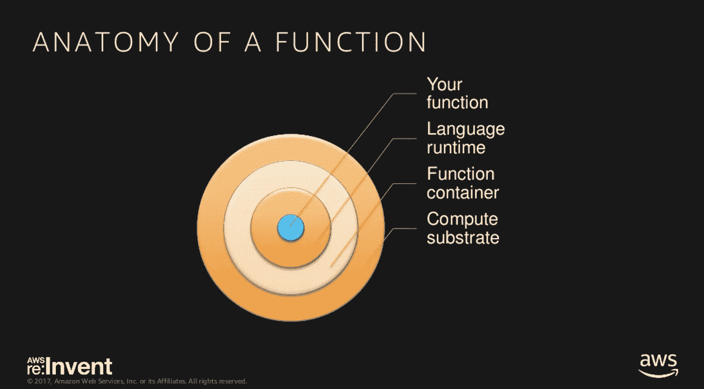
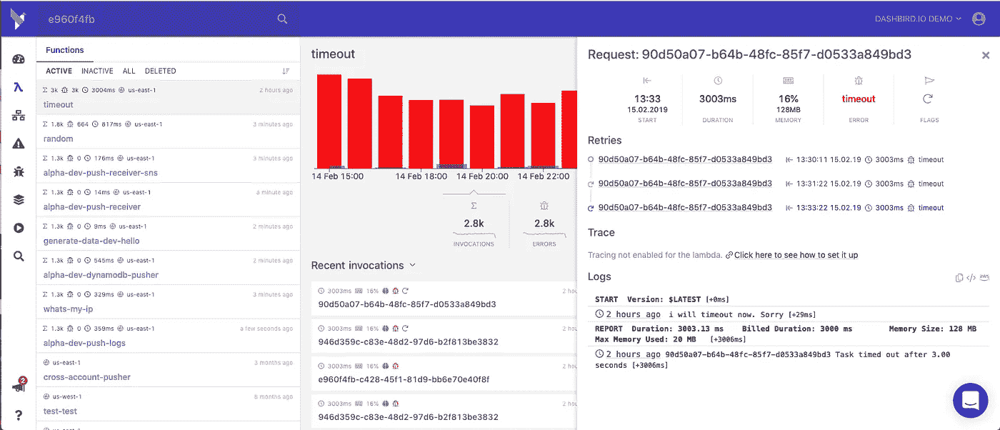
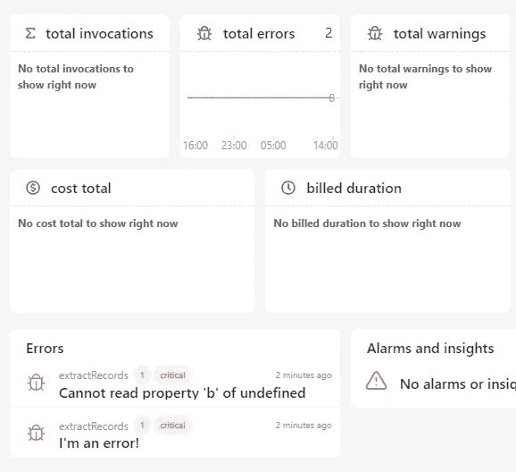
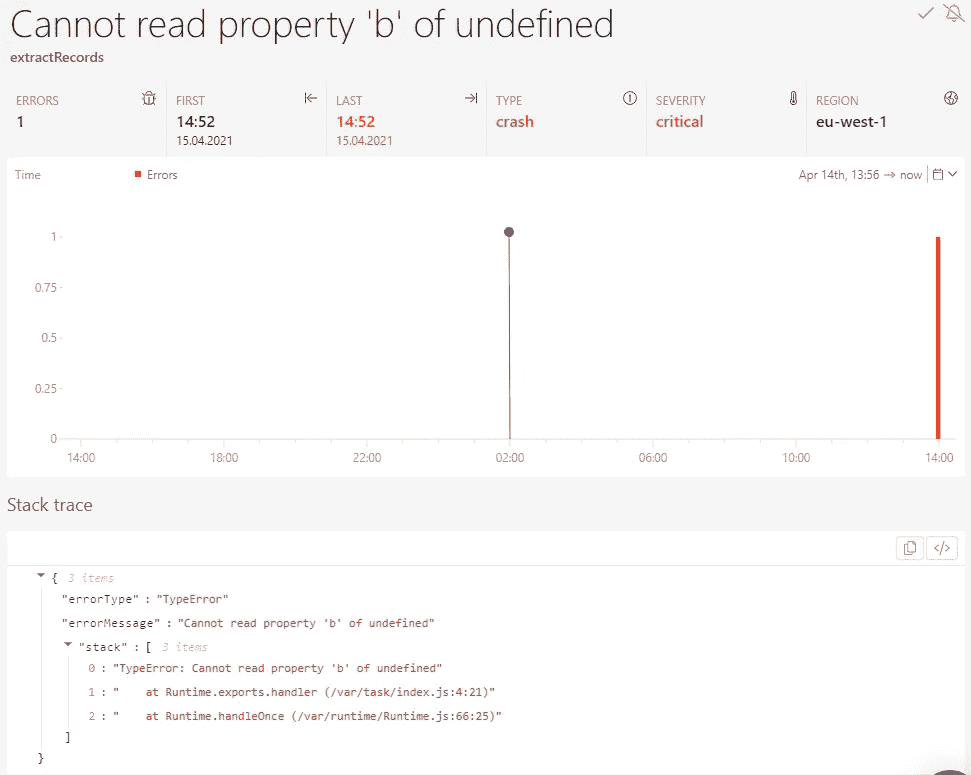
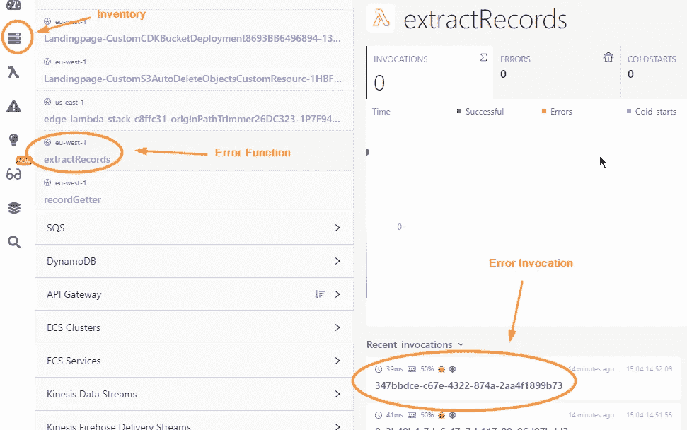
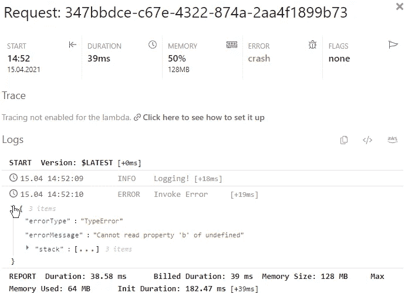

# 快速调试 AWS Lambda 函数

> 原文：<https://blog.devgenius.io/quickly-debug-your-aws-lambda-functions-ff45ce433463?source=collection_archive---------4----------------------->

在本文中，我们将探讨如何更快地调试 AWS Lambda 函数的四种不同方法。


伟大的作家使用隐喻来表达他们的观点，所以让我很快的尝试一下。

虫子是讨厌的小害虫。要除掉他们很难，但除了只是到处喷毒，剩下的选择就很少了。其中一个选择是利用自然捕食者来消灭这些虫子，比如鸟类。

所以鸟可以帮你摆脱 bug，我在一家叫 Dashbird 的公司工作，帮助开发者调试他们的 AWS Lambda 应用。

看到我做了什么吗？**害虫\臭虫⇔鸟\大鲵**？

# 使用 AWS Lambda 函数的主要原因

AWS Lambda 的主要好处之一是，正如 AWS 所声称的那样，**“你可以忘记项目的基础设施，只专注于在云中启动应用程序，同时你将能够与其他亚马逊服务进行集成。”**可扩展性和使用 AWS 计算资源的低成本是随之而来的其他好处。



*Lambda 函数的剖析— AWS re:Invent 2017*

你所需要做的就是**编写你的函数**，**将它连接到一个事件**，**部署它**，然后 **AWS 会处理剩下的事情**。Lambda 函数将在 AWS 上每小时处理数千个请求，而不需要您付出任何努力。

**但是当 Lambda 函数失败时会发生什么**？

# 如何调试 AWS Lambda 函数？

在谈到 AWS Lambda 函数的调试过程时，**四种方法是最常用的**。这些方法可以分为两类。第一个是离线调试，第二个是日志记录。

# 离线调试 Lambda 函数

在标准开发过程中，脱机调试允许您在本地工作。

无服务器离线库非常适合在你的应用程序还在开发的时候调试它。它的行为非常类似于 AWS，让你访问各种服务，如 SQS，社交网络，S3 等。不同的是，不是请求命中实时服务，**而是请求去往本地仿真服务**。

# 在线记录 Lambda 函数

假设你有一个**实时服务**或者有一个**开发/登台环境**或者**多个开发者同时在同一个项目上工作**。在这种情况下，你需要开始关注现场调试服务。尽管调试 monolith 应用程序的工具数不胜数，但对于无服务器应用程序来说，调试工具却很少，有些比其他的好。

但是当您将 Lambda 函数部署到真实的基础设施时，**日志记录可能是唯一剩下的调试方法**。**可以通过三种方式进行记录**。

1.  **首先**，直接登录 AWS CloudWatch，只需简单写入标准输出即可。这可能是最流行的方法，因为它很容易设置。CloudWatch 的缺点是所有的日志都是分组的，当你的应用程序中有许多活动部件时，需要花费大量时间来找出问题所在。然而，如果你刚开始使用 AWS Lambda，这可能是最好的选择。
2.  **第二种方式**是**用像 Kinesis 这样的 AWS 服务编写自己的测井工具**。在这个过程中，需要手动创建这些工具**将花费开发人员大量的时间**，这进一步意味着成本会更高，因为将使用额外的亚马逊基础设施。但乍一看，这个过程似乎相当快。
3.  **第三种方式**是使用第三方日志服务。它们没有使用 CloudWatch 的缺点，也不需要你浪费开发时间。

Dashbird 是唯一完全致力于监控和调试 AWS Lambda 应用程序和无服务器系统的工具，我们的用户喜欢这项服务的主要原因是它的简单性。只需几次点击，您就可以连接您的 AWS 帐户，无需更改代码，并开始发现和排除**未知和已知错误**，从微服务的一般统计数据到单个功能执行配置文件。


# 用 Dashbird 调试 AWS Lambda 函数

Dashbird 是一个很好的选择，因为它是专门为无服务器开发者打造的，它能够快速检测任何类型的故障。Dashbird 为有效调试提供了相当多的功能，例如:

*   [**错误视图**](https://dashbird.io/failure-detection/) 在**中显示和发现故障点**时必不可少，这让开发人员能够洞察哪里出错了。
*   **日志搜索**允许你**搜索 Lambda 日志**，这意味着你将能够找到相关的调用。
*   **函数视图**允许您**更仔细地查看任何看起来行为不当的函数**并彻底解决它。
*   **实时跟踪**允许开发者**对函数的活动**进行实时观察。
*   **跟踪**让您对您的调用正在做什么以及它们是如何相互连接的有一个不可思议且令人信服的**洞察。**



# 调试示例 Lambda 函数

让我们试着调试一个示例函数。我们可以用 **AWS Lambda web 控制台**创建一个。我假设您知道如何做到这一点，并在此给出示例代码:

```
exports.handler = async (event, context) => {
  console.log("Logging!");

  const x = event.a.b;
};
```

该函数将生成两种类型的日志。首先调用`console.log`函数，然后访问一个未定义的事件属性。

如果你打开仪表板，首先看到的是主仪表板。这个错误将显而易见。



“`Cannot read property ‘b’ of undefined`”—众所周知的 JavaScript 错误消息。当你点击它时，你会得到**事件视图**，里面有更多的错误细节。



Dashbird 的错误详细信息将向您显示**错误第一次发生的时间、最后一次发生的时间、发生的地点以及实际的严重程度**。

它甚至给你一个堆栈跟踪，这有助于在下一次部署之前调试错误。

但是打给`console.log`的电话最终去了哪里？如果你去**库存**并在打开**的列表中点击你的 **Lambda 函数**，你可以选择那个函数**的最后调用。我的函数叫做`extractRecords`，所以这就是我要搜索的。



如果我单击最后一次调用，将打开该调用的日志，我将看到日志调用和错误。



根据你在函数中写的日志的数量，找到错误会变得很难，这就是为什么**我建议在调试**时使用错误细节。

# 摘要

AWS Lambda 函数在**隔离的远程环境**中工作，这使得调试越来越复杂。当你的代码处于**开发阶段**时，通过框架(想想[无服务器应用模型](https://github.com/aws/serverless-application-model))到**在你的机器上监控和调试你的代码**仍然是至关重要的。

当您最终**将您的功能部署到云**时，需要不同的方法来获得您需要的[洞察力](https://dashbird.io/serverless-observability/)。如果你认为 CloudWatch 太笨重，并且你想一目了然地看到正在发生的事情，那么试试 Dashbird 吧。它是为了监控无服务器应用程序而从头开始构建的**，并且**消除了您在构建自己的日志服务时会发现的许多障碍**。**