# 使用 GitHub 包快速发布和安装库

> 原文：<https://blog.devgenius.io/quickly-publish-and-install-a-library-with-github-packages-2db619fd832c?source=collection_archive---------12----------------------->


# 介绍

Github 附带了一些非常有用的内置特性，比如创建自己的包的能力。在本教程中，我将介绍如何设置 Github 包库，然后创建一个简单的 React 钩子，发布它，然后安装到另一个项目中。

免责声明:本教程假设 React 的一些基本知识！

# 什么是包？

一个**包**是一个私有或公共可用的文件或代码目录。通常，这些文件会为您的应用程序增加功能。

例如，世界上最受欢迎的软件包之一是 [lodash](https://lodash.com/) ，它是一个“提供模块化、高性能、& extras 的 JavaScript 实用程序库”，即最常用的功能，它提供的功能使我们的生活变得更加轻松。

在本地安装时，这些包通常位于名为 **node_modules** 的文件夹中。*是的，那个重达一吨的文件夹，千万不要提交给 Github 库。*

# 好吧，那么什么是 GitHub 包呢？

GitHub Packages 允许我们直接托管自己创建的包。这带来了一大堆功能，因为它与 GitHub 生态系统紧密相连，比如与 GitHub APIs、GitHub Actions 和 webhooks 的集成。

我们将把 React 组件库创建为一个包，托管在 Github 包中。

# GitHub 包设置

首先，让我们继续创建一个新的存储库。GitHub 已经包含了这样做的完整指南。[链接此处](https://docs.github.com/en/repositories/creating-and-managing-repositories/creating-a-new-repository)。对于上下文来说，[这个](https://docs.github.com/en/packages/quickstart)也是 GitHub 关于设置软件包仓库的官方指南。

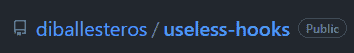

这样一来，让我们打开 Visual Studio 代码或您选择的 IDE，并在本地克隆它。在回购点击代码，并抓住克隆链接。

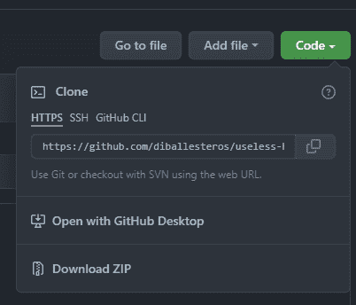

并克隆到我们的本地机器上。

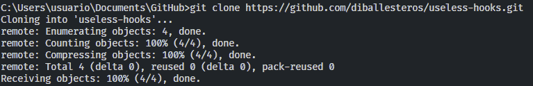

太棒了。现在我们可以初始化 npm 来生成我们的 package.json

会问你几个关于新套餐的问题。请记住将名称保留为:

```
@YOUR-USERNAME/YOUR-REPOSITORY 
... 
test command: exit 0 
...
```

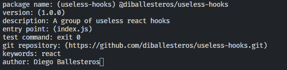

运行以下命令:

```
npm install 
git add . 
git commit -m "initialize npm package" 
git push
```

# 构建 React 挂钩

我们将构建一个简单的 React 包。正如你可能已经看到的，我把我的包命名为`useless-hooks`。所以我加一个通用的无用钩子。在本例中，useKonamiCode 只是为用户输入添加了一个事件监听器。如果用户连续输入特定的组合键，就会触发回调。

这里的要点是创建您的钩子并将其放在`src`文件夹中:

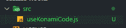

# 在 Github 包中发布

我们将使用 GitHub 动作来确保我们可以发布我们的包。这篇文章不会深入讨论这个问题，但是我确实有一些利用这个功能的方法。

重要的是要知道 GitHub 会检查你的库是否在你的根目录下有一个`.github`文件夹和一个`workflows`子文件夹。

# 什么是 YAML？

这里有一个直接来自他们网站的定义:

> 对于所有编程语言来说，YAML 是一种对人类友好的数据序列化语言
> 
> [*https://yaml.org/*](https://yaml.org/)

在这种情况下，每次我们在 GitHub 中创建一个版本，它都会按照文件中的工作流程为我们发布这个包。

在目录的根目录下创建以下文件夹和文件:


并在文件中添加以下几行:

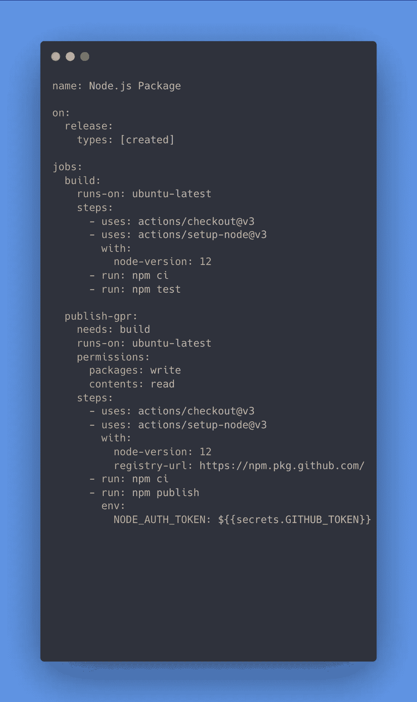

# 将它连接到 npm

现在，我们可以通过在根目录下创建一个`.npmrc`文件并添加下面一行(并用您的 GitHub 用户名替换您的-USERNAME:

```
@YOUR-USERNAME:registry=https://npm.pkg.github.com
```

或者在 package.json 中创建以下条目

```
"publishConfig": { 
    "registry": "https://npm.pkg.github.com" 
},
```

最后但同样重要的是，我们将把我们所有的更改推送到存储库:

```
git add . 
git commit -m "workflow to publish package" 
git push
```

# 创建版本

在 GitHub 上创建 release head 到你的 repo，在右边你会看到一个 **Releases** 部分。继续创建一个新版本。


之后，在新屏幕中，您可以通过添加标签、标题和描述来创建发布，然后点击 **Publish Release。**

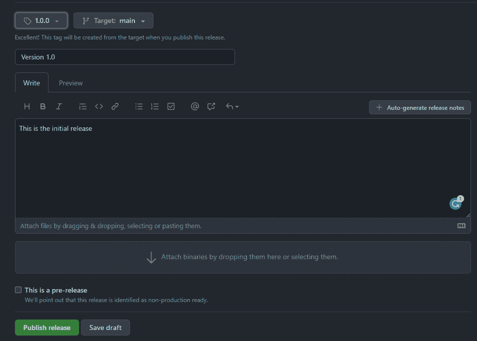

现在，在 GitHub Actions 选项卡中，我们将看到我们的工作流正在运行！(*你可能会看到版本为 1.0.1，我忘了上传 YAML 文件的任何内容…*😅)

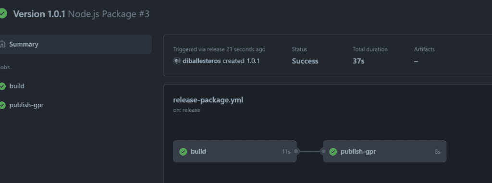

成功！

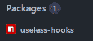

# 安装 GitHub 软件包库

出于示例目的，我将使用以下命令引导一个应用程序:

```
npx create-react-app my-app 
cd my-app
```

通常，我可以直接使用`npm install useless-hooks`，但是首先，我们必须将我们的应用指向 GitHub 包。

首先，我们必须对 GitHub 包进行认证。我将把这个指南放在这里，由 GitHub 自己制作:[链接](https://docs.github.com/en/packages/working-with-a-github-packages-registry/working-with-the-npm-registry#authenticating-to-github-packages)

在我们项目的根目录下创建一个`.npmrc`文件。

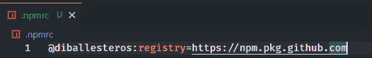

用您的 GitHub 用户名或您用来创建包的用户名替换@diballesteros。

在我们的 package.json 中，我们将包含新的依赖项:

```
"dependencies": { 
    ...other dependencies, 
    "@diballesteros/useless-hooks": "^1.0.1" 
}
```

并运行:

```
npm install
```

# 使用 GitHub 包库

终于可以用我们的包了！

在我们的 App.js 中，我们可以像导入任何其他库一样导入它:

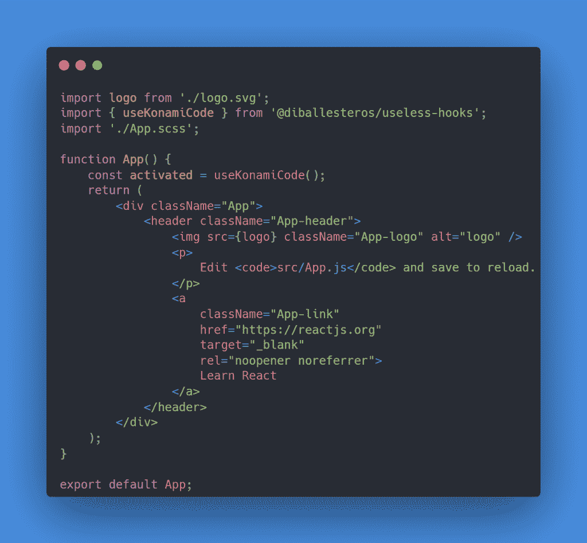

# 结论

你可以在这里找到库。有比这篇文章更多的发布，因为我在认证时遇到了一些问题。

如果你对 GitHub 包有任何其他的建议，请在下面的评论中告诉我。

更多内容请点击[相关代码](https://relatablecode.com)

如果你喜欢这个，请随时在 [LinkedIn](https://www.linkedin.com/in/relatablecode) 或 [Twitter](https://twitter.com/relatablecoder) 上与我联系

在我的[时事通讯](https://relatablecode.substack.com/)中查看我的免费开发者路线图和每周科技行业新闻。

*原载于 2022 年 4 月 4 日 https://relatablecode.com*[](https://relatablecode.com/quickly-publish-and-install-a-library-with-github-packages/)**。**