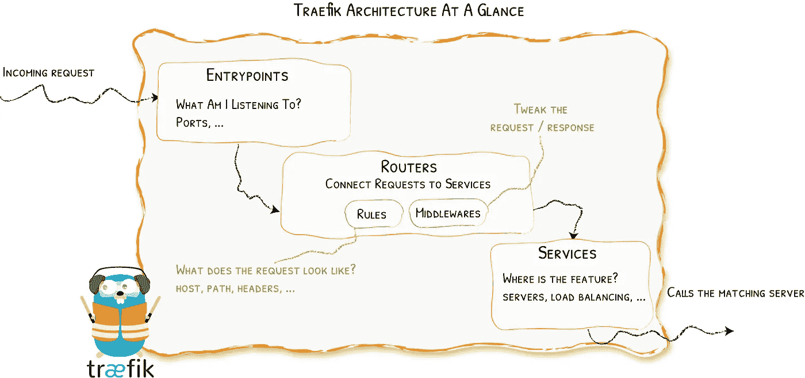
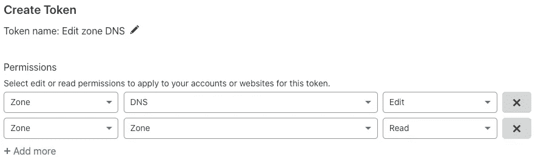
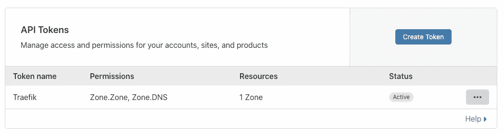
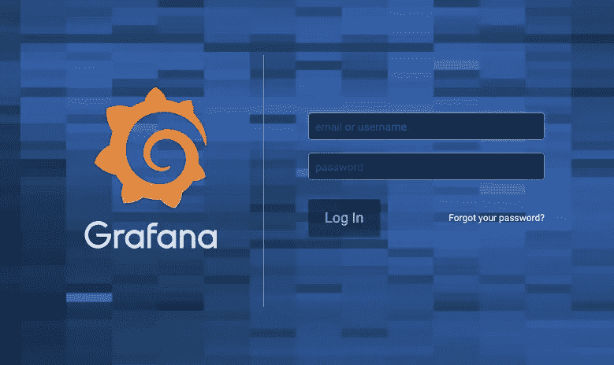

# Kubernetes 上的 Traefik v2 快速入门

> 原文：<https://blog.devgenius.io/quickstart-with-traefik-v2-on-kubernetes-e6dff0d65216?source=collection_archive---------1----------------------->

Traefik、Let's Encrypt 和 Cloudflare 的 5 分钟设置


[Traefik 2.0 于 2019 年 9 月上市](https://containo.us/blog/traefik-2-0-6531ec5196c2/)，发布了一系列新功能，包括支持 SNI 路由的 TCP、中间件、金丝雀/流量镜像和 Ingres route Kubernetes CRD。虽然 Containous 的团队(Traefik 的创建者)在设计从 v1 到 v2 的[迁移步骤](https://docs.traefik.io/migration/v1-to-v2/)方面做得很好，但是目前 Kubernetes 的用户指南并不多。除了文档网站上的“ [Traefik & CRD &让我们加密](https://docs.traefik.io/user-guides/crd-acme/)”用户指南(使用 [k3s](https://github.com/rancher/k3s) docker 图像)，我发现自己参考了网络上更广泛的 docker 教程来应用于我的 Kubernetes 集群。这是一个快速的 5 分钟端到端设置，使用 Traefik、Let's Encrypt 和 Cloudflare 处理 Kubernetes 上的 HTTPS 请求。

*在我们开始之前，如果您需要复习 Kubernetes 入口控制器、Ingres route CRD，或者比较 Traefik 和其他流行的入口控制器，请查看:*

[](https://medium.com/swlh/kubernetes-ingress-controller-overview-81abbaca19ec) [## Kubernetes 入口控制器概述

### 比较 Kubernetes 的流行入口控制器，并列出选择正确控制器的重要考虑因素…

medium.com](https://medium.com/swlh/kubernetes-ingress-controller-overview-81abbaca19ec) 

## 先决条件

要学习本教程，您需要一个安装了 [Helm 3.x](https://helm.sh/docs/intro/install/) 的 Kubernetes 集群(例如 minikube、GKE、EKS、AKS 或 k3s)。

将 Traefik 的图表存储库添加到 Helm:

```
helm repo add traefik https://containous.github.io/traefik-helm-chart
```

如果您不熟悉 Traefik，以下是基本概念的概述:

*   **入口点**:监听进入的流量
*   **路由器:**分析传入的请求并连接到服务
*   **中间件:**修改/更新请求(例如速率限制、HTTPS 重定向)
*   **服务:**将请求转发给相应的服务器/负载均衡器/应用



图片来源: [Traefik Docs](https://docs.traefik.io/routing/overview/)

最后，我将使用 Cloudflare 作为 DNS 提供者，但是您也可以使用任何受 Let's Encrypt [支持的提供者](https://docs.traefik.io/https/acme/#providers)来修改指南。

# 让我们加密设置

[Traefik v2 舵图](https://github.com/containous/traefik-helm-chart)引导三个入口点:

*   **端口 9000 上的 traefik** (用于就绪和活性探测)
*   **web** 端口 80 (http)
*   端口 443 (https)上的 websecure

定义入口点后，我们可以扩展图表，将 Let's Encrypt 用作证书解析器，并自动为您的域生成和续订证书。

让我们定义一个名为`letsencrypt`的证书解析器。创建一个名为`traefik-values.yaml`的新 YAML 文件，并添加以下部分:

```
additionalArguments:
  - "--certificatesresolvers.letsencrypt.acme.email=**<your-email-here>**"
  - "--certificatesresolvers.letsencrypt.acme.storage=/data/acme.json"
  - "--certificatesresolvers.letsencrypt.acme.caserver=[https://acme-v02.api.letsencrypt.org/directory](https://acme-v02.api.letsencrypt.org/directory)"
  - "--certificatesResolvers.letsencrypt.acme.dnschallenge=true"
  - "--certificatesResolvers.letsencrypt.acme.dnschallenge.provider=cloudflare"
  - "--api.insecure=true"
  - "--accesslog=true"
  - "--log.level=INFO"
```

我们使用 dnsChallenge 选项来生成 ACME 证书，但是您也可以选择使用 tlsChallenge 或 httpChallenge。

# Cloudflare 设置

为了让 Let's Encrypt 使用 Cloudflare，它需要一个带有 [DNS:Edit 权限](https://go-acme.github.io/lego/dns/cloudflare/)的 API 令牌。在您的域的 API 令牌部分下，单击`Create Token`。使用`Edit zone DNS`模板或自定义令牌，并授予以下权限:



一旦你有了令牌，状态应该是`Active`



现在在 Kubernetes 上，让我们创建这个秘密，这样 Traefik 就可以把它作为一个环境变量:

```
$ kubectl create secret generic cloudflare --from-literal=dns-token=**<my-cloudflare-token-here>**
```

最后，将 env 部分添加到您的`traefik-values.yaml`中

```
env:
  - name: CF_DNS_API_TOKEN
    valueFrom:
      secretKeyRef:
        name: cloudflare
        key: dns-token
```

# 安装 Traefik

现在，通过头盔安装 Traefik:

```
$ helm install traefik traefik/traefik -f traefik/traefik-values.yaml
```

一旦 pod 运行正常，您就可以通过端口转发来访问 Traefik 仪表板:

```
$ kubectl port-forward $(kubectl get pods --selector "app.kubernetes.io/name=traefik" --output=name) 9000:9000
```

Helm chart 还将创建一个负载平衡器，将流量路由到 Kubernetes。记下这个 IP 地址(或 AWS 上的 ELB DNS 名称),因为我们稍后将需要它来配置 DNS 条目。

# 添加 IngressRoutes

最后，让我们添加一个 IngressRoute 来看看 Traefik 的运行情况。我将使用 Grafana 作为示例服务来公开 via HTTPS。

通过头盔安装 Grafana:

```
$ helm install grafana stable/grafana
```

创建一个名为`grafana.yaml`的新文件

```
apiVersion: traefik.containo.us/v1alpha1
kind: IngressRoute
metadata:
  name: grafana-ingress
spec:
  entryPoints:
    - websecure
  routes:
  - match: Host(`**grafana.example.com**`)
    kind: Rule
    services:
    - name: grafana
      port: 3000
  tls:
    certResolver: letsencrypt
```

确保根据您的“让我们加密”设置更改主机名，并应用更改:

```
$ kubectl apply -f grafana.yaml
```

当 Traefik 创建新的路由逻辑并生成 Let's Encrypt 证书时，切换回 Cloudflare 并添加 A 记录(grafana ),该记录指向 Traefik 的负载平衡器的 IP 地址(或 ELB DNS 条目的 CNAME)。

导航到`grafana.example.com`，您应该会看到一个支持 HTTPS 的 Grafana 仪表盘:



# 包扎

现在我们有了一个基本的示例设置，接下来看看通过中间件启用 HTTPS 重定向或实现 IP 白名单来保护对 Grafana 的访问。您可以在 YAML 文件中扩展附加参数，或者通过 Helm 挂载 config.toml。

要了解更多关于 Traefik 的信息，请查看[官方文档](https://docs.traefik.io/)或在 [Traefik 论坛](https://community.containo.us/c/traefik/5)上寻找支持。