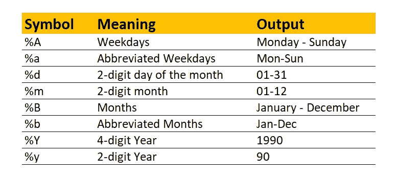
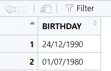
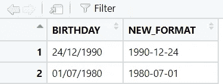
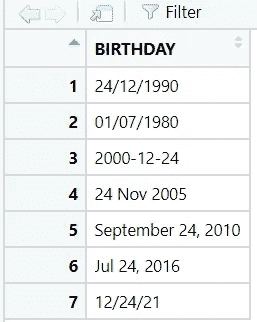
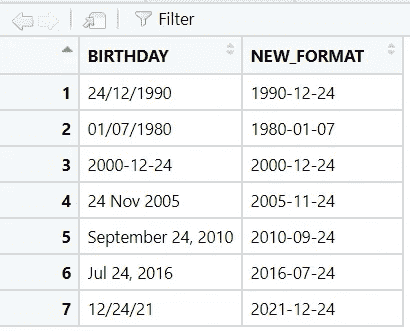
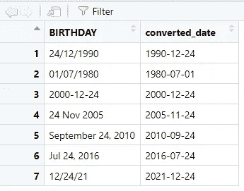
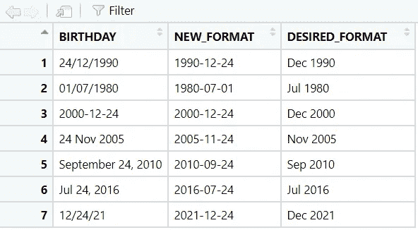

# 如何在 R 中转换日期格式

> 原文：<https://blog.devgenius.io/r-for-haters-how-to-convert-date-format-50583214e1c8?source=collection_archive---------5----------------------->

最近，我参与了多个项目，包括数据集中的日期时间字段。很多时候我需要把日期时间转换成 **ISO 8601 日期格式**(例如:`**YYYY-MM-DD**`)。我一直在处理的日期字段来自各种类型。特别是，当将多个数据集连接在一起时，当这些格式不一致时，可能会引入`**NA**` 值。此外，我无法计算持续时间或创建以文本形式存储日期字段的图表。当我的工作量变慢的时候，手动整理永远不会是问题。但是你需要从长远考虑，每次你手动清理这些字段都会增加大量的时间。作为数据分析师，我们还有其他优先事项要完成。出于这个原因，我喜欢在处理**日期时间格式**时分享一些想法和见解，以便我们可以提高工作效率。


如何在 R 中转换日期格式

在从事大型项目时，我们经常从不同的来源收集数据。这解释了为什么在很多情况下，即使相同的字段也有不同的格式。由于这种不一致性，data analyst 无法加快数据清理过程。我注意到很多次日期字段被存储为文本、数字或一堆不同的格式。

一些流行的日期格式类型:

*   `**MM/DD/YYYY** (12/24/1990)`
*   `**DD/MM/YYYY** (24/12/1990)`
*   `**YYYY/MM/DD** (1990/12/24)`

点击 了解更多不同日期时间格式 [**。**](https://www.ibm.com/docs/en/cmofz/10.1.0?topic=SSQHWE_10.1.0/com.ibm.ondemand.mp.doc/arsa0257.htm)

浏览完这些格式后，现在您对数据集中的日期字段会是什么样子有了更好的了解。要从一种格式转换成另一种格式，我们需要告诉计算机正确的方式。如果我们没有正确地指定，结果可能与我们的预期完全不同。我们如何告诉计算机我们到底想要什么？

日期格式汇总表



还有很多，但我只是在这里得到一些。如果我们有日期作为`**2022–12–24**`，计算机理解它是`**%Y-%m-%d**`格式。同样，`**24 Dec 2022**`，电脑消化为`**%d %b %Y**` (中间有空格)。这里重要的是**符号**，分隔符可以是**破折号** (-)、**空格**()、**正斜杠** (/)等等。

# 场景 1

让我们仔细看看一个具体的例子。我有一个如下格式的数据集，我想把**生日**列转换成我的计算机系统格式(`**YYYY-MM-DD**`，我们该怎么做？

```
library(dplyr)
df <- data.frame(BIRTHDAY = c("24/12/1990", "01/07/1980"))
```



您可以使用`**as.Date()**` 功能，输入数据和格式如下。

```
df <- df %>% 
  mutate(NEW_FORMAT = as.Date(as.character(BIRTHDAY), format = "%d/%m/%Y"))
```

结果如预期那样工作。基本上，你告诉计算机，他们把生日列当作格式为`**“%d/%m/%Y”**` **(日/月/年)**的字符，并借助`**as.Date()**` 函数把它转换成你的计算机系统日期格式。我的电脑系统有`**YYYY-MM-DD**`(2022–12–15)格式，你的可能和我的不一样，所以你可以在你的新专栏里期待不同的结果。



# 场景 2

现在假设您的数据在同一列中有多种格式，如何将所有这些格式转换成一种格式？

```
df <- data.frame(date_time = c("24/12/1990", "01/07/1980", "2000-12-24", 
                               "24 Nov 2005", "September 24, 2010", 
                                "Jul 24, 2016", "12/24/21"))
```



因为还有许多其他格式，在这个例子中，我只得到其中的一些，你可能会在你的数据集中看到其他不同的格式。但是不要担心，一旦你理解了基本的，你可以很容易地调整。

在这种情况下，我们可以应用与场景 1 相同的方法，场景 1 只指定一种格式。现在，我们需要指定所有这些格式，并将其放入一个向量中。让我们和我一起指定这些格式。

```
Specification:
24/12/1990: => %d/%m/%Y
01/07/1980: => %m/%d/%Y
2000-12-24: => %Y-%m-%d
24 Nov 2005: => %d %b %Y
September 24, 2010: => %B %d, %Y
Jul 24, 2016: => %b %d, %Y
12/24/21: => %m/%d/%y
```

```
df <- df %>% 
  mutate(NEW_FORMAT = as.Date(as.character(BIRTHDAY), 
format = c("%d/%m/%Y", "%m/%d/%Y", "%Y-%m-%d", 
"%d %b %Y", "%B %d, %Y", "%b %d, %Y", "%m/%d/%y")))
```

你告诉计算机，嘿，把生日作为字符与上述日期格式之一，如果格式匹配，那么把它转换成你的计算机系统的日期格式。如果没有，它将返回 NA 值。结果如下:



现在您知道了如何将多种日期格式转换成一种格式。每当你在你的数据中看到一个新的格式时，你可以把向量 c() 添加到**格式中。在这一步，如果您想创建一个函数供将来重用，我们鼓励您这样做。**

```
convert_date <- function(date_data){
  as.Date(as.character(date_data), 
format = c("%d/%m/%Y", "%m/%d/%Y", "%Y-%m-%d", "%d %b %Y", 
"%B %d, %Y", "%b %d, %Y", "%m/%d/%y")) 
}
df <- df %>% 
  mutate(NEW_FORMAT = convert_date(BIRTHDAY))
```

它返回相同的结果，现在每次需要转换日期数据时，只需要一行代码。如果发现新的数据格式，只需将该格式添加到函数中。

# 场景 3

在这种情况下，将各种数据格式转换成一种格式非常简单。只用一行代码就可以使用`**lubridate**` 包。使用上面相同的例子

```
library(dplyr)
library(lubridate)
df <- data.frame(BIRTHDAY = c("24/12/1990", "01/07/1980", "2000-12-24", 
                              "24 Nov 2005", "September 24, 2010", 
                              "Jul 24, 2016", "12/24/21")) 
df <- df %>% 
  mutate(converted_date = parse_date_time(BIRTHDAY, 
orders = c("mdy", "dmy", "ymd")))
```

它返回如下相同的输出:



同样，有多种方法可以将日期格式从一种格式转换为另一种格式。我画出不同的场景，分析解决问题的不同方法。通过这样做，我们学会了如何逐步找到解决方案。这被认为是进一步问题的基础。当我们将问题分解成小的种类时，逐个处理会容易得多。访问 [**这里**](https://lubridate.tidyverse.org/reference/parse_date_time.html) 了解更多关于`**parse_date_time**` 和`**lubridate**` 套餐的信息。

# 场景 4

哇哇哇，今天文章的四个不同场景。有时你想转换成特定的格式，而不是你的计算机系统格式。假设你想把`**2016/07/24**`转换成`**Jul 2016**` **，**我们该怎么做呢？

有时，经理想要一份带有图表的报告，他/她只想根据**月**和**年**进行过滤。只用月份和年份来转换日期非常方便。您可以使用`**format()**` 功能，通过该功能您可以输入日期列并输入需要转换的格式。让我们看看这个例子。

使用与**场景 3** 相同的示例，现在我们只添加一个具有**月**和**年**格式的列。

```
df <- data.frame(BIRTHDAY = c("24/12/1990", "01/07/1980", "2000-12-24", 
                              "24 Nov 2005", "September 24, 2010", 
                              "Jul 24, 2016", "12/24/21")) 
df <- df %>% 
  mutate(NEW_FORMAT = parse_date_time(BIRTHDAY, 
  orders = c("mdy", "dmy", "ymd"))) %>% 
  mutate(DESIRED_FORMAT = format(NEW_FORMAT, "%b %Y"))
```

看起来是这样的:



通过一些简便的方法来处理日期类型，现在您可以稍微提高您的生产率。通过每天一点一点的改进，它将会产生巨大的影响。

# 参考资料:

Lubridate 包:[用户友好的日期时间解析函数—parse _ date _ time lubridate(tidyverse.org)](https://lubridate.tidyverse.org/reference/parse_date_time.html)

日期格式:[R | R-bloggers 中的日期格式](https://www.r-bloggers.com/2013/08/date-formats-in-r/)

ISO 日期时间格式:[什么是 ISO 日期时间格式？(techtarget.com)](https://www.techtarget.com/whatis/definition/ISO-date-format#:~:text=The%20ISO%20standard%20takes%20a,or%202022%2D07%2D15.)

IBM 日期和时间格式:[日期和时间格式— IBM 文档](https://www.ibm.com/docs/en/cmofz/10.1.0?topic=SSQHWE_10.1.0/com.ibm.ondemand.mp.doc/arsa0257.htm)