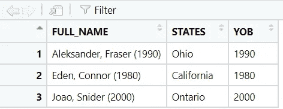
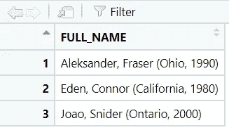
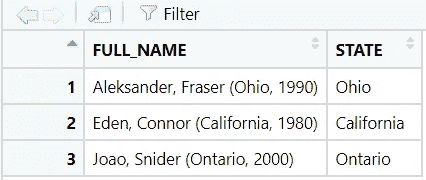
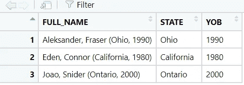
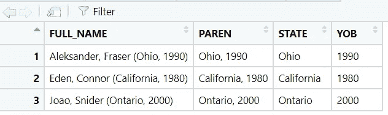

# R for Haters:如何提取括号内的单词/数字

> 原文：<https://blog.devgenius.io/r-for-haters-how-to-extract-word-number-inside-parentheses-c0fc775de9bc?source=collection_archive---------8----------------------->

在处理人员数据时，我有很多机会处理姓名和一个额外的括号，括号中包含出生年份、州或国家等信息。这些信息有时需要提取到一个单独的列中，以便我们可以用于进一步的数据分析。尽管有许多不同的情况，今天我们学习了在一对括号中提取所有内容的基本方法。


如何提取括号内的单词/数字

# 场景 1

这是一个数据框示例。此 **FULL_NAME** 列包含括号内带有额外出生年份的姓名。

```
library(dplyr)
library(stringr)
df <- data.frame(
FULL_NAME = c("Aleksander, Fraser (1990)","Eden, Connor (1980)",
"Joao, Snider (2000)"), 
STATES = c("Ohio", "California", "Ontario"))
```

当从一对括号中提取数字时，我们可能会想到一种使用*正则表达式* ( *regex* )的模式。花点时间想一个可能的方法来提取括号内的数字。你可以看到我们要提取的是左括号**后的数字**和右括号前的数字**。你可能听说过`**Lookahead/Lookbehind**`正则表达式。**

*   `**Lookahead**: **(?=)**` (要求 PERL = TRUE)，例如(？=yx):位置后跟“xy”
*   `**Lookbehind**: **(?<=)**` (PERL = TRUE)，例如(？<= yx):“xy”之后的位置

现在我们得到提取括号内数字的基本成分。逻辑是提取`**(**`后面的数字

前方还有`**)**` **。我在这里输入一个新的行，这样你就不会混淆了。我们要寻找的是什么(用这个语法`**(?<=\\()**` **)。**我们需要用`\\`转义`**(**` 。下一步，我们需要用这个语法寻找在`**)**`之前该怎么走`**(?=\\))**`，我们还需要用`\\`转义`**)**` 。**

这里是我们上面刚刚讨论的最后一个正则表达式:`**“(?<=\\()\\d+(?=\\))”**` **。你可能想知道`**\\d+**`是什么意思？它将匹配括号内的数字至少 **1** 次。**

```
Summary:
(?<=\\(): Look behind the open parenthesis
(?=\\): Look ahead the close parenthesis
\\d+: Match digits at least 1 time
```

是时候写一个函数了，这样我们可以在未来的项目中重用。这个函数将提取括号内的数字，注意，这个模式对于我们上面作为样本数据的特定情况是有效的。如果您的情况不同，您可以调整正则表达式来获取您想要的内容。

```
#Function to extract number inside parentheses
ex_num <- function(data){
  str_extract(data, "(?<=\\()\\d+(?=\\))")
}

df2 <- df %>%
  mutate(YOB = ex_num(FULL_NAME))
```

结果看起来像:



# 场景 2

在这种情况下， **FULL_NAME** 列包括括号内的州和出生年份。您的任务是将状态提取到一个单独的列中，您将如何调整正则表达式来捕获它呢？

```
df <- data.frame(
FULL_NAME = c("Aleksander, Fraser (Ohio, 1990)",
"Eden, Connor (California, 1980)","Joao, Snider (Ontario, 2000)"))
```



这种情况与场景 1 非常不同，场景 1 捕获括号内的数字。然而，在这种情况下，我们只想捕获州名。我们需要稍微修改一下正则表达式来捕捉它。对于`**Lookahead**`部分，我们将`**\\(**`改为`**,**`

```
ex_word <- function(data){
  str_extract(data, "(?<=\\()\\w+(?=,)")
}
```

```
Summary:
(?<=\\(): Look behind the open parenthesis
(?=,): Look ahead the comma
\\w+: Match word characters at least 1 time
```

正则表达式意味着我们在寻找从**左括号**到**逗号**之间的单词字符。下面是我们运行代码时的结果。

```
df2 <- df %>% 
  mutate(STATE = ex_word(FULL_NAME))
```



在这一步，您可能会问如何将州和出生年份提取到两个独立的列中。这是一个很好的观点。我们应用与上面两个例子相同的原理。下面是如何将出生年份提取到另一列中。此模式将捕获括号中的年份

`**(?<=\\(\\w{1,20},\\s)\\d+(?=\\))**`

`**(?<=\\(\\w{1,20},\\s)**` **:** *看左括号后面，单词字符长度从 1 到 20，一个逗号，一个空格。*

*   *例如:亚历山大·弗雷泽* `***(Ohio,***`*1990)*

你可能会奇怪为什么我们用`**{1,20}**`而不是`**+**` **。**这是因为在 look back 中，如果我们使用`**\\w+**`它将抛出下面的错误。因此，我们需要指定固定长度。(*由你决定，在这种情况下我就把它从 1 留到 20* )

`Look-Behind pattern matches must have a bounded maximum length`

```
df2 <- df %>% 
  mutate(STATE = ex_paren(FULL_NAME),
         YOB = str_extract(FULL_NAME, "(?<=\\(\\w{1,20},\\s)\\d+(?=\\))"))
```



如果你需要一次又一次地重复同样的任务，你可以考虑写一个函数，但是如果不经常使用，你就直接写没有函数的代码。

# 其他解决方案

俗话说“条条大路通罗马”。也就是说，我们有很多方法可以达到我们的目的。另一种简单的方法是，我们将把括号内的所有内容提取到另一列。在这一步，我们只能将单词或数字提取到两个独立的列中。

```
df <- data.frame(
FULL_NAME = c("Aleksander, Fraser (Ohio, 1990)",
"Eden, Connor (California, 1980)","Joao, Snider (Ontario, 2000)"))

df2 <- df %>% 
  mutate(PAREN = str_extract(FULL_NAME, "(?<=\\().*(?=\\))"),
         STATE = str_extract(PAREN, "\\w+"),
         YOB = str_extract(PAREN, "\\d+"))
```



# **总结**:

我们有很多方法来完成同样的任务。然而，在这篇文章中，我想尽可能地深入细节，以便你有更多的想法来解决同样的问题。当我们这样做的时候，我们学会了如何分析一个问题，并为每个特定的案例找出最佳的方法。如果你有任何想法或反馈，请随时告诉我。

# 参考资料:

R Regex 备忘单:【wordpress.com】四列布局备忘单