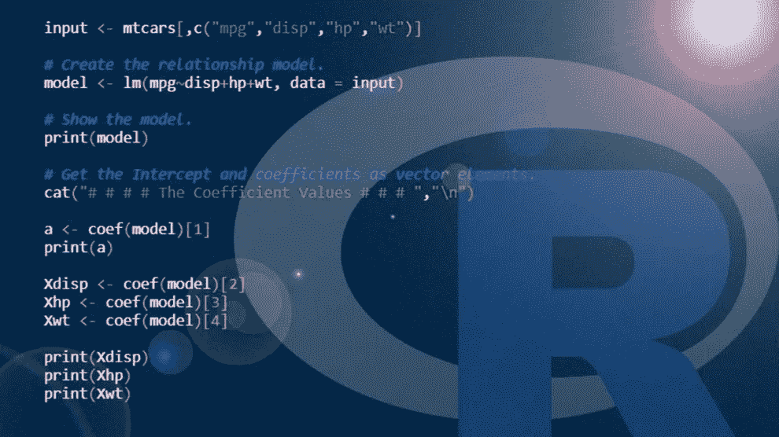
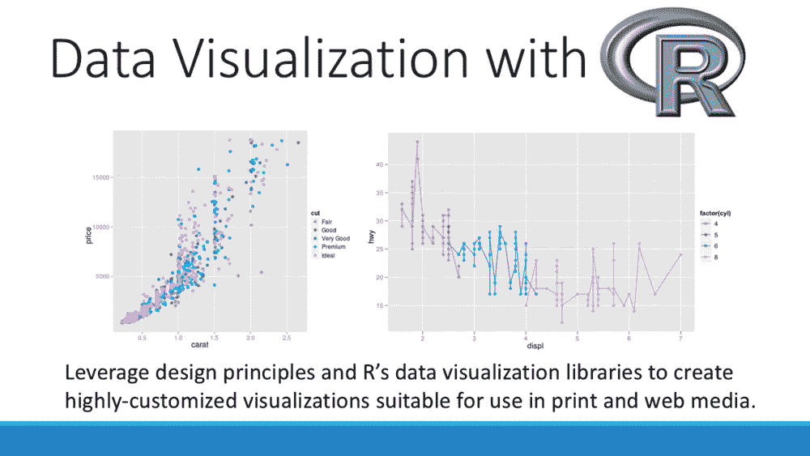

# 初学者指南

> 原文：<https://blog.devgenius.io/r-guide-for-beginners-60a15fb831a9?source=collection_archive---------8----------------------->

你想学，但是如果你不知道从哪里开始怎么办？在这里，我将通过你如何毫不费力地学习 R 来支持你。

## 1-很难学

重要的事情优先 R 以其陡峭的学习曲线而闻名。*换句话说，R 很难学，因为与其他处理对象的编程语言不同，R 处理的是矢量化运算。*所以，R 从来没有标量运算，它的矢量化运算似乎有标量函数。此外，您必须运行每一行代码，这与任何其他编程语言的设计不同。

## 2-代替整数和浮点数，它使用双精度数据类型

它不仅仅止于此。而其他编程语言使用整数和浮点数来表示它们的数值数据；r 则不然。*用双精度“double”*表示数值数据。所以，你不需要在需要的时候把它们变成 floats。但是要把它们变成整数，你需要把 L 写成一个数，这个数用 L 显示(即 2L，L 用来表示整数)。然后数字的类型变成了整数。

## 3-它不是面向对象的编程语言

r 处理向量而不是对象。这意味着所有的数据类型都必须相同。如果没有，R 会将它们强制转换为相同的数据类型，以使代码行正常工作。此外，向量的成员称为分量。

## 4-您需要下载 R studio 并下载软件包

R 使用名为“R Studio”的文本编辑器工作。即使 R 的一些其他扩展是在不同的文本编辑器中创建的，R Studio 也允许下载所有需要的包程序来工作。

## 5-易于进行数学和统计计算

我在上一篇文章中提到了 R 世界闻名的数学和统计计算。现在我可以说，在进行统计和数学计算时，没有其他编程语言比 R 语言更好。我也没有提到数据可视化。给你我的理由；首先，不需要导入库。你只需在 R Studio 中下载它们。第二，它具有特定的数学和统计功能，使它们易于使用。

## 6-导入数据集

在 python 中导入数据集可能会很痛苦。特别是我们需要定义特定的库来实现这一点。但是 R 用的是 load.csv()。它通常用于导入您需要的各种数据集。在 load.csv 中，您可以写入数据名称，也可以手动选择文件。而且，我们有 setwd()和 getwd()函数。在 getwd()中，它返回表示 R 进程当前工作目录的绝对文件路径。在 setwd()中，您只需设置您的工作目录。

## 7-易于可视化数据

各种工作急需的技能，R 在这里让他们的生活更轻松。只需要两个函数:ggplot()和 qplot()。众所周知，这些函数可以轻松创建出色的图表，以前所未有的方式呈现和可视化数据。更重要的是，只要代码没有被删除，你可以直接下载你需要的格式。

*你对 R 的编程指南怎么看？在下面的评论区分享你的问题和想法。*