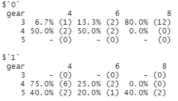

# r 使用 Tidyverse 和四个额外的软件包给每个数据科学家的提示

> 原文：<https://blog.devgenius.io/r-tips-for-every-data-scientist-with-tidyverse-and-four-additional-packages-b8ed7018691f?source=collection_archive---------1----------------------->

## 从这些 R 函数中获益，使您的下一个数据科学项目变得更加容易

Tidyverse 是 R 包的集合，主要用于数据工程和数据科学。这些包是 **ggplot2** 、 **purrr** 、**tible**、 **dplyr** 、 **tidyr** 、 **stringr** 、 **readr** 和**forcas**。所有这些都结合了相同的语言、设计和“语法”结构，使数据科学更简单、更容易、更快速。

由[麦克斯韦·纳尔逊](https://unsplash.com/@maxcodes?utm_source=medium&utm_medium=referral)在 [Unsplash](https://unsplash.com?utm_source=medium&utm_medium=referral) 上拍摄的照片

# 动机

数据准备、数据争论和数据工程有助于提高所有数据科学任务的数据可用性。但是在进入数据科学之前，需要以易于阅读、重复和分析的方式准备数据。

Tidyverse 包涵盖了所有重要的争论和工程师的任务。还有许多功能往往如此强大，却不为社区所知。

这篇文章将引导你通过八个 Tidyverse 函数和四个 four 提示语(包:**马格里特**、**看门人**、 **ggforce** 、 **Esquirre** )，让数据科学变得更容易。

以下 R 提示基于[航班](https://github.com/tidyverse/nycflights13/tree/main/data)和[航空公司](https://github.com/tidyverse/nycflights13/tree/main/data)的两个公开数据集。两者都可以在 R 包 nycflights13 中获得，并且可以通过调用一个库()函数附加到您的环境中。除非另有说明，所有图片均为作者所有。

# 1.使用管道“%>%”实现管道内的嵌套功能

管道(或链接)是链接数据操作函数而不存储中间结果的好方法。

尽管大量使用了 REGEX 和 str_replace_all 函数，但这段代码清晰易读、易于理解且易于管理。如果我们用普通的函数包装来替换内部管道，那么“name_short”的 mutate 将会变得相当难读。

两个代码片段返回相同的结果，并使用基本相同的函数。然而，第一个使用管道智能地做到了这一点。

# 2.一次跨多列操作

Tidyverse 为同时跨多个列操作提供了一些很棒的函数。cross 是一个函数，它使得在*summary()*和 *mutate()* 函数中对多个列应用相同的转换变得容易。

cross 接受两个参数；a)列的数组和 b)要应用于所选列的函数或函数列表。

# 3.Case 语句根据条件创建列

创建 case 语句通常是一项必需的任务，而 *case_when()* 函数可以实现简单、快速的转换。只需在其他 tidyverse 函数的顶部添加一个新列；例如 group_by 和 count。

并通过使用 *case_when()* 函数创建的变量 new_classification 创建一个带有分组的 tibble。

按 case 语句分组

# 4.使用转化

该函数执行与 mutate 相同的功能—创建一个新列。但是*transduce()*添加新变量并删除现有变量，而 *mutate()* 保留现有变量。

上面的例子返回了基本相同的结果集，而*transduce()*更加清晰易读。如果从第一个示例中删除 *select()* 函数，就会得到完整的数据集，以及一个新列。

# 5.集总水平

当有许多级别，但人们只对最频繁出现的级别感兴趣时，对给定因子变量的级别进行汇总是一个非常强大的功能。

给定 15 个字母的向量和它们的频率，人们可以立即看到，在 15 个不同的字母中，大约 80%的观察值属于 5 个字母。

现在，显示不同级别的低频长尾被归入“其他”，这对于可视化数据非常有用。

该脚本生成了一个简单而有效的图表，显示了前 5 个最常使用的运营商，并将其他运营商归为一组。

使用 fct_lump_n()函数的快速概览图

# 6.生成所有可能的组合

从一组变量中产生所有可能的组合不是你的日常场景。但是 Tidyverse 提供了名为 *crossing()* 或 *expand()* 的函数来完成这项工作。

使用*航班*数据集，让我们为几个选定的变量创建所有可能的组合。我们可以使用函数 *expand()* 。但是找到所有现有的唯一组合 *crossing()* 函数就可以了。

# 7.通过透视和展开重塑数据

另一项通常与数据准备相关的重要任务是数据整形。

第一个功能一个人必须(！)理解并舒服地工作是***pivot _ wider()***。该函数从一个变量(在本例中为变量:origin)获取值，并针对给定的统计数据(平均值)转置(整形/透视)数据(dep_time 和 arr_time)。

此转换基于平均时间(出发和到达)的起点为可变承运人创建统计数据。

从较长的数据集旋转到较宽的数据集

Contra to *pivot_wider()* 是函数 ***pivot_longer()*** 。这个函数正好相反。较宽的函数增加更多的列并减少行数，而较长的函数减少列数并创建新的数据行。

让我们持久化 pivot_wider 示例中的数据帧，并将数据帧命名为 flights_wider。

将数据集从宽旋转到长

这两个函数都以这样的方式透视数据集，即可以在较长的数据集中创建作为键:值变量的列，并且可以将键:值对透视到更宽的数据集。许多数据分析场景将受益于这两个函数。

# 8.向数据帧添加运行 ID

最后一个技巧是最简单的，但是可以节省大量的时间。向数据帧的每一行添加一个运行 ID。这个 ID 将为给定的行创建“唯一性”整体属性(列)。这可以为您节省大量过滤和编写代码的时间，然而，您可以说，给我一个 ID = 42 的行。

这份名单绝不是最终的名单，人们可以添加许多光荣的提及。尽管如此，这份名单是经过长期策划的，这份精选是基于工作和对 Tidyverse 的使用。

# 荣誉提名

Tidyverse 列表中增加了四个额外的函数——每个来自不同的包。这些都是做数据探索时值得记住的。

包 [**马格里特**](https://cran.r-project.org/web/packages/magrittr/index.html) 带强力赋值管*%<%*。它将修改重新分配给同一个数据帧。这将产生双重效果。当处理更大的数据集和更整洁的环境时，它将节省本地内存。

包 [**看门人**](https://cran.r-project.org/web/packages/janitor/index.html) 有一颗隐藏的宝石。函数 *tably()* 让创建统计表变得简单、干净、整洁。这些表格可以包括按行或列的百分比和累计。

包含三个变量和百分比的表格|按行计数

包含两个变量和百分比的表格|按行计数

软件包管理员还将帮助您清理数据(因此有了软件包名称)。值得一提的函数还有 *remove_empty()* 、 *get_dupes()* 和 *compare_df_cols()* 。第一个函数将移除空的列或行，第二个函数将查找重复项，第三个函数将比较数据集以查找重复项。

使用 [**ggforce**](https://cran.r-project.org/web/packages/ggforce/index.html) 包中的 *zoom_facet()* 函数在图表的特定部分创建焦点(缩放)。

使用 zoom_facet()缩放图形的部分

使用 [**esquisse**](https://cran.r-project.org/web/packages/esquisse/vignettes/get-started.html) 软件包，交互式地探索和可视化您的数据。浏览和过滤数据集。软件包(插件)帮助您绘制绘图，曲线，散点图，直方图，箱线图等。和许多其他类型。

将创建一个对话窗口，使数据浏览变得容易。

此外，生成 **ggplot2** 代码，可以复制并进一步用于分析。

# 结论

Tidyverse 函数和其他四个软件包(Magrittr、gate er、ggforce 和 esquisse)中的函数列表非常有用，可以帮助任何数据科学家处理数据。此外，这将使他们的代码可读和可复制，仅仅因为它将更容易理解和管理。