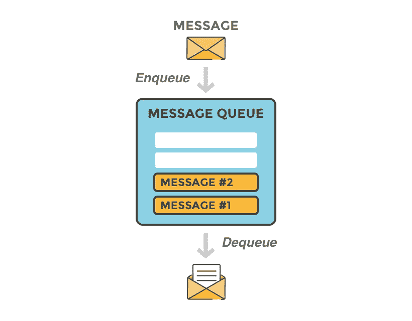
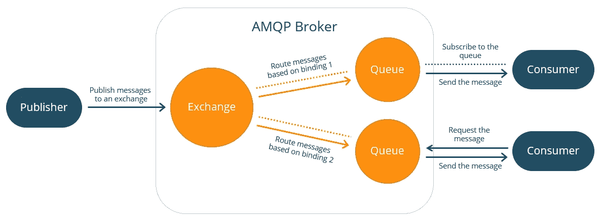
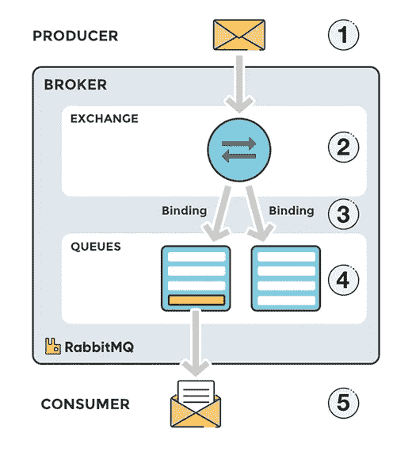
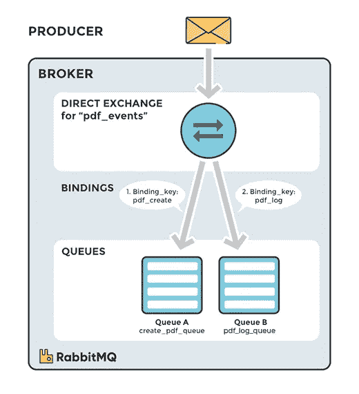
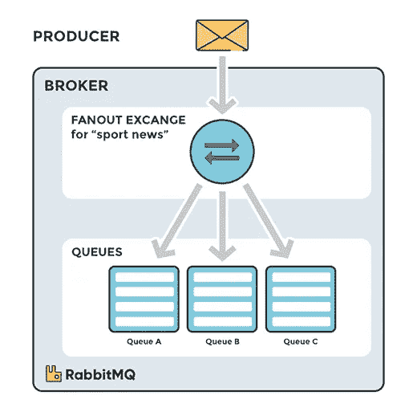
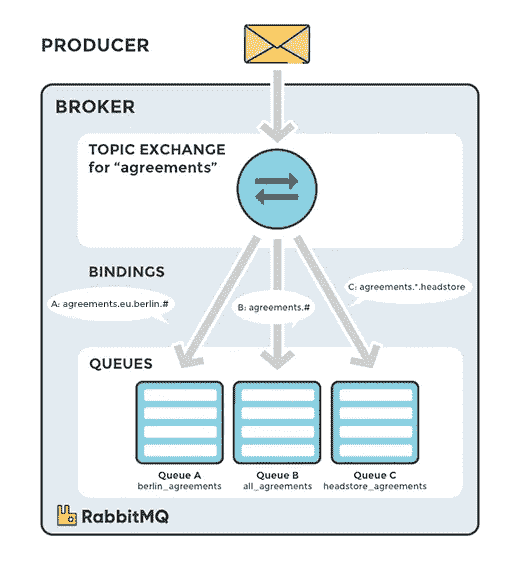
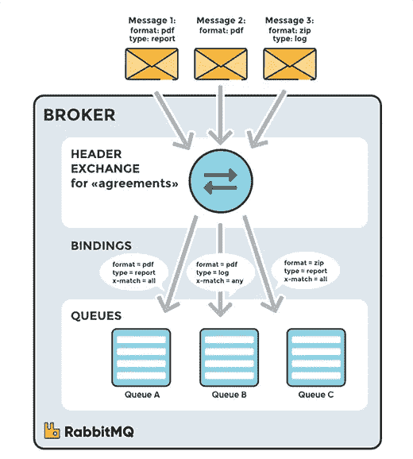

# 兔子 q

> 原文：<https://blog.devgenius.io/rabbitmq-edbea68c6bd6?source=collection_archive---------7----------------------->

在我最近参与的项目中，我们决定朝着微服务架构模式的方向前进。这一举动背后的动机是为了克服在整体架构中面临的困难，也是基于我们的要求。RabbitMQ 是我们微服务架构中非常依赖的一个组件。让我们继续深入了解 RabbitMQ。

# 什么是 RabbitMQ

RabbitMQ 是一个使用 AMQP(高级消息队列协议)实现的消息队列软件。消息队列通过发送消息来促进应用程序之间的有效通信。当目标应用程序繁忙或未连接时，它还通过存储消息来充当消息的临时庇护所。消息队列支持异步通信，这意味着生成和使用消息的其他应用程序(端点)与队列进行交互，而不是直接相互通信。

什么是**消息**？消息可以包括任何信息。例如，它可能包含关于应该在另一个应用程序(可能在另一个服务器上)上启动的进程/作业的信息，或者它也可能只是一个简单的文本消息。它可以是通知一个应用程序开始处理一个任务的信号，或者告诉一个应用程序另一个应用程序完成了一个任务。

## 兔子的建筑

*   **发布者**向**队列**发布消息。
*   消息代理存储消息，直到**消费者**连接并从队列中取出消息。然后，消费者处理该消息。
*   生产者和消费者彼此独立运作。

# AMQP 议定书

高级消息队列协议(AMQP)是面向消息的中间件的开放标准应用层协议。AMQP 的定义特征是消息定向、排队、路由(包括点对点和发布-订阅)、可靠性和安全性。

AMQP 规定了消息发布者和消息消费者的行为，以便在不同供应商用不同编程语言构建的不同应用程序之间无缝传输消息。

## RabbitMQ 中的消息流

1.  生产者向交易所发布消息。当您创建交换时，您必须指定它的类型。稍后将详细解释不同类型的交换。
2.  交换机接收消息，现在负责消息的路由。根据交换类型，交换会考虑不同的消息属性，如路由关键字。
3.  必须创建从交换到队列的绑定。在这种情况下，我们看到来自交换的两个不同队列的两个绑定。交换根据邮件属性将邮件路由到队列中。
4.  消息会一直留在队列中，直到被使用者处理
5.  消费者处理消息。

# RabbitMQ 中的组件

## 出版商

术语“出版商”在不同的上下文中有不同的含义。通常，在消息传递中，发布者(也称为“生产者”)是发布(产生)消息的应用程序(或应用程序实例)。**发布者**的工作是向 RabbitMQ 消息代理发布给定的消息。

## 顾客

“消费者”一词在不同的上下文中有不同的含义。通常，在消息传递中，消费者是使用消息的应用程序或应用程序实例。**消费者**从它所连接的队列中消费消息。成功处理消息后，消费者可以确认，消息将从队列中删除。

## 行列

队列是 RabbitMQ 存储消息/数据的地方。RabbitMQ 队列也遵循先进先出的方法。队列可以通过可用的编程库进行配置。它可以是持久的(具有持久性属性),以便在代理崩溃时保护数据。还可以向队列提供名称(使用 Name 属性)。除了名称和持久性，队列还有一些其他属性，如自动删除、独占和参数。

## 交换

消息不会直接发布到队列，而是由生产者将消息发送到交换。交换负责将消息路由到不同的队列。交换接受来自生产者应用程序的消息，并在绑定和路由键的帮助下将它们路由到消息队列。绑定是队列和交换之间的链接。

## 交易所的类型

**直接兑换**

创建直接交换时，它会将消息定向到绑定到它的队列。路由关键字是一种属性，负责通知交换机消息应该被定向到哪个队列。

**扇出交换**

与直接类型不同，在扇出中，我们没有路由关键数字。当一个扇出交换机接收到一个消息时，该消息的一个副本被发送到绑定到它的所有队列。

**话题交流**

在主题中，可以使用路由关键字的模式。可以使用*和#字符创建这些模式。当用#创建路由关键字模式时，我们告诉交换机这个#可以用 0 或 n 个字替换**。当我们使用*时，我们是在说交换*只能用 1 个字**代替**。因此，当主题类型的交换接收到消息时，它将检查消息的路由关键字，与队列的路由关键字进行比较，并将该消息的副本发送到路由关键字(消息和队列)组合在一起的所有队列。**

**割台交换**

在解释这种交换之前，有必要说明可以在消息的头部(类似于 HTTP 的头部)发送属性。Headers exchange 类似于 Topic，但它不是比较路由关键字，而是将消息头中的属性与在 exchange 中绑定队列时定义的参数中的属性进行比较。可以为此验证创建一个规则。

**死信交换**

如果找不到该消息的匹配队列，则该消息将被自动丢弃。RabbitMQ 提供了一个被称为“死信交换”的 AMQP 扩展，它提供了捕获不可传递消息的功能。