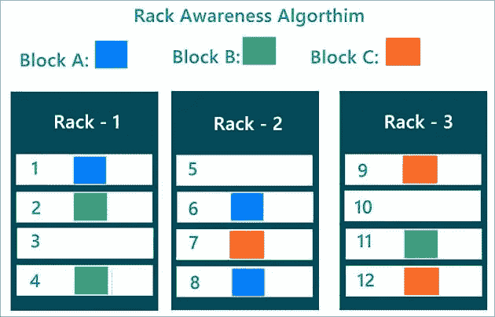
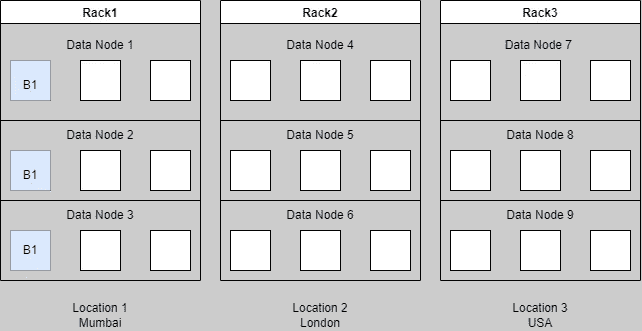
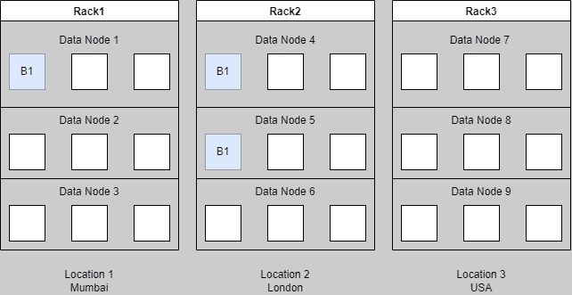

# 机架感知机制

> 原文：<https://blog.devgenius.io/rack-awareness-mechanism-1e75d05defac?source=collection_archive---------22----------------------->

希望！如果我能把我的东西放得这么有条理😁

我们正在通过 HDFS (Hadoop 分布式文件系统)进行⚓航行，我们已经了解了数据节点和名称节点以及如何处理它们的故障。在上一篇[文章](https://medium.com/@prikshitsingla78/handling-name-node-failures-fced6552b52d)中，我们学习了如何处理名称节点故障，以及如何使用辅助名称节点来恢复它。

现在，名称节点和数据节点是物理硬件机器，它们需要被放置在世界上的某个位置🌍地图。但我们不能把它们放在任何我们想放的地方，因为它们包含的数据对我们来说至关重要。我们需要系统地放置它们，它应该遵循一个结构。那么，今天让我们来了解我们应该如何安排它们，以及这个术语**机架感知机制**如何帮助我们实现这一点。

# 行李架

机架就像我们家里的鞋架，但我们将放置数据节点，而不是将鞋子放在这个机架中。从技术上讲，机架是指放置在不同地理位置的一组系统。不同的地理位置意味着世界上不同的位置。我们将更加详细地理解为什么我们需要在不同的位置存储数据。

# 复制管道

让我们看图表来了解机架。

因此，正如我们在图中看到的，孟买位置机架将数据块 1 存储在不同的数据节点中。这与我们学习数据节点故障时的情形相同，我们讨论了默认情况下为 3 的复制系数，正如您在这里看到的，3 个数据块存储在 3 个不同的数据节点中，但它们放在一个机架中。这是存储数据的正确方法吗？如果发洪水怎么办🌊或者其他自然灾害🌋发生在孟买，因此我们存储数据的地方已经无法访问。这将非常糟糕，因为我们的数据将会丢失。那么正确的方法是什么🙄。

这是正确的方法吗？我们已经防止了数据遭受自然灾害，但是将数据块转发到新位置需要大量的网络带宽，涉及更多的 I/O 操作，而在同一机架内转发数据块需要较少的网络带宽，涉及较少的 I/O 操作。因此，将每个副本放在不同的机架中并不是一个理想的解决方案，因为带宽会更大，需要更多的时间和更多的 I/O 操作。现在让我们看看正确的选择。

Uff 终于！😪

平衡的那个！

平衡的方法是将副本放在两个不同的机架中。一个副本在一个机架中，另外两个在不同的机架中，反之亦然。这将防止我们在同一位置存储数据，也将降低网络带宽，意味着更少的 I/O 操作。

我们终于了解了机架感知机制，现在让我们继续前进。

# 我们如何知道数据块是否损坏？

每个数据节点以固定的频率向名称节点发送块报告，指示是否有任何块被破坏。如果数据块被破坏，那么复制因素就会出现，在 Rack Algos 的帮助下，副本会被复制。

# 如何实现名称节点的高可用性？

当我们学习处理名称节点故障时，我们已经学习了共享位置，这是使您的名称节点更长时间可用的第一种方法。第二种方法是使用 QJM(定额杂志经理)。我不会在这里介绍 QJM，但是你仍然可以在这里阅读相关内容，也可以观看视频。

# 网关/边缘节点

每次我访问边缘/网关节点时，我都感觉像步入了幻想🦄

我们登录到 Hadoop 集群中的网关/边缘节点。它为您提供了一个与 Hadoop 集群对话的接口。这是一台完全独立的机器，其配置方式使得它可以连接到 Hadoop 集群。如果您的公司需要 Hadoop 集群。他们会给你访问边缘节点的权限。他们将为您提供边缘节点的 IP 地址，您需要使用公司 Hadoop 管理员提供的正确密码和用户名登录。

我们对机架感知机制和边缘节点的讨论到此结束。我们已经完成了基本的理论知识，接下来是我们开始行动的时候了，首先让我们在系统上安装 Hadoop，然后开始动手操作。

是时候采取一些行动了，请继续关注🔥🔥

**干杯🤗读者们，如果你们已经走了这么远..**

**让我们暂时结束这篇博客吧！**

**谢谢！为了阅读。**

如果你喜欢这个博客，请鼓掌回应👏

**跟随..☺️** [**我**](https://medium.com/@prikshitsingla78) **更多这样有见地的 articles✍️**

请在评论中分享你的想法，并请分享对需要改进的部分的反馈，以便我下次改进。

祝大家有美好的一天！