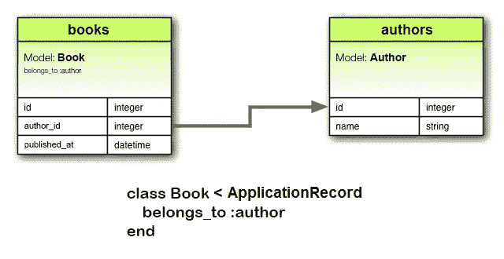
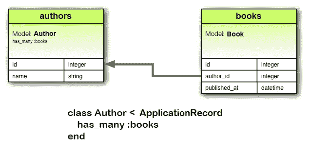
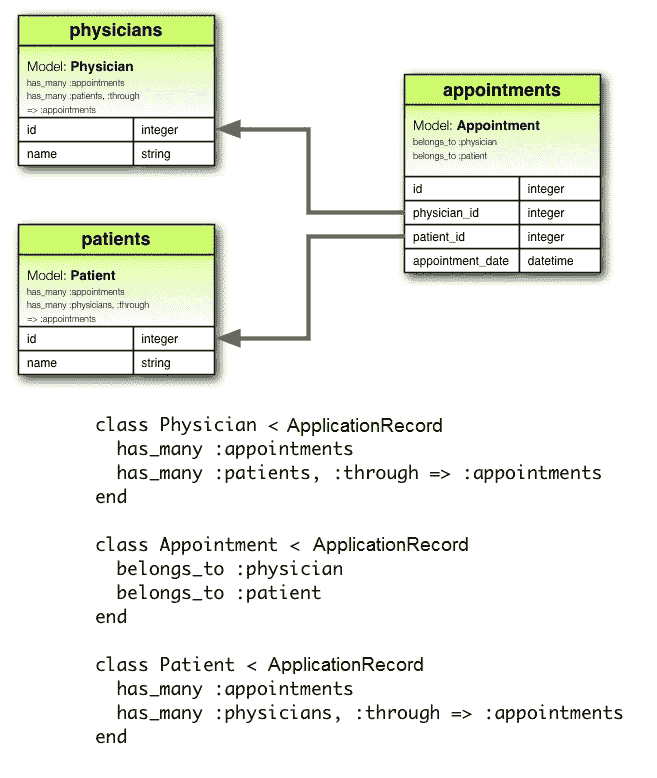

# Rails 关联和表格

> 原文：<https://blog.devgenius.io/rails-associations-tables-c9ec2f77a167?source=collection_archive---------16----------------------->

有不同类型的表，根据您希望它们之间的关系，您需要相应地配置表。我将讨论的关系类型有:属于、拥有和拥有许多:通过。

对于**隶属于**关联；我们希望在它所属的表中有一个外键(如上图所示)。以区分您是否需要模型的 belongs_to 关系；您首先想知道这个表是否需要一个**外键**(上面例子中的 author_id)。确定它所属的类是单数，因为我们选择的模型只能属于一个单数模型。如果我们要使用它，我们会这样做:

**book1****= book . find(1)**<——这将把变量 post 提交给具有该 id 号的图书。现在，如果我们假设已经创建了一本书，其 author_id 为 3。

这将返回 id 为 3 的 author 对象及其所有信息。如果我们想说得更具体，我们可以加上。例中作者后的“姓名”只是获取姓名。或者使用列的特定名称来获取相应的数据。

**book1.author.name**

**book1 . author . id**<——将返回作者的 id。在这种情况下将是 3。

现在另一边将是 has_many 协会。在这个例子中，一个作者能够出版多本书。在编写关联时，确保对象是复数(如上所示)。让我们假设我们使用相同的例子作为属于。现在，我们想用这样的话来称呼这个协会:

**author 3 = author . find _ by(id:3)**

**author 3 . books**<——这将带来一个与这个特定作者相关联的对象数组。如果您正在测试这个，并且得到一个空数组([])，这很可能意味着还没有任何与该作者相关联的书籍。

如果我们想要书名，我们不能用 T21，除非我们明确想要哪本书的书名。

**author 3 . books . first . title<-**这将调用该作者的图书数组中第一本书的标题。

现在对于 has_many :through 我们将使用上面这个例子。这个关联使用一个 joiner 表(Appointment)来连接其他表(内科医生和病人)。进行关联时，始终将 **Joiner 模型放在第一位(不需要“=>”)**。如您所见，医生和患者表没有外键。但是我们有一个带有外键的约会表。这将是我们用来在医生和病人之间建立关系的方式。为了使用它，我们想用一个类似这样的东西来调用它。

让我们假设我们使用。为两者找到(1)。这两个都是 id 为 1 的对象。

**appointment = appointment . create(patient _ id:1，physician_id: 1，appointment _ date:12/12/2020)**<——这样我们就创建了另外两个对象之间的关系。既然我们有关系，我们就有能力给对方打电话。

**patient 1 . physicians**<——这将返回与患者预约相关的所有医生对象的数组；同样的方法也可以用在 physician1 上来寻找一系列的病人。如果你得到一个空数组，这可能意味着还没有创建关系。

**patient 1 . appointments**<——这将带来一个与该变量对应的约会数组。

**patient 1 . appointments . last . appointment _ date**<-将获得该相应预约的预约日期。

**patient1 . appointments . first . physician**<——这将调用 physician 对象(而不是数组)，该对象属于 patient 1 的约会数组中的第一个约会。

需要记住的重要一点是，约会数组将依赖于约会的创建时间。

链接到更多表格和关联:[https://guides.rubyonrails.org/association_basics.html](https://guides.rubyonrails.org/association_basics.html)