# 随机化需要数字和正确的模型规格。

> 原文：<https://blog.devgenius.io/randomization-needs-numbers-bb4c85faaebe?source=collection_archive---------18----------------------->

他的文章不是关于什么是随机或者不是随机。这只是一个展示和讲述随机化的局限性，以及为什么随机化实际上是一个大数字游戏。在我攻读博士期间，我(与人合作)发表了大约七篇关于癌症领域随机对照试验质量的文章。之后，我给动物科学行业的 75 多名博士讲授了 5 年多的[实验设计](https://medium.com/@marc.jacobs012/general-introduction-to-design-of-experiments-in-animal-science-using-sas-for-codes-fe1c5272b37a)。尽管随机化是医学领域的灵丹妙药，但动物科学早已通过[阻断](https://medium.com/@marc.jacobs012/building-and-optimizing-randomized-complete-block-designs-using-sas-c973d127d862)(在医学界称为分层随机化)的艺术扩大了随机化。原因是由于农场的限制，试验的规模通常很小。毕竟，随机化是一个大数字游戏。

今天，我想通过 R 中的模拟向你展示如果你不能得到使随机化起作用所需要的数字会发生什么，以及为什么期望随机化不能解决你所有的问题也许是最好的。因为，毕竟，随机化是为了在对照组和治疗组中平均分布已知和未知的混杂因素，没有人知道他/她不知道什么。

或者，引用威廉·布里格斯在他的书《不确定性》中的话:

> *“随机性不是原因。机会也不是。像“偶然可以解释”、“随机变化”、“差异是随机的”、“不太可能是由于偶然”、“由于偶然”、“抽样误差”等等这样的说法总是错误的。生物学中的突变被说成是“随机的”；量子事件被称为“随机”；变量是“随机”的。统计学的整个理论都是建立在一个错误的观念上，即机遇是原因。正如我们将要看到的那样，这一理论已经导致了许多不幸。*

首先，我将证明一个简单的是一个固有的偏离“真实均值”或“总体均值”。因此，在这些昂贵的随机对照试验中进行的所有工作都具有有限的外部有效性，并且需要重复。这就是为什么[元分析](https://pubmed.ncbi.nlm.nih.gov/24129668/#:~:text=The%20main%20analysis%20showed%20that,the%20first%20year%20after%20surgery.)如此重要。

```
require(tidyverse
set.seed(11223)
x<-rnorm(1000,100,10)
density(x)
plot(density(x),lwd=3)
head(x)
df=data.frame(x)
x2<-df%>%sample_frac(0.05)
par(new=TRUE)
lines(density(x2$x), add=T, col="red", lty=2)
x3<-df%>%sample_frac(0.10)
par(new=TRUE)
lines(density(x3$x), add=T, col="blue", lty=2)
x4<-df%>%sample_frac(0.10)
par(new=TRUE)
lines(density(x4$x), add=T, col="green", lty=2)
x5<-df%>%sample_frac(0.10)
par(new=TRUE)
lines(density(x5$x), add=T, col="orange", lty=2)
```

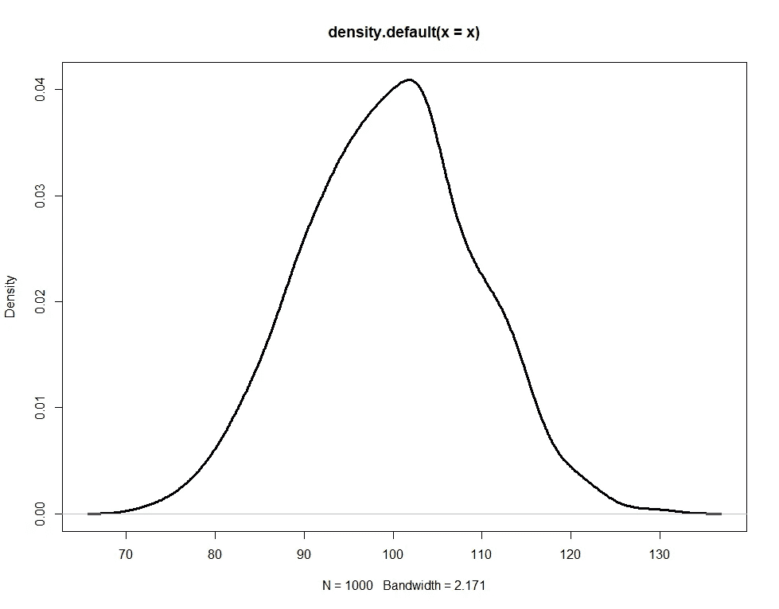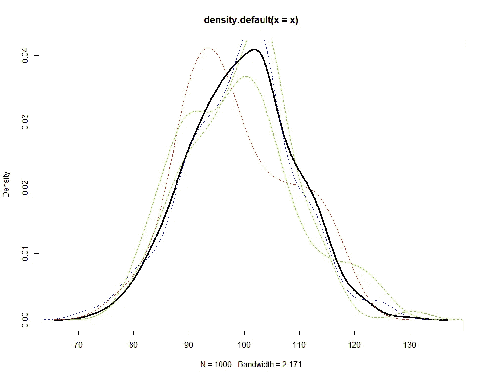

不难看出，每个样本(我从原始观察结果中提取了 10%的部分)最多只能模拟总体，并且可能会严重偏离总体。这还不错。其实应该是意料之中的。

你们大多数人都知道从分布中抽取样本的把戏，但我不确定有多少人知道从样本中抽取总体的把戏。也叫[自举](https://en.wikipedia.org/wiki/Bootstrapping_(statistics))。bootstrapping 所做的是通过替换对样本进行重新采样，以逼近假设样本中的总体。让我展示给你看。

```
my.bootstrap <- numeric(10
for(i in 1:length(my.bootstrap)) {
  my.bootstrap[i] <- mean(sample(x2$x, replace=TRUE))
}
quantile(my.bootstrap,0.025)
quantile(my.bootstrap,0.975)
hist(x, freq=FALSE, ylim=c(0,0.06), breaks=48, col="white")
abline(v=mean(x), lty=1, lwd=2, col="blue")
abline(v=mean(my.bootstrap), lty=1, lwd=2, col="red")
abline(v=quantile(my.bootstrap,0.975), lty=2, lwd=1, col="red")
abline(v=quantile(my.bootstrap,0.025), lty=2, lwd=1, col="red")
```

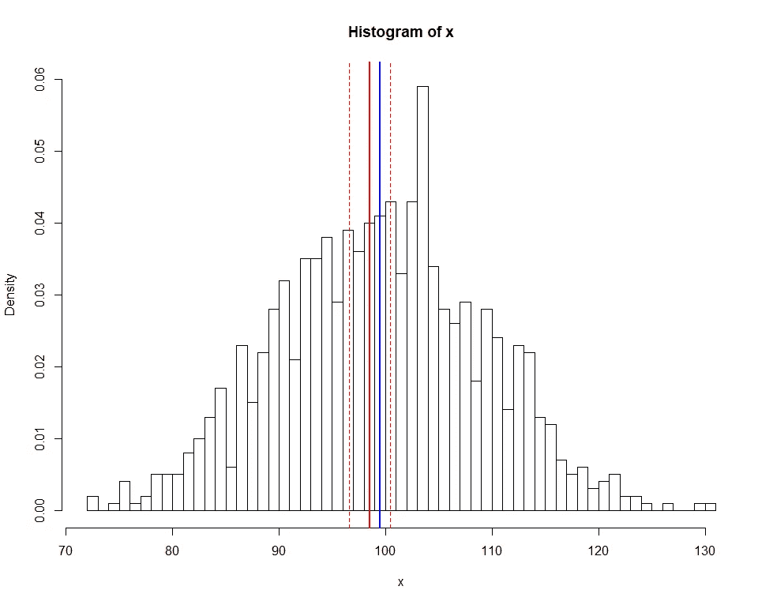

它并不完美，但自举置信限(红色虚线)包含了理论总体均值(1000)，即使模拟总体均值并不完全是 1000。因此，可以说一个小样本，比如 100 个大的观察值，就足以通过 bootstrapping 逼近未知总体。

然而，我已经提到过抽取样本(以及随机化)是一个很大的数字游戏，上面的例子抽取了一个 100 次观察的样本，并重复这个过程 5000 次。如果我把所有的取样缩小很多，会发生什么？比如说，从总体中抽取 5%的部分(50 次观察)和 10 次重采样？这意味着，我将重做十次试验！没有多少人能重做一次试验。

```
my.bootstrap <- numeric(10
for(i in 1:length(my.bootstrap)) {
  my.bootstrap[i] <- mean(sample(x2$x, replace=TRUE))
}
quantile(my.bootstrap,0.025)
quantile(my.bootstrap,0.975)
hist(x, freq=FALSE, ylim=c(0,0.06), breaks=48, col="white")
abline(v=mean(x), lty=1, lwd=2, col="blue")
abline(v=mean(my.bootstrap), lty=1, lwd=2, col="red")
abline(v=quantile(my.bootstrap,0.975), lty=2, lwd=1, col="red")
abline(v=quantile(my.bootstrap,0.025), lty=2, lwd=1, col="red")
```

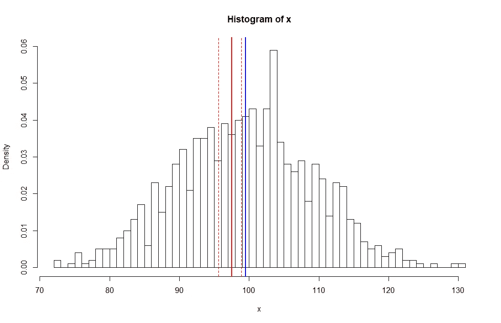

这一次，自举置信区间甚至不包含总体均值，并且自举均值非常接近。这是意料之中的，因为抽样是一个大数字游戏。例如，要让蓝线达到 1000，我们可能需要创建一个 10k 或 100k 的大数据库。

现在，让我们从单样本例子转移到双样本例子。群体之间的差异。

```
set.seed(11223)
sample1 <- data.frame(sample = 'first sample', values = rnorm(1000,56,5))
sample2 <- data.frame(sample = 'second sample', values = rnorm(1000,50,5))
samples <- rbind(sample1,sample2)

g1<-ggplot(samples,
       aes(x = values, col = sample, fill = sample, group = sample)) + 
  geom_density(alpha=0.2) + theme_bw() + theme(legend.position = "none")

samples2<-as.data.frame(cbind(sample1$values,sample2$values, sample1$values-sample2$values))

g2<-ggplot(samples2,
           aes(x=V3)) + 
  geom_density() +
  geom_vline(xintercept=mean(samples2$V3), col="red", lty=2)+
  theme_bw()

require(viridis)
g3<-ggplot(samples2,
       aes(x = V1, y=V2, col=V3)) + 
  geom_point(size=5, alpha=0.8) +
  scale_color_gradient2(low = "red", mid = "darkblue", high = "red", 
                        midpoint = mean(samples2$V3), guide = FALSE)+
  theme(legend.position = "none")+
  theme_bw()

require(grid)
require(gridExtra)
grid.arrange(g1,g2,g3,nrow=3)
```

我要求 R 做的是创建两个大小相等的组，都来自正态分布，但没有任何联系。因此，比较这些组将显示大约 6 的平均差异，但是这不是因为任何事情。下图显示了两组的密度、组间差异的密度以及显示差异的散点图。差异的云形揭示了除了“随机性”之外，没有潜在的机制。

我相信威廉·布里格斯会说随机性只存在于模拟中，我不敢不同意。

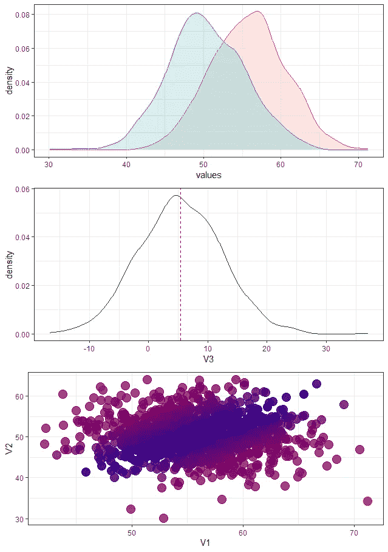

现在，我将对这个双样本示例执行与对单样本示例相同的操作——引导。让我从小处着手。

```
require(simpleboot)
require(boot)
bootstrapped <- two.boot(samples2$V1, 
                         samples2$V2, 
                         mean, 
                         R=10,
                         student = TRUE,
                         M=50)
hist(bootstrapped)
abline(v=bootstrapped$t0[1], lty=1, lwd=2, col="blue")
abline(v=mean(bootstrapped$t[,1]), lty=1, lwd=2, col="red")
abline(v=boot::boot.ci(bootstrapped, type="stud")$student[4:5], lty=2, lwd=1, col="red")
```

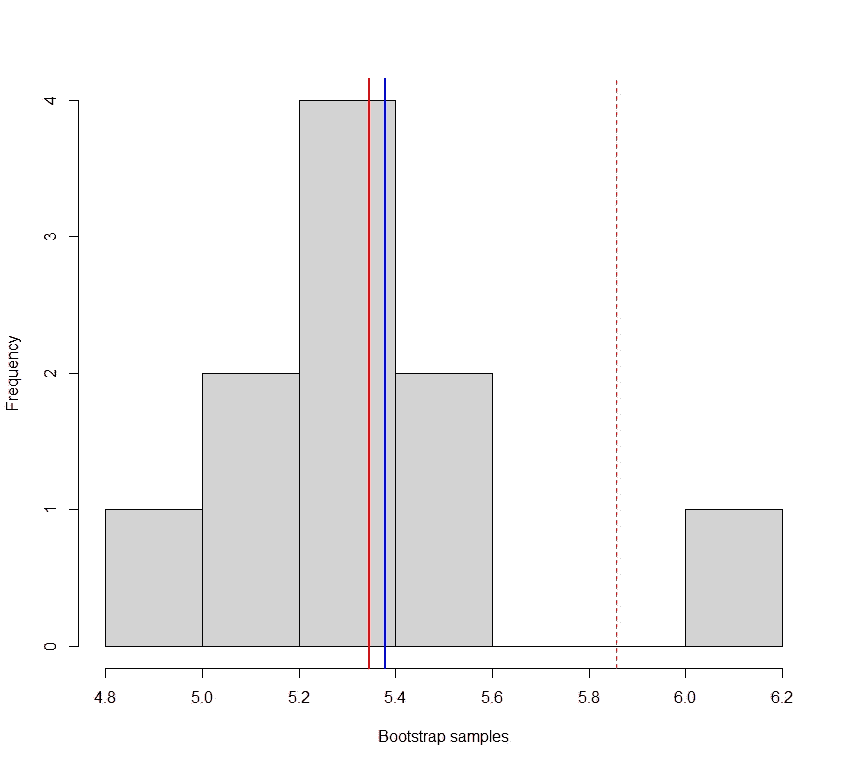

让我完成更大的。

```
bootstrapped <- two.boot(samples2$V1,
                         samples2$V2, 
                         mean, 
                         R=1000,
                         student = TRUE,
                         M=1000)
hist(bootstrapped)
abline(v=bootstrapped$t0[1], lty=1, lwd=2, col="blue")
abline(v=mean(bootstrapped$t[,1]), lty=1, lwd=2, col="red")
abline(v=boot::boot.ci(bootstrapped, type="stud")$student[4:5], lty=2, lwd=1, col="red")
```

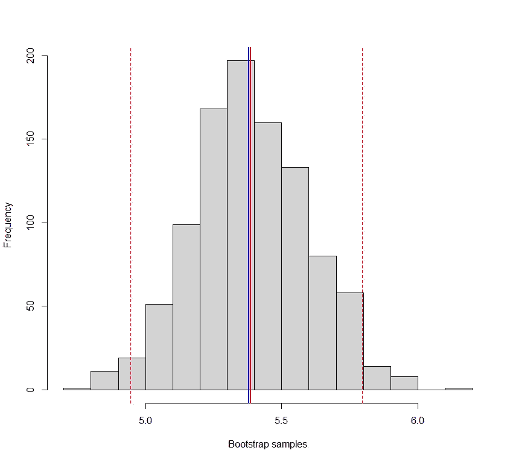

不要太乐观，因为自举平均值非常接近总体平均值。自举置信区间相当宽，这意味着你进行的任何试验都可能偏离总体均值那么远。没有人能够将一项试验重复 1000 次，或者找到 1000 份极其相似的试验出版物。你得到的数据越多，你得到的方差就越大。

现在，让我们让它变得更有趣，并走向回归，建立一个没有实际关系的线性模型。然后，我会添加一个简单的主效果，通过添加多个交互效果来扩展。这里的目标是看看当模型包含或不包含所有必要的效应时，bootstrapping 是否会从样本中提取总体效应。

```
require(car)
set.seed(11223)

n <- 1000
x <- rnorm(n)
y <- x + rnorm(n)

population.data <- as.data.frame(cbind(x, y))

m1 <- lm(y ~ x, population.data)
betahat.boot <- Boot(m1, R=199) 
summary(betahat.boot)  # default summary
confint(betahat.boot)
hist(betahat.boot)
```

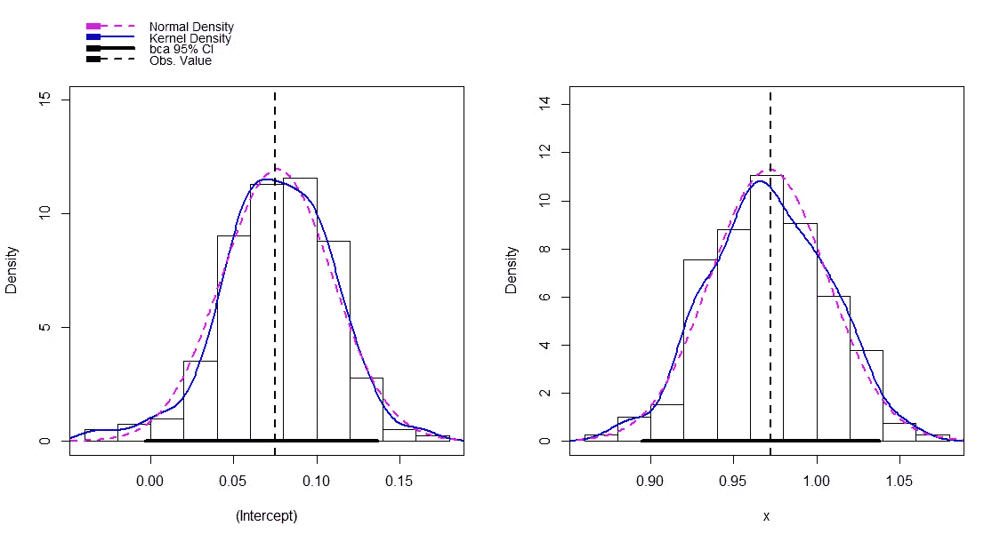

```
n <- 100
x <- rnorm(n)
y <- 2.5*x + rnorm(n)
population.data <- as.data.frame(cbind(x, y))
m1 <- lm(y ~ x, population.data)
betahat.boot <- Boot(m1, R=199) # 199 bootstrap samples--too small to be useful
hist(betahat.boot)
```

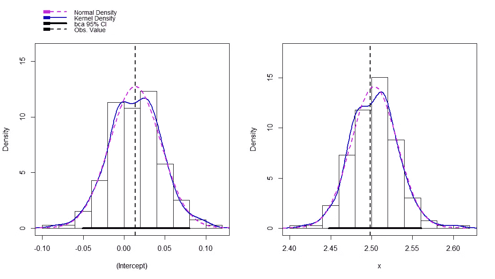

```
require(jtools)
require(interactions)
n <- 1000
a <- rnorm(n)
b <- rnorm(n)
c <- rnorm(n)
d <- rnorm(n)
e <- rnorm(n)
y <- 2.5*a + 
  1.3*b+
  0.7*c+
  2.1*d+
  1.9*e+
  -0.5*a*b+
  -0.9*a*c+
  1.1*c*d+
  0.8*a*d*c+
  rnorm(n)
population.data <- as.data.frame(cbind(a,b,c,d,e,y))
m0 <- lm(y ~ a+b+c+d+e+
           a:b+
           a:c+
           a:d+
           a:e+
           b:c+
           b:d+
           b:e+
           c:d+
           c:e+
           d:e+
           a:c:b, population.data)
m1 <- lm(y ~ a+b+c, population.data)
i0<-interact_plot(m0, pred = a, modx = c)
i1<-interact_plot(m1, pred = a, modx = c)
grid.arrange(i0,i1, ncol=2)
plot_summs(m0, m1, scale = TRUE,plot.distributions = TRUE)
```

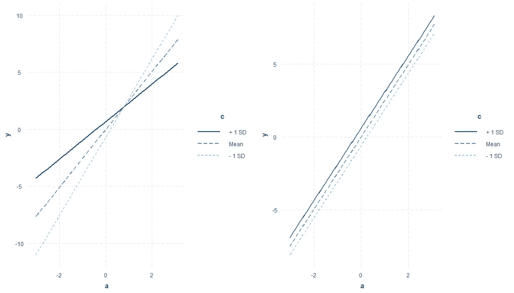

上图显示了包含主要效应和一阶相互作用的模型与仅包含部分主要效应的模型之间的相互作用图。这类似于分析师不知道附加效应起作用的情况。这个例子可能有点极端，但是人们不知道他们不知道的事情，这就是模拟变得方便的地方。上图清楚地显示了第二个模型( *m1* )没有捕捉到现有的交互。

比较来自 *m0* 和 *m1* 模型的系数也显示了一些主要效应的估计发生了什么。

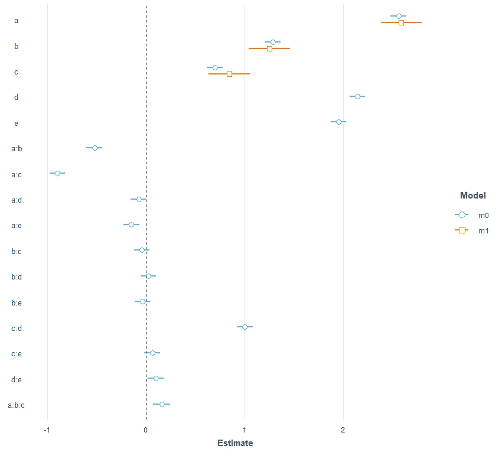

让我们看看自举是否能帮助我们。首先，让我们再次看看稀疏模型的系数。这些结果的真正问题是，你不知道你至少错过了两个主要效果( *d* 和 *e* )，以及许多交互作用。

```
plot_summs(m1,omit.coefs =NULL,
           scale = TRUE,
           plot.distributions = TRUE, 
           model.names = c("m1"))
require(sjPlot)
require(sjmisc)
plot_model(m1, show.values = TRUE, value.offset = .3)+theme_bw()
```

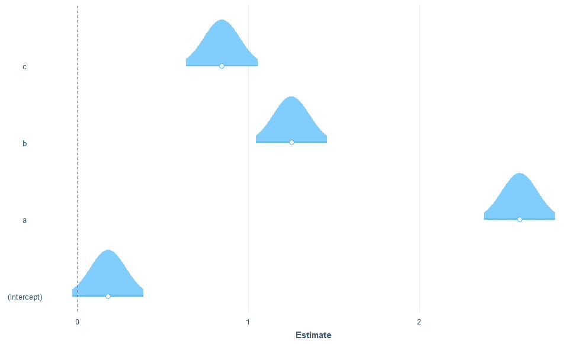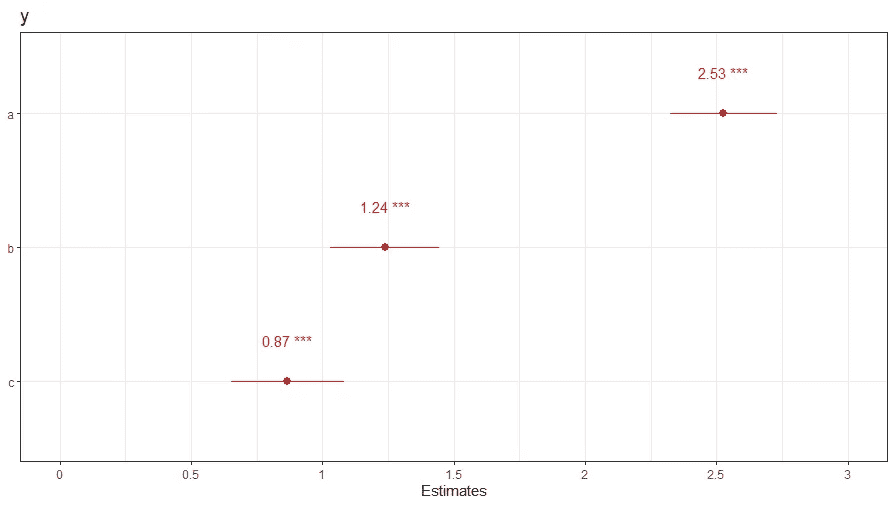

那么，如果我们对数据进行 bootstrap，我们会得到更接近总体效应的估计值吗？根据我下面看到的，我并不担心，因为自举置信区间似乎包含了总体的系数。

```
betahat.m1.boot <- car::Boot(m1, R=1000)
hist(betahat.m1.boot)
summary(betahat.m1.boot) 

Number of bootstrap replications R = 1000
            original    bootBias  bootSE bootMed
(Intercept)  0.10076 -0.00258513 0.11154 0.10175
a            2.52591  0.00011154 0.12425 2.52161  # 2.52 - 2.5 = 0.02
b            1.23634 -0.00140071 0.10736 1.23401  # 1.24 - 1.3 = 0.07
c            0.86689  0.00414945 0.11381 0.87044  # 0.87 - 0.7 = 0.17 --> due to missing interaction
```

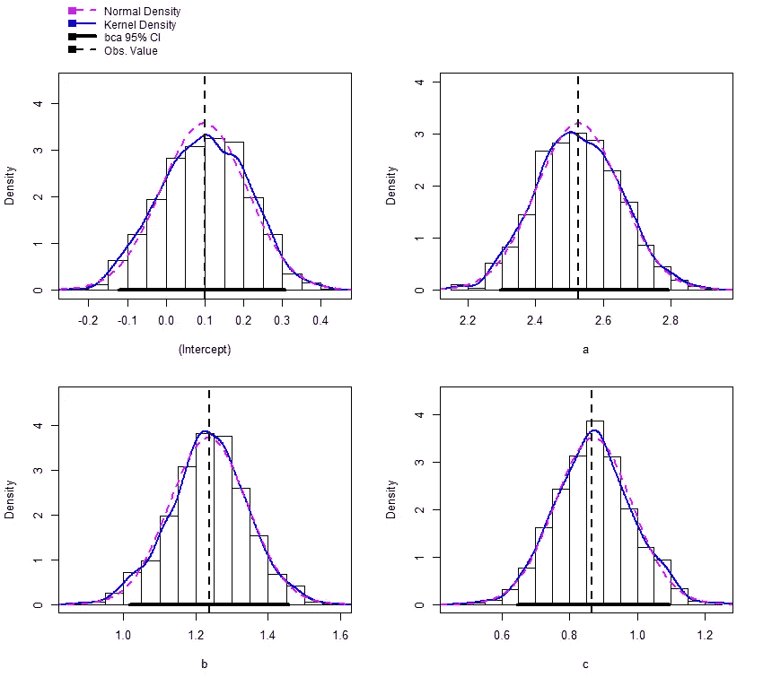

但是，我们忘记了真正要做的是，从原始的大数据库中提取一个微小的样本，然后观察它的表现。当然，自举的结果将模拟总体，因为我从这些原始观察中构建了 1000 个数据集。但是如果我只能取样 50 个呢？一次？

```
x2<-population.data%>%sample_frac(0.05)
m2 <- lm(y ~ a+b+c+d+e+
           a:b+
           a:c+
           a:d+
           a:e+
           b:c+
           b:d+
           b:e+
           c:d+
           c:e+
           d:e+
           a:c:b, x2)
plot_summs(m0, m2, scale = TRUE,model.names = c("m0", "m2"))
```

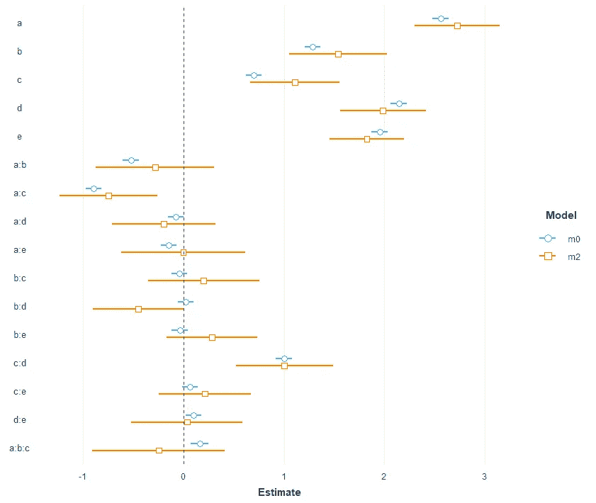

如果我没有包括所有我应该包括的重要变量呢？

```
m3 <- lm(y ~ a+b+c, x2
plot_summs(m0,m2,m3, scale = TRUE, model.names = c("m0", "m2","m3")))
```

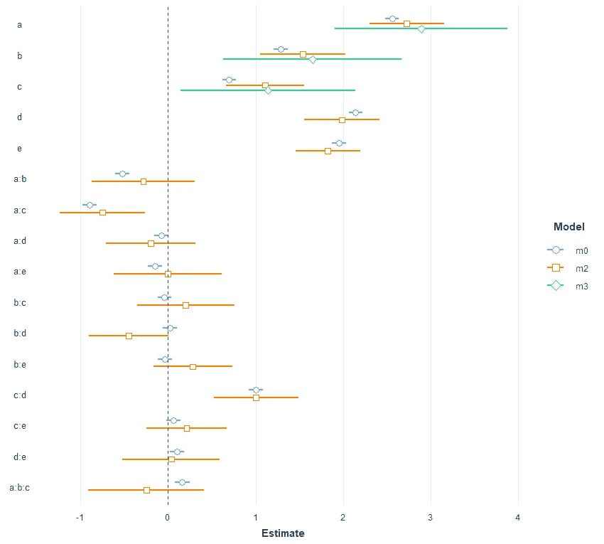

自举现在能帮我吗？正如你所看到的，它不能，就像随机化一样，引导也需要一个足够的基础来开始。

```
betahat.m2.boot <- car::Boot(m2, R=1000)
hist(betahat.m2.boot)
summary(betahat.m2.boot)

> summary(betahat.m2.boot)

Number of bootstrap replications R = 1000 
              original   bootBias  bootSE    bootMed
(Intercept)  0.2194352 -0.0140810 0.26017  0.2227485
a            2.4550501 -0.0191784 0.27917  2.4178270
b            1.3595962  0.0400222 0.27590  1.3863846
c            1.0580434  0.0542109 0.33912  1.1051985

betahat.m3.boot <- car::Boot(m3, R=1000) 
hist(betahat.m3.boot)
summary(betahat.m3.boot)

> summary(betahat.m3.boot)

Number of bootstrap replications R = 1000 
            original   bootBias  bootSE bootMed
(Intercept)  0.90742 -0.0097986 0.52050 0.88945
a            2.72682  0.0229260 0.44768 2.74583
b            1.45078  0.0166067 0.45787 1.47188
c            1.30921 -0.0068593 0.51522 1.31287
```

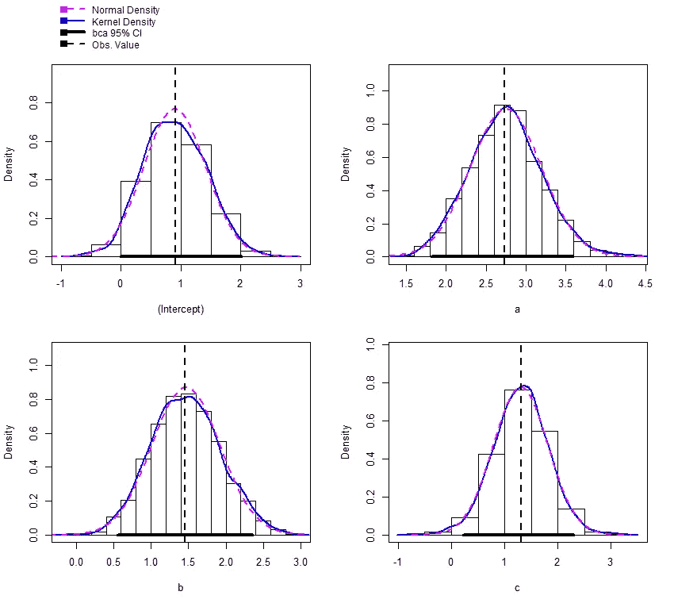

来自 *m3* 的直方图显示了足够好的曲线来产生正态分布的自举置信区间，但是偏差太大。然而，你永远不会知道，因为你没有在你的模型中包括所有相关的协变量。

或者以布里格斯[结束:](https://www.linkedin.com/posts/dr-marc-jacobs-885b1430_randomness-is-not-a-cause-neither-is-chance-activity-6846811236747788288-7rMM)

> 拿起一支铅笔，让它飞到半空中。发生了什么事？它掉了，因为什么？因为重力，我们说，一个我们都熟悉的原因。但是地球引力并不是唯一作用在铅笔上的力；只是最主要的一个。我们不认为铅笔掉落是“随机”的，因为我们知道原因的性质或本质，并推断出后果。我们需要更多地讨论是什么构成了因果与概率模型，但是一个站在田野中间抛硬币的人比一个掉了铅笔的人更倾向于概率思维。概率成为原因知识的替代品，它们本身并不成为原因。"