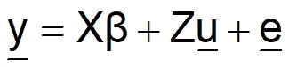
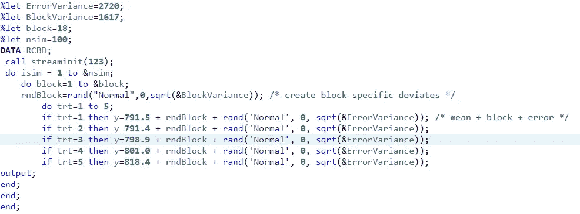
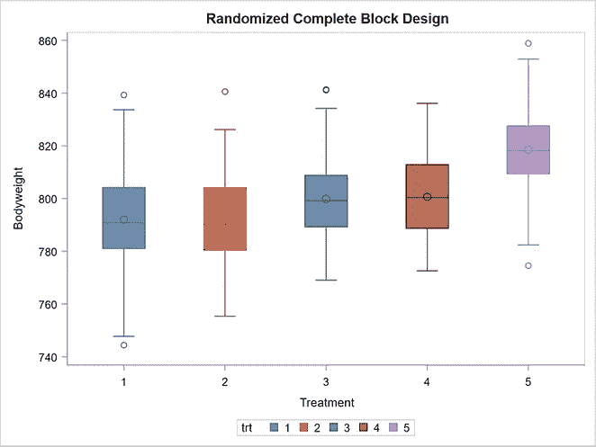
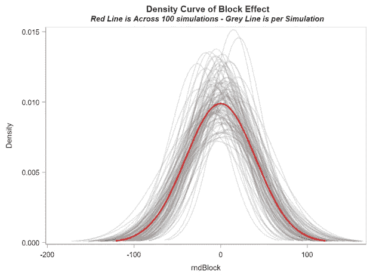
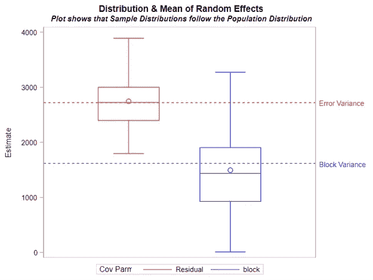
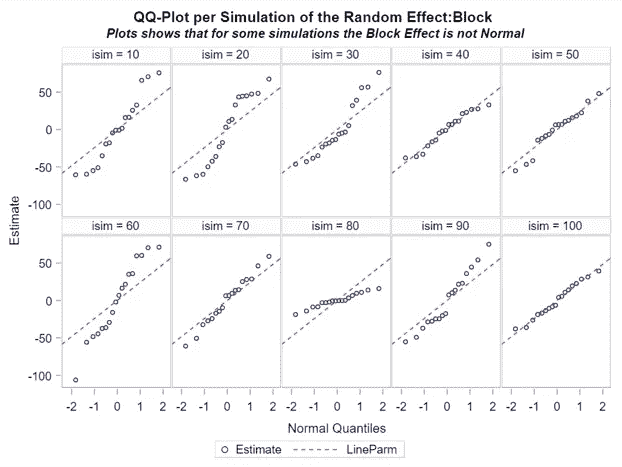
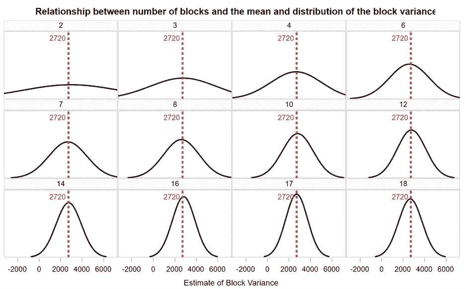
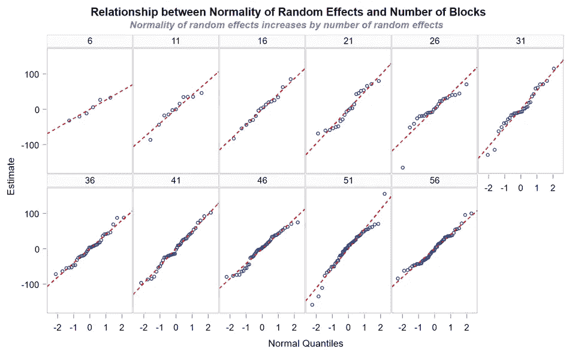
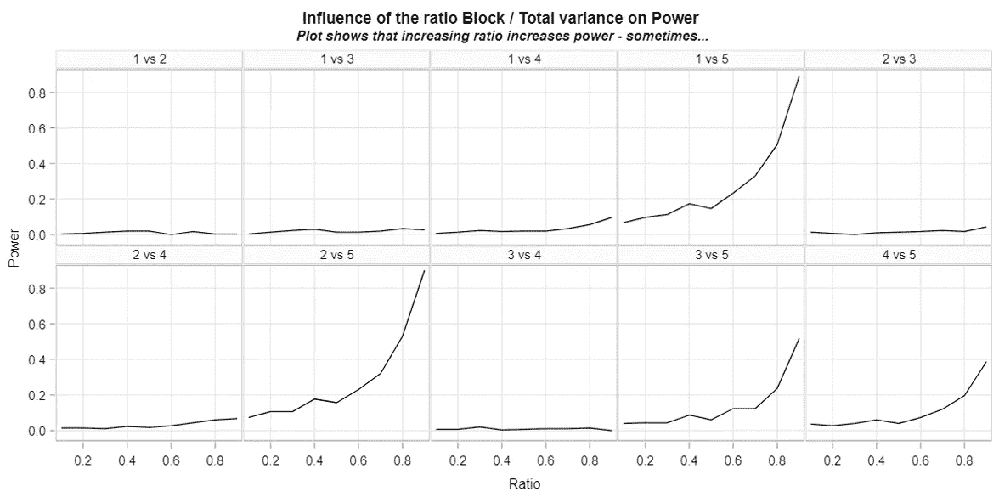
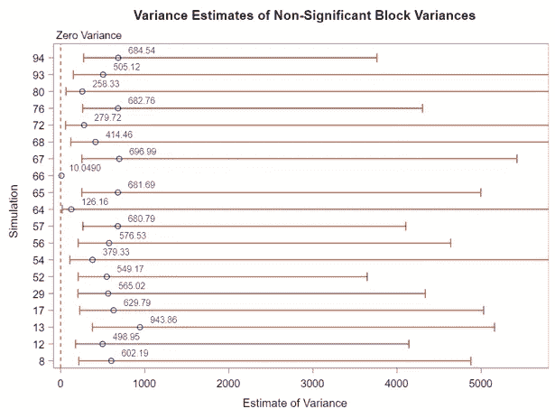

# 混合模型中的随机性

> 原文：<https://blog.devgenius.io/randomness-in-mixed-models-8b7affd8a7c4?source=collection_archive---------4----------------------->

所有的统计模型至少有一个系统部分和一个随机部分。在方差分析或广义线性模型(GLM)中，模型的系统部分称为**固定效应**，随机部分称为**误差***或**无法解释的方差**。这意味着数据集中的差异需要用模型中包含的因素来解释。其余的将自动进入模型的错误部分——垃圾箱。*

在混合模型中，有更多的自由来估计和解释差异。事实上，混合模型在处理方差方面是如此强大，以至于它们与某些实验设计纠缠在一起，例如**随机完全区组设计(RCBD)** 。这里，我们用随机效应扩展了系统和误差部分，随机效应是一个或多个变量，旨在解释和使用方差。在 RCBD，这就是区块效应。

> "在混合模型中，有更多的自由来估计和解释差异. "

在数学形式中，混合模型看起来像这样:

观察=固定效应+随机效应+误差

这里，β和值分别代表固定效应和随机效应的系数，它们分别属于各自的设计矩阵 X 和 z。这里需要注意的重要一点是，在混合模型中，任何预测的响应都可以通过增加(减去)模型的固定、随机和误差部分进行工程设计，从而进行反向工程设计。混合模型的参数是完全线性的。

现在，混合模型有专门的完整书籍，所以我们不会去那里，但不能强调的是模型的固定和随机部分是如何工作的，在模型内部。我会尽量避免使用术语，而是使用模拟。

> “这里需要注意的是，在混合模型中，任何预测的响应都可以通过增加(减少)模型的固定、随机和错误部分来设计，从而进行反向工程。”

首先，重要的是要认识到，在混合模型中，固定效应不是随机的，而随机效应和误差部分才是。我再重复一遍:随机效应和误差部分都是随机的。在统计理论中，这意味着两个部分都被认为是独立同分布的随机变量。在混合模型中，它们由正态分布表示。

> “在混合模型中，固定效应不是随机的，随机效应和误差部分才是。”

统计模型有办法通过模拟来实现，所以让我们模拟一个随机的完全区组设计。在 RCBD 中，检测信号的关键是通过将噪声置于我们可以解释的模型的随机部分来限制噪声，即随机效应。记住，一个混合模型的参数是线性的，并且以一种相加的方式工作，所以解释的方差越多，无法解释的方差就越少。但是，让我们从一个无法解释的方差多于可以解释的方差的情况开始。

在 SAS 中，代码如下所示，导致以下结果:

RCBD 设计是一种嵌套设计，由区块内的处理组成。每次治疗的预测值基于固定效应+随机效应+误差。随机效应+误差都服从正态分布。

从上面的图片来看，通过添加三个模拟组件并重复该过程来获得箱线图是有意义的:

1.  固定效应—791.5；791.4 ;798.9 ;801.0 或 818.4。
2.  随机效应-从正态分布(0，1617)获得的值。
3.  误差-从正态分布(0，2720)获得的值。

如果没有随机成分，箱线图就不是箱线图，而是一张包含水平线的图片，仅模拟固定效果。

现在，像这样的模拟的诀窍是，我们知道“真实”的值是什么——因为我们选择并实现了它们——但是模型不知道。因此，当我们根据混合模型公式设计箱线图时，混合模型将进行反向工程，以找到数据的固定效应、随机效应和误差部分。混合模型如何处理这个问题取决于所选择的算法(限制与最大似然)，从而改变固定和随机效应的估计，但这个问题远远超出了本文的主题。

> “如果没有随机成分，箱线图就不是箱线图，而是一张包含水平线的图片，仅模拟固定效果。”

值得注意但经常被遗忘的是，随机效应现在必须遵循与模型误差部分相同的假设 *i.i.d* 。

显示 100 个模拟随机区块效应的密度图。

从上图可以清楚地看出，随机效应遵循正态分布，因此存在于采样空间内。即使您知道随机效应分布的均值和方差，它对预测值的附加效应也存在于采样空间中。它不是固定的。

我们可以使用箱线图和 Q-Q 图来显示模型的随机效应和误差部分。

箱线图显示了混合模型的两个随机部分的变化。误差方差平均值比块方差平均值更接近近似值。这是因为误差方差更大(2720 vs 1617)。

每个模拟数据集的 Q-Q 图显示，尽管总体上遵循了 i.i.d .要求，但一些数据集显示出严重缺乏方差的正态假设。这只是概率结合模拟的一部分。

和往常一样，当有更多的数据可供估计时，对任何影响的估计都会变得更加清晰。我们可以通过增加块的数量并绘制随机效应的平均值和分布图——这里是块方差——很容易地证明这一点。

我的随机完全区组设计中的区组越多，我就越能接近区组效应的“真实”方差。和往常一样，方差均值的近似值需要的样本比其分布少。人们可以很容易地将其与估计固定效应所需的样本量进行比较。

块越多，随机效应(此处为块方差)越符合正态分布，如 Q-Q 图所示。

最后，但同样重要的是随机效应和模型误差部分之间的关系。每个混合模型的总方差是一个加法练习，在这个练习中，您将所有方差(解释的和未解释的)相加，以估计总方差。现在，你解释的方差越多，噪音就越少，因为总数不会改变。因此，如果存在差异——考虑到我们可能存在的固定效应——当解释总方差比率较高时，混合模型会更容易发现差异。

大多数固定效应均值过于接近，无法保证任何“显著”差异，但是随着组/总方差比率的增加，比较处理 1、2 和 5 的功效肯定会增加。

对于那些认为估计随机效应或误差很容易的人，你需要再想想。尽管我们已经使用正态分布来模拟方差——在混合模型中它们被认为是正态分布的——但它们自然会趋于零。方差不能为负，但正态分布可以为您提供负值。因此，这就是为什么有些人喜欢用自然边界为零的伽马分布来模拟方差。

解释方差的估计毕竟不是那么确定。

总之，混合模型是解释方差和使用方差增加信噪比的极好模型。但是，他们确实有一些需要满足的要求。如果被遗忘，混合模型的估计可能比传统的线性模型更多。

在这篇文章中，我留下了许多未解决的问题。如果你有兴趣了解更多，请联系我们！