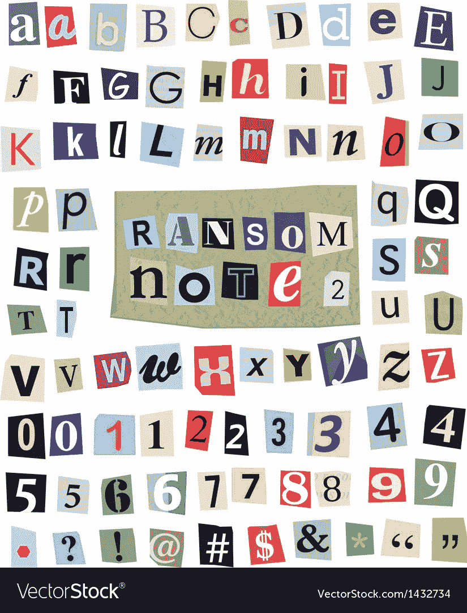
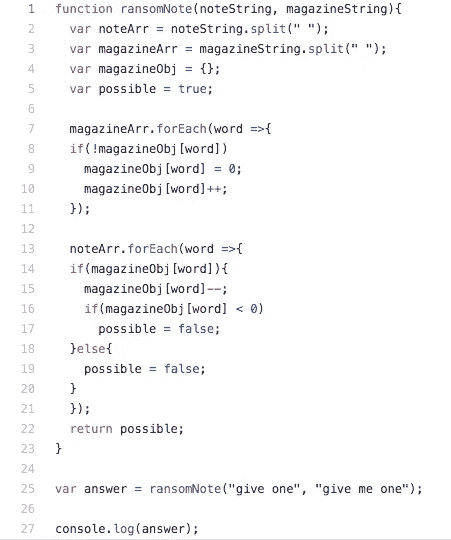

# 勒索信 JavaScript 中的哈希表算法

> 原文：<https://blog.devgenius.io/ransom-note-hash-table-algorithm-in-javascript-bf6171db87b9?source=collection_archive---------4----------------------->

哈希表的伟大之处在于，对于大多数操作，它们都具有令人垂涎的 O(1)时间复杂度。

换句话说，通过项的键定位项，然后更新值是非常容易的。不需要遍历整个数组，不需要执行二分搜索法(这很快消除了您必须搜索的内容，但您仍然必须搜索一大堆内容)，您只需通过键在散列中找到一个项目，然后“做您的爵士乐”。

查看这个伟大的资源来获得更多关于时间复杂性的信息:[https://www.bigocheatsheet.com/](https://www.bigocheatsheet.com/)

此外，我不能不提这个解决方案来自我们在 https://www.youtube.com/watch?v=kzka2GbVTuU[的朋友，所以如果你喜欢这种优雅的解决方案，一定要看看他的频道。(如果您在调试代码时遇到问题，他甚至会回答您的意见！！)](https://www.youtube.com/watch?v=kzka2GbVTuU)

所以首先要做的是:我们有两个长字符串，我们需要比较“note”字符串和“magazine”字符串中的条目，只有当可以从“magazine”构造一个注释时，才返回 true。是的，这是区分大小写的，所以必须准确。

下面是这些步骤以及我通过查看这些代码理解它们的方式:

1.  这个。JavaScript 中的 split()方法是将项目放入数组中进行比较的完美方法。
2.  我们创建了我们的 Hash“magazine obj”(只是一个普通的旧 JavaScript 对象或“POJO”作为一个智者，我的导师 Erik Kim 这样称呼它们。想你了，哥们)。
3.  “可能的”变量是我们将如何以布尔形式输出我们的解。
4.  接下来我们要做的是遍历我们的“杂志数组”,并将每个单词分配给对象中的一个键。
5.  这种解决方案的优雅也适用于空间复杂性。我们所要做的就是找出“如果”我们可以创建所述笔记，就是遍历单词的“笔记数组”并检查它们是否在 magazineObj 中。如果我们找到一个单词，我们用第 15 行“magazineObj[word]-”将它从对象中删除。我喜欢这实际上是做一些垃圾收集作为过程的一部分。
6.  如果我们的 magazineObj[word]开始输出负值(第 16 行)，那么我们知道注释中有在 magazineString 中找不到的单词，否则，我们输出“True”。

代码如下:

简单、优雅的哈希表解决方案

第一个“边缘格”，我注意到这个不占的是标点符号。如果我们在一个单词后面有一个逗号，我们仍然可以从技术上删除同一个单词，并创建一个勒索信。

我还遗漏了什么吗？我很想听听你对重构的想法。

编码快乐！