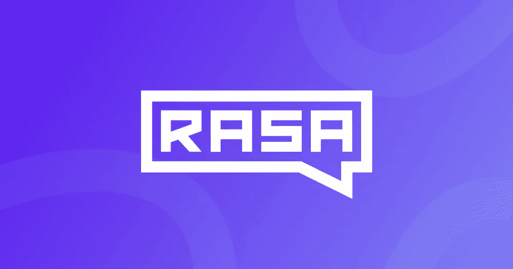
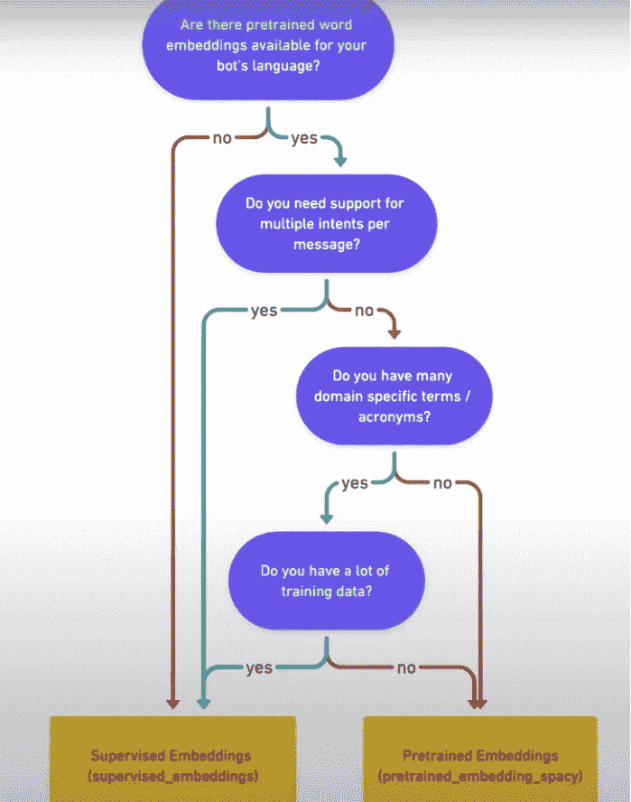
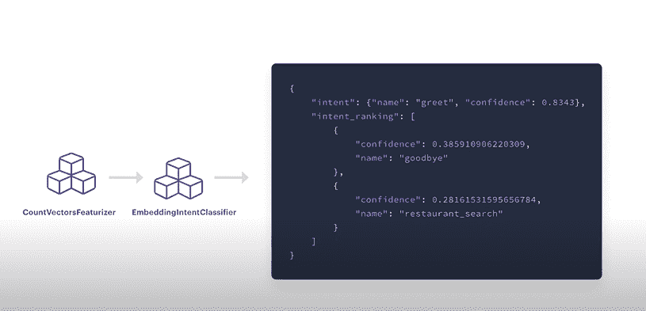
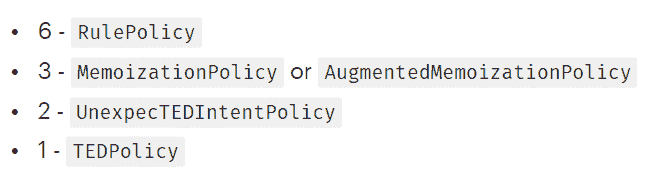

# RASA:开源对话式人工智能

> 原文：<https://blog.devgenius.io/rasa-the-open-source-conversational-ai-ab7a674e51d0?source=collection_archive---------3----------------------->

RASA 是一个**开源**机器学习框架，用于开发自动化的基于文本和语音的虚拟助手。

Rasa 开源是建立在 Tensorflow、spaCy 等较低级别的机器学习库之上的。它可以与预先训练好的模型一起使用，如伯特、拥抱脸变形金刚、GPT、斯帕西等，你还可以加入自定义模块，如拼写检查器和情感分析。

它提供自然语言处理，将用户的信息转化为机器可以理解的意图和实体，并通过考虑上下文来预测系统要执行的下一组动作。

**现在让我们试着一点一滴地理解 RASA 的工作方式:**

***意图*** *:表达意图的一组消息。意图的例子被用作助手的自然语言理解模型(NLU)的训练数据*

***响应*** *:包含多个响应，返回其中一个根据意图预测的响应。*

***动作*** *:动作是自定义响应，可用于进行 API 调用、存储提取的实体等等。*

***故事*** *:以结构化的方式表示用户与 AI 助手之间的对话，然后用于训练模型。*

***规则*** *:无论之前在对话中说了什么，对话的某一部分都应该遵循的一套规则。*

***实体:*** *助理在某个上下文中可能需要的信息。*

例如:如果一个用户在对话中说出了他的名字，助手应该能够提取出这个名字，并在整个对话中记住它，这样就能保持自然。这是通过训练命名实体识别模型来识别和提取实体来实现的。

# 情境人工智能助手

人工智能助手根据之前说过的话或其所处的情况(“上下文”)预测反应。

人工智能助手的主要工作是准确地回答用户的询问。Rasa Stack 通过自然语言理解组件 **Rasa NLU** 和对话管理组件 Rasa **核心来处理这些任务。**

NLU:它帮助我们的助手理解人类语言。它采用非结构化的人类语言，并提取意图和实体形式的结构化数据。

**对话管理组件(核心):**系统的大脑，它根据对话状态和上下文来决定助理应该如何响应。CORE 通过观察数据中的模式(对话 b/w 用户和 AI)进行学习，也称为**故事**。

在开发人工智能助手之前，开发人员需要从战略上考虑用户的类型，了解他们的用途以及他们可能与助手进行的对话。

如果我们没有这些数据，那么我们可以使用“*绿野仙踪*”的方法:像机器人一样与真实用户交谈，并记下他们正在进行的对话。

# RASA 的管道

管道定义了不同的组件，这些组件顺序地处理用户消息，并最终导致将用户消息分类成意图和提取实体

## 预训练嵌入(意图分类器 Sklearn):

该管道使用 SpaCy 管道，该管道加载预训练的语言模型，然后该模型用于将句子中的每个单词表示为单词嵌入。单词嵌入是单词的向量表示，这意味着用户消息中的每个单词都被转换成密集的数字向量。

**单词向量**捕捉单词的语义和句法方面，意味着相似的单词应该由相似的向量来表示。

## 使用预训练嵌入空间管道的优势:

*   语义和语法将提高我们的模型的性能，即使使用较小的训练数据。
*   更快的训练和迭代时间。

## 使用预训练嵌入空间管道的缺点:

*   仅限于具有预训练单词嵌入的语言。
*   预先训练的单词嵌入不覆盖特定的领域单词。

可以使用的另一种预先训练的训练模型是监督嵌入

## 监督嵌入:意图分类器张量流嵌入

监督模型通过使用我们提供的数据从零开始学习一切，而不是预先训练的模型。

## 使用监督嵌入的优势:

*   由于模型是在我们的数据上训练的，它包含我们的领域特定的单词，从而提供更高的准确性
*   允许我们用任何可以标记的语言来构建助手。
*   允许我们处理更高级的情况，如具有多种意图的消息。

用于决定管道的决策树

## **了解管道工作:**

**SpacyNLP:** 使用预先训练的单词嵌入。负责加载空间语言模型，并为后续步骤准备模型。

**Tokenizer** : Tokenizer 是模型中最重要的部分之一，因为它将用户消息分解成称为**令牌**的小块，以便 NLP 理解它们。它应该是管道配置中定义的第一个组件。

**例如:**

**WhitespaceTokenizer(监督模型的默认标记器)**:查找用户消息中的空白，并相应地断开消息。

**SpacyTokenizer(预训练车型)**

## **实体提取器:**

Rasa 提供了几个实体提取器供选择。其中一个是

**CRF(条件随机场)提取器:**它识别一个句子中的目标，并查找该目标前后的单词。CRF 的输出通常直接加到 NLP 的输出上。它应该放在管道配置文件中的标记化器之后。

***举例*** *:“柏林明天天气怎么样？”—->CRF—->实体:* ***日期*** *:明天，* ***地点*** *:柏林*

如果我们的训练数据很小，那么我们可以使用 SpacyEntityExtractor，这将利用它的特性，如 *PartOfSpeech* ，这将有助于在用户输入中定位实体。

一个专门设计的库，用于从用户输入中提取日期、数字、邮政编码、电子邮件和其他一些东西。

为了使我们的 NLU 模型能够对意图进行分类，我们需要一个特征器和一个实际的模型。

需要一个特征化器来从令牌中提取更深层次的特征，然后意图分类模型可以使用这些特征来学习潜在的模式并做出预测。

例如:如果我们没有使用预先训练的单词嵌入模型，那么**countvectorsfeaturezer**是一个很好的工具。它使用 sklearn 的 countVectorizer 创建了一个单词包。

在某些情况下，我们可以使用 **ngram(字符块)**代替**计数矢量器**，这将减少错误，但反过来会增加训练时间。

**简单定义**:特征化器将记号以及它们的一些属性转换成可以被 ML 算法使用的特征。

**意图分类模型**:如果我们没有使用预先训练好的模型，那么***embedded Intent classifier***是最好的选择。还建议将 CountVectorizer 与该组件一起使用。

**使用 EmbeddedIntentClassifier 的优势:**

*   如果我们使用我们的数据从头开始训练模型，那么它可以处理特定领域的词汇
*   它允许我们用任何可以标记的语言来构建助手。
*   处理高级案例，如具有多种意图的消息。

如果我们使用预先训练的单词嵌入，那么建议使用 **SklearnIntent 分类器。**它定义了一个模型支持向量机，使用特征器提取的特征和那些预训练的单词嵌入来学习底层模型并进行预测。

**训练数据中的类别不平衡**:与其他相比，一些意向可能有大量的样本作为训练数据。在 ML 中，我们称之为类不平衡，这可能会影响模型，使它们表现不佳。为了避免这种情况，你应该确保所有的故事路径都有大致相等的故事数量，这样就不会出现不平衡。否则可能会导致不一致或不正确的响应。模型可能会变得过拟合。

*标点符号，逗号，！甚至表情符号也不被提取为标记，因此不被用作训练数据。*

意图分类和实体提取**取决于任务**。在 NameEntityRecognition 模型中，**默认情况下，标记将区分大小写**。但是这可以通过修改模型的参数来改变。

创建类似的意图会使 NLP 的训练数据变得混乱，并且会对结果产生不良影响。相反，我们可以通过提供更多相似的例子来平衡意图

# 对话管理政策

策略是决定下一步做什么的一个非常重要的组成部分。有两个非常重要的超参数:

**Max_history** :控制模型查看多少对话历史，以决定下一步采取哪个动作。

如果用户输入了超出范围的内容，那么我们可以得到一个响应，在连续多次得到该响应后，该响应将解释它的功能。

**数据扩充**:为了更好地训练模型，从现有故事中创建大量新故事。它们可以通过以下方式进行操作

rasa train–增强 20:这个命令将从现有的故事中创建 200 个故事。

如果我们已经有足够的数据，那么我们不需要使用它们，因为这会增加时间。设置--增强 0 来禁用它们。

**记忆策略:**它模仿它被训练的故事，并试图将用户输入与该故事相匹配。如果成功，则它响应该故事的相应响应，否则不响应。

**映射策略:**如果我们希望我们的机器人每次选择一个意图时都用一个特定的文本来响应，而不管上下文，那么我们将使用这个策略。

用于实现 add trigger: <action_name>在 domain.yml 文件中，在 intents 部分缩进，在 config.yml 中添加 name:MappingPolicy</action_name>

**Keras 策略**:在 Python 深度学习库中实现的神经网络，名为 Keras。它通过考虑各种细节来预测下一个动作，如先前的动作、提取的意图和实体以及槽。

它结合了 ML 的能力和对话管理，轻松处理困难的情况。依赖 **RNN 建筑(LSTM)**

**嵌入策略** ( **TEDP** ):多回合对话造型。使用 Transformer 学习模式并进行预测。更好地处理意外输入。仅受增强因素影响的策略

**表单策略**:预测表单动作，使我们的助手能够根据用户输入填写表单。如果需要收集大量信息，那么槽将是低效的。

**回退策略:**如果用户输入了令人困惑的东西或者不是我们的助手设计要做的事情，那么回退策略通过用默认消息进行响应来处理这种情况。

**TwoStageFallback 策略:**与上一个具有相同的功能。不同之处在于，它不是立即运行 fall_back 操作，而是首先得到用户的肯定。

你是指这个吗？如果是，那么对话继续。如果没有，机器人将要求用户重新措辞的消息。如果它理解了消息，那么很好，否则它再次建议一个意图，如果用户否认它，那么回退被触发。

## **政策优先级**

按优先顺序排列的政策

这是关于 RASA 框架内部工作的概述，以及它为了成为更好的对话式人工智能而利用的各种机器学习概念。