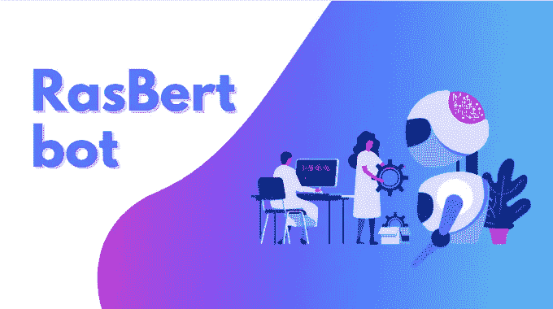
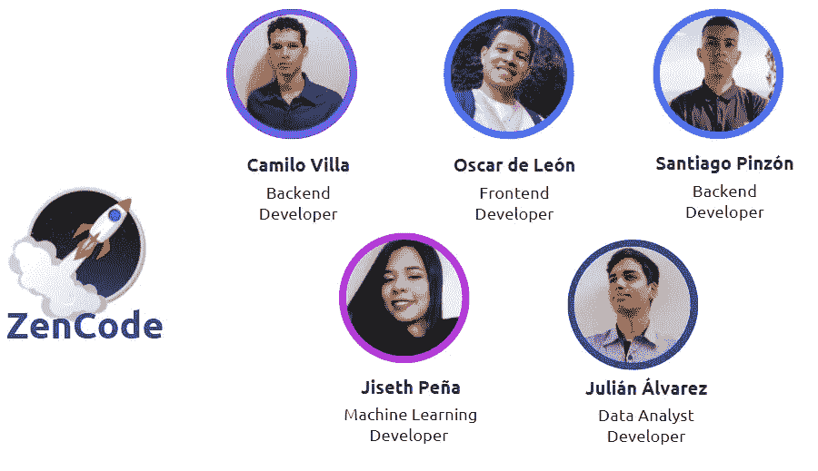
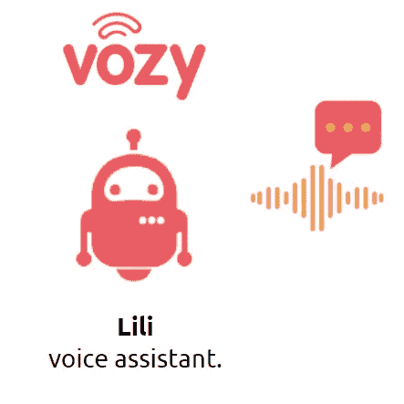
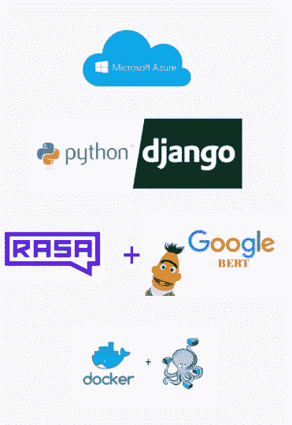
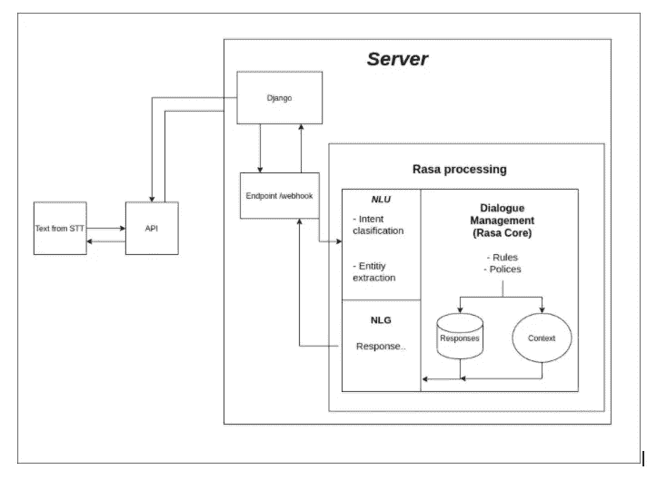

# Rasbert-bot:一个改进虚拟辅助的 API

> 原文：<https://blog.devgenius.io/rasbert-bot-an-api-to-improve-virtual-assistance-fc2040e96eaa?source=collection_archive---------3----------------------->

[拉斯伯特-机器人(rasbert-bot.me)](https://rasbert-bot.me/)

嘿！在这篇博客中，我将与你分享我的经历以及与 Rasbert-bot 开发相关的一切。首先，我将介绍给我们机会成为项目一部分的公司:

[Vozy](https://www.vozy.co/) 是一家为客户服务开发语音技术解决方案的公司。它的主要助手名为 Lili，可以识别用户的需求，然后提供准确的答案。

ZenCode 在 [Vozy](https://www.vozy.co/) 的指导下开发的作品

该公司受霍尔伯顿学校(Holberton School)邀请参加学生的期末项目，这是 ZenCode 诞生的地方，一个由五名开发人员组成的团队向该公司提出申请，并参与提交的项目。

# 关于 ZenCode🚀

ZenCode(名字灵感来自 Python 的 ZEN)

该团队由以下人员组成:

*   奥斯卡·德莱昂: [GitHub](https://github.com/serosc95) | [LinkedIn](https://www.linkedin.com/in/oscar-dleon/)
*   圣地亚哥·平松:[GitHub](https://github.com/santiagoPinzonD)|[LinkedIn](https://www.linkedin.com/in/santiagopinzond/)
*   吉赛思培尼亚:[GitHub](https://github.com/jisethpenarias)|[LinkedIn](https://www.linkedin.com/in/jisethpenarias/)
*   朱利安·Á·阿尔瓦雷斯:[GitHub](https://github.com/julianalvarezcaro)|[LinkedIn](https://www.linkedin.com/in/julianalvarezcaro/)
*   胡安·卡米洛·维拉:[GitHub](https://github.com/jcamilovillah)|[LinkedIn](https://www.linkedin.com/in/jcamilovillah/)

# 沉浸在机器学习概念中

该项目的动机是通过 API 为 Lili (Vozy 的虚拟助理)提供对用户消息意图的更好理解，该 API 将接收从 STT(语音到文本)生成的文本。为此，我们需要使用 NLP(自然语言处理)领域的机器学习模型。

我记得在项目开始时，我们不知道 NLP 是什么。我和我的同事以前没有从事过机器学习，我们甚至没有基本的概念，所以这个项目的一大挑战是深入主题，以便理解我们到底在做什么。

在这个过程中，陪同我们的 Vozy 团队的 [Cristina](https://www.linkedin.com/in/cristina-gomez-santamaria/) 和 [Daniel](https://www.linkedin.com/in/juan-daniel-lópez-castaño-401620164/) 提供了关于 NLP 概述、机器学习介绍以及监督和非监督数据分析的指导。这一辅导过程持续了大约两周。

# 项目开发

在了解了我们所面临的问题以及这一切背后的目的之后，是时候开始工作了。我们开始定义团队的角色，并分析我们将在项目开发中使用的技术。最后，我们的技术组合如下:

技术

首先，我们决定在 Microsoft Azure 上部署这个项目，因为我们对它有些熟悉，而且学校为我们提供了一个学生包，我们可以免费使用它。架构的其余部分定义起来非常简单，我们使用 Docker 和 Docker-Compose 来处理系统中所需的版本，例如，因为 Rasa 可以工作到 Python 的某个版本。为了开发 API，我们使用 Django，因为它比 Flask 等其他框架更健壮。

## 罗砂

现在，项目的主题是“Rasa 与 BERT 的整合”。Rasa 是一个开源的机器学习框架，用于基于文本和语音的自动对话。它理解消息，进行对话，连接到消息通道和 API(你可以在它的[官方文档](https://rasa.com/docs/)中读到更多)。Rasa 将负责根据我们的数据集和管道训练模型。

## 伯特

[另一方面，BERT](https://github.com/google-research/bert) 是谷歌开发的一种基于神经网络的技术，用于预训练自然语言处理。BERT 有一个从维基百科或谷歌图书等网站上提取的巨大的单词语料库。我们与 BERT 的合作是找到一个具有特定西班牙语语料库的过训练模型，因为原始模型是为英语训练的。这就是我们如何发现由智利大学开发的 BETO 的原因，它是专为西班牙语开发的 BERT 的替代品。

# API 流程

接下来，我将向您展示基本的 Rasbert-bot 流程。

拉斯伯特-博特流

API 从 Lili 接收 STT(这又是用户想要说的)，然后由使用 Rasa + BERT 实现训练的模型处理文本，然后返回响应，指示置信度、消息对应的意图以及它是否标识了可能的实体(实体被理解为特定特征:姓名、ID、地址等)。

拉斯伯特机器人的一些特点是:

*   识别用户的意图，并在此基础上做出回应
*   它还能够识别用户提供的实体(姓名、地址、牌照等)。
*   Rasbert-bot 是为特定领域开发的，在本例中是保险和政策领域。
*   使用验证方法来使用 API

下面是如何使用拉斯伯特机器人的视频演示:

 [## 演示 Rasbert-bot.mp4

### 编辑描述

drive.google.com](https://drive.google.com/file/d/1MJN0n-1v-K5La9GyH_FD5EBBB38vSFIr/view?usp=sharing) 

# 最大的挑战

我们遇到了几个巨大的挑战，其中之一是我们必须分析超过 17，000 条数据才能构建一个更清晰的数据集。这意味着要花费大量的时间来消除重复的数据，增加潜在的例子，等等。此外，还有按意图对每个短语进行分类、分析可能的实体并定义它们、考虑特定于实体的正则表达式等工作。

另一个巨大的挑战是，每次我们在系统中做出重大改变时，都要训练模型。训练这种类型的模型需要花费大量的时间和资源，所以团队中很少有人能负担得起在我们的机器上进行这种类型的训练。

最后，思考可能的故事(用户交谈时机器人可以跟随的流程)是一项艰巨的工作，它花费了我们许多小时的睡眠。对于改变故事的顺序，思考边缘案例和许多其他事情，我认为 Rasa 的对话管理部分是最困难的。

# 一些结论…

现在，让我们从所有这些使用 NLP 和机器学习模型的工作中得出一些结论。

我认为，我可以从整个过程中强调的最相关的事情之一是，这么快就“学会”了一些机器学习和自然语言处理概念。我的意思是，机器学习或数据科学并不是他们想让我们看到的一个深奥的世界，你也不应该是一个数学天才；而是基于某些概念，能够在不同领域应用它的能力。沉浸在这个小小的世界里是一件令人难以置信的事情，我非常感激成为其中的一员，因为如果我没有从事这项工作，我甚至不知道什么是神经网络。

我明白了，就像我一样，任何人都可以学到任何东西！这是关于设定小目标来建立进步。

# 关于我的一点点

我是一名年轻的开发人员，对科学和艺术充满热情，我认为我在技术中找到了这两者的结合点。我是一个思想开放的人，乐于接受变化，喜欢提出新的想法和灵活的解决方案。
我认为在解决问题之前深入分析问题是很重要的，听取我的团队的意见也很重要，因为这是达成解决方案的关键。

如果你想和我建立联系，请在 [GitHub](https://github.com/jcamilovillah) 、 [Twitter](https://twitter.com/jcamilovillah) 或 [LinkedIn](https://www.linkedin.com/in/jcamilovillah/) 上关注我。

要了解更多关于 Rasbert-bot 的信息，您可以访问[网页](https://rasbert-bot.me/)或 [Gitlab](https://gitlab.com/holbiezencode/rasbert-bot) 中的项目。

感谢阅读，我希望你喜欢它，并发现一些新的东西！

回头见！