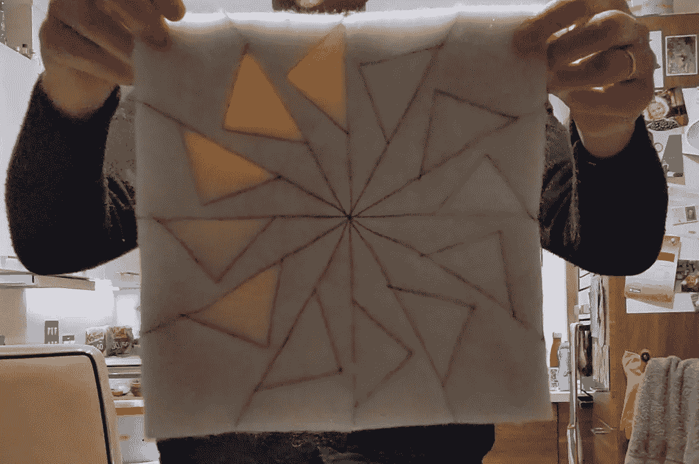
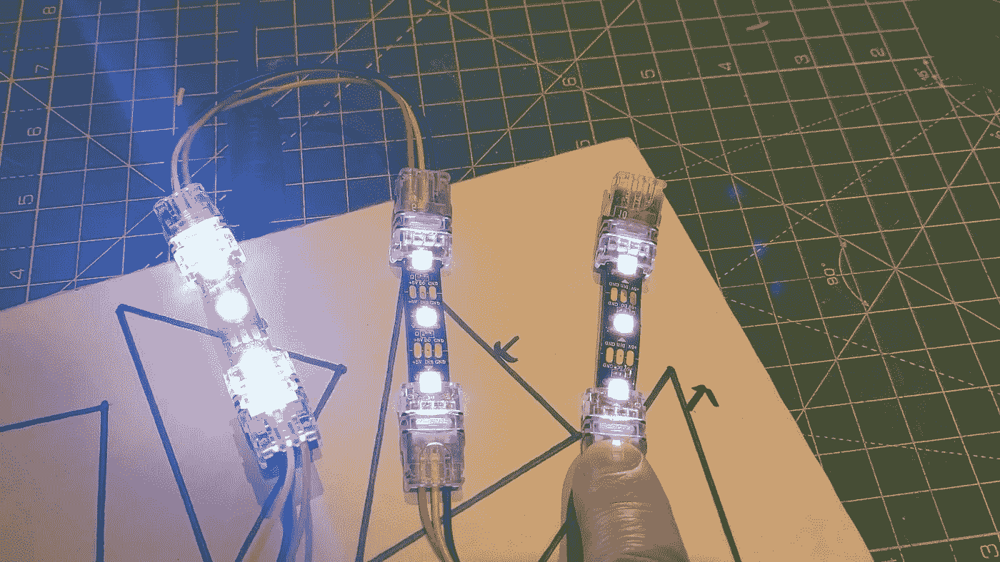
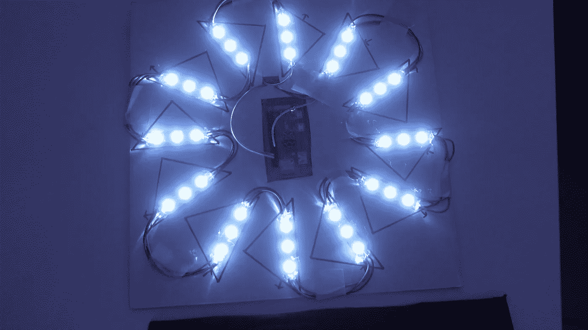
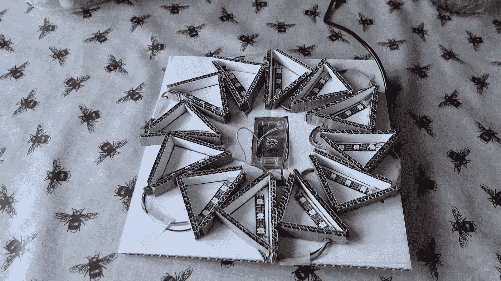
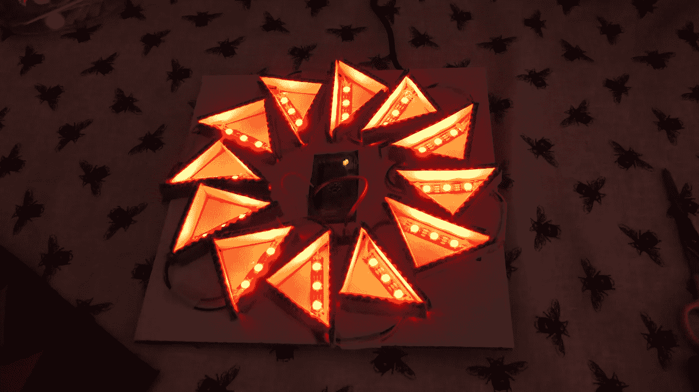
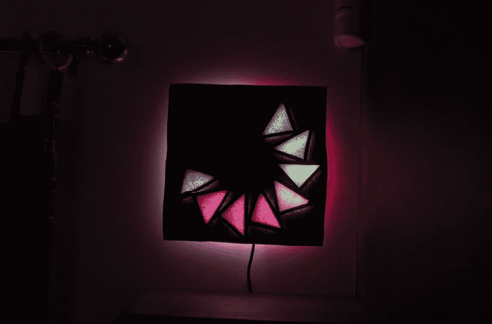
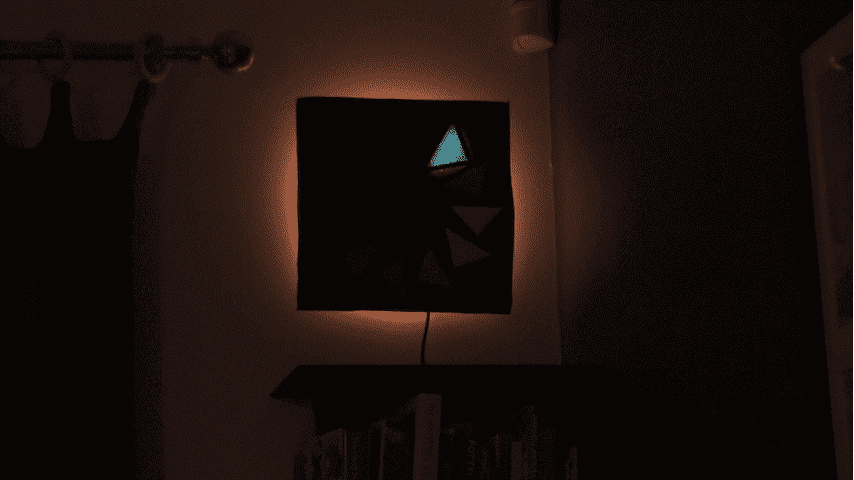
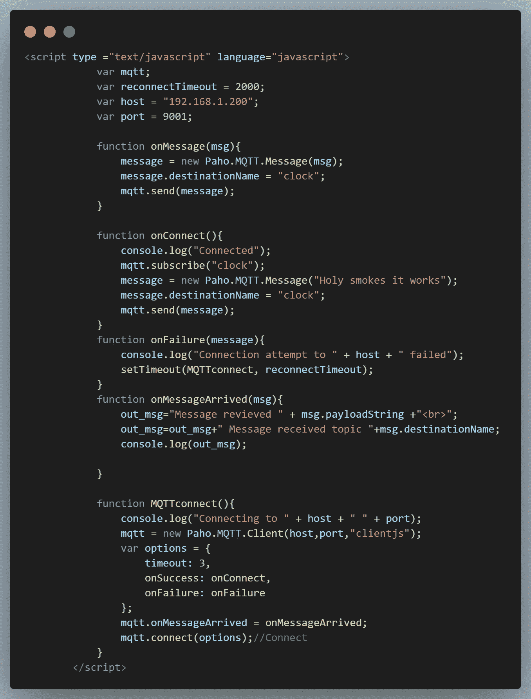

# 树莓皮动力飞鹅时钟

> 原文：<https://blog.devgenius.io/raspberry-pi-powered-flying-geese-clock-ebde0c76ffe6?source=collection_archive---------2----------------------->

## 用 Python 编程并通过 MQTT 控制的 led 灯让这种传统的被子图案栩栩如生

时钟由一个被面组成，被面安装在嵌有发光二极管的纸板框架上。灯光连接到一个树莓派零点，通过织物发光来指示时间，并将墙壁涂成红色，以给出过去几分钟的模糊概念。

除了作为一个时间片，被子还包括各种定时器和环境设置，我确定这些控制会比我以前的项目更即时。受到 Kevin McAcleer 和其他人的启发，我决定像对待机器人一样对待这个被子，并通过 MQTT(一种轻量级的发布-订阅网络协议)来控制它。

# 建筑

我按照 Etsy 上找到的图案一[简单的“鹅圈”底纸拼接来做被子。通过这种方法，织物被一次一片地缝合到纸模板上，以创建精确的最终设计。完成后，纸被移除，留下被子顶部。](https://www.etsy.com/uk/listing/976447670/circle-of-geese-paper-pieced-quilt-block)

钟面的四分之一准备好了

有许多灵感的现代作品都是用这种方式制作的，比如下面展示的[“狮子之心”](http://The Heart of a Lion Foundation Paper Piece Pattern)图案。像这样的现代纸拼接设计让人想起用 Photoshop 制作的低多边形图形艺术，只有织物和三维。

由[priandjoyquilting](http://The Heart of a Lion Foundation Paper Piece Pattern)制作的“狮子之心”基础纸片图案

## 光漫射

我对这四个部分的组合非常满意，我想用一种能展示拼接和缝份隐藏细节的方式来点亮整个作品。然而，如果没有每只“鹅”被单独照亮，就很难显示钟面的 12 个小时。

光线穿过鹅圈图案，显示出缝份

被子填料是扩散 led 光线的良好材料。我用了双层来确保单个像素不会透过织物看起来像斑点。然后，在绕过每个三角形之前，我在中心缝了六根线，希望这能在边缘之间形成一道屏障。

被子顶部缝合到双层填料上，并勾勒出三角形截面

一旦被面的边缘装订完成，我就开始做一个框架。被子顶部的尺寸为 30 厘米 x 30cm 厘米，所以我剪了一块比这个略小的正方形纸板，并标出三角形的位置。为了更均匀地分散光线，我打算在被子顶部和安装 led 的纸板之间留一个小间隙。我会用 15 毫米的纸板条来创造这种高度。

钟的纸板背衬

## 树莓派

RGB WS2812B LEDs 连接到 Raspberry Pi Zero，由 Python 脚本控制。和我之前的项目一样，我按照 Adafruit 网站上的[用户指南进行配置。我使用 5v 电源为 Pi 和灯供电。](https://learn.adafruit.com/adafruit-neopixel-uberguide/python-circuitpython)

为了避免焊接，我愚蠢地买了一些连接器，它们一面卡在 LED 灯带上，另一面卡在电源线和数据线上。我想这会给整个建造过程一个简单的乐高式的感觉，但是我从来没有把它们连接到足够的地方来防止非常明显的电压降。所以，这是回到焊接绘图板，这在最后没有回报。

非常明显的电压降是由于接触不良造成的

时钟上的每个“小时”由三个发光二极管组成，在 12 点钟时，整个表面都亮了起来，就像大型质子对撞机发生了事故一样。将被子随意放在灯光上，会产生有趣的效果，但时间之间没有明显的区别。

时钟的每个小时都有三个 LEDS

一旦我把这些条粘上来创造立面，纸板背衬本身在点燃时开始看起来引人注目，尽管不完美，三角形的鹅在容纳光线方面做得很好。

每小时 15 毫米的条纹有助于提升高度，使光线均匀扩散

每个小时都闪着红光

为了显示经过的时间，36 个 led 在背面形成一个圆圈，将光线从墙上反射回来——最初我打算每五分钟间隔三个灯，但最终我笨拙地使用它们来创建一个进度条。在 Python 脚本中，过去的分钟数表示为一小时的分数，然后乘以 36。例如，在过去 30 分钟(一小时的 30/60)时，18 个灯发出红光，其余的灯发出白光；在 5 分钟前(55/60 小时),只剩下 3 盏白光灯。

这就是 8:25 的样子:

钟面上显示 8:25

事后看来，我希望我把更多的灯放在更靠近正方形轮廓的边缘，因为圆形已经消失了。是圆钉方被的情况！

## MQTT、Python 和 JavaScript 的融合

对于时钟函数，python 脚本从互联网上获得时间，然后改变适当的灯光，这是程序的默认行为。其他程序将被子视为一盏灯，并设置各种环境背光颜色。最终程序的功能就像鸡蛋计时器，前端旋转就像现实生活中的加载屏幕。

时钟还可以作为计时器，墙壁会慢慢变红

半熟的鸡蛋有 4 分钟的计时器，而熟的鸡蛋有 10 分钟的计时器。计时器运行时，绿色值从 255 下降到 0，红色值则相反。快速看一眼墙壁，你就能大致知道鸡蛋煮到什么程度了。在中途，光是红色和绿色的等份，或者被称为橙色，一旦完成，在灯熄灭之前，墙发出绿色的光。

Raspberry Pi 被配置为使用 Mosquito 的 MQTT 代理和使用 Paho MQTT Python 库的客户机。

paho 客户端在 Python 文件中使用

它还使用 Apache web 服务器托管一个简单的嵌入了 JavaScript 的 HTML 页面，该页面为 Pi 上的代理创建一个开放的 web 套接字。这可以加载到我们网络上的任何设备上。

JavaScript 向代理打开 websocket

用户按下按钮触发一条消息发布到等待的 Python 脚本，最终结果感觉就像墙上安装的电灯开关一样即时。

我使用了杰里米·库克的关于蚊子的教程和史蒂夫的关于 MQTT、Paho 和 websockets 的互联网指南，让我开始学习代码，我期待着在未来的项目中建立这种学习。一个需要考虑的问题是，Raspberry Pi Zero 是否真的是这项工作的最佳工具。我使用它是因为它是备用的，而且我知道我在用 Apache web 服务器做什么并获取当前时间。也许一个带有 Wifi 模块和实时时钟的微型计算机会是更好的方法。也许是时候让我深入了解 Node Red 及其所有应用程序了。

对于未来的项目，我脑海中有一个绗缝的二进制时钟或显示二进制算术结果的被子。如果这是你喜欢的类型，并且你喜欢阅读这个项目，请考虑在媒体上关注我或者订阅我的 [YouTube 频道](https://www.youtube.com/russelleveleigh)。

你可以在 GitHub 上看到这个项目的所有代码:[https://github.com/reveleigh/Circle-of-Geese-Clock](https://github.com/reveleigh/Circle-of-Geese-Clock)