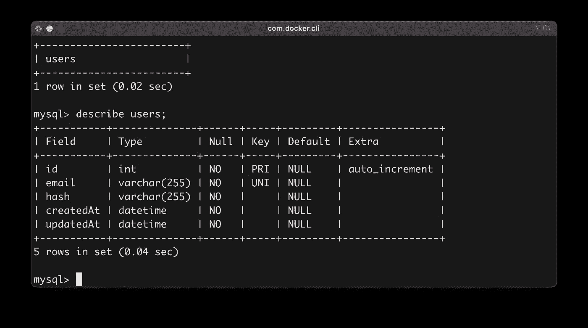
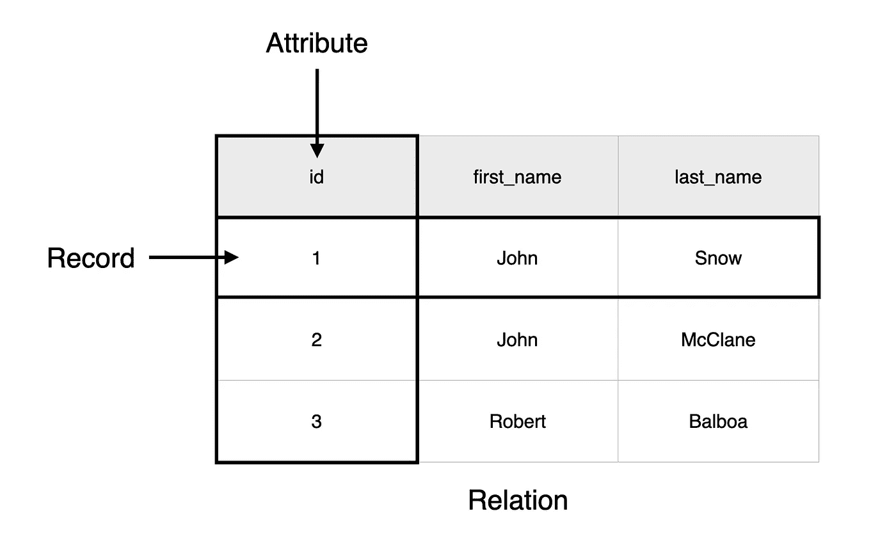
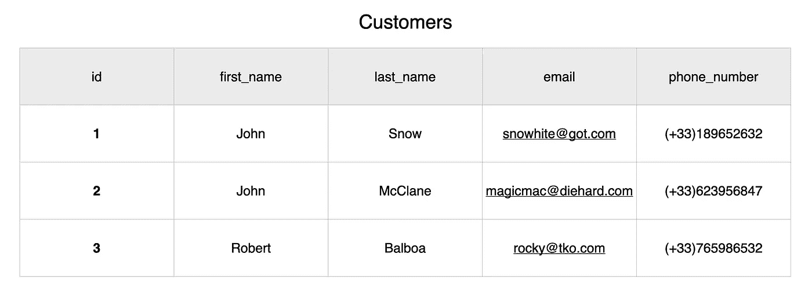
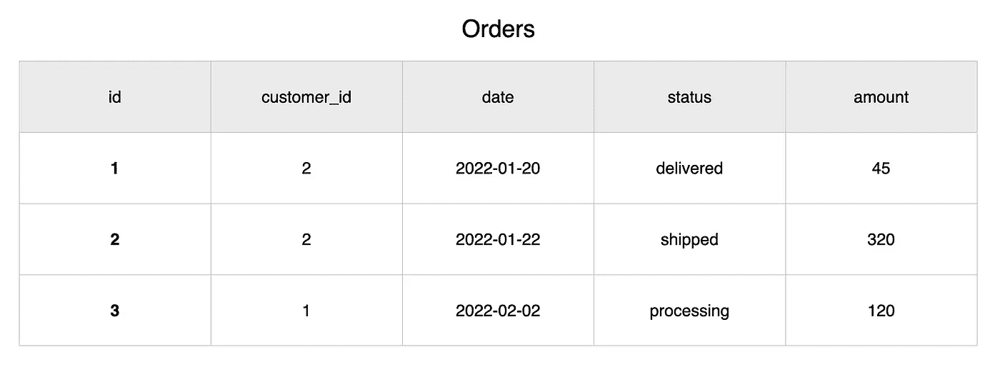

# 关系数据模型概述(RDBMS 第 1 部分)

> 原文：<https://blog.devgenius.io/rdbms-part-1-the-relational-model-bc7181607e2a?source=collection_archive---------17----------------------->

《打造分层微服务 之书 [**现已在 https://learnbackend.dev/接受预购。**](https://learnbackend.dev/books/build-layered-microservices)

**关系数据库**是一种存储并提供对彼此相关的分类数据点的访问的数据库。

它基于**关系模型，**于 1969 年由 [Edgar F. Codd](https://en.wikipedia.org/wiki/Edgar_F._Codd) 首次描述，这是一种将数据表示为表的方式，也称为**关系**，其中这些表的行被指定为**记录**，列被指定为**属性**。

记录通常代表实体类型的实例，例如客户或产品，而属性将保存该实例的值，例如名称、电子邮件地址、电话号码或数量。

除了保存值之外，属性在某些情况下也被称为键，它允许在不同的表之间创建关系。

顺便提一下，这些关系数据库中的大多数通常被称为 **SQL** 数据库，因为它们实现了结构化查询语言的变体，这种语言在处理结构化数据时被证明是特别有用的。

# 关系模型的好处

## 简单

由于关系模型的简单性，关系数据库可以很容易地在不同的环境中实现和维护，以便匹配任何业务的规模和需求，从简单的电子表格到更高级的数据库管理系统，如 MySQL 或 Postgres。

## 准确(性)

由于数据点可以使用主键和外键的概念相互引用，因此不需要重复，这反过来又提高了数据的准确性和唯一性。

## 灵活性

关系模型的灵活性还允许灵活的数据库结构，可以很容易地适应不断变化的需求。

事实上，由于关系数据库可以容纳的行数、列数或表数应该没有限制，所以可以通过插入、更新或删除表、列或单个数据来毫不费力地改变其内部结构，而不会影响其他现有部分。

## 可用性

最后，由于关系模型不像树或层次模型那样遵循模式，因此它允许使用连接查询和条件语句有选择地组合多个表中特定列的数据，以便只获取、聚合和显示适当的相关数据。

# 相关的例子

现在让我们考虑一个包含下面两个表的电子商务网站的数据库。

第一个名为`customers`的表包含客户的信息。

第二个名为`orders`的表包含客户在网站上的订单。

如果您注意的话，您会注意到这两个表有一个共同点:属性`id`，它在这个上下文中被称为**键**。

由于该属性，关系数据库可以在这两个表之间创建一个关系，它由`orders`表的`customer_id`列具体化，这实际上是对`customers`表的`id`列的引用。

在这种情况下，`customers`表的`id`列因此被称为**主键**，而指向它的`orders`表的`customer_id`列被称为**外键**。

因此，当后端向数据库发送请求以处理订单时，数据库可以同时获取订单和相关的客户信息，从而允许仓库提取正确的产品并将其运送到正确的地址。

# 下一步是什么？

 [## 数据完整性约束(RDBMS 第 2 部分)

### 数据完整性是指在其整个生命周期中维护和保证数据的准确性和一致性。

blog.devgenius.io](/the-data-integrity-constraints-rdbms-part-2-19e0cd10d6dd) 

不要忘记👏🏻如果你喜欢读我的作品，可以提高 50 倍！

👉你喜欢这种内容？在[https://learn back end . dev](https://learnbackend.dev/)查看《如何使用 Express framework 构建生产就绪的分层认证微服务》一书 [**构建分层微服务**](https://learnbackend.dev/books/build-layered-microservices) ，该书从第一行代码到最后一行文档都符合开发实践和软件架构方面的行业标准。