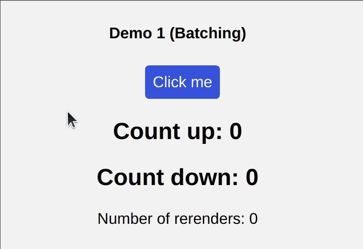
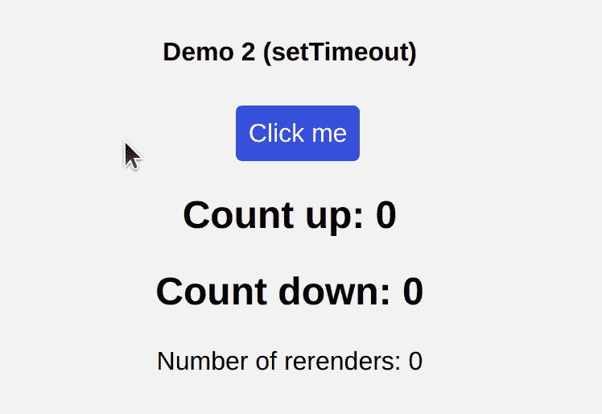
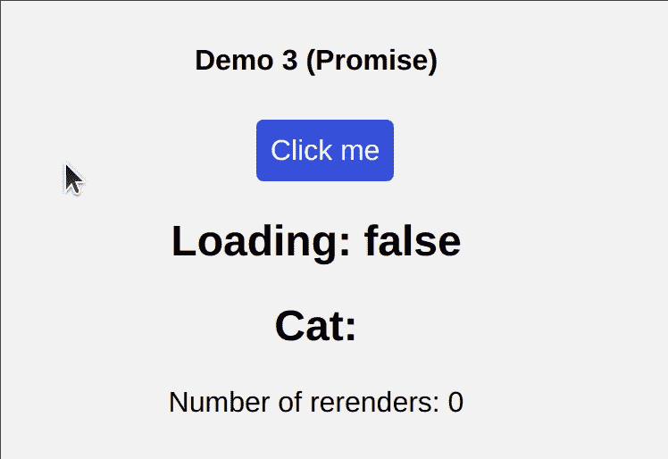
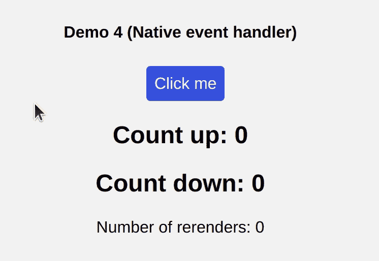
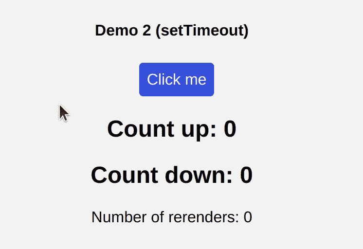

# 反应 18:自动配料

> 原文：<https://blog.devgenius.io/react-18-automatic-batching-2f5d691b4f19?source=collection_archive---------7----------------------->


反应 18:自动配料

我相信您过去听说过“反应批处理”这个术语，可能您(和我一样)对它的含义和实际用途感到困惑。

在继续这篇文章之前，请确保您查看了我的个人网站，并订阅了我的博客，我会在那里发布更多类似这样的内容:[*https://tasoskakour.com*](https://tasoskakour.com/)*。*

一般来说，单词*批处理*可以以多种方式使用，但是对我们的用例有意义的一般定义可以表达为:

> *作为计算机处理单元的一组作业、数据或程序。*
> 
> *(批处理)数据处理的一种形式，在同一机器运行期间，许多输入作业被分组处理。*

# 什么是反应配料

基本上，当 React 应用“批处理”时，这意味着它**将多个状态更新组合成一个单一的重新渲染**主要是为了更好的性能。

在 React 17 和之前的版本中，React 只在 React 事件处理程序中自动批处理任何状态更新**(就像*点击*或*改变*)。**

看看下面的代码，猜猜`handleClick`函数会导致多少次重新渲染？

也不用担心`useRenderCount`功能。这只是一个用来计算重渲染次数的自定义钩子:-)

```
const useRenderCount = () => {
  const renderCounter = useRef(0); 
  useLayoutEffect(() => {
    renderCounter.current++;
  });
  return renderCounter.current;
};
```

实际演示:

```
const Demo1 = () => {
    const renderCount = useRenderCount(); // we use this to count re-renders
    const [countUp, setCountUp] = useState(0);
    const [countDown, setCountDown] = useState(0);

    const handleClick = () => {
        setCountUp((cUp) => cUp + 1);
        setCountDown((cDown) => cDown - 1);
    };

    return (
        <div style={{ textAlign: "center" }}>
            <h4>Demo 1 (Batching)</h4>
            <button onClick={handleClick}>Click me</button>
            <h2>Count up: {countUp}</h2>
            <h2>Count down: {countDown}</h2>
            <div>Number of rerenders: {renderCount}</div>
        </div>
    );
}
```



演示 1: React 事件处理程序被成功批处理。

没错，它只会导致**一个**重新渲染，因为 React 会把两个状态更新`setCountUp`和`setCountDown`批处理成一个！

很酷吧？React 将自动为我们处理这些问题，并避免不必要的重新渲染，这对性能非常好！此外，它将防止我们的组件呈现“半成品”状态，其中只有一个状态变量被更新，这可能会导致错误。

# ✋:但是……有一个问题

**React(版本 18 之前)只会批量 React 事件处理程序。它不会批量更新 promises、setTimeout、本机事件处理程序或任何其他事件。**

在现实世界中，有许多用例需要更新 React 不能批处理的处理程序中的多个状态。

让我们看看下面的一些例子，React 不会批量更新，它会导致多次重新渲染。

## setTimeout 内部的更新

在下面的演示中，`setCountUp`和`setCountDown`将导致**两个**重新渲染，因为 React 无法在`setTimeout`回调中批量处理多个更新。

```
const Demo2 = () => {
  const renderCount = useRenderCount();
  const [countUp, setCountUp] = useState(0);
  const [countDown, setCountDown] = useState(0);

  const handleClick = () => {
    setTimeout(() => {
      setCountUp((cUp) => cUp + 1);
      setCountDown((cDown) => cDown - 1);
    }, 500);
  };

  return (
    <div className="Demo">
      <h4>Demo 2 (setTimeout)</h4>
      <button onClick={handleClick}>Click me</button>
      <h2>Count up: {countUp}</h2>
      <h2>Count down: {countDown}</h2>
      <div>Number of rerenders: {renderCount}</div>
    </div>
  );
};
```



演示 2:反应(<17) is not able to batch setTimeout callbacks.

## 2) Updates inside a promise

In the example below we fetch a random cat image when the button is clicked. React cannot batch the multiple state updates that’s after the 【 fetch call, specifically the 【 and 【 .

However, it successfully batches the first two calls before the await: 【 and 【 .

So in total the 【 function will cause 3 re-renders.

```
const Demo3 = () => {
  const renderCount = useRenderCount();
  const [loading, setLoading] = useState(false);
  const [cat, setCat] = useState(null);

  const handleClick = async () => {
    // these two below will be batched
    setLoading(true);
    setCat(null);
    const response = await fetch("https://thatcopy.pw/catapi/rest/");
    if (response.ok) {
      const json = await response.json();
      setCat(json.url); // cannot batch
    }
    setLoading(false); // cannot batch
  };

  return (
    <div className="Demo">
      <h4>Demo 3 (Promise)</h4>
      <button onClick={handleClick}>Click me</button>
      <h2>Loading: {String(loading)}</h2>
      <h2
        style={{
          display: "flex",
          justifyContent: "center",
          alignItems: "center"
        }}
      >
        Cat:{" "}
        {cat ? (
          
        ) : (
          ""
        )}
      </h2>
      <div>Number of rerenders: {renderCount}</div>
    </div>
  );
};
```



Demo 3: React (<17) is not able to batch promises.

## 3) Updates inside a native event handler

In the example below we use a native event handler by attaching a 【 listener to our button. React is not able to batch these multiple state updates as well.

```
const Demo4 = () => {
  const renderCount = useRenderCount();
  const [countUp, setCountUp] = useState(0);
  const [countDown, setCountDown] = useState(0);

  useEffect(() => {
    const handleClick = () => {
      setCountUp((cUp) => cUp + 1);
      setCountDown((cDown) => cDown - 1);
    };

    const element = document.querySelector("#my-button");
    element.addEventListener("click", handleClick);

    return () => {
      element.removeEventListener('click', handleClick);
    };
  }, []);

  return (
    <div className="Demo">
      <h4>Demo 4 (Native event handler)</h4>
      <button id="my-button">Click me</button>
      <h2>Count up: {countUp}</h2>
      <h2>Count down: {countDown}</h2>
      <div>Number of rerenders: {renderCount}</div>
    </div>
  );
};
```



React (<17) is not able to batch native event handlers.

## 💡 Quick fix to the above scenarios

Obviously, a fix to the above scenarios would be to store all the “individual” states to a big state (or use a useReducer).

For example, the Demo with the fetch promise could be written as shown below in order to prevent unwanted re-renders:

```
const Demo3Fix = () => {
  const renderCount = useRenderCount();
  const [state, setState] = useState({
    loading: false,
    cat: null
  }); // a single state object

  const handleClick = async () => {
    setState({
      loading: true,
      cat: null
    }); // 1st re-render
    const response = await fetch("https://thatcopy.pw/catapi/rest/");
    if (response.ok) {
      const json = await response.json();
      setState((s) => ({ cat: json.url, loading: false })); // 2nd re-render
    } else {
      setState((s) => ({ ...s, loading: false })); // or this 2nd re-render
    }
  };

  const { cat, loading } = state;

  return (
    ...
  );
};
```

➡️ All the previous React 17 demos are available in this CodeSandbox: [https://codesandbox.io/s/cranky-mccarthy-g5ntm](https://codesandbox.io/s/cranky-mccarthy-g5ntm)

# 对救援做出反应 18🎉

React 18 为所有用例添加了自动批处理，以进一步提高性能。你可以在这里阅读更多。它仍处于测试阶段。

这意味着对于我们之前所有例子中的**来说，React (18)会自动将多个状态更新批处理成一个更新。**

为了证明，看看下面的 *setTimeout* 演示，我们唯一改变的是 React 到 18 的版本和`index.js`内的代码，我们在那里指示 React 如何加载我们的应用程序。具体来说，为了让 React 18 利用这些新特性，我们需要利用`createRoot` api。

`index.js`在 React 17:

```
import { render } from "react-dom";
import App from "./App";

render(<App />, document.getElementById("root"));
```

`index.js`在 React 18:

```
import { createRoot } from "react-dom";
import App from "./App";

createRoot(document.getElementById("root")).render(<App />);
```



React 18:它自动批处理 setTimeout 回调！

以下是 React 18 的所有实验代码:[https://codesandbox.io/s/objective-elbakyan-6u76m](https://codesandbox.io/s/objective-elbakyan-6u76m)

# 不想批怎么办？

可能有这样一种情况，我们不希望 React 批量更新(尽管通常认为批处理是安全的)。我们可以通过使用如下所示的`flushSync`函数来实现:

```
import { flushSync } from 'react-dom'; 

const handleClick = () => {
  flushSync(() => {
    setCountUp((cUp) => cUp + 1);  // 1st re-render 
  })
  flushSync(() => { 
    setCountDown((cDown) => cDown - 1); // 2nd re-render
  })  
};
```

这里值得注意的是，在 React 18 之前的版本中，我们可以通过使用如下未记录的 API `unstable_batchedUpdates`来强制批处理 React 事件处理程序之外的状态更新:

```
unstable_batchedUpdates(() => {
  // these 2 below will be batched
  setCountUp((cUp) => cUp + 1);
  setCountDown((cDown) => cDown - 1);
});
```

根据文档，这个 API 在 18 中仍然存在，但是已经没有必要了，因为批处理是自动发生的。在未来的版本中，它也可能被删除。

# 结束了

我希望你喜欢这篇文章，回头见！😃

*最初发表于*[T5【https://tasoskakour.com】](https://tasoskakour.com/blog/react-18-automatic-batching)*。*