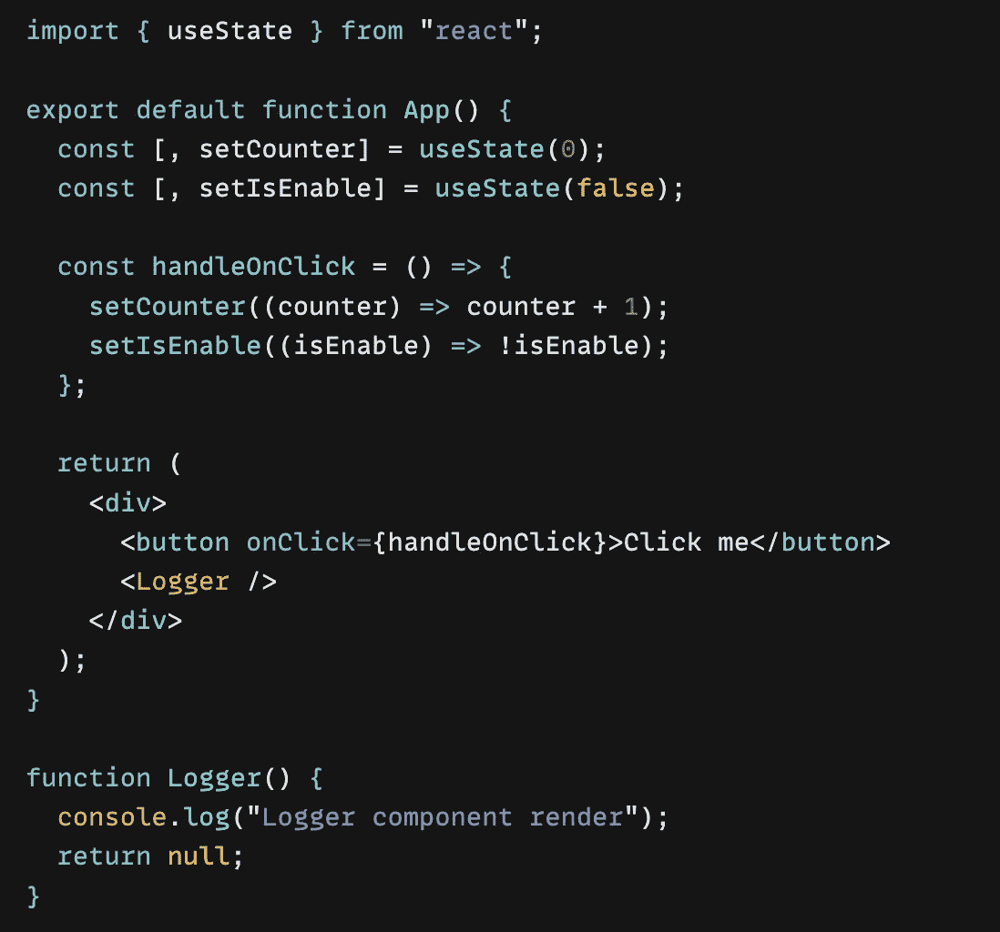
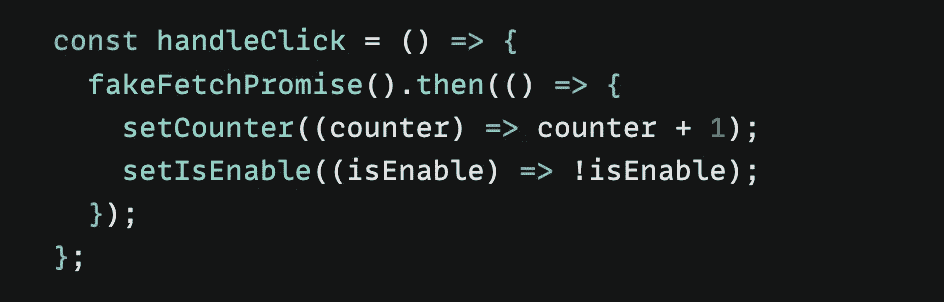
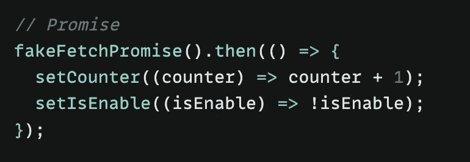
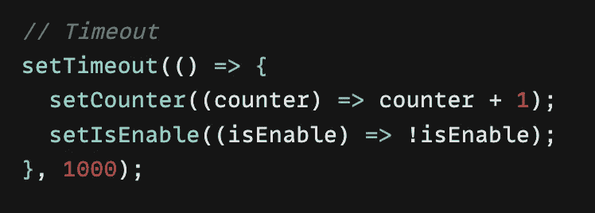
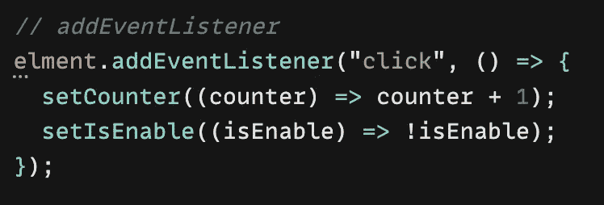
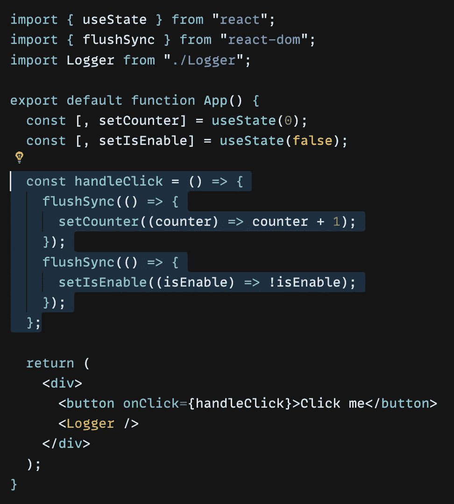

# React 18 —自动配料

> 原文：<https://blog.devgenius.io/react-18-automatic-batching-dc0de5eb6165?source=collection_archive---------10----------------------->

## 了解 React 自动批处理状态更新

# React 17 发生了什么？

React17 只支持*对浏览器事件(如点击)进行批处理*

*考虑下面的片段。*

**

*当您按下按钮时。作为函数体`handleOnClick` 将执行并尝试更新两个状态的 ***计数器*** 和**isE*enable***。如果你检查控制台。您只会在看到一次来自`Logger component`的信息。这就是批处理。*

**

*记录器组件仅重新呈现 1 次，即使更新了 2 个状态*

*正如我提到的，React17 将只批处理*浏览器事件*，但是一旦数据被获取，更新状态又如何呢？让我们看看控制台上有多少渲染消息。*

**

*完成承诺后更新状态。*

**

*在这种情况下，记录器重新渲染 2 次*

*总共 2 个渲染。你可能会想， ***“嗯，它只要渲染两次；*** 这不会对性能影响不大的🧐*

*不要，一旦你的应用程序开始增长，有很多嵌套的组件。重新呈现父组件时，性能可能会受到影响，因为每次状态更新时，整个组件树都会重新呈现。*

*[React 17 批处理状态更新示例的沙盒。](https://codesandbox.io/s/react17-batching-state-update-example-zw27ix)*

# *React 18 中的批处理是什么？*

*当您迁移到 React 版本 18 时， ***组件的所有状态更新，不管它们来自哪里，都将被批处理。****

*正如我提到的，*状态更新无论是承诺、事件处理程序、超时还是任何其他事件都将批处理* ***，与 React 事件*** *内部的更新方式相同。可怕的🤩**

******

*[React 18 自动批处理示例的沙盒](https://codesandbox.io/s/react-18-batching-state-update-kni7n2?file=/src/App.js)*

# ***如何防止自动批处理？***

*自动批处理非常有助于将一组状态更新到一个渲染中，但是有一种方法可以阻止这种行为。您可以使用**中的 **flushSync** 和 **react-dom** 包来退出批处理。***

**

*我们包装了用 **flushSync 更新状态的函数。**在这种情况下，***setCounter*T5**和*setIsEnable*。一旦每个功能被执行。记录器将重新绘制 **2 次。*******

# ***结论***

*React 18 将多个状态更新组合成一个单一的重新呈现，而不管它们来自哪里(承诺、超时、事件处理程序等)。)以获得更少的组件重新渲染和更好的性能。然而，如果你不需要这种行为。React 为批处理的退出选项提供了 **flushSync***

*希望您了解 React 18 的自动配料是怎么回事。感谢阅读👋🏼*