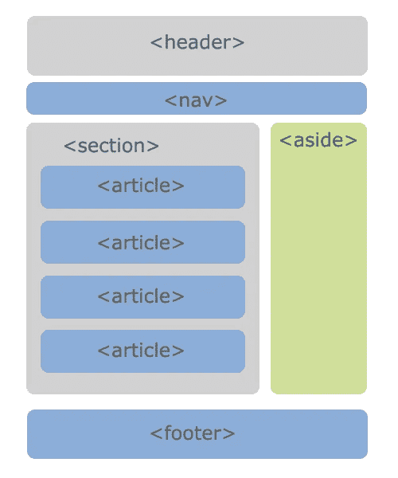

# React 2020 — P1:介绍和安装

> 原文：<https://blog.devgenius.io/react-2020-p1-intro-and-installation-21a673ab6a22?source=collection_archive---------4----------------------->


让我们来解决另一个话题:反应。React 是一个 JavaScript 库，我们将使用它来构建用户界面。一切都将被分解成组件，以便于维护和扩展。什么是组件？看看下面。当一个网站被分成独立的组件时，管理起来就容易多了。我们有*表头*、*导航*、*栏目*、*侧栏*、*页脚*等。组件又可以包含其他组件。下面的*段*组件包含四个*条*组件。下面的所有组件都在主组件中。



在尝试使用 React 之前，您应该已经掌握了基本的 HTML、CSS 和 JavaScript。即使人们会说你必须是一个绝对的 JavaScript 忍者才能对付 React，我倾向于不同意这种说法；基本的理解就足够了。一旦你接近一个你不理解的话题，你总是能在那时重新振作起来。然而，对函数式和面向对象编程的全面理解是非常有益的。

在使用 React 之前，您必须能够安装 React。根据需求，确保您的计算机上安装了最新版本的 Node。前往 http://nodejs.org/获得最新(LTS)版本。运行提示，你应该设置好了。安装完成后，您可以通过在终端中键入 *node -v* 来验证您已经安装了 node。您还需要通过键入 *npm -v* 来验证 *npm* 是否已安装。节点软件包管理器 *npm* 将与节点一起安装。为什么需要 npm？因为 React 只是一个 npm 包。最后，运行 *npx -v* 来验证是否安装了 npm 软件包运行器。这就是我们要用来在电脑上安装 React 的东西。

您可能还希望获得 [React 开发人员工具](https://chrome.google.com/webstore/detail/react-developer-tools/fmkadmapgofadopljbjfkapdkoienihi?hl=en)浏览器扩展，以便能够在浏览器中查看您的 React 应用程序是如何运行的。

我们都准备好了。打开您的终端，导航到您想要创建 React 应用程序的目录。运行命令:

```
c:\youtube>npx create-react-app *yt-react*
```

您可能已经看到过 *create-react-app* 命令在没有 *npx 的情况下被全局使用。*通过使用 *npx* ，您可以确保 *create-react-app* 保持最新。通过全局安装，您将必须确保每次都有最新的版本。所以干脆把这一段忘了，用 *npx* 。

*yt-react* 字符串是项目名称；您可以随意命名您的项目(只要您坚持与您命名计算机上的目录相同的命名规则)。一旦安装过程完成，将*光盘*放入目录并启动它。

```
c:\youtube>cd yt-react
c:\youtube>npm start
```

localhost:3000 上的 react 页面将自动打开，您将看到主页。


命令 *npm start* 启动开发服务器。您将在终端中注意到该命令继续运行。如果您关闭您的终端，您将终止开发服务器，并且您的 React 应用程序将不再运行。如果要终止开发服务器，请按 CTRL+C。


最后一步是在 IDE 中打开项目。我用的是 [VS 代码](https://code.visualstudio.com/)。只需导航到文件夹并打开它。您将看到所有已安装的文件夹和文件。恭喜你。你已经拥有了继续这个系列所需要的一切。


第一个文件夹 *node_modules* 包含所有需要的依赖项。每次需要一个新的依赖项时，它都会进入这个文件夹。*公共*文件夹包含几个文件。*index.html*包含一个 *< div id="root" >* 标签，React 应用程序将在该标签中呈现。您不会对该文件执行任何操作；只要知道它的存在。这是将向用户提供的文件。

您的发展过程将在 *src* 目录中进行。我们要看的第一个文件是 *src/index.js* 。这就是将组件加载到 *< div id="root" >* 元素中的文件。

前两行导入 React 和 ReactDOM。React 需要导入到所有 React 组件中。需要 ReactDOM 只是为了将应用程序呈现到屏幕上。转到第 3 行， *index.css* 文件从当前目录导入，该目录是 *src* 目录。您的 React 应用程序现在可以访问这个 CSS 文件了。

在第 4 行，加载了创建主页的组件。 *App* 组件从当前目录( *src/* )下的 *App.js* 文件中加载。我们稍后再看 *App.js* 文件。现在，只知道文件包含一个名为 *App* 的功能组件，这是在第 4 行导入的组件。如果组件被命名为*汽车*，你将不得不从 *App.js* 文件中导入*汽车*。

我们现在跳过第 4 行，转到 *ReactDOM.render()。*第一个参数是将要呈现的组件。现在把这个论点想象成一段 HTML 代码。那里只能有一个组件。您可以拥有嵌套组件，但它需要被包装组件包围。例如，我们可以返回一个 *< div >* 标签。那个 *< div >* 标签可以有内部< div >的、< h1 >的等等。

```
ReactDOM.render(<div>Hello</div>, ...);
```

事实上，如果您修改了代码，将第一个参数替换为*<div>Hello</div>，*您将会看到您的页面仍然工作，并将显示 *Hello* 字符串。


第二个参数是*document . getelementbyid(' root ')*，这是一个普通的 JavaScript，它获取具有*根*的 *id* 的元素。这个元素位于哪里？它在 *public/index.html* 文件中，就是我们之前看的那个文件。该文件包含一个 div 元素:*<div id = " root "></div>*。这是 React 代码将被发送到的地方。如果您在浏览器中检查上面的元素，您会注意到我们刚刚发送的代码位于 *< div id="root" >* 标记内。


您可以恢复您的 *src/index.js* 组件内部的更改，以确保我们正在呈现 *App* 组件。

记住， *App* 组件包含在我们的 *src/index.js* 文件的第 4 行中(参见上面的代码)。包含 *App.js* 文件时，不包含*。js* 扩展名。让我们打开 *App.js* 文件，看看这个 *App* 组件是什么。

这是一个名为 *App* 的功能组件:

```
function App() { … }
```

每个文件都需要导入 *React* ，这就是你在第 1 行看到的。第 2 行和第 3 行的代码导入了这个特定组件所需的徽标和 CSS 文件。因为我们才刚刚开始，所以我们想尽可能地从头开始。让我们从删除徽标导入开始。既然这个标志已经不存在了，我们还需要删除引用它的 *< img >* 标签。

在 *return()* 语句中的代码可能看起来像 *HTML* ，但它实际上是 *JSX* ，这就是为什么你需要在顶部导入 *React* 。在 HTML 中，要使用 CSS 类，你可以用*类*属性、 *< div class="…" >* 来引用它，但是在 React 中我们有基于*类的组件*，所以*类*是一个保留关键字。在 JSX，你会使用 *className* 。让我们继续清理并移除顶部的 *CSS* 导入。我们还将删除 *< div >* 语句中的所有内容。

刷新页面，您会看到您只是显示字符串:*空白页。*你其实不用刷新；React 将自动执行此操作。


我们需要查看的最后一段代码是位于 *src/App.js* 文件底部的*导出默认 App* 。它是基本的 JavaScript 代码，允许您从页面导出一个组件，并将其导入另一个页面。没有此代码，您将无法运行*import App from’。 *src/index.js* 文件中的/App'* 。

每个导出的组件需要有一个 *return()* 语句，该语句将只返回一个元素。不能返回多个元素；这就是为什么所有东西都用 *< div >* 标签包装的原因。如果你看看函数组件 *App()* ，它包含一个返回语句，返回一个 *JSX* 元素。那个 *JSX* 元素可以有其他嵌套元素，但是两个 *JSX* 元素不能返回。

```
// Not valid
return (
  <div>Hello</div>
  <div>Hi</div>
);// Valid
return (
  <div>
    <div>Hello</div>
    <div>Hi</div>
  </div>
);
```

这是这次介绍的全部内容。我们将在下一篇文章中更深入地探讨 React。

[](https://github.com/dinocajic/react-youtube-tutorials) [## dinocajic/react-YouTube-教程

### React 2020 YouTube 教程。在…上创建一个帐户，为 dinocajic/react-YouTube-tutorials 开发做出贡献

github.com](https://github.com/dinocajic/react-youtube-tutorials) 

迪诺·卡伊奇目前是 [LSBio(生命周期生物科学公司)](https://www.lsbio.com/)、[绝对抗体](https://absoluteantibody.com/)、 [Kerafast](https://www.kerafast.com/) 、[珠穆朗玛生物](https://everestbiotech.com/)、[北欧 MUbio](https://www.nordicmubio.com/) 和 [Exalpha](https://www.exalpha.com/) 的 IT 主管。他还担任我的自动系统的首席执行官。他有十多年的软件工程经验。他拥有计算机科学学士学位，辅修生物学。他的背景包括创建企业级电子商务应用程序、执行基于研究的软件开发，以及通过写作促进知识的传播。

你可以在 [LinkedIn](https://www.linkedin.com/in/dinocajic/) 上联系他，在 [Instagram](https://instagram.com/think.dino) 上关注他，或者[订阅他的媒体出版物](https://dinocajic.medium.com/subscribe)。

[*阅读迪诺·卡吉克(以及媒体上成千上万其他作家)的每一个故事。你的会员费直接支持迪诺·卡吉克和你阅读的其他作家。你也可以在媒体上看到所有的故事。*](https://dinocajic.medium.com/membership)