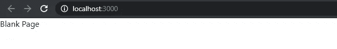
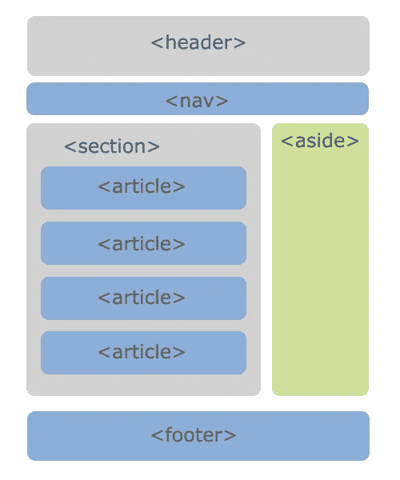
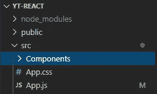
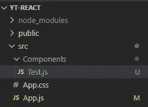
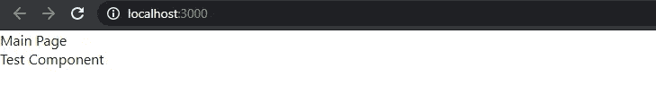

# 反应 2020 — P2:更深入的介绍

> 原文：<https://blog.devgenius.io/react-2020-p2-deeper-intro-df82d7beee40?source=collection_archive---------5----------------------->

在[上一篇文章](https://medium.com/dev-genius/react-2020-p1-intro-and-installation-21a673ab6a22)中，我们浏览了我们创建的 React 应用程序的表面。现在，让我们更深入地了解应用程序，并为我们将在本系列中创建的 React 应用程序设置项目结构。

在[之前的文章](https://medium.com/dev-genius/react-2020-p1-intro-and-installation-21a673ab6a22)中我们已经看过 *public/index.html* ，但是为什么这个文件会获得 React 应用？当用户访问您的网站时，您的服务器会将该文件发送给用户。名称*索引*是大多数服务器将在公共目录中查找的默认文件名。如果您使用 *npm start* 启动 React 应用程序，并在浏览器中检查代码，您会注意到页面底部包含了一些脚本。

这些脚本将 React 应用程序加载到您的 *< div id="root" >* 中。

我们已经走过了当前的流程，但让我们快速回顾一下。

1.  React 的入口点是 *src/index.js*
2.  *src/index.js* 导入 React、ReactDOM 和 *App* 组件。
3.  React 和 ReactDOM 是包。 *App* 组件从 *src/App.js* 导入。
4.  *App* 组件是一个返回 JSX 元素的功能组件。在这种情况下，它返回 *< div >空白页< /div >* 。
5.  *App* 组件从 *App.js* 导出，导入到 *index.js* 中。
6.  导入后，使用 ReactDOM.render()方法进行渲染。 *render()* 方法将 *App* 组件内容放入包含 *id="root"* 属性的 HTML 元素中。

如果我们想创建另一个页面呢？在传统的静态 HTML 页面网站创建中，你需要创建 *public/about.html* 。React 应用程序被称为单页面应用程序，因此应用程序的唯一入口是通过*public/index . html:
*。

## 成分

组件只是用户界面的一部分。一旦创建，就可以反复使用。让我们看一下我们在介绍/安装文章中看到的同一张图。

我们有许多不同的组件:*标题*，*导航*，*页脚*等。*条*组件分组在*节*组件内，这意味着组件可以容纳其他组件。上面所有的组件都位于主组件的内部，对我们来说就是 *App* 组件。

我们可以创建不同的组件，但它们分为两类:有状态的组件和无状态的组件。有些组件有状态，有些没有。我们将在后面的文章中讨论状态，但本质上，状态是一个存储数据并可被组件访问的对象。

还有功能组件和基于类的组件。当你查看 *src/App.js 时，你已经看到了一个功能组件的例子。*功能组件只是一个返回 *JSX* 元素的 JavaScript 函数。

在上面的例子中， *src/App.js* 包含一个名为 *App* (功能组件)的函数，该函数返回 *JSX div* 元素。

不过，您可能不熟悉基于类的组件。基于类的组件是扩展 *React 的类。组件*并包含一个返回 JSX 元素的 *render()* 方法。我们可以很容易地将上面的 *App* 功能组件转换成一个类组件。

您的代码不需要任何其他更改。React 知道调用 *render()* 方法，该方法将返回 JSX 元素。

为什么使用基于类的组件而不是功能组件？在钩子被引入之前，只有类组件可以利用*状态*。那不再是真的了。我来自一个基于类的 OOP 背景，所以我更喜欢类而不是钩子。然而，钩子似乎是由 React 推动的，所以我认为现在使用钩子比使用类更安全。我偷偷欣赏了所有其他基于 OOP 的开发者在网上发表他们的观点，声称他们喜欢类组件而不是功能组件。然而，我们在这里学习 React，所以我们将详细研究两者。

## 设置项目结构

我们将使用 *App.js* 文件作为我们的切入点。我们创建的任何新组件都将被导入到 *App.js* 中，并在那里呈现。我们将在我们的 *src* 目录下创建一个*组件*目录，并将我们所有的组件放在那里。

让我们创建一个快速组件来演示这一点。右键点击目录，新建一个文件: *Test.js* 。

每个 React 组件必须以 react import 语句开始。我们将创建一个返回 JSX 元素的功能组件，并导出该组件。

组件已经创建，但是它现在对我们没有任何作用。由于我们将使用我们的*应用*组件来呈现我们所有的其他组件，我们需要将*测试*组件导入到我们的*应用*组件中，并在那里呈现它。

看上面的 *src/App.js* ，我们从 *src/Components/Test.js* 文件中导入*测试*组件。的’。/'状态，从当前目录(该文件所在的目录)开始，然后进入*组件*目录。一旦被导入，测试组件*就会使用 *<组件名/ >* 语法呈现在第 9 行。如果 JSX 元素没有结束标记，您必须为它提供一个自结束标记:*<component name>*无效。*

我希望您开始理解 React 应用程序中的逻辑流程。在接下来的几篇文章中，我们将逐一探讨这些概念，并重申代码如何在应用程序中流动。

 [## dinocajic/react-YouTube-教程

### React 2020 YouTube 教程。在…上创建一个帐户，为 dinocajic/react-YouTube-tutorials 开发做出贡献

github.com](https://github.com/dinocajic/react-youtube-tutorials) 

Dino Cajic 目前是 [LSBio(寿命生物科学公司)](https://www.lsbio.com/)、[绝对抗体](https://absoluteantibody.com/)、 [Kerafast](https://www.kerafast.com/) 、[珠穆朗玛生物科技](https://everestbiotech.com/)、[北欧 MUbio](https://www.nordicmubio.com/) 和 [Exalpha](https://www.exalpha.com/) 的 IT 主管。他还担任我的自动系统的首席执行官。他有十多年的软件工程经验。他拥有计算机科学学士学位，辅修生物学。他的背景包括创建企业级电子商务应用程序、执行基于研究的软件开发，以及通过写作促进知识的传播。

你可以在 [LinkedIn](https://www.linkedin.com/in/dinocajic/) 上联系他，在 [Instagram](https://instagram.com/think.dino) 上关注他，或者[订阅他的媒体刊物](https://dinocajic.medium.com/subscribe)。

阅读 Dino Cajic(以及 Medium 上成千上万的其他作家)的每一个故事。你的会员费直接支持迪诺·卡吉克和你阅读的其他作家。你也可以在媒体上看到所有的故事。