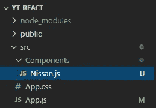
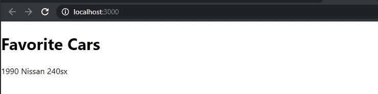
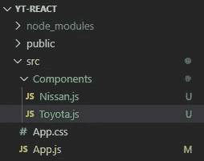
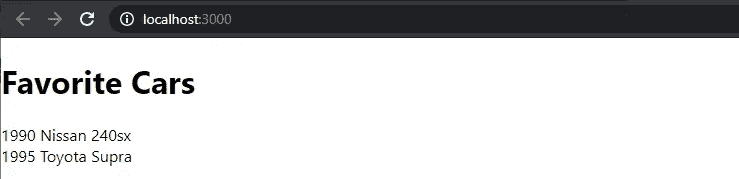
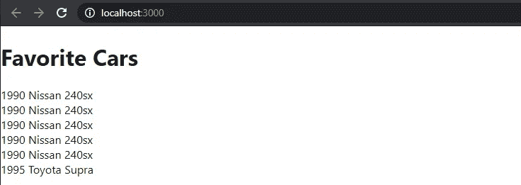

# React 2020 — P3:功能部件

> 原文：<https://blog.devgenius.io/react-2020-p3-functional-components-28820c25d884?source=collection_archive---------11----------------------->


如果您错过了前两篇文章，我建议您在继续之前回去复习一下。我的大部分文章都是建立起来的；在一篇文章(或者是一本书)中包含所有内容实在是太难了。

[](https://medium.com/dev-genius/react-2020-p1-intro-and-installation-21a673ab6a22) [## React 2020 — P1:介绍和安装

### 让我们来解决另一个话题:反应。React 是一个 JavaScript 库，我们将使用它来构建用户界面。

medium.com](https://medium.com/dev-genius/react-2020-p1-intro-and-installation-21a673ab6a22) [](https://medium.com/dev-genius/react-2020-p2-deeper-intro-df82d7beee40) [## 反应 2020 — P2:更深入的介绍

### 让我们更深入地了解 React，并为我们将在整个过程中创建的 React 应用程序设置项目结构…

medium.com](https://medium.com/dev-genius/react-2020-p2-deeper-intro-df82d7beee40) 

到目前为止，您应该已经熟悉了组件，并且在较高层次上理解了功能组件和基于类的组件之间的区别。在本文中，我们将更详细地讨论功能组件。

让我们在 *src/components/* 目录中创建一个新的功能组件 *Nissan* 。准备好…这个系列的主题将是汽车。如果你是按照上一篇文章的思路，在 *src/components* 目录中有一个 *Test.js* 文件。那已经被删除了，你应该在那里看到的唯一文件是 *Nissan.js* 。



如果您没有运行开发服务器，现在是时候了:

```
*C:\your-project-root-dir>****npm start***
```

在您的 *Nissan.js* 文件中，您需要导入 React。因为这是一个功能组件，所以这是您需要导入的全部内容。

```
import React from 'react'
```

接下来声明函数，命名为*日产*。该功能组件将返回一个 JSX 元素，这将是一个 *< div >* 标记，其中包含字符串 *1990 Nissan 240sx* 。

功能组件本身什么也不做。我们必须将它导入到我们的 *App.js* 文件中。然后，我们将在*应用*功能组件中呈现它，以便它可以在浏览器中显示。为什么在 *App* 里面？因为 *App* 已经显示在屏幕上了。在 *src/index.js* 里面导入，然后推送到 *< div id="root" >* 。这只是对你的一点回顾。你可以将*日产*导入到 *index.js、*中，如果你愿意，可以直接将其推送到 *< div id="root" >* 中。你马上就会明白为什么你不想那样做了。

为了在 *App.js* 中导入 *Nissan* 功能组件，我们必须通过在 *Nissan.js* 文件的底部添加 *export defaul Nissan* 来导出 *Nissan* 组件。

然后我们将在 *src/App.js* 中导入 *Nissan* 功能组件。一旦导入，就可以渲染*日产*组件。

1.  *App* 也是一个功能组件。由于是 React 组件，所以需要在 *App.js* 文件的顶部导入 React。我们在第一行看到了这个。
2.  2 号线上的*日产*组件是进口的。
3.  第 4 行声明了 *App* 功能组件。
4.  *App* 返回一个 *< div >* JSX 元素，该元素包含一个 *< h1 >* 标签和呈现的*日产*组件。通过获取组件名称并创建一个自结束标记来呈现组件:*<【Nissan/>*。我们稍后会看到何时使用自结束标记，何时使用标准结束标记: *<日产></日产>* 。
5.  在页面底部导出 *App* 组件，然后导入到 *src/index.js* 中，在那里渲染并推送到位于 *public/index.html* 中的 *< div id="root" >* 标签中。



如果我们想展示另一辆车呢？我们可以重复同样的过程，我们会的。转到 *src/components* 并创建一个 *Toyota.js* 文件。



创建一个名为 *Toyota* 的功能组件，该组件返回一个包含字符串 1995 Toyota Supra 的 *< div >* JSX 元素(这是 Toyota 最后一次制作 Supra，否则你无法说服我)。确保导出文件底部的 *Toyota* 组件。

将文件导入到 *src/App.js* 中，并渲染它，就像您对 *Nissan* 组件所做的那样。

如果你看看你的浏览器，你会看到 240sx 正下方显示的 Supra。



这就是为什么我们在 *src/App.js* 文件中包含组件，而不是直接转到 *src/index.js* 文件:这样我们就可以呈现多个组件。我们只能返回一个 JSX 元素。为了返回多个 JSX 元素，我们必须将它们包装在一个元素中。在本例中，我们外层的 *< div >* 标记，包含了*<>*h1 标记、*</>*标记，以及*</>*标记。渲染时，我们会看到类似这样的内容:

我们也可以在我们的 *App* 组件中调用函数组件任意多次。因此，如果我们想显示 240sx 5 次，我们可以只渲染组件 5 次。

查看浏览器，你会发现，果然，日产显示 5 次。



如果我们想要创建其他车辆，我们可以为它们创建单独的组件，将它们导入到 *App.js* 中并渲染它们。这是不实际的。如果有一个名为 *Car* 的组件，我们可以向其传递参数，那会好得多。我们将在下一篇文章中讨论如何将参数传递给功能组件。

[](https://github.com/dinocajic/react-youtube-tutorials) [## dinocajic/react-YouTube-教程

### React 2020 YouTube 教程。在…上创建一个帐户，为 dinocajic/react-YouTube-tutorials 开发做出贡献

github.com](https://github.com/dinocajic/react-youtube-tutorials) 

Dino Cajic 目前是 [LSBio(寿命生物科学公司)](https://www.lsbio.com/)、[绝对抗体](https://absoluteantibody.com/)、 [Kerafast](https://www.kerafast.com/) 、 [Everest BioTech](https://everestbiotech.com/) 、 [Nordic MUbio](https://www.nordicmubio.com/) 和 [Exalpha](https://www.exalpha.com/) 的 IT 负责人。他还担任我的自动系统的首席执行官。他有十多年的软件工程经验。他拥有计算机科学学士学位，辅修生物学。他的背景包括创建企业级电子商务应用程序、执行基于研究的软件开发，以及通过写作促进知识的传播。

你可以在 [LinkedIn](https://www.linkedin.com/in/dinocajic/) 上联系他，在 [Instagram](https://instagram.com/think.dino) 上关注他，或者[订阅他的媒体出版物](https://dinocajic.medium.com/subscribe)。

阅读 Dino Cajic(以及 Medium 上成千上万的其他作家)的每一个故事。你的会员费直接支持迪诺·卡吉克和你阅读的其他作家。你也可以在媒体上看到所有的故事。