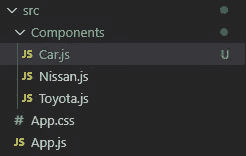
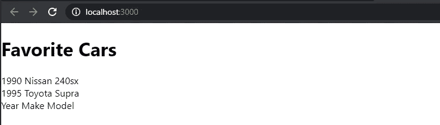
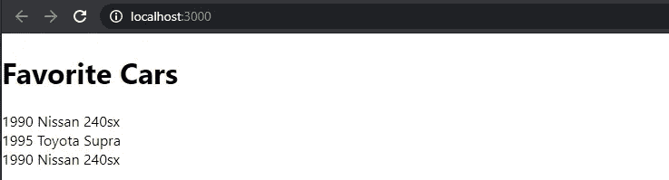
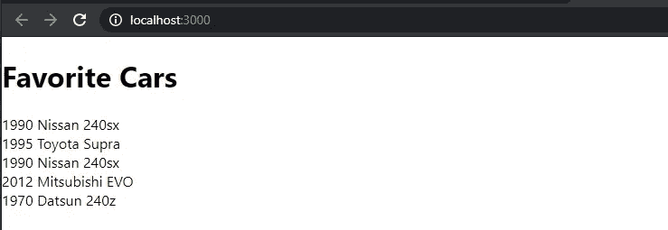

# 反应 2020 — P4:功能组件道具

> 原文：<https://blog.devgenius.io/react-2020-p4-functional-component-props-c870d18175fb?source=collection_archive---------2----------------------->


在[上一篇](https://medium.com/dev-genius/react-2020-p3-functional-components-28820c25d884)中，我们创建了两个功能组件:*日产*和*丰田*。我们将这些组件导入到 *App* 组件中，并呈现它们。如果我们想要渲染其他的汽车，我们必须为每辆汽车生成一个特定的组件。

如果你看一下我们创建的两个组件，你会发现它们之间唯一的区别是呈现的字符串和组件名称。如果有一个通用的 *Car* 组件，接受汽车的年份、品牌和型号作为参数，并显示我们传递给它的任何车辆，不是更好吗？这就是这个话题的内容。

让我们创建一个*汽车*功能组件，并添加年份/品牌/型号作为字符串占位符。



如果我们将*汽车*组件导入到*应用*中并渲染它，我们可以看到它显示在我们的浏览器中。



我们如何将参数传递给组件？参数以 *props* 的形式传递。Props 只是 properties 的简称。Props 允许您将自定义数据传递给 React 组件。当我们渲染组件时，道具将被传递给组件。所以，在 *App* 组件中，我们正在渲染组件 *<汽车/ >* 。我们将创建自定义道具名称，这些名称将附加到 React 的*道具*对象，React 将使每个 React 组件都可以访问这些名称。

让我们为我们的*汽车*组件创建几个定制道具。对我来说，道具类似于 HTML 属性。比如 *< img >* 标签有一个属性叫做*src:*。我们将为我们的 *<汽车/ >* 标签(位于 *src/App.js)* 创建三个“属性”，并将它们命名为*年份*、*制造*和*型号*。

```
<Car year="1990" make="Nissan" model="240sx" />
```

这些道具中的每一个，年份、品牌和型号，都会被 React 自动附加到*道具*对象上。如果您查看您的浏览器，您会注意到没有任何变化，因为这些属性在任何地方都没有被利用。我们如何显示这些参数而不是字符串“Year Make Model？”我们必须修改*车*组件。

为了在功能组件中使用 *props* 对象，您必须在您的功能组件声明中将 *props* 声明为参数。

```
function Car(props) { ... }
```

现在，使用 React magic，您可以访问带有所有自定义属性的*道具*对象。要访问返回的 JSX 中的*道具*对象，您必须使用花括号。在 JSX 内部，你使用花括号来访问对象，变量等。我们将在后面的文章中更详细地介绍 JSX。

```
<div>{ props }</div>
```

要访问刚刚创建的属性，可以在*道具*对象上使用点操作符。例如，要访问 *year* 属性，输入 *props.year* 。我们可以重复*的过程，制作*和*型号*。

如果你查看你的浏览器，你会发现这些参数已经进入了*汽车*组件。



我们现在可以创建任意多的汽车组件。

如果我们查看浏览器，我们可以验证是否显示了这两款新车。



这就是他们全部。在接下来的两篇文章中，我们将研究如何创建类组件并向它们传递参数。

[](https://github.com/dinocajic/react-youtube-tutorials) [## dinocajic/react-YouTube-教程

### React 2020 YouTube 教程。在…上创建一个帐户，为 dinocajic/react-YouTube-tutorials 开发做出贡献

github.com](https://github.com/dinocajic/react-youtube-tutorials) 

Dino Cajic 目前是 [LSBio(寿命生物科学公司)](https://www.lsbio.com/)、[绝对抗体](https://absoluteantibody.com/)、 [Kerafast](https://www.kerafast.com/) 、[珠峰生物技术](https://everestbiotech.com/)、[北欧 MUbio](https://www.nordicmubio.com/) 和 [Exalpha](https://www.exalpha.com/) 的 IT 负责人。他还担任我的自动系统的首席执行官。他有十多年的软件工程经验。他拥有计算机科学学士学位，辅修生物学。他的背景包括创建企业级电子商务应用程序、执行基于研究的软件开发，以及通过写作促进知识的传播。

你可以在 [LinkedIn](https://www.linkedin.com/in/dinocajic/) 上联系他，在 [Instagram](https://instagram.com/think.dino) 上关注他，或者[订阅他的媒体刊物](https://dinocajic.medium.com/subscribe)。

阅读 Dino Cajic(以及 Medium 上成千上万的其他作家)的每一个故事。你的会员费直接支持迪诺·卡吉克和你阅读的其他作家。你也可以在媒体上看到所有的故事。