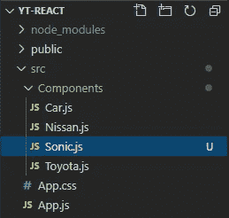
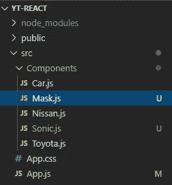

# React 2020 — P5:类组件

> 原文：<https://blog.devgenius.io/react-2020-p5-class-components-2c36c0eb4c28?source=collection_archive---------4----------------------->


在前两篇文章中，我们研究了功能组件。

[](https://medium.com/dev-genius/react-2020-p3-functional-components-28820c25d884) [## React 2020 — P3:功能部件

### React 中的功能组件介绍

medium.com](https://medium.com/dev-genius/react-2020-p3-functional-components-28820c25d884) [](https://medium.com/dev-genius/react-2020-p4-functional-component-props-c870d18175fb) [## 反应 2020 — P4:功能组件道具

### 参数以道具的形式传递。Props 只是 properties 的简称。

medium.com](https://medium.com/dev-genius/react-2020-p4-functional-component-props-c870d18175fb) 

尽管 React 团队似乎想要远离基于类的组件，但他们仍然在这里。顺便提一下，我喜欢并偏爱类组件。我们已经在[更深入的介绍文章](https://medium.com/dev-genius/react-2020-p2-deeper-intro-df82d7beee40)中提到了类组件。

[](https://medium.com/dev-genius/react-2020-p2-deeper-intro-df82d7beee40) [## 反应 2020 — P2:更深入的介绍

### 让我们更深入地了解 React，并为我们将在整个过程中创建的 React 应用程序设置项目结构…

medium.com](https://medium.com/dev-genius/react-2020-p2-deeper-intro-df82d7beee40) 

基于类的组件是一个扩展 *React 的类。组件*并包含一个返回 JSX 元素的 *render()* 方法。我们可以很容易地将功能组件转换成类组件。

让我们创建一个类组件，列出一部电影，在这部电影中，金凯瑞非常棒。我们将首先在我们的 *src/components* 目录中创建一个 *Sonic.js* 文件。如果你还没有看过《索尼克》,我强烈推荐它(尤其是如果你有孩子的话)。



就像功能组件一样，我们需要导入 React。

```
import React from 'react';
```

该类将扩展 *React。组件*并将包含一个返回元素的 *render()* 方法。 *render()* 方法是一种生命周期方法(我们将在后面的文章中研究生命周期方法)。render() 生命周期方法是一个必需的方法，这意味着每次创建一个类组件时，该组件都需要有 *render()* 方法。

就像功能组件一样，类组件也需要被导出，以便以后可以被渲染。导入过程与功能组件的导入过程相同。我们将在 *App* 组件中导入类组件，并呈现它。

确保您的开发服务器正在运行: *npm start* 。


因为我们还不知道如何将参数传递给类组件，所以要显示一部由 Jim Carrey 创作的附加电影，您必须创建一个新组件。于是，在 *src/components* 中创建组件 *Mask.js* ，导入到 *App* 中，渲染到 *< Sonic / >* 下方。



您可能已经注意到，我们正在将一个类组件导入到 *App* 功能组件中。是的，你能做那件事。您还可以将功能组件导入类组件。我们将在下一篇文章中研究如何给组件传递参数，因为我们不想为金凯瑞出演的每部电影都创建单独的组件。

[](https://github.com/dinocajic/react-youtube-tutorials) [## dinocajic/react-YouTube-教程

### React 2020 YouTube 教程。在…上创建一个帐户，为 dinocajic/react-YouTube-tutorials 开发做出贡献

github.com](https://github.com/dinocajic/react-youtube-tutorials) 

Dino Cajic 目前是 [LSBio(寿命生物科学公司)](https://www.lsbio.com/)、[绝对抗体](https://absoluteantibody.com/)、 [Kerafast](https://www.kerafast.com/) 、 [Everest BioTech](https://everestbiotech.com/) 、 [Nordic MUbio](https://www.nordicmubio.com/) 和 [Exalpha](https://www.exalpha.com/) 的 IT 主管。他还担任我的自动系统的首席执行官。他有十多年的软件工程经验。他拥有计算机科学学士学位，辅修生物学。他的背景包括创建企业级电子商务应用程序、执行基于研究的软件开发，以及通过写作促进知识的传播。

你可以在 [LinkedIn](https://www.linkedin.com/in/dinocajic/) 上联系他，在 [Instagram](https://instagram.com/think.dino) 上关注他，或者[订阅他的媒体出版物](https://dinocajic.medium.com/subscribe)。

阅读 Dino Cajic(以及 Medium 上成千上万的其他作家)的每一个故事。你的会员费直接支持迪诺·卡吉克和你阅读的其他作家。你也可以在媒体上看到所有的故事。