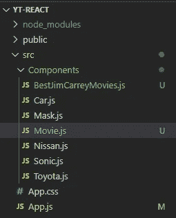

# 反应 2020-P6:类组件道具

> 原文：<https://blog.devgenius.io/react-2020-p6-class-component-props-af254c103d14?source=collection_archive---------8----------------------->

我们在前一篇文章中讨论了类组件。我们创建了几个金凯瑞电影组件，我们停在那里，因为我们不想继续为每个金凯瑞电影创建新的电影组件。

[](https://medium.com/dev-genius/react-2020-p5-class-components-2c36c0eb4c28) [## React 2020 — P5:类组件

### 基于类的组件是一个扩展 React 的类。组件并包含一个 render()方法，该方法返回一个 JSX…

medium.com](https://medium.com/dev-genius/react-2020-p5-class-components-2c36c0eb4c28) 

如果我们有一个组件，允许我们通过把电影名作为参数传入来呈现金凯瑞出现过的任何电影，这将是有益的。如果您一直在跟进，那么在 React 中传递参数对您来说应该不是一个新概念。我们已经了解了如何在功能组件中传递参数；我们只需要弄清楚如何在基于类的组件中实现它。

[](https://medium.com/dev-genius/react-2020-p4-functional-component-props-c870d18175fb) [## 反应 2020 — P4:功能组件道具

### 参数以道具的形式传递。Props 只是 properties 的简称。

medium.com](https://medium.com/dev-genius/react-2020-p4-functional-component-props-c870d18175fb) 

让我们在 *src/components* 下创建一个新文件，并将其命名为 *BestJimCarreyMovies.js* 。

该文件将包含一个名为 *BestJimCarreyMovies* 的基于类的组件，该组件返回一个字符串“金凯瑞的电影”应该导出该组件，以便可以将其导入到其他地方。

我们将把它导入到我们的 *src/App.js* 文件中，并在我们的 *App* 组件中呈现它。

一旦你确定你正在运行你的开发服务器( *npm start* )，检查浏览器。


前两部电影来自我们在[上一篇文章](https://medium.com/dev-genius/react-2020-p5-class-components-2c36c0eb4c28)中创建的两个组件。

在功能组件中，我们将 *props* 对象作为参数传递给功能组件。 *props* 对象包含所有已声明的属性。在类组件中，由于我们扩展了 *React。组件，*我们通过继承获得对*道具*对象的访问权。要访问对象内部的属性或方法，我们使用 *this* 关键字。如果你不熟悉*这个*，你需要熟悉[面向对象编程](https://en.wikipedia.org/wiki/Object-oriented_programming)。我可以解释的最简单的方法是，如果你在谈论你自己，你可以使用我的代词。例如，如果你在谈论你的眼睛，你会说*我的眼睛。如果你在谈论别人的眼睛，你会说他/她/他们的眼睛。用*这个* ( *我的*)你在指着自己。由于*道具*被继承，它在对象内，所以你将用*这个*来引用它。*

创建属性的过程与我们创建功能组件的过程相同。当您在 *App* 组件中呈现您的组件时，您将为它附加一个自定义属性；在这种情况下，我们将创建一个名为*电影*的自定义属性。

```
*In src/App.js*<BestJimCarreyMovies movie="Ace Ventura" />
```

*电影*被附加到*道具*对象上，并且可以通过使用 *this.props.movie* 来访问。

```
*In src/components/BestJimCarreyMovies.js*return(
  <div>{ this.props.movie } by Jim Carrey</div>
)
```

如果我们检查我们的浏览器，我们可以看到由金凯瑞的 *Ace Ventura 显示。现在，我们可以根据需要多次呈现这个组件，并且每次都向它传递一个新的参数。*


我知道你明白这是怎么回事。为什么不进一步抽象一下呢？为什么不直接创建一个*电影*组件，将电影片名和演员作为*道具*传递呢？



我们现在可以播放金凯瑞或其他演员的电影。


这就是基于类的组件中 *props* 对象的全部内容。下一篇报道 JSX 时再见。

[](https://github.com/dinocajic/react-youtube-tutorials) [## dinocajic/react-YouTube-教程

### React 2020 YouTube 教程。在…上创建一个帐户，为 dinocajic/react-YouTube-tutorials 开发做出贡献

github.com](https://github.com/dinocajic/react-youtube-tutorials) 

Dino Cajic 目前是 [LSBio(寿命生物科学公司)](https://www.lsbio.com/)、[绝对抗体](https://absoluteantibody.com/)、 [Kerafast](https://www.kerafast.com/) 、[珠峰生物技术](https://everestbiotech.com/)、[北欧 MUbio](https://www.nordicmubio.com/) 和 [Exalpha](https://www.exalpha.com/) 的 IT 负责人。他还担任我的自动系统的首席执行官。他有十多年的软件工程经验。他拥有计算机科学学士学位，辅修生物学。他的背景包括创建企业级电子商务应用程序、执行基于研究的软件开发，以及通过写作促进知识的传播。

你可以在 [LinkedIn](https://www.linkedin.com/in/dinocajic/) 上联系他，在 [Instagram](https://instagram.com/think.dino) 上关注他，或者[订阅他的媒体刊物](https://dinocajic.medium.com/subscribe)。

阅读 Dino Cajic(以及 Medium 上成千上万的其他作家)的每一个故事。你的会员费直接支持迪诺·卡吉克和你阅读的其他作家。你也可以在媒体上看到所有的故事。