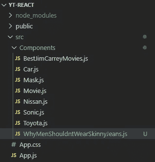

# 反应 2020 — P7: JSX

> 原文：<https://blog.devgenius.io/react-2020-p7-jsx-c7066a0a7d98?source=collection_archive---------7----------------------->


我甚至考虑做一个 JSX 教程，因为它非常类似于 HTML 语法。不过，我想我们确实需要涵盖一些差异。JSX 代表 JavaScript XML。你不需要在《反应》中使用 JSX，但是它比另一个更容易使用。

让我们创建一个新的组件，同时激怒一些人。在 *src/components* 下创建一个新的功能组件，称为*why menshouldntwearskinnyjeans*。



将组件导入 *App.js* 并渲染。

如果您在浏览器中查看结果，您将看到渲染的组件( *npm start* )。


很好。到目前为止是标准的。但是，我们如何将刚才看到的例子转换为不使用 JSX 呢？在 *React.createElement()* 的帮助下，我们习惯的简单语法被转换成 JavaScript。 *createElement()* 方法接受几个参数。第一个参数是您要创建的元素类型。在我们的例子中，我们想要创建一个 *< div >* 标签。

```
React.createElement('div', ...)
```

下一个参数列出了元素属性。我们不需要这个元素的任何属性，所以我们只需要输入 *null* 。

```
React.createElement('div', null, ...)
```

第三个参数是元素内部的内容。

```
React.createElement('div', null, 'Because they look terrible');
```

如果您保存文件，您会注意到您得到了相同的结果。


这看起来已经很乱了。如果我们有嵌套标签呢？想象一下，我们的绳子周围有一个 *< h1 >* 的标签*因为它们看起来很糟糕*。对 JSX 来说很简单。

使用*reaction . create element()*不太合适。您不能在第三个参数字符串周围加上 *< h1 >* 标记。

```
Won't work
React.createElement('div', null, '<h1>Because...</h1>');
```

那么，您如何解决这个问题呢？您必须放置另一个*reaction . create element()*作为第三个参数，然后传递所有内容。

正如你所看到的，这开始看起来像一个完全的烂摊子，就像男人穿的紧身牛仔裤。我希望你已经看到了 JSX 的好处。

不过，我不满足于一个原因。我想补充一系列理由。JSX 让我的生活变得简单。我们将创建一个无序列表，并在其中列出一些原因。


没有 JSX，我们应该为了好玩而创作吗？当然，为什么不呢？

我建议你忘掉这些，像正常人一样使用 JSX。

JSX 和超文本标记语言还有什么不同？JavaScript 有一些保留的关键字，比如*类*，所以你不能像使用 HTML 一样，插入*类*属性来获得 CSS 类。在 JSX，指代 CSS 类的*类*属性实际上是*类名*。

```
<div className="bad-decisions"><ul>...</ul></div>
```

您会注意到 *className* 是用 camel case 符号编写的。你可以用 *onClick* 属性调用函数；再次注意 camel case 语法。如果我们将函数 *burnPants* 添加到 *onClick* 属性中，我们将会遇到编译失败的错误，因为我们还没有创建 *burnPants* 函数(我们肯定应该创建它)。

最后，您必须添加自结束标记语法。比如 HTML 中的 *< br >* 标签就没有结束标签。既然没有，我们就称那个标签为自结束标签。您可能也熟悉 HTML 中的自结束标记语法，尽管它不再被推送了。在 JSX，这是必须的。同样的概念可以应用于其他标签，例如 *< img / >* 标签。对于 JSX 来说，这就是你需要知道的全部。你随时都可以在 React 的网站上查阅相关文档。

[](https://github.com/dinocajic/react-youtube-tutorials) [## dinocajic/react-YouTube-教程

### React 2020 YouTube 教程。在…上创建一个帐户，为 dinocajic/react-YouTube-tutorials 开发做出贡献

github.com](https://github.com/dinocajic/react-youtube-tutorials) 

Dino Cajic 目前是 [LSBio(寿命生物科学公司)](https://www.lsbio.com/)、[绝对抗体](https://absoluteantibody.com/)、 [Kerafast](https://www.kerafast.com/) 、 [Everest BioTech](https://everestbiotech.com/) 、 [Nordic MUbio](https://www.nordicmubio.com/) 和 [Exalpha](https://www.exalpha.com/) 的 IT 主管。他还担任我的自动系统的首席执行官。他有十多年的软件工程经验。他拥有计算机科学学士学位，辅修生物学。他的背景包括创建企业级电子商务应用程序、执行基于研究的软件开发，以及通过写作促进知识的传播。

你可以在 [LinkedIn](https://www.linkedin.com/in/dinocajic/) 上联系他，在 [Instagram](https://instagram.com/think.dino) 上关注他，或者[订阅他的媒体刊物](https://dinocajic.medium.com/subscribe)。

阅读 Dino Cajic(以及 Medium 上成千上万的其他作家)的每一个故事。你的会员费直接支持迪诺·卡吉克和你阅读的其他作家。你也可以在媒体上看到所有的故事。