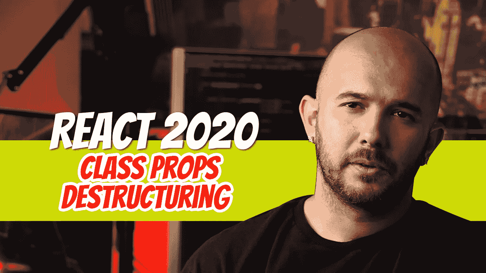
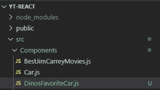

# React 2020 — P8:类道具解构

> 原文：<https://blog.devgenius.io/react-2020-p8-class-props-destructuring-739d592fca4?source=collection_archive---------3----------------------->



如果你以前看过 React 代码，你几乎有 100%的机会见过析构。如果您查看大多数基于类的组件的导入语句，您很可能会看到类似这样的内容:

```
import React, **{ Component }** from 'react';class ClassName extends **Component** { ... }
```

*{ Component }* 就是一个析构的例子。如果我们不使用析构，我们将不得不在类声明中使用以下语法:

```
import React from 'react';class ClassName extends **React.Component** { ... }
```

解构到底是什么？这只是一种从一个对象或数组中提取多个键，并将它们赋给一个变量的方法。在您的职业生涯中，您可能曾经见过以下语法:

变量 *a* 被赋予 10，变量 *b* 被赋予 20。这段代码只是将元素从数组中取出，放入变量中。

在这个例子中，我们有一个对象*用户*。*用户*对象包含两个属性: *id* 和*名称*。我们可以将这些属性析构并提取到单独的变量或常量中，如第 6 行所做的那样。有趣的事实:到目前为止，我们所看到的一切都只是 JavaScript。

让我们看看如何在类组件中析构 *props* 对象。如果你不熟悉*道具*对象，看看我关于类组件道具的文章。

[](https://medium.com/dev-genius/react-2020-p6-class-component-props-af254c103d14) [## 反应 2020-P6:类组件道具

### 如何将参数传递给 React 的基于类的组件？这篇文章回答了这个问题。

medium.com](https://medium.com/dev-genius/react-2020-p6-class-component-props-af254c103d14) 

在 *src/components* 里面新建一个文件，命名为 *DinosFavoriteCar.js* 。



创建类组件并将其命名为 *DinosFavoriteCar，*但是这次在导入 React 时析构了*组件*。让 *render()* 生命周期方法返回一个包含字符串 *Year Make Model* 的 JSX 元素。将其导入 *App* 组件并渲染。


现在我们已经验证了没有错误，让我们将一些道具传递给 *DinosFavoriteCar* 组件，并像在之前使用[一样使用它们。使用*年份、*和*型号*道具通过 2020 款日产 GT-R。](https://medium.com/dev-genius/react-2020-p6-class-component-props-af254c103d14)

```
<DinosFavoriteCar year="2020" make="Nissan" model="GT-R" />
```

您可以使用类组件 *DinosFavoriteCar* 中的*道具*对象来显示*年份、品牌、*和*型号*。


就在那里。目前没有新消息。如果您查看 *DinosFavoriteCar* 组件，您会注意到我们为每个属性使用了 *this.props* 。从*道具*对象中提取*年份、*和*型号*不是很好吗？是的，会的。所以让我们开始吧。

在您的 *render()* 方法中，键入以下内容:

```
const { year, make, model } = this.props;
```

我们已经看到了与上面的*用户*对象几乎相同的例子。*道具*对象包含*年份、*和*型号*。我们将提取这些属性，并将它们分配给*年份、品牌、*和*型号*常量。当我们这样做的时候，我们可以摆脱掉这个道具。

在下一篇文章中，我们将看看如何在功能组件内部解构 *props* 。

[](https://github.com/dinocajic/react-youtube-tutorials) [## dinocajic/react-YouTube-教程

### React 2020 YouTube 教程。在…上创建一个帐户，为 dinocajic/react-YouTube-tutorials 开发做出贡献

github.com](https://github.com/dinocajic/react-youtube-tutorials) 

Dino Cajic 目前是 [LSBio(寿命生物科学公司)](https://www.lsbio.com/)、[绝对抗体](https://absoluteantibody.com/)、 [Kerafast](https://www.kerafast.com/) 、[珠峰生物技术](https://everestbiotech.com/)、[北欧 MUbio](https://www.nordicmubio.com/) 和 [Exalpha](https://www.exalpha.com/) 的 IT 负责人。他还担任我的自动系统的首席执行官。他有十多年的软件工程经验。他拥有计算机科学学士学位，辅修生物学。他的背景包括创建企业级电子商务应用程序、执行基于研究的软件开发，以及通过写作促进知识的传播。

你可以在 [LinkedIn](https://www.linkedin.com/in/dinocajic/) 上联系他，在 [Instagram](https://instagram.com/think.dino) 上关注他，或者[订阅他的媒体刊物](https://dinocajic.medium.com/subscribe)。

阅读 Dino Cajic(以及 Medium 上成千上万的其他作家)的每一个故事。你的会员费直接支持迪诺·卡吉克和你阅读的其他作家。你也可以在媒体上看到所有的故事。