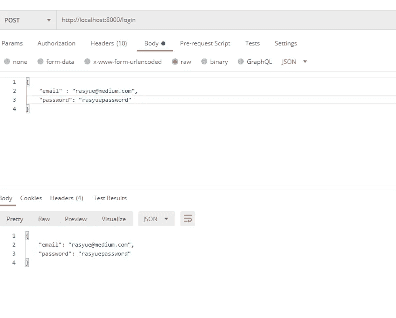

# React 和 FastAPI 登录系统

> 原文：<https://blog.devgenius.io/react-and-fastapi-login-system-370ca4e8ddc?source=collection_archive---------1----------------------->


# React FastAPI 登录游戏攻略

在本教程中，我们将使用 React 和 FastAPI Python 创建一个登录系统。

FastAPI 是一个 Python 框架。这是一个高性能的框架，可以用来快速设置后端应用程序。

另一方面，React 是由脸书开发的 JavaScript 框架。

还有，如果你是那种看视频学得比较好的类型，试试这个 [**React 和 FastAPI 登录**](https://www.youtube.com/watch?v=5y5HX3EJZMg)

现在，让我们开始吧。

# React 和 FastAPI Python 构建 React 应用程序(前端)

让我们设置一个 React 的新应用程序。在本教程中，我将使用 JavaScript。如果你愿意，你可以选择不要打字稿。

打开命令提示符并运行以下命令。

```
npx create-react-app my-rasyue-app
// once the script runs sucessfully, run below.
cd my-rasyue-app
npm start
```

现在，打开您喜欢的 IDE 并打开`my-rasyue-app`文件夹。

# 配置我们的 React 应用程序(前端)

概括地说，我们的 React 应用程序应该:

1.  有一个登录页面和一个个人资料页面(受保护的网页，只有登录后才能访问)
2.  有一个注销按钮，它将清除存储在`localStorage`中的 JWT
3.  登录页面将有一个登录表单，有用户名和电子邮件两个输入。
4.  在登录表单提交时，我们将使用 axios 向后端发送 POST 请求(FastAPI Python)

好了，让我们开始吧！

# 创建登录页面

运行以下命令安装`react-router-dom`和`axios`

```
npm install react-router-dom@6
npm install axios
```

打开你的`index.js`，粘贴以下内容。

```
import React from 'react';
import ReactDOM from 'react-dom';
import './index.css';
import App from './App';
import reportWebVitals from './reportWebVitals';
import { BrowserRouter } from "react-router-dom";
import 'bootstrap/dist/css/bootstrap.min.css';ReactDOM.render(
  <BrowserRouter>
    <App />
  </BrowserRouter>,
  document.getElementById('root')
);// If you want to start measuring performance in your app, pass a function
// to log results (for example: reportWebVitals(console.log))
// or send to an analytics endpoint. Learn more: https://bit.ly/CRA-vitals
reportWebVitals();
```

我们用< `BrowserRouter` >包装`App`，以允许在应用程序中使用`Routes`。

现在，打开你的`App.js`，粘贴以下内容。

```
import './App.css';
import {
  Route,
  Routes,
} from "react-router-dom";import Login from './Login.js'
import Profile from './Profile.js' function App() { return (
    <div className="App">
      <Routes>
        <Route path="/" element={<Login />} />
        <Route
          path="/profile"
          element={<Profile />}
        />
      </Routes>
    </div>
  );
} export default App;
```

我们现在必须创建两个新文件`Login.js`和`Profile.js`

继续创建这两个文件。

在`Login.js`内部，粘贴以下内容。

```
export default function Login(){ return(
        <>

            <div style = {{minHeight: 800, marginTop: 20 }}>
                <h1>Login Page</h1>
            </div>

        </>
    )
}
```

在`Profile.js`内部，粘贴以下内容。

```
export default function Profile(){ return(
        <>

            <div style = {{minHeight: 800, marginTop: 20 }}>
                <h1>Profile Page</h1>
            </div>

        </>
    )
}
```

打开浏览器并打开`localhost:3000`

你应该有这样的东西。


React 登录页面

到目前为止，我们已经创建了 2 个新页面，`Profile`和`Login`。我们还在`App.js`文件中定义了`Routes`。

不要太花哨。

# 设置身份验证并制作受保护的页面

是时候为 React 设置我们的身份验证了。

创建一个新文件`Auth.js`并粘贴以下内容

```
import {
    Navigate ,
    useLocation
  } from "react-router-dom";export const setToken = (token) =>{ // set token in localStorage
    localStorage.setItem('rasyueToken', token)}export const fetchToken = (token) =>{ // fetch the token
    return localStorage.getItem('rasyueToken')} export function RequireToken({children}) { let auth = fetchToken()
    let location = useLocation();

    if (!auth) {

      return <Navigate to="/" state={{ from: location }} />;
    }

    return children;
}
```

打开`App.js`并用以下内容替换。

```
import './App.css';
import {
  Route,
  Routes,
} from "react-router-dom";import Login from './Login.js'
import Profile from './Profile.js'import {RequireToken} from './Auth.js'function App() { return (
    <div className="App">
      <Routes>
        <Route path="/" element={<Login />} />
        <Route
          path="/profile"
          element={
            <RequireToken>
              <Profile />
            </RequireToken>
          }
        />
      </Routes>

    </div>
  );
} export default App;
```

为了解释我们所做的，我们首先创建了一个新文件`Auth.js`，并在其中定义了 3 个函数，即`setToken`、`fetchToken`和`RequireToken`

`setToken`和`fetchToken`用于设置和获取我们存储在`localStorage`中的项目。

如果你不熟悉 localStorage，我建议你在这里 阅读它们[](https://developer.mozilla.org/en-US/docs/Web/API/Window/localStorage)

**`RequireToken`用于`App.js`中的`Route`。该函数将接收子路径，并确定是否允许用户访问该路径。**

**这是使页面受到保护的步骤，在本例中，我们使`Profile`页面受到保护。**

**如果令牌不可用，用户将无法访问令牌。**

**让我们完成 React 应用程序登录的最后一部分。**

# **React FastAPI —完成登录表单**

**打开你的`Login.js`并粘贴以下内容。**

```
import {useState} from 'react'
import {setToken, fetchToken} from './Auth.js'
import {useNavigate} from "react-router-dom";
const axios = require('axios');export default function Login(){ const navigate = useNavigate();
    const [username, setUsername] = useState('');
    const [password, setPassword] = useState(''); const login = () =>{ if(username === '' && password === ''){ return }else{ console.log('axios')
            axios.post('http://localhost:8000/login', {
                username: username,
                password: password
            })
            .then(function (response) { if(response.data.token){

                    setToken(response.data.token)
                    navigate("/profile");
                }
            })
            .catch(function (error) { console.log(error, 'error'); }); }

    } return(
        <>

            <div style = {{minHeight: 800, marginTop: 20 }}>
                <h1>Home Page</h1> <div style = {{marginTop: 50 }} >
                    {
                        fetchToken() 
                        ? (
                            <p>You are logged in!</p>
                        ) 
                        : (
                            <form>
                            <label style = {{marginRight: 10 }}>Input Username: </label>
                            <input type = 'text'  onChange={ (e)=> setUsername(e.target.value)} />
                            <label style = {{marginRight: 10 }}>Input Password: </label>
                            <input type = 'text'  onChange={ (e)=> setPassword(e.target.value)} />
                            <button type = 'button' onClick = {login}>Login</button>
                        </form>
                        )
                    }                </div> </div>

        </>
    )
}
```

**刷新后，您的页面看起来会像这样。**

****

**最后，打开你的`Profile.js`,换成下面的。**

```
import {useNavigate} from "react-router-dom";export default function Profile(){ const navigate = useNavigate(); const signOut = () => { localStorage.removeItem('rasyueToken')
        navigate("/");
    } return(
        <>

            <div style = {{minHeight: 800, marginTop: 20 }}>
                <h1>Profile Page</h1> <p>Hi, this is your profile</p> <div>
                    <button type = 'button' onClick= {signOut}>Sign Out</button>
                </div>
            </div>

        </>
    )
}
```

**如果你现在测试你的登录系统，那么它还不能工作，我们仍然需要创建我们的后端。**

**让我们构建我们的 FastAPI 后端应用程序。**

# **React 和 FastAPI Python 构建 FastAPI 应用程序(后端)**

**让我们来设置我们的 FastAPI 应用程序。**

**首先，确保你的电脑上安装了 [Python](https://www.python.org/) 。**

**在本教程中，我将使用 [Anaconda](https://www.anaconda.com/products/individual#Downloads) 和 [Pycharm](https://www.jetbrains.com/pycharm/) ，因为它对 Python 模块提供了更多的控制，但你不必同时下载 Anaconda 和 Pycharm。**

**只是安装 Python 和使用任何其他 IDE 应该还是可以的。**

**创建一个新文件夹，命名为任何你喜欢的名字，在里面创建一个新名字`main.py`**

**在我们使用 **FastAPI** 之前，我们需要先通过`pip`安装它。运行以下命令来安装它。**

```
pip install fastapi
pip install "uvicorn[standard]"
pip install pyjwt
```

# **React FastAPI 登录—构建第一个 Hello World 页面**

**现在，在你的`main.py`中，粘贴以下内容。**

```
from fastapi import FastAPI app = FastAPI() @app.get("/")
def read_root():
    return {"Hello": "World"}
```

**使用`uvicorn main:app --reload`运行您的 FastAPI 应用程序**

**你应该有这样的东西。**

****

**FastAPI Hello World**

**下一步是定义一个端点，该端点将处理来自前端应用程序 React 的登录请求。**

**端点还应该生成一个 JWT 令牌，并与 MongoDB 数据库通信。**

# **React FastAPI 登录—创建登录端点**

**打开你的`main.py`，粘贴以下内容。**

```
from fastapi import FastAPI
from typing import Optional
from pydantic import BaseModelapp = FastAPI() class LoginItem(BaseModel):
    email: str
    password: str @app.get("/")
def read_root():
    return {"Hello": "World"} @app.post("/login")
async def login_user(login_item: LoginItem):
    return login_item
```

**正如您在上面看到的，我们添加了另一个端点`/login`，它只接受带有对象输入`login_item`的 post 请求。**

**定义类型`LoginItem`是为了确保 post 请求输入仅由`email`和`password`组成。**

**如果我们使用 Postman 测试端点，我们将得到类似这样的结果。**

****

# **React FastAPI 登录—修改登录端点以生成 JWT**

**现在我们已经有了工作的`login`端点，下一步是实现生成 JWT 的函数。**

**打开你的`main.py`，换成以下。**

```
from fastapi import FastAPIimport jwt
from pydantic import BaseModel
from fastapi.encoders import jsonable_encoder SECRET_KEY = "my_secret_key"
ALGORITHM = "HS256"
ACCESS_TOKEN_EXPIRE_MINUTES = 800dummy_user = {
    "username": "rasyue",
    "password": "rasyuepassword",
}app = FastAPI() class LoginItem(BaseModel):
    username: str
    password: str @app.get("/")
def read_root():
    return {"Hello": "World"} @app.post("/login")
async def login_user(login_item: LoginItem): data = jsonable_encoder(login_item)
    if dummy_user['username'] == data['username'] and dummy_user['username'] == data['username']:
        encoded_jwt = jwt.encode(data, SECRET_KEY, algorithm=ALGORITHM)
        return {'token': encoded_jwt }
    else:
        return {'message': 'Login failed'}
```

**为了解释以上内容，首先，我们在混音中添加了 JWT 模块和 `jsonable_encoder`。**

**接下来，我们定义了`SECRET_KEY`、`ALGORITHM`和`ACCESS_TOKEN_EXPIRE_MINUTES`，稍后我们将使用它们来生成我们的令牌。**

**然后我们定义`dummy_user`，它是一个存储我们凭证的对象。请注意，我已经将`LoginItem`类中的`email`更改为`username`**

**在实际的应用程序中，当用户登录时，我们应该使用来自数据库的数据，但是为了简单起见，使用硬编码的凭证也可以。**

**继续使用 Postman 测试您的端点。**

****

**登录失败的邮递员**

****

**邮递员送来的代币**

**这就是我们的后端。**

# **测试我们的登录表单**

**最后，一切都设置好了，让我们测试一下我们的登录系统。**

****

**React 主页**

****

**React 个人资料页面**

**`Profile`页面受保护，没有令牌，您将无法访问。尝试注销，看看令牌会发生什么变化。**

# **结束了**

**本教程到此为止。**

**如果你有兴趣了解更多类似的教程，请查看我写的这个你可以很容易跟随的教程， [**在 Angular 和 FastAPI 中创建登录系统**](https://rasyue.com/programming/creating-login-system-in-angular-and-fastapi/)**

***更多内容请看*[*blog . dev genius . io*](http://blog.devgenius.io)*。***