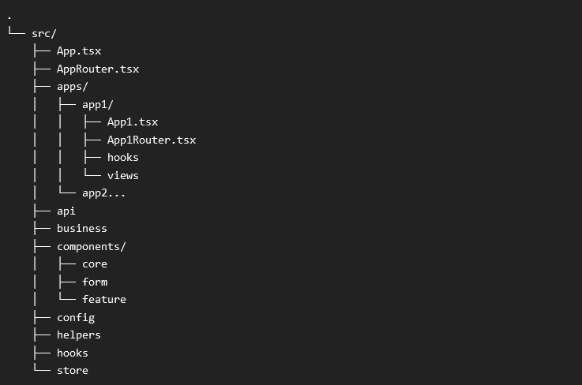

# React 应用程序文件夹结构

> 原文：<https://blog.devgenius.io/react-app-folder-structure-64ad8ee764d2?source=collection_archive---------0----------------------->

当使用或设置一个普通的 React 或 Create React 应用程序项目时，很难创建一个一致且可理解的文件夹结构。这是我的方法:

让我们分解每个文件和文件夹:

**App.tsx** 项目设置和初始化。第三方库可以在这里初始化。任何需要包装整个项目的提供者都应该在这里设置。例如，在我的工作场所，我们用一个用于 React-Query 的 QueryClientProvider、各种 React 上下文提供程序和一个 Redux store 提供程序来包装项目。如果您需要处理授权，那么在 App.tsx 和 AppRouter.tsx 之间添加一个中间组件来处理帐户信息获取、登录状态验证、会话有效性等可能是值得的。万一在设置过程中出现严重错误，将整个项目包含在错误边界中也不会有什么坏处。

**approuter . tsx
你的项目和 404 页面的顶级路线。嵌套路线可以在每个单独的应用程序中处理。为了减少包的大小，您可以使用 React.lazy 来延迟加载每个单独的应用程序，但是在使用这种方法之前，请确保您知道如何使用延迟加载的块来部署应用程序更新！用另一个错误边界包装您的路由器和路由。每条通向应用程序的路径都是惰性加载的，应该用一个带有适当后备组件的悬念组件来包装。如果需要，可以将应用程序路由封装在授权组件中，以根据用户类型限制对应用程序的访问。**

**apps /** 您的项目可能会增长到处理多个子应用程序。例如，您可能首先创建一个仪表板，然后被要求使用 react 重写前置网站。与其创建一个新的回购协议并建立一个新的项目，不如将这些项目分解到同一个项目和回购协议中的不同应用程序中。

**App【X】。tsx** 每个应用都有自己的入口点文件，很像 App.tsx，在那里完成特定应用的设置

**App[X]Router.tsx** 每个 App 处理自己的子路由。这里可以使用与 AppRouter.tsx 类似的技术和架构

**app[X]/Hooks** Hooks 专门用于该应用，但不用于整个项目

**app[X] / Views** 该特定应用的页面以及组成它们的组件。该文件夹的命名由您决定，根据您项目的需要，它可以很容易地重命名为特性或页面。

**api /** 来自你后端的 api 端点应该在这里。外部第三方 api 集成的端点也可以放在这里。如果使用 Typescript，Api 端点响应类型也应该在这里。可以在这里设置一套使用 React-Query 或等效替代方法的 api 挂钩来包装任何 api 端点。

**业务/** 核心业务逻辑。描述业务规则的函数、类和常量应该放在这里，而不是放在组件或钩子中。然后，可以将业务逻辑导入到各种组件和挂钩中。这将保持代码的整洁，并鼓励对核心业务功能进行广泛的测试。将业务逻辑代码分离到一个文件夹中的另一个原因是，如果编写的业务逻辑必须在任何其他 javascript 代码库中共享，那么这些代码可以提取到一个共享包中，并在项目间重用。

**组件/** 在应用和功能之间轻松共享组件是使用 React 的根本原因。在此文件夹中创建的组件旨在经常使用并跨应用程序使用。

**组件/核心** 您项目的基本构件。您可能会使用第三方组件库，因此可能已经为您创建了许多组件。即使这样，将这些组件包装在您自己的定制组件中也是很方便的，这样可以提供更多的控制并避免编写重复的代码。因为这里创建的组件将在应用程序中使用，所以它们易于使用是很重要的。对于复杂的核心组件，它可以帮助提供组件和一个初始化/助手钩子。可以驻留在该文件夹中的示例组件包括:LoadingButton、RadioGroup、RichTextEditor、ProfileIcon 等。

**组件/表单** /core 文件夹中组件的包装器，具有额外的表单相关功能。常见的附加功能包括:表单字段标题、描述、错误消息和必需的指示符。如果您计划使用 formik 这样的表单库，这个文件夹是使用 useField 钩子将 Formik 的 API 连接到您的组件的好地方。如果您的项目没有很多表单和输入字段，那么这个文件夹可能是不必要的

**组件/功能** 跨多个应用程序使用的大量工作。应位于该文件夹中的组件示例包括:共享页面、页眉、重复使用的表单部分(如地址组)、布局模板组件以及许多其他组件。要弄清楚该把什么放入这个文件夹，以及核心组件和特性组件之间的界限是什么，可能会很棘手。理想情况下，功能组件由多个内核或 Formik 组件组成，通常可以完成多项任务。

**配置/** 项目设置代码、全局变量、URL 等。这个文件夹在不同的项目中会有很大的不同。一个例子可以包括窗口变量初始化/读取、联网和获取设置等。

**助手/** 跨应用使用的有用功能。商业逻辑不应该写在这里。有用的助手的例子包括:日期助手，货币助手等。

**钩子/** 跨应用使用的共享钩子。因为每个应用程序都有自己的钩子文件夹，所以确保这个顶层钩子文件夹包含在多个应用程序中使用的钩子。有很多有用的钩子库，但是你最终可能会创建自己的钩子库。

**商店/** 您的全球商店。除非你的应用发展到一定的规模，否则你可能不需要建立一个全球商店。你很可能知道什么时候需要使用它。由于其性能，React 上下文并不理想，但是只要不经常更新值，它就可以工作。

**结论** 希望这个项目文件夹结构有用且直观。关于文件夹结构的几个细节被有意地留为开放性的，以促进讨论，并作为一种承认，这种结构不会为每个用例工作。在为您的 React 应用程序指定任何特定的文件夹结构之前，我强烈建议您阅读其他几篇关于 React 应用程序文件夹结构的文章，并与您的团队交流(如果适用)。

**延伸阅读**

React 文件结构:[https://reactjs.org/docs/faq-structure.html](https://reactjs.org/docs/faq-structure.html)

React 文件夹结构:[https://www.robinwieruch.de/react-folder-structure/](https://www.robinwieruch.de/react-folder-structure/)

React 文件/目录结构:[https://www.joshwcomeau.com/react/file-structure/](https://www.joshwcomeau.com/react/file-structure/)

**补充说明和澄清**

*香草反应*
非框架反应项目。例如，不使用 Nextjs 或 Remix。

*测试呢？* 测试文件的位置和结构由你决定，我个人倾向于把测试文件放在实现附近。我推荐读一些 Kent C Dodds 的文章，对测试有更深的理解。