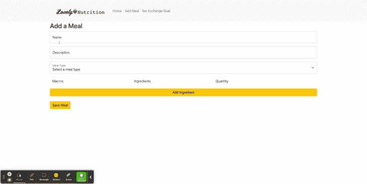

# React Bootstrap:创建受控表单，通过灵活的输入数量来添加和更新数据

> 原文：<https://blog.devgenius.io/react-bootstrap-creating-controlled-forms-to-add-and-update-data-with-a-flexible-number-of-inputs-6d2e4e6977c7?source=collection_archive---------1----------------------->

# 摘要

本文描述了如何使用 React Bootstrap 在一个受控表单中创建输入组。在使用下拉列表的地方，选项是从 API 获取的。每个输入组中的数据都被格式化为一个对象，其中每个输入都是对象中某个键的值。使用 useState 钩子将对象添加到对象数组中，并通过回调传递给父窗体。当在后端处理多对多关系以及使用嵌套数组或嵌套对象数组的 API 时，这非常有用。

# 介绍

自从我在熨斗学校开始编程以来，我一直想创建一个输入数量灵活的表单。例如，在我以前的项目中，我创建了一个表单，用户可以在其中创建一个游戏任务。我希望他们能够通过从游戏中选择角色来增加一个以上的角色，但是我不知道怎么做。在这个项目中，我正在为我妻子的公司[可爱的营养](https://www.lovely-nutrition.com/)制作一个膳食跟踪应用程序。她使用糖尿病交换列表，类似于减肥中心的积分系统，来帮助她的客户简化饮食，并帮助他们实现目标。当我开始使用交易所创建一个膳食追踪应用程序时，我知道我必须想出一种方法，让他们能够在食谱中添加配料，并更新这些配料的数量。

# 创建表单

首先，我创建了一个组件`AddMealForm`，并从 React 导入了 [useState](https://reactjs.org/docs/hooks-state.html) 钩子，为表单设置状态。我还从 [React Bootstrap](https://react-bootstrap.github.io/getting-started/introduction/) 中导入了我使用的组件。你不需要使用 Bootstrap，没有它也一样。在这个例子中，Bootstrap 只为表单提供样式。这里是 GitHub 上[回购的链接。](https://github.com/jsnidar/lovely-meal-tracker)

`meal_ingredients: []`将保存包含饭菜中每种配料信息的对象数组。其他值很简单。

# 服务器和 API 上下文

后端[是用 Ruby 构建的。我将从一个使用](https://github.com/jsnidar/phase-3-sinatra-react-project)[活动记录](https://guides.rubyonrails.org/active_record_basics.html)的数据库设置的 [Sinatra API](http://sinatrarb.com/) 中获取数据。这是数据库的 ERD。

如您所见,`meal_ingredients`是一顿饭的关联记录的连接表。它储存了一顿饭中每种配料的数量。配料表存储了每种配料的信息，如份量单位、数量和常量营养素类型。

GET 请求被设置为返回一顿饭及其配料的所有数据。

# 固定输入与可变输入

我在这里定义了一个**固定输入**作为一个将被渲染固定次数的输入。我将一个**变量输入**定义为一个可以被创建可变次数的输入。我不会详细介绍我是如何创建固定输入的，因为这些更简单。

# 设置可变输入

下面是我如何为表单编写变量输入。

我为每个输入的标签创建了一个`Col`,为删除按钮的位置创建了一个`Col`。这样，标签只会在添加的所有成分上面显示一次。

我设置了一个状态变量`listId`。当没有其他信息被添加到一个成分中时，我将它用作该成分的引用，当我在呈现组件时映射成分时，我将它用作一个键。React 要求当您通过循环创建多个组件时，每个组件都有一个唯一的键。

我创建了一个`addIngredient()`函数，该函数用默认值更新带有膳食成分对象的`formData`，并为`listId`设置状态以确保没有重复值。

我声明了一个变量`renderIngredients`来为`formData.meal_ingredients`对象数组中的每个对象创建一个`<AddIngredient/>`组件。对于`listId`,我通过了`listId -1`,因为自从它被赋值后就一直递增。

接下来，我创建了一个`AddIngredient`组件，它接收这些道具，并使用期望的输入进行渲染。

它呈现:

我使用在`AddMealForm`中声明的`updateIngredient`回调函数声明了处理每个输入变化的函数。

这里是`AddMealForm`组件中的`updateIngredient()`函数。

该功能接收更新后的`ingredientObj`，使用地图更新修改后的配料，并用更新后的信息设置`formData`。

我为宏和成分创建了下拉组件，并将它们导入到`AddIngredient`组件中。

`MacrosDropdown`看起来是这样的:

它为`macros`属性中的每个宏渲染一个`<option>`，并将默认值设置为传递下来的`macro`属性。`selectMacro`回调更新`AddIngredient`实例中的`mealIngredient`，并使用`updateIngredient`回调为`formData`设置状态。

`IngredientsDropdown`组件以类似的方式更新成分。

# 回顾

*   在`AddMealForm`组件中设置`formData`、`listId`和`ingredients`的状态。

*   `AddIngredient`是`AddMealForm`的子节点，它保存每种添加成分的输入。添加的配料带有一个`listId`，因为配料中没有其他数据可用作关键字。
*   一旦添加了配料，所有对配料的更新都用于通过回调来更新`formData`。当`formData`被更新时，表格再次显示更新后的信息。

当用户完成创建他们的食物时，`formData`包含这样的数据，可以用来通过 API 向服务器发送 POST 或 PATCH 请求。

希望这能帮助你创建一个像这样的表单，因为你也在学习编程！