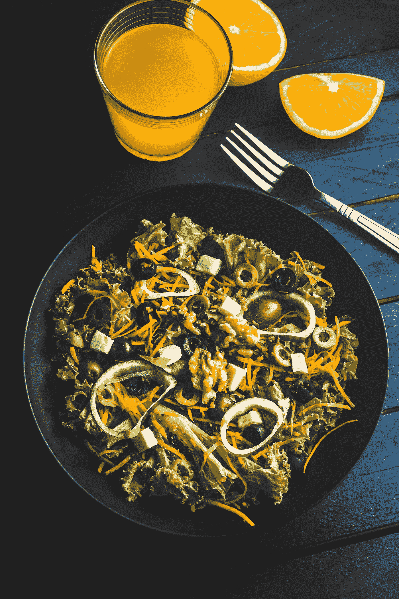

# React 引导—自定义覆盖

> 原文：<https://blog.devgenius.io/react-bootstrap-customizing-overlays-b51bb804794e?source=collection_archive---------5----------------------->


布鲁克·拉克在 [Unsplash](https://unsplash.com?utm_source=medium&utm_medium=referral) 上拍摄的照片

React Bootstrap 是为 React 开发的 Bootstrap 的一个版本。

这是一组具有引导风格的 React 组件。

在本文中，我们将了解如何使用 React Bootstrap 添加覆盖。

# 禁用元素

如果我们想在一个被禁用的元素上触发覆盖，我们必须从一个没有被禁用的包装元素上触发覆盖。

这是因为被禁用的元素不是交互式的。

例如，我们可以写:

```
import React from "react";
import "bootstrap/dist/css/bootstrap.min.css";
import Button from "react-bootstrap/Button";
import OverlayTrigger from "react-bootstrap/OverlayTrigger";
import Tooltip from "react-bootstrap/Tooltip";export default function App() {
  return (
    <>
      <OverlayTrigger
        trigger="click"
        placement="right"
        overlay={<Tooltip id="tooltip-disabled">Tooltip!</Tooltip>}
      >
        <span className="d-inline-block">
          <Button disabled style={{ pointerEvents: "none" }}>
            Disabled button
          </Button>
        </span>
      </OverlayTrigger>
    </>
  );
}
```

我们添加了`trigger`和`placement`道具，这样当我们点击 disabled 按钮时就可以看到工具提示。

这是可能的，因为我们在按钮周围有一个跨度，当这个跨度被单击时，我们可以触发工具提示。

# 更换容器

我们可以更改容器来控制覆盖图所附加到的 DOM 元素。

例如，我们可以写:

```
import React from "react";
import "bootstrap/dist/css/bootstrap.min.css";
import Button from "react-bootstrap/Button";
import Overlay from "react-bootstrap/Overlay";
import Popover from "react-bootstrap/Popover";export default function App() {
  const [show, setShow] = React.useState(false);
  const [target, setTarget] = React.useState(null);
  const ref = React.useRef(null); const handleClick = event => {
    setShow(!show);
    setTarget(event.target);
  }; return (
    <div ref={ref}>
      <Button onClick={handleClick}>click me</Button> <Overlay
        show={show}
        target={target}
        placement="bottom"
        container={ref.current}
        containerPadding={20}
      >
        <Popover>
          <Popover.Title as="h1">Title</Popover.Title>
          <Popover.Content>
            Lorem ipsum dolor sit amet, consectetur adipiscing <b>elit</b>.
          </Popover.Content>
        </Popover>
      </Overlay>
    </div>
  );
}
```

将弹出框而不是按钮附加到 div。

我们将`container`设置为 div 的 ref 的 ref。

代码的其余部分与其他 popovers 相同。

# 动态更新位置

弹出器的位置可以动态更新。

例如，我们可以写:

```
import React from "react";
import "bootstrap/dist/css/bootstrap.min.css";
import Button from "react-bootstrap/Button";
import OverlayTrigger from "react-bootstrap/OverlayTrigger";
import Popover from "react-bootstrap/Popover";const UpdatingPopover = React.forwardRef(
  ({ popper, children, show: _, ...props }, ref) => {
    React.useEffect(() => {
      popper.scheduleUpdate();
    }, [children, popper]); return (
      <Popover ref={ref} content {...props}>
        {children}
      </Popover>
    );
  }
);const longContent = `
  Lorem ipsum dolor sit amet, 
  consectetur adipiscing elit. 
  Cras ac urna bibendum, pretium magna id, 
  imperdiet erat.
`;
const shortContent = "Lorem ipsum";export default function App() {
  const [content, setContent] = React.useState(shortContent); React.useEffect(() => {
    const timerId = setInterval(() => {
      setContent(content === shortContent ? longContent : shortContent);
    }, 3000); return () => clearInterval(timerId);
  }); return (
    <>
      <style type="text/css">
        {`
        .btn-primary {
          position: absolute;
          top: 50vh;
          left: 0vw;
        }
      `}
      </style>
      <OverlayTrigger
        trigger="click"
        overlay={<UpdatingPopover>{content}</UpdatingPopover>}
      >
        <Button>click me!</Button>
      </OverlayTrigger>
    </>
  );
}
```

创建定期更改文本的工具提示。

我们有 th `UpdatingPopover`组件，它有`useEffect`钩子来观察变化。

我们调用`scheduleUpdate`来更新 popover。

我们观察`children`和`popper`属性的变化，以确保当这些变化发生时我们调用`scheduleUpdate`。

我们将 ref 和其他道具传递给 popover，这样就可以应用位置和其他东西。

`children`是我们工具提示的内容。

在`App`中，我们有`OverlayTrigger`，它的文本周期性地变化。

当我们点击按钮时它就会被触发。

工具提示的内容由`useEffect`回调中的`setContent`函数设置。

然后我们返回的函数是在卸载组件时清除计时器。



照片由 [Eiliv-Sonas Aceron](https://unsplash.com/@shootdelicious?utm_source=medium&utm_medium=referral) 在 [Unsplash](https://unsplash.com?utm_source=medium&utm_medium=referral) 拍摄

# 结论

我们可以让松饼充满活力。

此外，我们可以通过在禁用的元素周围添加包装器来触发覆盖。

我们可以指定要附加覆盖的容器。