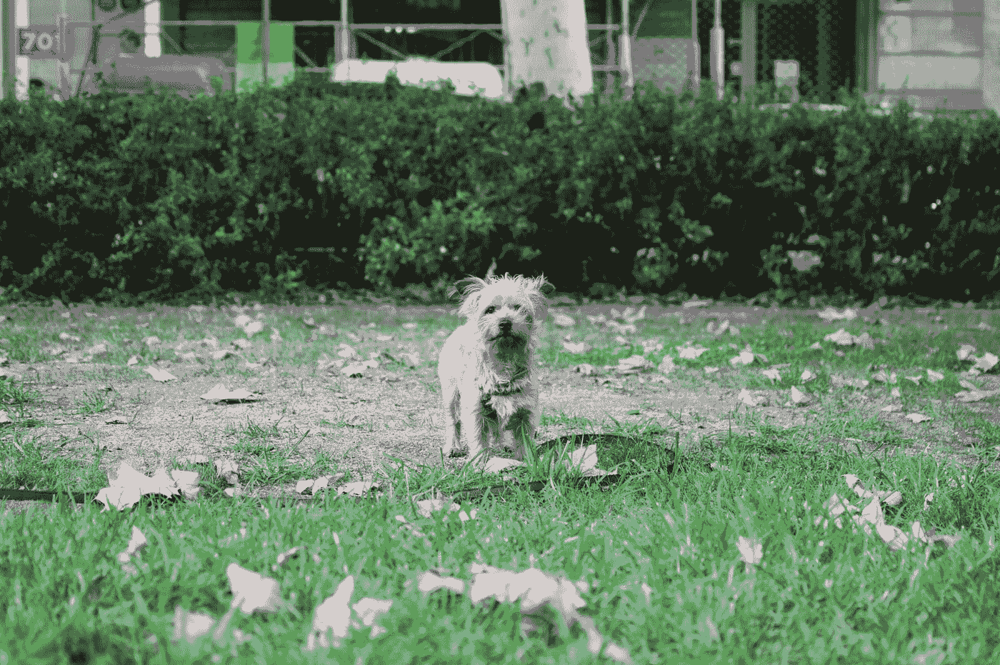

# 反应引导—下拉定制

> 原文：<https://blog.devgenius.io/react-bootstrap-dropdown-customization-b88e36dc423e?source=collection_archive---------2----------------------->



克里斯多夫·卡森在 [Unsplash](https://unsplash.com?utm_source=medium&utm_medium=referral) 上拍摄的照片

React Bootstrap 是为 React 开发的 Bootstrap 的一个版本。

这是一组具有引导风格的 React 组件。

在本文中，我们将了解如何定制 React 引导下拉菜单。

# 投放方向

我们可以改变下拉菜单的显示方向。

例如，我们可以写:

```
import React from "react";
import Dropdown from "react-bootstrap/Dropdown";
import DropdownButton from "react-bootstrap/DropdownButton";
import ButtonGroup from "react-bootstrap/ButtonGroup";
import "bootstrap/dist/css/bootstrap.min.css";export default function App() {
  return (
    <>
      {["up", "down", "left", "right"].map(direction => (
        <DropdownButton
          as={ButtonGroup}
          key={direction}
          drop={direction}
          variant="secondary"
          title={`Drop ${direction}`}
        >
          <Dropdown.Item eventKey="1">foo</Dropdown.Item>
          <Dropdown.Item eventKey="2">bar</Dropdown.Item>
          <Dropdown.Divider />
          <Dropdown.Item eventKey="3">baz</Dropdown.Item>
        </DropdownButton>
      ))}
      }
    </>
  );
}
```

我们用`drop`道具设定方向。

可以是`'up'`、`'down'`、`'left'`或`'right'`。

然后，下拉列表将分别显示在上方、下方、左侧或右侧。

# 下拉项目

我们可以添加下拉项目作为链接或按钮。

要改变我们的偏好，我们可以使用`as`道具。

例如，我们可以写:

```
import React from "react";
import Dropdown from "react-bootstrap/Dropdown";
import DropdownButton from "react-bootstrap/DropdownButton";
import "bootstrap/dist/css/bootstrap.min.css";export default function App() {
  return (
    <>
      <DropdownButton title="Dropdown button">
        <Dropdown.Item as="button">foo</Dropdown.Item>
        <Dropdown.Item as="button">bar</Dropdown.Item>
        <Dropdown.Item as="button">baz</Dropdown.Item>
      </DropdownButton>
    </>
  );
}
```

在菜单中创建带有按钮的下拉菜单，如`as`所示。

# 菜单对齐

菜单对齐方式可以更改。

我们可以用`alignRight`道具把它放在屏幕右侧。

例如，我们可以写:

```
import React from "react";
import Dropdown from "react-bootstrap/Dropdown";
import DropdownButton from "react-bootstrap/DropdownButton";
import "bootstrap/dist/css/bootstrap.min.css";export default function App() {
  return (
    <>
      <DropdownButton title="Dropdown button" alignRight>
        <Dropdown.Item as="button">foo</Dropdown.Item>
        <Dropdown.Item as="button">bar</Dropdown.Item>
        <Dropdown.Item as="button">baz</Dropdown.Item>
      </DropdownButton>
    </>
  );
}
```

我们添加道具来制作右边显示的下拉菜单。

# 菜单标题

菜单可以有自己的标题。

要添加它们，我们可以使用`Dropdown.Menu`组件。

例如，我们可以写:

```
import React from "react";
import Dropdown from "react-bootstrap/Dropdown";
import DropdownButton from "react-bootstrap/DropdownButton";
import "bootstrap/dist/css/bootstrap.min.css";export default function App() {
  return (
    <>
      <DropdownButton title="Dropdown button" alignRight>
        <Dropdown.Header>Dropdown header</Dropdown.Header>
        <Dropdown.Item as="button">foo</Dropdown.Item>
        <Dropdown.Item as="button">bar</Dropdown.Item>
        <Dropdown.Item as="button">baz</Dropdown.Item>
      </DropdownButton>
    </>
  );
}
```

添加标题。

使用`Dropdown`组件的长格式，我们可以编写:

```
import React from "react";
import Dropdown from "react-bootstrap/Dropdown";
import ButtonGroup from "react-bootstrap/ButtonGroup";
import "bootstrap/dist/css/bootstrap.min.css";export default function App() {
  return (
    <>
      <Dropdown as={ButtonGroup}>
        <Dropdown.Toggle variant="success">Dropdown Button</Dropdown.Toggle>
        <Dropdown.Menu>
          <Dropdown.Header>Dropdown header</Dropdown.Header>
          <Dropdown.Item eventKey="2">foo</Dropdown.Item>
          <Dropdown.Item eventKey="3">bar</Dropdown.Item>
        </Dropdown.Menu>
      </Dropdown>
    </>
  );
}
```

我们在`Dropdown.Menu`中有`Dropdown.header`。

# 菜单分隔线

`Dropdown.Divider`组件允许我们添加菜单分隔符。

例如，我们可以写:

```
import React from "react";
import Dropdown from "react-bootstrap/Dropdown";
import ButtonGroup from "react-bootstrap/ButtonGroup";
import "bootstrap/dist/css/bootstrap.min.css";export default function App() {
  return (
    <>
      <Dropdown as={ButtonGroup}>
        <Dropdown.Toggle variant="success">Dropdown Button</Dropdown.Toggle>
        <Dropdown.Menu>
          <Dropdown.Item eventKey="1">baz</Dropdown.Item>
          <Dropdown.Divider />
          <Dropdown.Item eventKey="2">foo</Dropdown.Item>
          <Dropdown.Item eventKey="3">bar</Dropdown.Item>
        </Dropdown.Menu>
      </Dropdown>
    </>
  );
}
```

我们在`Dropdown.Menu`中添加了`Dropdown.Divider`来分隔条目。

# 用户化

我们可以用多种方式定制款式。

例如，我们可以写:

```
import React from "react";
import Dropdown from "react-bootstrap/Dropdown";
import ButtonGroup from "react-bootstrap/ButtonGroup";
import "bootstrap/dist/css/bootstrap.min.css";export default function App() {
  return (
    <>
      <style type="text/css">
        {`
        .super-colors {
          background: rgb(34,193,195);
          background: linear-gradient(0deg, rgba(34,193,195,1) 0%, rgba(253,187,45,1) 100%);
        }
      `}
      </style>
      <Dropdown as={ButtonGroup}>
        <Dropdown.Toggle variant="success">Dropdown Button</Dropdown.Toggle>
        <Dropdown.Menu className="super-colors">
          <Dropdown.Item eventKey="1">baz</Dropdown.Item>
          <Dropdown.Divider />
          <Dropdown.Item eventKey="2">foo</Dropdown.Item>
          <Dropdown.Item eventKey="3">bar</Dropdown.Item>
        </Dropdown.Menu>
      </Dropdown>
    </>
  );
}
```

我们用渐变的`super-colors`类作为菜单的背景。

`className` prop 将按照我们的期望设置呈现元素的类名。

# 自定义下拉组件

我们可以创建自定义下拉组件。

例如，我们可以写:

```
import React from "react";
import Dropdown from "react-bootstrap/Dropdown";
import ButtonGroup from "react-bootstrap/ButtonGroup";
import FormControl from "react-bootstrap/FormControl";
import "bootstrap/dist/css/bootstrap.min.css";const CustomToggle = React.forwardRef(({ children, onClick }, ref) => (
  <div
    ref={ref}
    onClick={e => {
      e.preventDefault();
      onClick(e);
    }}
  >
    {children}
  </div>
));const CustomMenu = React.forwardRef(
  ({ children, style, className, "aria-labelledby": labeledBy }, ref) => {
    const [value, setValue] = React.useState(""); return (
      <div
        ref={ref}
        style={style}
        className={className}
        aria-labelledby={labeledBy}
      >
        <FormControl
          autoFocus
          className="mx-3 my-2 w-auto"
          placeholder="search"
          onChange={e => setValue(e.target.value)}
          value={value}
        />
        <ul className="list-unstyled">
          {React.Children.toArray(children).filter(
            child =>
              !value || child.props.children.toLowerCase().startsWith(value)
          )}
        </ul>
      </div>
    );
  }
);export default function App() {
  return (
    <>
      <Dropdown as={ButtonGroup}>
        <Dropdown.Toggle as={CustomToggle}>Dropdown Button</Dropdown.Toggle>
        <Dropdown.Menu as={CustomMenu}>
          <Dropdown.Item eventKey="1">baz</Dropdown.Item>
          <Dropdown.Item eventKey="2">foo</Dropdown.Item>
          <Dropdown.Item eventKey="3">bar</Dropdown.Item>
        </Dropdown.Menu>
      </Dropdown>
    </>
  );
}
```

我们创建了自己的`CustomToggle`组件来呈现我们自己的开关。

我们必须将 ref 从道具传递到我们的触发组件，这样 React Boostrap 就可以用于触发。

然后运行道具中的`onClick`功能打开菜单。

`children`有拨动的内容。

同样，我们也创建了一个`CustomMenu`组件。

我们从道具中获取`children`、`style`和`className`，并应用它们。

此外，我们添加了一个`FormControl`组件来设置我们输入时的`value`状态。

当我们输入时，菜单上的项目会被搜索项过滤掉。

因此只显示与我们输入的内容相匹配的条目。


照片由 [Gurdain Bharj](https://unsplash.com/@gurdain?utm_source=medium&utm_medium=referral) 在 [Unsplash](https://unsplash.com?utm_source=medium&utm_medium=referral) 上拍摄

# 结论

自定义下拉菜单有很多种方法。

我们可以制作自己的开关和菜单。