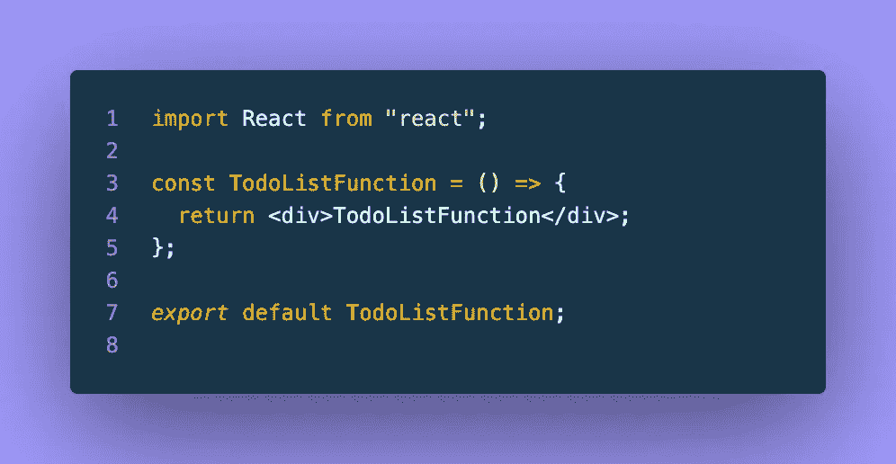

# React 类和函数待办事项列表

> 原文：<https://blog.devgenius.io/react-class-function-todo-lists-6361ae06369b?source=collection_archive---------1----------------------->


待办事项列表…可能是最基本的、独立的、概念验证的、几乎是最典型的应用程序实现。这个简单的应用程序想法亲切地将我们的注意力引向持久数据(至少在本地)和几种可能的条件渲染。在尝试新的库或前端框架时，这总是一个很好的“选择”。

我最近遇到了我对 React 类组件相当生疏的知识，主要是因为我在 99%的时间里选择了函数组件。然而，尴尬可以成为一个很好的动力。

因此，本文将重温类组件，这是任何 React 开发人员都必须具备的技能，并且旨在制作一个利用类和函数组件的待办事项应用程序。

首先，我们可以用 [create-react-app](https://create-react-app.dev/docs/getting-started) 创建我们的应用程序:

```
npx create-react-app class-and-function-todos
```

我们还将在最后安装[类名](https://www.npmjs.com/package/classnames)用于一些样式目的:

```
npm install classnames
```

然后从根目录启动应用程序:

```
cd class-and-function-todos
npm start
```

这是我们正在寻找的“待办事项”:

*   创建两个 todo 列表组件，一个作为类，一个作为函数
*   待办事项列表组件需要一个输入字段来创建新的待办事项
*   新的 todo 不应是空字符串
*   输入字段需要一个按钮来添加新输入的 todo
*   并且每个 todo 都应该在被单击时切换其换行属性值

为了保持有序，我们可以在 src 文件夹中添加一个“components”文件夹来存放我们的两个待办事项列表组件。我们将组件*称为 TodoListClass.jsx* 和*称为 TodoListFunction.jsx* 。

为了启动和运行，并确保我们正确地导入了每个组件，让我们快速地在 App.js 中呈现这两个组件。这是我的组件的开头看起来的样子:


src/App.js


src/components/todolist class . jsx



src/components/todolistfunction . jsx

这是我们拨入这些组件后 react 应用程序应该呈现的内容:


https://本地主机:3000

现在我们已经有了工作的文件夹结构和组件呈现，我们将开始处理类组件待办事项列表:


完成:src/components/todolistclass . jsx

到目前为止，我们已经有了一个类组件，它带有一个构造函数、两个事件处理程序和一个 jsx 的呈现方法，还不算太坏！为了更好地与下一个函数组件版本进行比较，我们来看一下这个类的每个部分。

第 5 行的构造函数方法用它的起始值初始化我们的本地状态，并将两个事件处理程序绑定到我们的类:handleSubmit & handleTodoClick。

在第 12 行，handleSubmit 将一个事件作为其参数，并执行 preventDefault 事件方法。这允许我们继续 handleSubmit 函数，而无需刷新浏览器，这是单击“Submit”类型的输入时的默认操作。

继续 handleSubmit，初始化一个 newTodo(第 16 行)，但是如果 newTodo 的标签为空，我们将立即退出这个函数；防止我们意外添加空白的牛顿体。

最后，我们使用类组件的 setState 方法将 newTodo 添加到我们的 Todo 列表中(第 24 行),然后清除输入字段(第 29 行),这样我们就可以重新开始，并使用输入字段添加额外的 todo。

handleTodoClick 方法被传递给每个 todo，这样它就可以切换它们的“done”属性，并在我们的 render 方法中利用第 61 行的线穿过样式。

进入 render 方法(第 42 行)，我们返回一个 react 片段，因为我们实际上有两个想要呈现的组件(div & style)。style 标签是一种简单的方法，它包含了切换 todo 列表项的换行功能所需的样式，而主 div 是呈现 todo 列表的地方。

我们在第 47–50 行为输入和 todo 列表中的按钮使用了一个不受控制的表单，然后映射 todos from 状态，将它们显示在输入字段下方。

虽然这看起来很多，但是当一次分析一部分时，组件的每个部分都很简单和直接。

接下来，我们将在函数组件中构建完全相同的功能:


已完成:SCR/components/todolistfunction . jsx

这个函数组件看起来非常类似于类组件，但是在语法上有一些不同。最明显的区别是使用钩子来管理状态(第 5–6 行)，用事件处理函数代替方法，用返回语句代替呈现方法。

我觉得这里要强调的最大区别是 useState 挂钩。并排查看这两个组件允许对状态管理执行进行比较和对比。即使是一个简单的待办事项应用程序也可以以一种有益的方式突出这些关键的实现差异:

*   构造函数与使用状态挂钩
*   this.setState vs setTodos(来自 useState 钩子的 setter)

此时，我们的应用程序应该看起来像这样:


已完成:https://localhost:3000

如果您需要复习任何一种类型的组件，请尝试用两种不同的方法构建相同的功能。无论您更喜欢其中一个，或者您所在的团队同时使用这两个组件，快速深入地研究函数和类组件都是很好的实践！