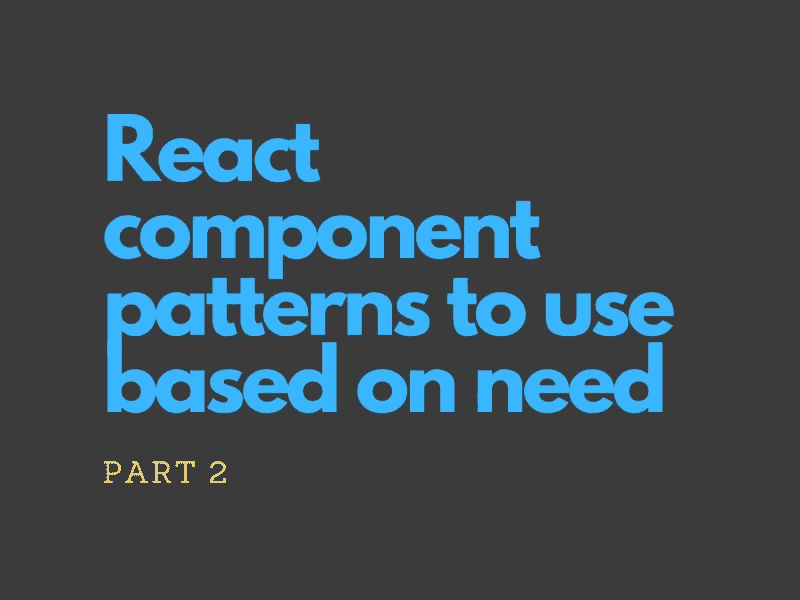

# 根据需要使用组件模式(第 2 部分)

> 原文：<https://blog.devgenius.io/react-component-patterns-to-use-based-on-need-part-2-e15270191cc9?source=collection_archive---------1----------------------->



在[第 1 部分](https://medium.com/dev-genius/react-component-patterns-to-use-based-on-need-part-1-55694f2e676e)中，我们讨论了什么是设计模式，它们在 React 中是如何发展的，以及我们需要问什么问题来定义我们组件的需求。然后我们详细研究了 React 钩子的使用，以及它们如何影响旧的模式，比如 H.O.Cs、容器展示器和渲染道具。

在本文中，让我们关注下一组我们可以思考的问题。但是，首先回顾一下，以下是最初的一组问题:

1.  **我们的组件中有逻辑吗？**
2.  许多组件都应该遵循层次结构吗？
3.  **我们给多个组件发的是同一套道具吗？**
4.  **我们是否有需要重置的状态？**
5.  用户应该对组件的行为有更多的控制权吗？
6.  **还有其他杂项需求吗？**

我在这一部分处理问题 2 和 3。

## 许多组件都应该遵循层次结构吗？

如果你有一个组件的许多功能部分，那么把它分割成连接在一起的更小的组件是有意义的。从长远来看，一个单一的、臃肿的组件将会成为维护的噩梦，因为它违反了软件设计的多个原则。

现在出现的问题是，我们如何管理被创建的组件之间的交互？一个主要的看点是一种****的等级关系*** 。*

*只要有父子关系，我们就可以考虑**复合组件**模式，看看它是否符合要求。我在第 1 部分中简要讨论了这种模式。*

```
*<Parent {...parentProps}>
    <Child {...childProps} onClick={onClick} />
    <Child {...childProps} />
</Parent>*
```

*使用复合组件背后的主要思想是， ***父组件可以包含子组件共享的状态，同时子组件通过回调*** 将它们的更新共享给父组件。`<select>` & `<option>` HTML 标签就是这种模式的组件的例子。*

*这种结构的好处是:*

*   ***可定制性**:选择如何在父组件中排序子组件的能力*
*   ***状态的隐式共享**:用户不必知道父节点和子节点之间的共享状态，因此不必将它们定义为道具。*
*   *没有**没有钻柱*。我们可以为孩子定义独立于父母的道具，反之亦然。一个简单的代码片段就足以说明这种好处:****

```
*// Single, bloated component:
<SingleBloatedComponent prop1 prop2 propForSubFunctionality />
// Assume that the component internally renders another component for the sub-functionality where it will have to pass in propForSubFunctionality again as a prop // Compound component:
<CompoundComponentParent prop1 prop2>
    <SubFunctionalityChildComponent propForSubFunctionality />
</CompoundComponentParent> />*
```

*构建复合组件的两种方法:*

*   *在渲染过程中使用`children`道具并在上面贴图。克隆每个孩子，并使用附加道具渲染一个增强组件，即将父组件的状态作为道具共享给孩子。*
*   *使用上下文 API 在父节点和`children`节点之间共享状态*

*为什么要使用**上下文 API** ？是因为它让 ***的图案变得灵活*** 。我们可以在不使用这个 API 的情况下构建一个复合组件。然而，我们将面临一个无法克服的挑战: ***我们如何与非直系子女共享状态？****

```
*// Context API not needed:
<Menu>
    <MenuItem />
    <MenuItem />
</Menu> // Context API needed (or some type of prop-drilling):
<Menu>
    <div style={{ margin: "5px" }}>
      <MenuItem />
    </div>
    <Container topDivider>
      <MenuItem />
    </Container>
</Menu>*
```

*决定使用上下文 API 本质上是在灵活性和简单性之间进行权衡。*

**实施步骤:**

*   *识别父对象中的`children`道具。在渲染中使用它。*
*   *在父项中创建一个上下文来存储共享数据(如果有)。我们必须在内部使用另一种模式:由`React.createContext`提供的*上下文提供者*模式*
*   *将孩子包在提供程序中，以便他们稍后可以使用`useContext`钩子访问它*

*作为一个*偏好问题*，我们也可以这样命名复合组件集:*

```
*// ...
const Menu = () => { /* ... */ }
// ...
Menu.Button = () => { /* ... */ }
Menu.Item = () => { /* ... */ }
// ...
export default Menu;// Usage:
<Menu hideButtons>
  <Menu.Button />
  <Menu.Button />
  <Menu.Item />
</Menu>*
```

*当我们想要明确地通知用户开发人员希望包装在父组件中的组件类型时，这是很有帮助的。*

*最后，即使使用了上下文 API，我们的子组件和父组件也没有完全分离。甚至在子元素中使用父元素的上下文也会使它变得不纯。如果你想使用完全依赖道具的高度解耦的、松散的组件，就像第 1 部分解释的那样回退到渲染道具。*

***关于上下文 API 和提供者的说明***

*这个 API 帮助维护整个应用程序的全局状态。但是，在任何地方使用它时都要小心，因为只要上下文发生变化，所有依赖组件都会重新呈现。*

*在复合组件内部，如果我们希望避免更新太多使用上下文 API 的子组件，并且在子组件的呈现上不需要太多的灵活性，我们可以通过访问父组件中的`children` prop 来简单地与直接子组件共享状态。*

```
*const ParentComponent = (props) => {
  // ...
  return (
    props.children.map(child => 
      /* Embellish the child with props and return it */
    )
  )
);*
```

## *我们是否向多个组件发送同一组道具？*

*到目前为止，我们已经看到了如何根据结构来构造我们的组件，即使用钩子来分离逻辑&使用复合组件来管理层次和交互。带着这个问题，重点是管理道具。*

*有时候我们想:*

*   *将同一组道具发送到一个组件*
*   *将一组道具发送到多个组件实例，而不是一个*

*在这种情况下，我们可以对道具集进行分组，并创建一个可重用的集合。这有助于保持代码*干燥*。这实际上是一种被称为**道具集合**的模式。*

```
*// No pattern:
<SomeComponent prop1={1} prop2={2} prop3={3} uniquePropA />
<SomeComponent prop1={1} prop2={2} prop3={3} uniquePropB /> // Props collection:
const collection = { prop1: 1, prop2: 2, prop3: 3 }
// ...
<SomeComponent {...collection} uniquePropA />
<SomeComponent {...collection} uniquePropB />*
```

*我能想到的使用道具集合的最好例子之一就是收集 ***辅助功能*** 道具。考虑下面的例子:*

*注意，我们总是向多个元素发送相同的`role`、`tabIndex`和`ariaDisabled`道具，每次都使用相同的值。这是多余的，重复了太多的代码！*

*通过 Props collection，我们可以使代码可重用:*

*这种模式适合于*分组*一套常用的道具。然而，如果这些道具相似，但组件之间不精确，会发生什么？*

*有没有一种方法可以解释道具收藏中的微小变化？*

```
*What if we have two requirements for the props? 
1\. { tabIndex: 0,  role: "button",  "aria-disabled": false }, and
2\. { tabIndex: 0,  role: "button",  "aria-disabled": true }*
```

*我们需要的是 ***的灵活性来覆盖集合中的某些道具*** 。要做到这一点，我们可以使用一个相关的模式，称为 **Props getter** 。*

*道具获取器类似于一个道具集合，但是它是一个 ***函数*** 而不是一个对象，该对象允许以能够定制返回的道具的方式调用它。有了这种能力，我们可以使用同一套道具，但也可以根据用户的需要定制它们。*

*对于我们的示例片段，假设我们有一个组件接受一个用于处理按钮点击的`onClick`道具。开发人员在 Props 集合中添加了一个方法，作为默认的处理程序。如果用户想要添加一个自定义的点击处理程序，它不会覆盖默认的，但是会被触发呢？我们可以使用 Props getter 模式来处理这种情况。*

## *摘要*

*   *将单个膨胀的组件分解成相互作用的小组件*
*   *如果交互是分层的，考虑使用复合组件模式。它允许父节点和子节点之间共享状态，并且可以使用回调来通知子节点的更新*
*   *该模式有利于可定制性，因为它允许我们在避免钻取道具的同时，对父组件中的子组件重新排序*
*   *上下文 API 是实现复合组件的好方法，它在内部使用提供者模式。小心使用它，因为当它改变时，它会根据上下文更新每个组件(这是一个性能问题)*
*   *为了保持模式的简单性并仅限于直接的子组件，不要使用上下文 API，而是依赖于`children`属性来与子组件共享状态。或者，考虑对完全解耦的纯组件使用 Render Props 模式*
*   *使用道具集合模式预先定义一组不变的公共道具*
*   *为了定制一组公共道具&覆盖其中的一些，我们可以使用一个道具 getter 函数来代替集合*

## *进一步阅读*

*在第 3 部分的最后一篇文章中，我将讨论关于状态处理的模式，为组件的用户提供更多的控制，以及其他一些概念。*