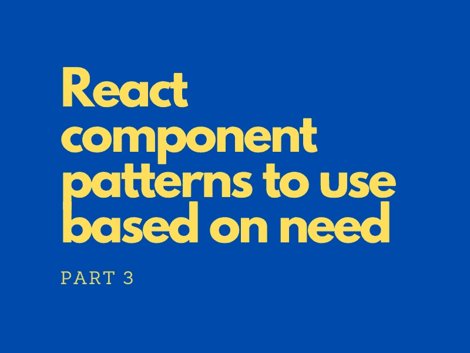

# 根据需要使用组件模式(第 3 部分)

> 原文：<https://blog.devgenius.io/react-component-patterns-to-use-based-on-need-part-3-4d524eae9561?source=collection_archive---------3----------------------->



在本系列的 [1](/react-component-patterns-to-use-based-on-need-part-1-55694f2e676e) 和 [2](/react-component-patterns-to-use-based-on-need-part-2-e15270191cc9) 部分，我们讨论了前三个问题，包括钩子、容器、hoc、渲染道具、复合组件、道具集合和道具获取器。

到目前为止，我们看到的模式都是关于组件的结构、它们的交互和道具。在这最后一部分，让我们向内看，看看如何从组件用户的角度管理状态。

**问题**:

*先前已解决:*

1.  我们的组件中有逻辑吗？
2.  许多组件都应该遵循层次结构吗？
3.  我们是否向多个组件发送同一组道具？

*本文将讨论:*

1.  **我们是否有需要重置的状态？**
2.  用户应该对组件的行为有更多的控制权吗？
3.  **还有其他杂项需求吗？**

## 我们有需要重置的状态吗？

有些组件需要比其他组件更易于配置。除了它们是有状态的，我们还可以考虑它们是否需要:

*   *用 props 提供的值初始化*，即组件的初始值不需要硬编码
*   具有将状态复位到初始状态的能力

这种模式的常见例子通常是数字，如触发器和计数器。出于原创的原因，我选择了一个电子邮件列表项，类似于你打开电子邮件账户时看到的内容。“已读”状态可以通过项目内的按钮重置。

在这个例子中，我们传入一个属性作为状态的初始值。如果缺少它，我们可以默认为硬编码的值，使它更灵活。如果用户想将状态重置为初始状态，他可以点击触发`resetRead`方法的“重置”按钮。简单吧？

在实际开发中，仅仅重置状态可能还不够！大多数情况下，**副作用**需要运行。例如，我们需要在重置时将`hasRead`状态保存在后端。

请记住，在重置过程中，一定要处理好副作用！在下面的代码片段中，我们在重置时调用一个父组件方法，它可以作为一个属性传入。

现在我们的代码可以初始化状态，提供重置功能，并处理重置过程中的副作用！由于所有这些都是组件的*逻辑*部分，如果需要重用，我们可以将其提取到一个*钩子*中。

## 用户应该对组件的行为有更多的控制权吗？

“控制”这个词让人想起了组件的*控制支柱*的概念，其中子组件的值总是由状态驱动。通常，表单元素如<输入>被控制。例如:

```
[email, setEmail] = useState('');
// ...
<input value={email} onChange={(e) => setEmail(e.target.value)} />
```

背后的*想法*很简单:给组件的用户更多的控制权！为了实现这一点，我们需要提供一个值和一个处理程序来更新这个值。

控制道具对于简单的用例来说已经足够了，但是当事情变得更复杂时会发生什么呢？我们会继续添加和元素数量一样多的值和处理程序吗？显然，这并不理想，因为它变得难以维护。

**状态缩减器**模式非常适合这种情况。非常适合 ***反转状态*** 的控制，即允许用户根据自己的需求 ***进行管理。***

我们可以使用`useReducer`钩子来管理多个状态字段，然后传入一个*自定义缩减器*到*覆盖*部分或全部默认的状态字段，这样组件的用户就可以从外部控制组件。

状态缩减器有用的另一个原因是 ***可组合性*** 。我们可以通过选择&组装不同的元素来增强功能，而不是修改单个元素。

让我们构建一个产品搜索过滤器，允许您选择一种服装类型&一组颜色，然后单击 search 显示结果。大概是这样的:


首先，假设逻辑都在组件本身内部。我们有两种状态，每种过滤器对应一种状态，即产品和颜色。条件是我们只能选择一种产品，而且要多少颜色都可以。

我们已经可以将组件的“逻辑”部分抽象成一个钩子了！由于我们要处理多个过滤器的选择，我们可以使用一个`useReducer`和`dispatch`动作来代替管理许多`useState`钩子。

以下示例显示了重构后的组件:

如果一个 ***新要求*** 要求我们以这样一种方式扩展代码，如果选择了“t 恤”&“黑色”，那么颜色“午夜蓝”必须自动添加到搜索中，即一般行为的例外，该怎么办？如果这个组件被多个实体使用，并且每个实体都有自己的异常，那该怎么办？在这种情况下，我们将*而不是*能够修改我们的减速器和吊钩以满足所有需求！

我们必须向我们的 API(组件)的消费者提供更多的控制，以便他们可以定制其行为。我们不能用简单的控制道具做到这一点，因为它会变得太复杂。相反，传入一个**定制的缩减器**，它可以*覆盖*默认的缩减器！

更新我们的钩子，使用一个 reducer 道具，或者像这样回到默认状态:

```
const useProductSearchFilter = (**reducer = productSearchFilterReducer**) => {
  const [{ product, colors }, dispatch] = useReducer(
    **reducer**,
    initialProductSearchFilterState
  ); // ...});
```

组件也可以类似地更新:

```
const ProductSearchFilter = ({
  products = [],
  colors = [],
  sizes = [],
  onSearch = () => {},
  **reducer**
}) => {
  const {
    product,
    colors: selectedColors,
    selectProduct,
    selectColors
  } = useProductSearchFilter(**reducer**); // ...});
```

因此，消费者可以添加例外，即如果满足以下条件，我们必须自动将“午夜蓝”颜色添加到搜索中:

请注意，消费者可能需要访问默认缩减器。

## 还有其他杂七杂八的需求吗？

在本节中，我不想讨论任何一种模式。我补充是为了全面。一旦我们选择了一个模式，还需要考虑其他的实现。问这个问题会让你有意识的去思考他们。

除了选择模式，我们应该认识到优化的需要，比如用`useCallback`或`useMemo`来记忆函数。

有时，由于性能的限制，一个特定的模式，尽管非常适合我们的需求，可能并不是实际的方法！

## 摘要

*   如果你需要设置一个初始状态并重置为初始状态，使用状态初始化器模式
*   在状态初始化模式下的重置过程中处理必要的副作用
*   如果状态变得太复杂，不建议使用控制属性来控制组件
*   状态缩减器模式允许组件的消费者提供一个定制的缩减器来覆盖默认的缩减器
*   状态缩减器是一个很好的模式，可以将我们的状态控制转化给消费者，并实现可组合性

这是如何根据需要选择反应模式的系列文章的最后一部分。希望你觉得有用！(参见[第一部分](/react-component-patterns-to-use-based-on-need-part-1-55694f2e676e) & [第二部分](/react-component-patterns-to-use-based-on-need-part-2-e15270191cc9))

(我在其他平台也很活跃。主要是，[LinkedIn](https://www.linkedin.com/in/pushkar-desai-811a75102/)&[Twitter](https://twitter.com/pushkardk)