# React 上下文 API:入门

> 原文：<https://blog.devgenius.io/react-context-api-getting-started-6f396866bbfe?source=collection_archive---------8----------------------->

React 的上下文 API 是 React 内置的一个方便的工具，它允许您以一种简单明了的方式在组件之间共享您的状态。例如:

*   当您的状态在父组件中定义，但在深度嵌套的组件中需要时。或者，
*   您可能有许多组件都需要的状态，导致需要多次重复代码

Context 允许您神奇地将数据传输到任何需要的地方，而不需要钻取(通过许多组件传递数据，只是为了将数据传递到一个深度嵌套的组件)。

context API 经常被比作`Redux.` Redux，然而，它是一个更健壮的状态管理库，提供了许多功能来帮助管理您的状态，包括但不限于 Redux devtools，以及修改您的状态的简单方法。Redux 也在幕后使用了上下文 API。这并不意味着你只能使用其中的一个。在同一个应用程序中使用 Context API 和 Redux 的 react 应用程序很常见，但用于不同的状态需求。

本文是关于如何开始使用功能组件的上下文 API。你只需要知道反应的基本原理就可以了。

假设我们有一个非常简单的应用程序，TodoManager，其代码库如下:

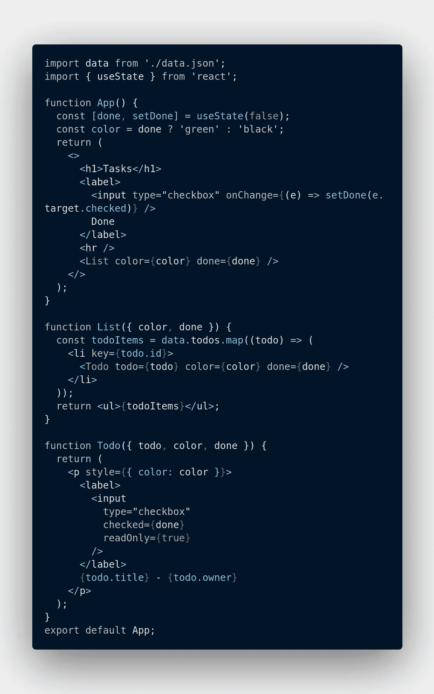

React 中的支柱钻孔示例

在代码中，我有三个组件。App 是顶级父组件。List 用于呈现待办事项列表。Todo 处理单个 todo 将如何显示。

在`App`父组件中，定义了两个状态，`color`和`done.`这两个状态在列表组件中不是必需的，但在`Todo`组件中是必需的。目前，我们使用 prop-drilling 将这些状态片段传递给中间的所有组件，只是为了将该状态传递给底层组件。这可能很难管理，尤其是如果代码库很大并且逻辑更复杂的话。这就是`context`的用武之地。我们可以重构上面的应用程序，这样我们就不必通过不必要的组件传递`done`和`color`。相反，我们将在需要的地方直接消费它们。

# 如何使用上下文

下面是使用 react 的上下文 API 时要遵循的步骤。

## 第一步。创建上下文

这是通过`createContext`函数实现的，该函数接受一个可选的默认值。在本例中，我为`color`信息构建了一个上下文。默认值为蓝色。

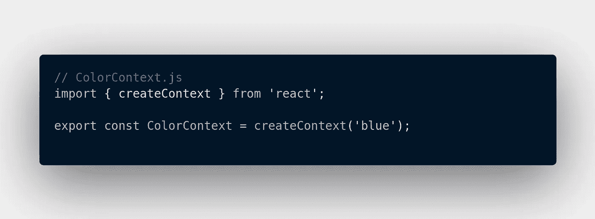

CreateContext 确实如其名。它还返回包含两个关键部分的 object:`Provider`和`Consumer`。这些将在下面的章节中讨论。

## 第二步:利用上下文

有了上面创建的上下文，现在我们可以在实际需要`color`的子组件中使用上下文。

这样，代码看起来像这样:

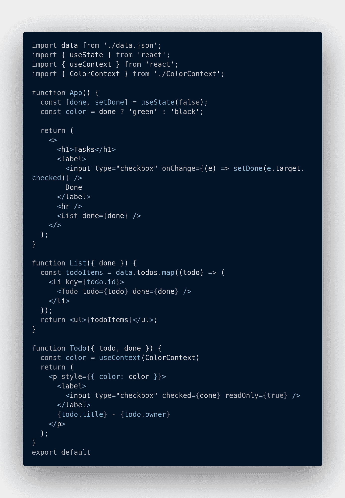

请注意，我不再将`color`传递给`List`。`Todo`组件现在直接调用`useContext`来访问上下文值。

`useContext`是一个方便的钩子，允许任何组件访问颜色上下文值。

此刻，所有的任务都有一个颜色`blue`，这是我们指定的默认值。您可以将默认值视为一个后备选项。当消费组件(在本例中为 Todo)没有包装在`Provider`组件中时，React 将使用这个值。因此，默认值当前是静态的，不能从上下文文件外部更改。

# 提供商和消费者

您将使用上下文值的`child components`包装在`Provider`组件中。这允许子节点订阅上下文值。这意味着当上下文值改变时，子元素会自动更新。`Provider`组件接受一个`value`属性，该属性定义了您希望与消费的子组件共享的数据。

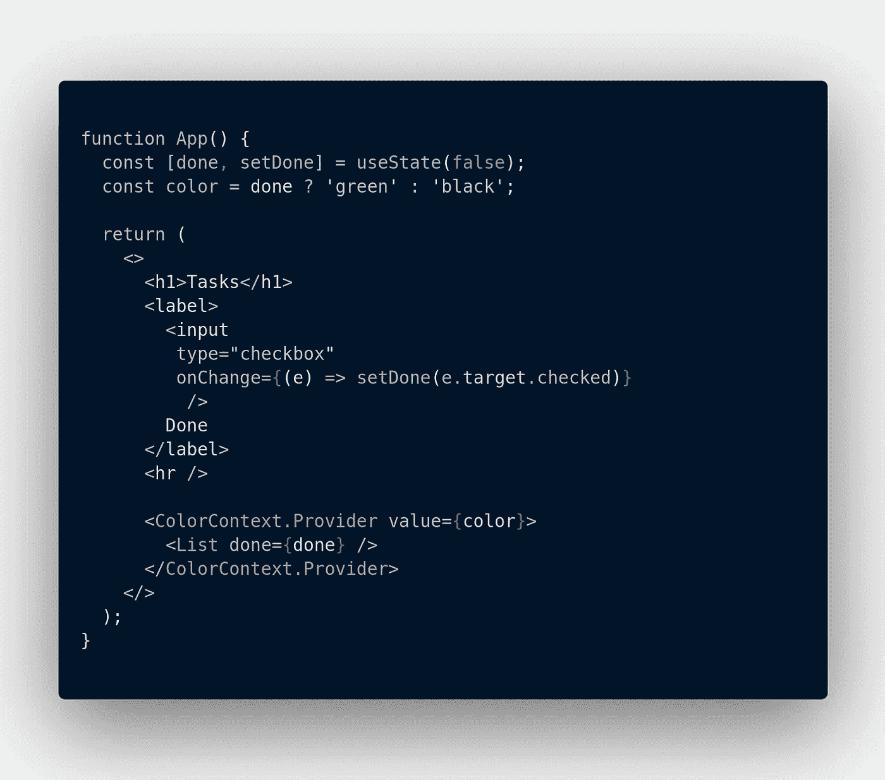

使用提供程序组件

因为我们用提供者组件包装了`List`组件，所以`List`的任何子组件现在都可以访问 ColorContext 中的任何值。

提醒一下，这是`Todo`组件的样子:

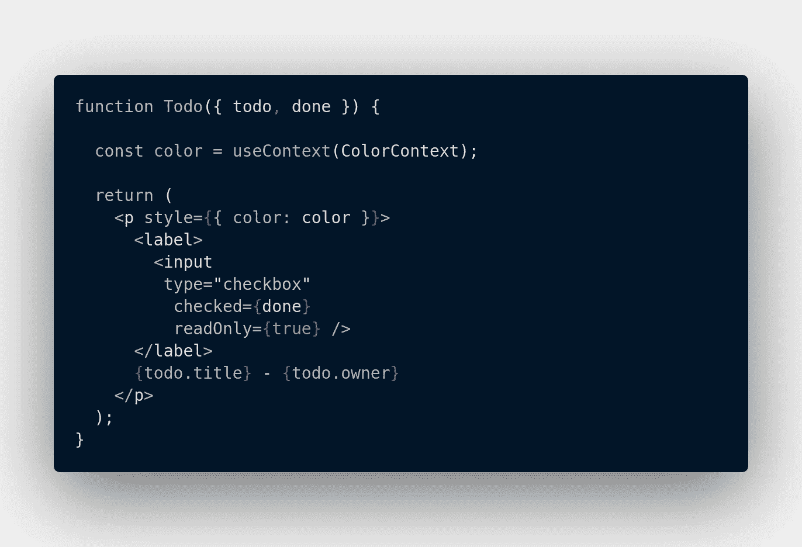

消费语境

现在，todos 根据`done`的值在绿色和黑色之间切换，这是由顶级 App 组件确定的。

对于提供者如何工作，一个简单的心理模型是考虑 CSS 继承。如果有一个顶级的`div`包装在其他元素周围，那么这些元素就会呈现在顶级 div 中定义的任何颜色。每当您更改 div 颜色时，它内部的元素也会更改以匹配它们的父 div。

## 旁注…

我们之前提到过`Consumer`组件。这是消费上下文的“遗留”方式。不使用方便的`useContext`，代码应该是这样的:

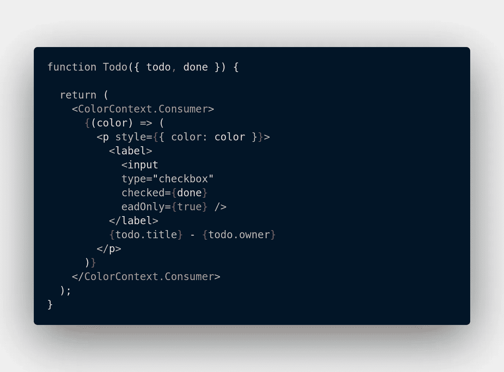

使用消费者组件

您用`ColorContext.Consumer`包装代码，然后使用`renderProps`从上下文提供者中“提取”值。然而，这是一种古老的做事方式，你应该使用`useContext.`

# 上下文 API 和自定义挂钩

我最喜欢的使用上下文 API 的方式是通过一个定制的钩子。在每个需要上下文值的地方调用`useContext()`都很好，但是我更喜欢调用一次，并在子组件中使用自定义钩子，正如我们将看到的。

在 React 中，定制钩子的全部目的是避免重复你自己。当您有一些在不同组件中不断重复的状态逻辑时，您知道是时候将它放入一个自定义钩子中了。这使得您的代码更整洁，更易于维护，因为您的状态逻辑是在一个地方定义的，因此易于修改和/或维护。

在前面的代码中，我们仍然通过列表组件将`done`状态“钻取”到 Todo。我们将改变这一事实。

## 步骤 1:创建一个“增强的”提供者组件

在 ColorContext.js 文件中，我将创建一个定制的 provider 组件。提供者组件现在将处理`color`和`done`状态，以及我将来可能添加的任何其他状态。因此，我将把它从`ColorContext`重命名为`StatusContext`，因为它现在处理的不仅仅是颜色方面。

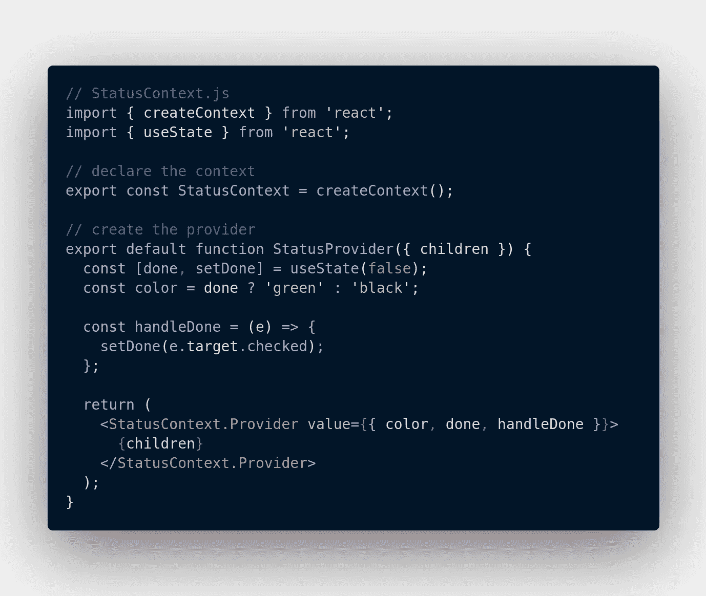

我已经声明了我的状态片段和它们的逻辑，然后通过调用真正的`Provider`组件并将这些状态和处理程序传递到`value` prop 中来返回它们。

## 步骤 2:用提供者包装必要的孩子

在我们的例子中，甚至父组件`App`也依赖于上下文，因为它拥有`done`复选框。因此，我将调用条目文件 index.js 中的提供者。

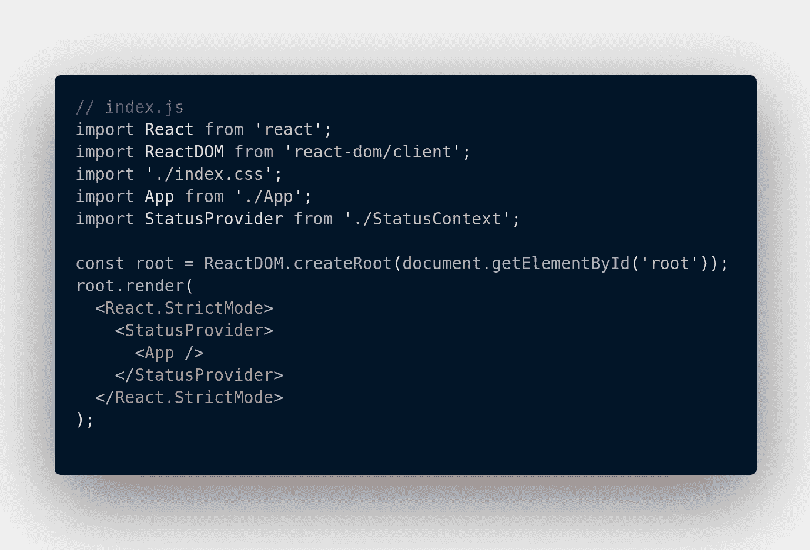

用提供者包装应用程序组件

现在，我们在`StatusProvider`组件中返回的所有内容在整个应用程序中都是可用的。此时，您可以通过调用子级中的 useContext 来读取上下文值。一种更简单、更干净的方法是为此定义一个自定义钩子。

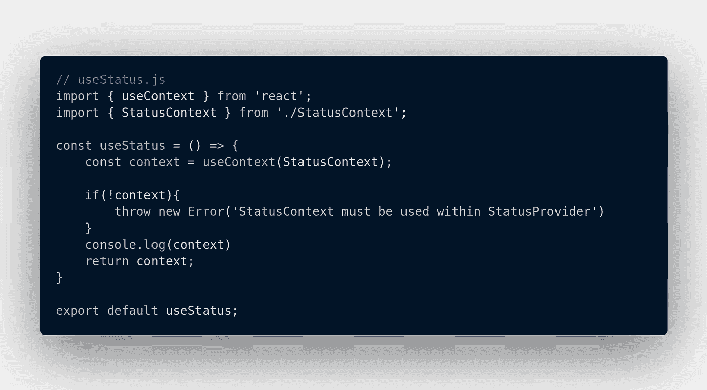

上下文自定义挂钩

这也允许您进行一些错误处理。如果您忘记用`StatusProvider`包装子组件，然后仍然从任何子组件中调用`useCount hook`，您将在控制台中得到以下错误:

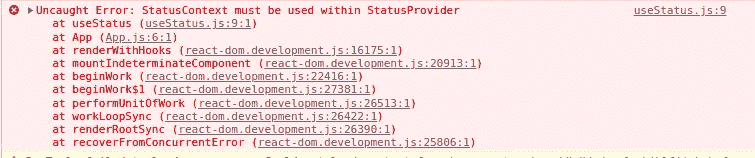

上下文错误消息

## 步骤 3:使用自定义挂钩

现在访问上下文值很容易。用`StatusProvider`包装`App`组件保证了您可以从 react 应用程序中的任何地方访问上下文值。如果您的上下文值是整个应用程序都需要的值，这可能会很方便。例如，诸如用户是否登录、他们的用户名等认证值。

我们组件的最终状态:

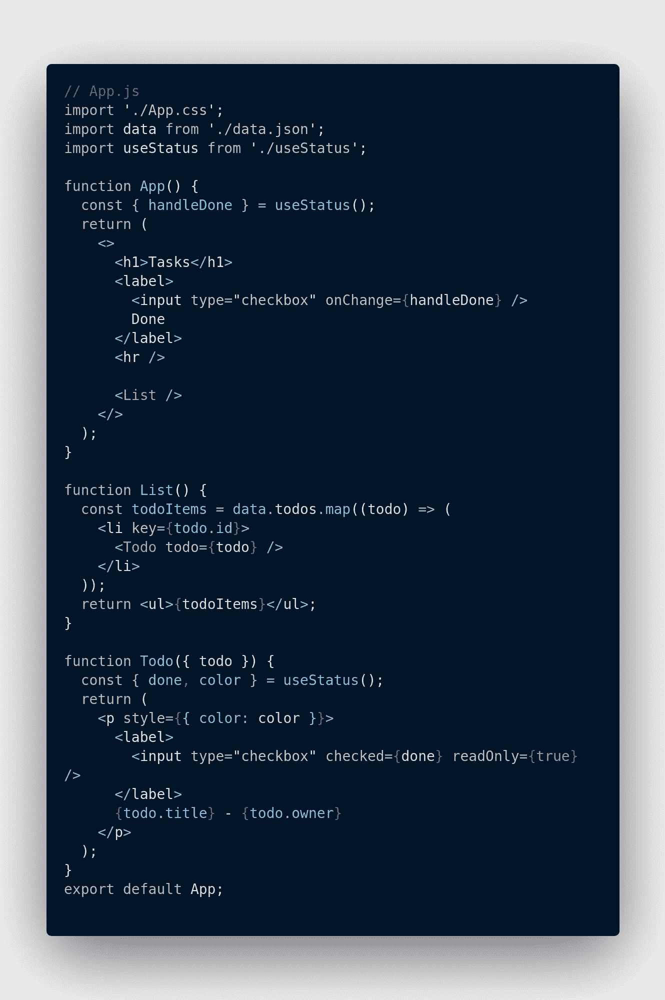

App.js 中的自定义挂钩

`useStatus`钩子返回一个包含三个值的对象，`done,` `color,`和`handleDone.`只要需要这些值，我们就调用钩子和[析构函数](https://developer.mozilla.org/en-US/docs/Web/JavaScript/Reference/Operators/Destructuring_assignment)我们需要的任何属性。

# 结论

在本文中，我们讨论了如何用`createContext` 创建上下文，以及如何用`context.Provider`向孩子提供上下文。我们还看到了如何使用`useContext` hook 或遗留`context.Consumer`组件来使用上下文。最后，我们看了如何使用带有自定义钩子的上下文。