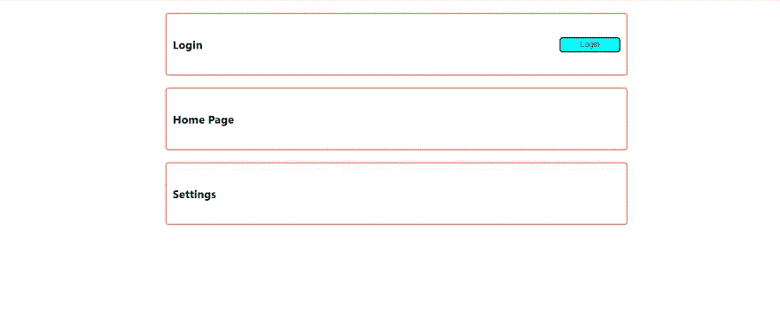
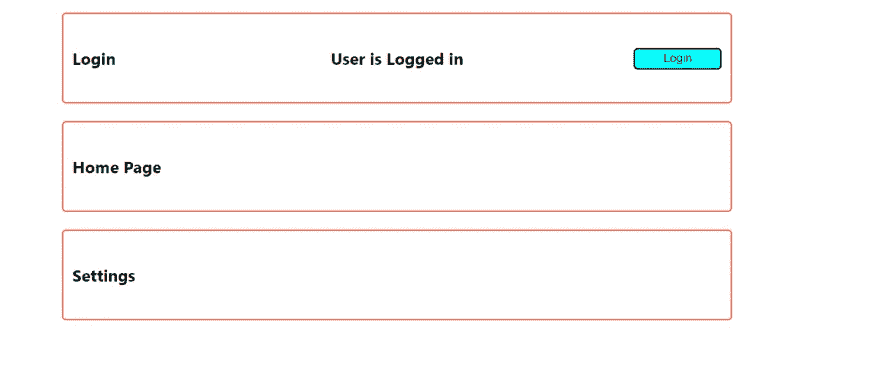

# 使用类型脚本反应上下文 Api

> 原文：<https://blog.devgenius.io/react-context-api-using-typescript-9d54e1c921dd?source=collection_archive---------0----------------------->


反应上下文 Api

# 介绍

React 上下文 API 提供了一种在不传递属性的情况下向下传递数据的方法。这在传递组件树的全局数据时很有用。例如，多语言应用程序中的当前认证用户、主题和首选语言。这有助于避免**支柱钻孔**的问题。
我们将构建一个包含多个组件的应用程序，其中将维护用户是否登录的全局状态。该状态将通过上下文在组件间共享。

如果你想在 YouTube 上学习这个教程，可以点击下面的链接。

GitHub 上提供了最终的解决方案

[](https://github.com/tndungu/React-Context-Api-Project) [## GitHub-tndungu/React-Context-Api-Project:一个使用上下文 Api 管理全局…

### 一个有 3 个组件的应用程序，登录，主页和设置，演示了使用 React 上下文管理全局状态…

github.com](https://github.com/tndungu/React-Context-Api-Project) 

# 先决条件

本教程假设您对使用带有 React 的 TypeScript 有一些基本的了解。你可以通过[类型脚本和](https://medium.com/dev-genius/typescript-with-react-tutorial-8a147b36903d)反应教程来开始。

# 应用程序开发:分步指南

要启动新的 typescript 应用程序，请使用以下命令

*   **纱线**:

```
yarn create-react-app context-typescript-app --template typescript
```

*   npm :

```
npx create-react-app context-typescript-app --template typescript
```

cd 进入学生应用程序，如果使用 npm，则进入`yarn start`或`npm start`。

在`src`文件夹中，我们将创建一个名为`components`的文件夹。在这个文件夹中，让我们创建 3 个简单的组件`Login`、`Home`和`Settings`。它们将如下所示:

```
//Login.tsx
export const Login = () => {
    return (
        <>
            <div className="pageLayout">
                <div>
                    <h3>Login</h3>
                </div>
                <div>
                    <button>Login</button>
                </div>
            </div>
        </>
    );
};//Home.tsx
export const Home = () => {

    return (
        <div className='pageLayout'>
            <div>
                <h3>Home Page</h3>
            </div>

            <div>
            </div>
        </div>
    )
}//Settings
export const Settings = () => {
    return (
        <div className='pageLayout'>
            <div>
                <h3>Settings</h3>
            </div>

            <div>
            </div>
        </div>
    )
}
```

导入`App.tsx`文件中的组件。

```
import './App.css';
import { Home } from './components/Home';
import { Login } from './components/Login';
import { Settings } from './components/Settings';

function App() {

  return (
    <>
      <Login />
      <Home />
      <Settings />
    </>
  );
}

export default App;
```

将以下样式添加到 App.css 文件中。

```
.App {
  display: flex;
  width: 100%;
  align-items: center;
  justify-content: center;
  flex-direction: column;
}

.pageLayout{
  display: flex;
  align-items: center;
  justify-content:space-between;
  border: 0.1rem solid tomato;
  border-radius: 0.3rem;
  width: 50%;
  height: 100px;
  margin: 10px;
}
button{
  width: 100px;
  height: 25px;
  background-color: aqua;
  border-radius: 5px;
  cursor: pointer;
}

div{
  margin: 10px;
  min-width: 100px;
}
.title{
  max-width: 100px;
}
```

在这一点上，如果你保存所有的文件，并运行应用程序，它应该看起来像下面。



# 创建上下文

在`App.tsx`中，我们将创建一个包含状态`loggedIn`的上下文，如果用户登录，则状态为`true`，如果用户未登录，则状态为`false`。

```
import './App.css';
import { Home } from './components/Home';
import { Login } from './components/Login';
import { Settings } from './components/Settings';
import { createContext, useState } from 'react'

export const LoginContext = createContext({ loggedIn: false, setLoggedIn: (loggedIn: false) => { } })

function App() {
  const [loggedIn, setLoggedIn] = useState<boolean>(false)

  return (
    <LoginContext.Provider value={{ loggedIn, setLoggedIn }}>
      <Login />
      <Home />
      <Settings />
    </LoginContext.Provider>
  );
}

export default App;
```

在上面的代码中，`LoginContext`将有一个带有两个属性的对象:`loggedIn`是一个布尔值,`setLoggedIn`是一个用于设置登录值的函数钩子。
`LoginContext`对象带有提供者反应组件，该组件允许消费组件订阅上下文变化。我们将向`LoginContext.Provider`传递一个价值主张。该值将沿着组件树向下传播到订阅上下文更改的每个组件。

# 使用上下文

我们已经创造了环境，现在是时候消费它了。在 components 文件夹中，让我们添加简单的组件`DisplayLogin.tsx`，如下所示。另外，让我们对`Login.tsx`做如下修改。

```
//DisplayLogin
export const DisplayLogin = () => {
  return (
    <div><h3>User is Logged in</h3></div>
  )
}//Login.tsx
import { useContext } from 'react'
import { LoginContext } from '../App'
import { DisplayLogin } from './DisplayLogin';

export const Login = () => {
    const { loggedIn, setLoggedIn } = useContext(LoginContext)

    return (
        <>
            <div className="pageLayout">
                <div>
                    <h3>Login</h3>
                </div>{!loggedIn &&
                    <DisplayLogin />
                }
                <div>
                    <button onClick={() => setLoggedIn(!loggedIn)}>Login</button>
                </div>
            </div>
        </>
    );
};
```

从上面的`Login.tsx`组件，我们已经使用了`useContext`钩子来订阅和使用 LoginContext。这使我们能够在不传递道具的情况下在`Login.tsx`中获得全局变量。如果您运行该应用程序，它应该显示如下。单击该按钮后，将显示“用户已登录”消息。



让我们也订阅`Home`和`Settings`组件。这两个组件现在看起来如下:

```
//Home.tsx
import { useContext } from 'react'
import { LoginContext } from '../App'
import { DisplayLogin } from './DisplayLogin';

export const Home = () => {
    const { loggedIn, setLoggedIn } = useContext(LoginContext)
    return (
        <div className='pageLayout'>
            <div>
                <h3>Home Page</h3>
            </div>
            {!loggedIn &&
                    <DisplayLogin />
                }
            <div>
            </div>
        </div>
    )
}//Settings
import { useContext } from 'react'
import { LoginContext } from '../App'
import { DisplayLogin } from './DisplayLogin';

export const Settings = () => {
    const { loggedIn, setLoggedIn } = useContext(LoginContext)

    return (
        <div className='pageLayout'>
            <div>
                <h3>Settings</h3>
            </div>
            {!loggedIn &&
                <DisplayLogin />
            }
            <div>
            </div>
        </div>
    )
}
```

此时，如果点击`Login`按钮，所有组件上将显示“用户已登录”消息。这是因为我们已经订阅了所有 3 个组件的上下文。


使用上下文 Api 登录的用户

# 重构上下文

`useContext()`已用于所有部件。这不是最佳实践，因为这意味着我们在每个组件中公开整个上下文，而这可能是不必要的。此外，我们的代码中存在重复。所以我们需要将上下文代码移动到它的文件中。我们还可以创建一个自定义钩子来包装`LoginContext.Provider`。最终的代码将如下所示:

```
//App.tsximport './App.css';
import { Home } from './components/Home';
import { Login } from './components/Login';
import { Settings } from './components/Settings';
import { LoginProvider } from './Context/LoginContext'function App() { return (
    <LoginProvider>
      <Login />
      <Home />
      <Settings />
    </LoginProvider>
  );
}export default App;// Context/LoginContext
import React, { useState, createContext } from "react";interface LoginProviderProps{
  children: React.ReactNode
}export const LoginContext = createContext({loggedIn: false,setLoggedIn: (loggedIn: boolean) => {}});export const LoginProvider = ({ children }: LoginProviderProps) => { const [loggedIn, setLoggedIn] = useState(false); return (
    <LoginContext.Provider value={{ loggedIn,setLoggedIn }}>
      {children}
    </LoginContext.Provider>
  );
};//useLoginContextimport {useContext} from 'react'
import { LoginContext } from '../Context/LoginContext'export const useLoginContext = () => {
  return useContext(LoginContext)
}//Home.tsx
import { useLoginContext } from './useLoginContext'export const Home = () => {
    const { loggedIn } = useLoginContext() return (
        <div className='pageLayout'>
            <div>
                <h3>Home Page</h3>
            </div>
            {loggedIn &&
                    <div><h3>User is Logged in</h3></div>
                }
            <div>
            </div>
        </div>
    )
}//Login.tsx
import { useLoginContext } from "./useLoginContext";export const Login = () => {
    const { loggedIn, setLoggedIn } = useLoginContext() return (
        <>
            <div className="pageLayout">
                <div>
                    <h3>Login</h3>
                </div>
                {loggedIn &&
                    <div><h3>User is Logged in</h3></div>
                }
                <div>
                    <button onClick={() => setLoggedIn(!loggedIn)}>{loggedIn ? 'Logout' : 'Login'}</button>
                </div>
            </div>
        </>
    );
};//Settings
import { useLoginContext } from './useLoginContext'export const Settings = () => {
    const {loggedIn } = useLoginContext() return (
        <div className='pageLayout'>
            <div>
                <h3>Settings</h3>
            </div>
            {loggedIn &&
                    <div><h3>User is Logged in</h3></div>
                }
            <div>
            </div>
        </div>
    )
}
```

# 结论

恭喜你！您已经了解了使用 TypeScript 在 React 中创建和使用上下文所需的所有内容。上下文 API 是管理中小型应用程序全局状态的一种流行方式。对于大型应用程序，REDUX 可能是管理状态的更好方式。
如果您需要进一步的帮助，请随时在下面发表评论。