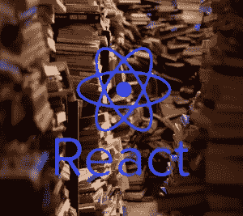
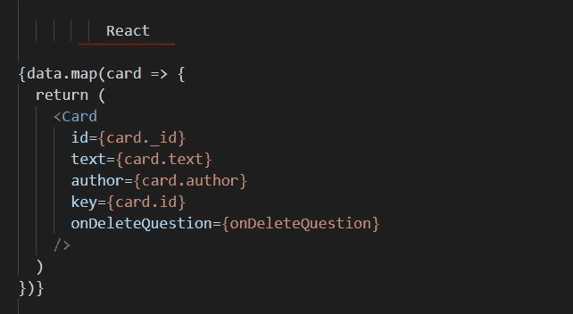

# 2022 年:React 让公司损失惨重

> 原文：<https://blog.devgenius.io/react-costs-companies-a-lot-of-money-6bfa3e5cc6f4?source=collection_archive---------0----------------------->

事实是，对于公司来说，在 React 中开发浪费了 T2 大量的时间和 T4 的金钱。它甚至可以让他们破产。

# **1。依赖性**

React 是一个视图库。
要编写路由、表单、api 请求管理、状态管理……你必须添加很多库，并在所有这些点之间建立连接。
知道有几个库可以编写表单或路由…我们最终会有不同的 react 项目，有不同的库，因此它们之间有微妙的联系。
此外，对于维护而言，由于有多种路由技术，这意味着需要了解这些技术，因此需要更长、更复杂的学习时间。
所以所有这些库之间的版本兼容性存在很大风险。
当这些包中的一个被更新时，就有出现 bug 的风险。
项目越大，风险越大。此外，测试的设置更加复杂。
***由于所有这些多样性，React 在时间和维护上非常昂贵。***

# 2.结构/维护

用 React 开发就像在没有规则的道路上行驶，每个人都做自己想做的事情。这很危险，你可能永远也到不了那里，或者会花掉你一大笔钱。
React 是一样的，没有结构，没有导向。此外，有多种解决方案或替代方案来填补空白。创建和维护成本很高，因为一切都取决于人、他们的知识和反应项目。此外，由于技术经常变化，已经过时的老项目不得不被接管，资金和时间不得不再次投入。
***这对于维修来说是真正的灾难。***

# 3.Redux

Redux 是复杂性的一个怪物。
React + redux 是真正的气厂。

仅仅为了管理**一个变量**的状态，你就要写:一个**动作**，一个**减速器**，一个**选择器** …见一个**元**。
好一块**屎**！

它的开发花费了数百万美元，因为它只需要很少的努力和时间。

当然，人们会告诉我，现在有了像 mobx 这样的其他解决方案。
但与此同时，redux 的上千个站点呢？

用替代方案重写需要花费学习和经验的金钱。

**再一次**，有多种选择:redux，mobX，反冲，反应钩…这使得账单上升(这增加了依赖的多样性)

# 4.JSX

**JSX 是垃圾**，视图和逻辑之间没有分离，语法是从其他垃圾 xml 中提取的。
对设计师来说，这增加了设计的难度，因为视野被这种 JSX 污染了。

之前有:HTML + PHP
现在有了 react : HTML + JSX

React 开发人员是大修补者，他们可以通过混合逻辑接口和视图很快结束混乱的代码。

这也是要花钱和时间的。

react =视图被污染**代码**+"**{(()} })} {)} {()**"

哎呀我有点夸张了，我可能忘了一个' } '

想象一下添加 flexbox 或 bootstrap 时的视图，那该是什么样子

# **5。测试**

**很难用 React 编写** **测试**。没有依赖注入，所以我们必须在没有依赖注入的情况下进行管理。

此外，我们不能测试 JSX。
浪费更多的时间。

# 6.一种趋势，一种时尚

React 是一种趋势。
时尚并不意味着最好。
一个趋势的问题是，即使不改编也用错了。

# 结论

出于所有这些原因，如果您不想增加开发和维护成本，就不要使用 React。
React 适合写小部件和网站。
**设计“软件”应用类型项目**更喜欢另一种解决方案，如 **Angular** 这是一个开发这类项目的真正框架或 **Vue.js** 及其版本 3。否则你最终会像 Airbnb 一样后悔，他们停止了 react native，并在 Android 和 ios 中重做了一切。